# ⬆️ Microsoft Azure AZ-305 (Designing Microsoft Azure Infrastructure Solutions) Practice Tests Exams Questions & Answers

## Table of Contents

| No. | Questions |
|---- | ---------
| 1   | [Litware, Inc. is a medium-sized finance company. Litware has a main office in Boston. The network contains an Active Directory forest named Litware.com that is linked to an Azure Active Directory (Azure AD) tenant named Litware.com. All users have Azure Active Directory Premium P2 licenses. Litware has a second Azure AD tenant named dev.Litware.com that is used as a development environment. The Litware.com tenant has a conditional acess policy named capolicy1. Capolicy1 requires that when users manage the Azure subscription for a production environment by using the Azure portal, they must connect from a hybrid Azure AD-joined device. Litware has 10 Azure subscriptions that are linked to the Litware.com tenant and five Azure subscriptions that are linked to the dev.Litware.com tenant. All the subscriptions are in an Enterprise Agreement (EA). The Litware.com tenant contains a custom Azure role-based access control (Azure RBAC) role named Role1 that grants the DataActions read permission to the blobs and files in Azure Storage. The on-premises network of Litware contains the resources shown in the following table. Litware has ExpressRoute connectivity to Azure. Litware plans to implement the following changes: Migrate DB1 and DB2 to Azure. Migrate App1 to Azure virtual machines. Deploy the Azure virtual machines that will host App1 to Azure dedicated hosts. Litware identifies the following authentication and authorization requirements: Users that manage the production environment by using the Azure portal must connect from a hybrid Azure AD-joined device and authenticate by using Azure Multi-Factor Authentication (MFA). The Network Contributor built-in RBAC role must be used to grant permission to all the virtual networks in all the Azure subscriptions. To access the resources in Azure, App1 must use the managed identity of the virtual machines that will host the app. Role1 must be used to assign permissions to the storage accounts of all the Azure subscriptions. RBAC roles must be applied at the highest level possible. Litware identifies the following resiliency requirements: Once migrated to Azure, DB1 and DB2 must meet the following requirements: Maintain availability if two availability zones in the local Azure region fail. Fail over automatically. Minimize I/O latency. App1 must meet the following requirements: Be hosted in an Azure region that supports availability zones. Be hosted on Azure virtual machines that support automatic scaling. Maintain availability if two availability zones in the local Azure region fail. Litware identifies the following security and compliance requirements: Once App1 is migrated to Azure, you must ensure that new data can be written to the app, and the modification of new and existing data is prevented for a period of three years. On-premises users and services must be able to access the Azure Storage account that will host the data in App1. Access to the public endpoint of the Azure Storage account that will host the App1 data must be prevented. All Azure SQL databases in the production environment must have Transparent Data Encryption (TDE) enabled. App1 must not share physical hardware with other workloads. Litware identifies the following business requirements: Minimize administrative effort. Minimize costs. You plan to migrate App1 to Azure. You need to recommend a storage solution for App1 that meets the security and compliance requirements. Which type of storage should you recommend, and how should you recommend configuring the storage?](#litware-inc-is-a-medium-sized-finance-company-litware-has-a-main-office-in-boston-the-network-contains-an-active-directory-forest-named-litwarecom-that-is-linked-to-an-azure-active-directory-azure-ad-tenant-named-litwarecom-all-users-have-azure-active-directory-premium-p2-licenses-litware-has-a-second-azure-ad-tenant-named-devlitwarecom-that-is-used-as-a-development-environment-the-litwarecom-tenant-has-a-conditional-acess-policy-named-capolicy1-capolicy1-requires-that-when-users-manage-the-azure-subscription-for-a-production-environment-by-using-the-azure-portal-they-must-connect-from-a-hybrid-azure-ad-joined-device-litware-has-10-azure-subscriptions-that-are-linked-to-the-litwarecom-tenant-and-five-azure-subscriptions-that-are-linked-to-the-devlitwarecom-tenant-all-the-subscriptions-are-in-an-enterprise-agreement-ea-the-litwarecom-tenant-contains-a-custom-azure-role-based-access-control-azure-rbac-role-named-role1-that-grants-the-dataactions-read-permission-to-the-blobs-and-files-in-azure-storage-the-on-premises-network-of-litware-contains-the-resources-shown-in-the-following-table-litware-has-expressroute-connectivity-to-azure-litware-plans-to-implement-the-following-changes-migrate-db1-and-db2-to-azure-migrate-app1-to-azure-virtual-machines-deploy-the-azure-virtual-machines-that-will-host-app1-to-azure-dedicated-hosts-litware-identifies-the-following-authentication-and-authorization-requirements-users-that-manage-the-production-environment-by-using-the-azure-portal-must-connect-from-a-hybrid-azure-ad-joined-device-and-authenticate-by-using-azure-multi-factor-authentication-mfa-the-network-contributor-built-in-rbac-role-must-be-used-to-grant-permission-to-all-the-virtual-networks-in-all-the-azure-subscriptions-to-access-the-resources-in-azure-app1-must-use-the-managed-identity-of-the-virtual-machines-that-will-host-the-app-role1-must-be-used-to-assign-permissions-to-the-storage-accounts-of-all-the-azure-subscriptions-rbac-roles-must-be-applied-at-the-highest-level-possible-litware-identifies-the-following-resiliency-requirements-once-migrated-to-azure-db1-and-db2-must-meet-the-following-requirements-maintain-availability-if-two-availability-zones-in-the-local-azure-region-fail-fail-over-automatically-minimize-io-latency-app1-must-meet-the-following-requirements-be-hosted-in-an-azure-region-that-supports-availability-zones-be-hosted-on-azure-virtual-machines-that-support-automatic-scaling-maintain-availability-if-two-availability-zones-in-the-local-azure-region-fail-litware-identifies-the-following-security-and-compliance-requirements-once-app1-is-migrated-to-azure-you-must-ensure-that-new-data-can-be-written-to-the-app-and-the-modification-of-new-and-existing-data-is-prevented-for-a-period-of-three-years-on-premises-users-and-services-must-be-able-to-access-the-azure-storage-account-that-will-host-the-data-in-app1-access-to-the-public-endpoint-of-the-azure-storage-account-that-will-host-the-app1-data-must-be-prevented-all-azure-sql-databases-in-the-production-environment-must-have-transparent-data-encryption-tde-enabled-app1-must-not-share-physical-hardware-with-other-workloads-litware-identifies-the-following-business-requirements-minimize-administrative-effort-minimize-costs-you-plan-to-migrate-app1-to-azure-you-need-to-recommend-a-storage-solution-for-app1-that-meets-the-security-and-compliance-requirements-which-type-of-storage-should-you-recommend-and-how-should-you-recommend-configuring-the-storage)
| 2   | [Your company has the divisions shown in the following table. You plan to deploy a custom application to each subscription. The application will contain the following: A resource group. An Azure web app. Custom role assignments. An Azure Cosmos DB account. You need to use Azure Blueprints to deploy the application to each subscription. What is the minimum number of objects required to deploy the application?](#your-company-has-the-divisions-shown-in-the-following-table-you-plan-to-deploy-a-custom-application-to-each-subscription-the-application-will-contain-the-following-a-resource-group-an-azure-web-app-custom-role-assignments-an-azure-cosmos-db-account-you-need-to-use-azure-blueprints-to-deploy-the-application-to-each-subscription-what-is-the-minimum-number-of-objects-required-to-deploy-the-application)
| 3   | [The on-premises network contains a single Active Directory domain named contoso.com. Contoso has a single Azure subscription. Contoso has a business partnership with Fabrikam, Inc. Fabrikam users access some Contoso applications over the internet by using Azure Active Directory (Azure AD) guest accounts. Contoso plans to deploy two applications named App1 and App2 to Azure. App1 will be a Python web app hosted in Azure App Service that requires a Linux runtime. Users from Contoso and Fabrikam will access App1. App1 will access several services that require third-party credentials and access strings. The credentials and access strings are stored in Azure Key Vault. App1 will have six instances: three in the East US Azure region and three in the West Europe Azure region. App1 has the following data requirements: Each instance will write data to a data store in the same availability zone as the instance. Data written by any App1 instance must be visible to all App1 instances. App1 will only be accessible from the internet. App1 has the following connection requirements: Connections to App1 must pass through a web application firewall (WAF). Connections to App1 must be active-active load balanced between instances. All connections to App1 from North America must be directed to the East US region. All other connections must be directed to the West Europe region. Every hour, you will run a maintenance task by invoking a PowerShell script that copies files from all the App1 instances. The PowerShell script will run from a central location. App2 will be a NET app hosted in App Service that requires a Windows runtime. App2 has the following file storage requirements: Save files to an Azure Storage account. Replicate files to an on-premises location. Ensure that on-premises clients can read the files over the LAN by using the SMB protocol. You need to monitor App2 to analyze how long it takes to perform different transactions within the application. The solution must not require changes to the application code. Application developers will constantly develop new versions of App1 and App2. The development process must meet the following requirements: A staging instance of a new application version must be deployed to the application host before the new version is used in production. After testing the new version, the staging version of the application will replace the production version. The switch to the new application version from staging to production must occur without any downtime of the application. Contoso identifies the following requirements for managing Fabrikam access to resources: Every month, an account manager at Fabrikam must review which Fabrikam users have access permissions to App1. Accounts that no longer need permissions must be removed as guests. The solution must minimize development effort. All secrets used by Azure services must be stored in Azure Key Vault. Services that require credentials must have the credentials tied to the service instance. The credentials must NOT be shared between services. What should you implement to meet the identity requirements?](#the-on-premises-network-contains-a-single-active-directory-domain-named-contosocom-contoso-has-a-single-azure-subscription-contoso-has-a-business-partnership-with-fabrikam-inc-fabrikam-users-access-some-contoso-applications-over-the-internet-by-using-azure-active-directory-azure-ad-guest-accounts-contoso-plans-to-deploy-two-applications-named-app1-and-app2-to-azure-app1-will-be-a-python-web-app-hosted-in-azure-app-service-that-requires-a-linux-runtime-users-from-contoso-and-fabrikam-will-access-app1-app1-will-access-several-services-that-require-third-party-credentials-and-access-strings-the-credentials-and-access-strings-are-stored-in-azure-key-vault-app1-will-have-six-instances-three-in-the-east-us-azure-region-and-three-in-the-west-europe-azure-region-app1-has-the-following-data-requirements-each-instance-will-write-data-to-a-data-store-in-the-same-availability-zone-as-the-instance-data-written-by-any-app1-instance-must-be-visible-to-all-app1-instances-app1-will-only-be-accessible-from-the-internet-app1-has-the-following-connection-requirements-connections-to-app1-must-pass-through-a-web-application-firewall-waf-connections-to-app1-must-be-active-active-load-balanced-between-instances-all-connections-to-app1-from-north-america-must-be-directed-to-the-east-us-region-all-other-connections-must-be-directed-to-the-west-europe-region-every-hour-you-will-run-a-maintenance-task-by-invoking-a-powershell-script-that-copies-files-from-all-the-app1-instances-the-powershell-script-will-run-from-a-central-location-app2-will-be-a-net-app-hosted-in-app-service-that-requires-a-windows-runtime-app2-has-the-following-file-storage-requirements-save-files-to-an-azure-storage-account-replicate-files-to-an-on-premises-location-ensure-that-on-premises-clients-can-read-the-files-over-the-lan-by-using-the-smb-protocol-you-need-to-monitor-app2-to-analyze-how-long-it-takes-to-perform-different-transactions-within-the-application-the-solution-must-not-require-changes-to-the-application-code-application-developers-will-constantly-develop-new-versions-of-app1-and-app2-the-development-process-must-meet-the-following-requirements-a-staging-instance-of-a-new-application-version-must-be-deployed-to-the-application-host-before-the-new-version-is-used-in-production-after-testing-the-new-version-the-staging-version-of-the-application-will-replace-the-production-version-the-switch-to-the-new-application-version-from-staging-to-production-must-occur-without-any-downtime-of-the-application-contoso-identifies-the-following-requirements-for-managing-fabrikam-access-to-resources-every-month-an-account-manager-at-fabrikam-must-review-which-fabrikam-users-have-access-permissions-to-app1-accounts-that-no-longer-need-permissions-must-be-removed-as-guests-the-solution-must-minimize-development-effort-all-secrets-used-by-azure-services-must-be-stored-in-azure-key-vault-services-that-require-credentials-must-have-the-credentials-tied-to-the-service-instance-the-credentials-must-not-be-shared-between-services-what-should-you-implement-to-meet-the-identity-requirements)
| 4   | [You plan to import data from your on-premises environment to Azure. The data Is shown in the following table. What should you recommend using to migrate the data?](#you-plan-to-import-data-from-your-on-premises-environment-to-azure-the-data-is-shown-in-the-following-table-what-should-you-recommend-using-to-migrate-the-data)
| 5   | [Your organization has developed and deployed several Azure App Service Web and API applications. The applications use Azure Key Vault to store several authentication, storage account, and data encryption keys. Several departments have the following requests to support the applications. You need to recommend the appropriate Azure service for each department request. What should you recommend?](#your-organization-has-developed-and-deployed-several-azure-app-service-web-and-api-applications-the-applications-use-azure-key-vault-to-store-several-authentication-storage-account-and-data-encryption-keys-several-departments-have-the-following-requests-to-support-the-applications-you-need-to-recommend-the-appropriate-azure-service-for-each-department-request-what-should-you-recommend)
| 6   | [The on-premises network contains a single Active Directory domain named contoso.com. Contoso has a single Azure subscription. Contoso has a business partnership with Fabrikam, Inc. Fabrikam users access some Contoso applications over the internet by using Azure Active Directory (Azure AD) guest accounts. Contoso plans to deploy two applications named App1 and App2 to Azure. App1 will be a Python web app hosted in Azure App Service that requires a Linux runtime. Users from Contoso and Fabrikam will access App1. App1 will access several services that require third-party credentials and access strings. The credentials and access strings are stored in Azure Key Vault. App1 will have six instances: three in the East US Azure region and three in the West Europe Azure region. App1 has the following data requirements: Each instance will write data to a data store in the same availability zone as the instance. Data written by any App1 instance must be visible to all App1 instances. App1 will only be accessible from the internet. App1 has the following connection requirements: Connections to App1 must pass through a web application firewall (WAF). Connections to App1 must be active-active load balanced between instances. All connections to App1 from North America must be directed to the East US region. All other connections must be directed to the West Europe region. Every hour, you will run a maintenance task by invoking a PowerShell script that copies files from all the App1 instances. The PowerShell script will run from a central location. App2 will be a NET app hosted in App Service that requires a Windows runtime. App2 has the following file storage requirements: Save files to an Azure Storage account. Replicate files to an on-premises location. Ensure that on-premises clients can read the files over the LAN by using the SMB protocol. You need to monitor App2 to analyze how long it takes to perform different transactions within the application. The solution must not require changes to the application code. Application developers will constantly develop new versions of App1 and App2. The development process must meet the following requirements: A staging instance of a new application version must be deployed to the application host before the new version is used in production. After testing the new version, the staging version of the application will replace the production version. The switch to the new application version from staging to production must occur without any downtime of the application. Contoso identifies the following requirements for managing Fabrikam access to resources: Every month, an account manager at Fabrikam must review which Fabrikam users have access permissions to App1. Accounts that no longer need permissions must be removed as guests. The solution must minimize development effort. All secrets used by Azure services must be stored in Azure Key Vault. Services that require credentials must have the credentials tied to the service instance. The credentials must NOT be shared between services. You need to recommend a solution that meets the data requirements for App1. What should you recommend deploying to each availability zone that contains an instance of App1?](#the-on-premises-network-contains-a-single-active-directory-domain-named-contosocom-contoso-has-a-single-azure-subscription-contoso-has-a-business-partnership-with-fabrikam-inc-fabrikam-users-access-some-contoso-applications-over-the-internet-by-using-azure-active-directory-azure-ad-guest-accounts-contoso-plans-to-deploy-two-applications-named-app1-and-app2-to-azure-app1-will-be-a-python-web-app-hosted-in-azure-app-service-that-requires-a-linux-runtime-users-from-contoso-and-fabrikam-will-access-app1-app1-will-access-several-services-that-require-third-party-credentials-and-access-strings-the-credentials-and-access-strings-are-stored-in-azure-key-vault-app1-will-have-six-instances-three-in-the-east-us-azure-region-and-three-in-the-west-europe-azure-region-app1-has-the-following-data-requirements-each-instance-will-write-data-to-a-data-store-in-the-same-availability-zone-as-the-instance-data-written-by-any-app1-instance-must-be-visible-to-all-app1-instances-app1-will-only-be-accessible-from-the-internet-app1-has-the-following-connection-requirements-connections-to-app1-must-pass-through-a-web-application-firewall-waf-connections-to-app1-must-be-active-active-load-balanced-between-instances-all-connections-to-app1-from-north-america-must-be-directed-to-the-east-us-region-all-other-connections-must-be-directed-to-the-west-europe-region-every-hour-you-will-run-a-maintenance-task-by-invoking-a-powershell-script-that-copies-files-from-all-the-app1-instances-the-powershell-script-will-run-from-a-central-location-app2-will-be-a-net-app-hosted-in-app-service-that-requires-a-windows-runtime-app2-has-the-following-file-storage-requirements-save-files-to-an-azure-storage-account-replicate-files-to-an-on-premises-location-ensure-that-on-premises-clients-can-read-the-files-over-the-lan-by-using-the-smb-protocol-you-need-to-monitor-app2-to-analyze-how-long-it-takes-to-perform-different-transactions-within-the-application-the-solution-must-not-require-changes-to-the-application-code-application-developers-will-constantly-develop-new-versions-of-app1-and-app2-the-development-process-must-meet-the-following-requirements-a-staging-instance-of-a-new-application-version-must-be-deployed-to-the-application-host-before-the-new-version-is-used-in-production-after-testing-the-new-version-the-staging-version-of-the-application-will-replace-the-production-version-the-switch-to-the-new-application-version-from-staging-to-production-must-occur-without-any-downtime-of-the-application-contoso-identifies-the-following-requirements-for-managing-fabrikam-access-to-resources-every-month-an-account-manager-at-fabrikam-must-review-which-fabrikam-users-have-access-permissions-to-app1-accounts-that-no-longer-need-permissions-must-be-removed-as-guests-the-solution-must-minimize-development-effort-all-secrets-used-by-azure-services-must-be-stored-in-azure-key-vault-services-that-require-credentials-must-have-the-credentials-tied-to-the-service-instance-the-credentials-must-not-be-shared-between-services-you-need-to-recommend-a-solution-that-meets-the-data-requirements-for-app1-what-should-you-recommend-deploying-to-each-availability-zone-that-contains-an-instance-of-app1)
| 7   | [Fabrikam, Inc. is an engineering company that has offices throughout Europe. The company has a main office in London and three branch offices in Amsterdam, Berlin, and Rome. The network contains two Active Directory forests named corp.fabrikam.com and rd.fabrikam.com. There are no trust relationships between the forests. Corp.fabrikam.com is a production forest that contains identities used for internal user and computer authentication. Rd.fabrikam.com is used by the research and development (R&D) department only. The R&D department is restricted to using on-premises resources only. Each office contains at least one domain controller from the corp.fabrikam.com domain. The main office contains all the domain controllers for the rd.fabrikam.com forest. All the offices have a high-speed connection to the internet. An existing application named WebApp1 is hosted in the data center of the London office. WebApp1 is used by customers to place and track orders. WebApp1 has a web tier that uses Microsoft Internet information Services (IIS) and a database tier that runs Microsoft SQL Server 2016. The web tier and the database tier are deployed to virtual machines that run on Hyper-V. The IT department currently uses a separate Hyper-V environment to test updates to WebApp1. Fabrikam purchases all Microsoft licenses through a Microsoft Enterprise Agreement that includes Software Assurance. The use of WebApp1 is unpredictable. At peak times, users often report delays. At other times, many resources for WebApp1 are underutilized. Fabrikam plans to move most of its production workloads to Azure during the next few years, including virtual machines that rely on Active Directory for authentication. As one of its first projects, the company plans to establish a hybrid identity model, facilitating an upcoming Microsoft 365 deployment. All R&D operations will remain on-premises. Fabrikam plans to migrate the production and test instances of WebApp1 to Azure. Fabrikam identifies the following technical requirements: Website content must be easily updated from a single point. User input must be minimized when provisioning new web app instances. Whenever possible, existing on-premises licenses must be used to reduce cost. Users must always authenticate by using their corp.fabrikam.com UPN identity. Any new deployments to Azure must be redundant in case an Azure region fails. Whenever possible, solutions must be deployed to Azure by using the Standard pricing tier of Azure App Service. An email distribution group named IT Support must be notified of any issues relating to the directory synchronization services. In the event that a link fails between Azure and the on-premises network, ensure that the virtual machines hosted in Azure can authenticate to Active Directory. Directory synchronization between Azure Active Directory (Azure AD) and corp.fabrikam.com must not be affected by a link failure between Azure and the on- premises network. Fabrikam identifies the following database requirements: Database metrics for the production instance of WebApp1 must be available for analysis so that database administrators can optimize the performance settings. To avoid disrupting customer access, database downtime must be minimized when databases are migrated. Database backups must be retained for a minimum of seven years to meet compliance requirements. Fabrikam identifies the following security requirements: Company information including policies, templates, and data must be inaccessible to anyone outside the company. Users on the on-premises network must be able to authenticate to corp.fabrikam.com if an internet link fails. Administrators must be able authenticate to the Azure portal by using their corp.fabrikam.com credentials. All administrative access to the Azure portal must be secured by using multi-factor authentication (MFA). The testing of WebApp1 updates must not be visible to anyone outside the company. You need to recommend a solution to meet the database retention requirements. What should you recommend?](#fabrikam-inc-is-an-engineering-company-that-has-offices-throughout-europe-the-company-has-a-main-office-in-london-and-three-branch-offices-in-amsterdam-berlin-and-rome-the-network-contains-two-active-directory-forests-named-corpfabrikamcom-and-rdfabrikamcom-there-are-no-trust-relationships-between-the-forests-corpfabrikamcom-is-a-production-forest-that-contains-identities-used-for-internal-user-and-computer-authentication-rdfabrikamcom-is-used-by-the-research-and-development-rd-department-only-the-rd-department-is-restricted-to-using-on-premises-resources-only-each-office-contains-at-least-one-domain-controller-from-the-corpfabrikamcom-domain-the-main-office-contains-all-the-domain-controllers-for-the-rdfabrikamcom-forest-all-the-offices-have-a-high-speed-connection-to-the-internet-an-existing-application-named-webapp1-is-hosted-in-the-data-center-of-the-london-office-webapp1-is-used-by-customers-to-place-and-track-orders-webapp1-has-a-web-tier-that-uses-microsoft-internet-information-services-iis-and-a-database-tier-that-runs-microsoft-sql-server-2016-the-web-tier-and-the-database-tier-are-deployed-to-virtual-machines-that-run-on-hyper-v-the-it-department-currently-uses-a-separate-hyper-v-environment-to-test-updates-to-webapp1-fabrikam-purchases-all-microsoft-licenses-through-a-microsoft-enterprise-agreement-that-includes-software-assurance-the-use-of-webapp1-is-unpredictable-at-peak-times-users-often-report-delays-at-other-times-many-resources-for-webapp1-are-underutilized-fabrikam-plans-to-move-most-of-its-production-workloads-to-azure-during-the-next-few-years-including-virtual-machines-that-rely-on-active-directory-for-authentication-as-one-of-its-first-projects-the-company-plans-to-establish-a-hybrid-identity-model-facilitating-an-upcoming-microsoft-365-deployment-all-rd-operations-will-remain-on-premises-fabrikam-plans-to-migrate-the-production-and-test-instances-of-webapp1-to-azure-fabrikam-identifies-the-following-technical-requirements-website-content-must-be-easily-updated-from-a-single-point-user-input-must-be-minimized-when-provisioning-new-web-app-instances-whenever-possible-existing-on-premises-licenses-must-be-used-to-reduce-cost-users-must-always-authenticate-by-using-their-corpfabrikamcom-upn-identity-any-new-deployments-to-azure-must-be-redundant-in-case-an-azure-region-fails-whenever-possible-solutions-must-be-deployed-to-azure-by-using-the-standard-pricing-tier-of-azure-app-service-an-email-distribution-group-named-it-support-must-be-notified-of-any-issues-relating-to-the-directory-synchronization-services-in-the-event-that-a-link-fails-between-azure-and-the-on-premises-network-ensure-that-the-virtual-machines-hosted-in-azure-can-authenticate-to-active-directory-directory-synchronization-between-azure-active-directory-azure-ad-and-corpfabrikamcom-must-not-be-affected-by-a-link-failure-between-azure-and-the-on--premises-network-fabrikam-identifies-the-following-database-requirements-database-metrics-for-the-production-instance-of-webapp1-must-be-available-for-analysis-so-that-database-administrators-can-optimize-the-performance-settings-to-avoid-disrupting-customer-access-database-downtime-must-be-minimized-when-databases-are-migrated-database-backups-must-be-retained-for-a-minimum-of-seven-years-to-meet-compliance-requirements-fabrikam-identifies-the-following-security-requirements-company-information-including-policies-templates-and-data-must-be-inaccessible-to-anyone-outside-the-company-users-on-the-on-premises-network-must-be-able-to-authenticate-to-corpfabrikamcom-if-an-internet-link-fails-administrators-must-be-able-authenticate-to-the-azure-portal-by-using-their-corpfabrikamcom-credentials-all-administrative-access-to-the-azure-portal-must-be-secured-by-using-multi-factor-authentication-mfa-the-testing-of-webapp1-updates-must-not-be-visible-to-anyone-outside-the-company-you-need-to-recommend-a-solution-to-meet-the-database-retention-requirements-what-should-you-recommend)
| 8   | [You need to recommend a solution to ensure that App1 can access the third-party credentials and access strings. The solution must meet the What should you include in the recommendation?](#you-need-to-recommend-a-solution-to-ensure-that-app1-can-access-the-third-party-credentials-and-access-strings-the-solution-must-meet-the-what-should-you-include-in-the-recommendation)
| 9   | [You are evaluating whether to use Azure Traffic Manager and Azure Application Gateway to meet the connection requirements for App1. What is the minimum numbers of instances required for each service?](#you-are-evaluating-whether-to-use-azure-traffic-manager-and-azure-application-gateway-to-meet-the-connection-requirements-for-app1-what-is-the-minimum-numbers-of-instances-required-for-each-service)
| 10  | [PLACEHOLDER](#placeholder)
| 11  | [Your company has deployed several virtual machines (VMs) on-premises and to Azure. Azure ExpressRoute has been deployed and configured for on-premises to Azure connectivity. Several VMs are exhibiting network connectivity issues. You need to analyze the network traffic to determine whether packets are being allowed or denied to the VMs. Solution: Use the Azure Advisor to analyze the network traffic. Does the solution meet the goal?](#your-company-has-deployed-several-virtual-machines-vms-on-premises-and-to-azure-azure-expressroute-has-been-deployed-and-configured-for-on-premises-to-azure-connectivity-several-vms-are-exhibiting-network-connectivity-issues-you-need-to-analyze-the-network-traffic-to-determine-whether-packets-are-being-allowed-or-denied-to-the-vms-solution-use-the-azure-advisor-to-analyze-the-network-traffic-does-the-solution-meet-the-goal)
| 12  | [You need to recommend a solution to generate a monthly report of all the new Azure Resource Manager resource deployment in your subscription. What should you include in the recommendation?](#you-need-to-recommend-a-solution-to-generate-a-monthly-report-of-all-the-new-azure-resource-manager-resource-deployment-in-your-subscription-what-should-you-include-in-the-recommendation)
| 13  | [You need to design a storage solution for an app that will store large amounts of frequently used data. The solution must meet the following requirements: Maximize data throughput. Prevent the modification of data for one year. Minimize latency for read and write operations. Which Azure Storage account type and storage service should you recommend?](#you-need-to-design-a-storage-solution-for-an-app-that-will-store-large-amounts-of-frequently-used-data-the-solution-must-meet-the-following-requirements-maximize-data-throughput-prevent-the-modification-of-data-for-one-year-minimize-latency-for-read-and-write-operations-which-azure-storage-account-type-and-storage-service-should-you-recommend)
| 14  | [You need to recommend an Azure Storage Account configuration for two applications named Application1 and Applications. The configuration must meet the following requirements: Storage for Application1 must provide the highest possible transaction rates and the lowest possible latency. Storage for Application2 must provide the lowest possible storage costs per GB. Storage for both applications must be optimized for uploads and downloads. Storage for both applications must be available in an event of datacenter failure. What should you recommend?](#you-need-to-recommend-an-azure-storage-account-configuration-for-two-applications-named-application1-and-applications-the-configuration-must-meet-the-following-requirements-storage-for-application1-must-provide-the-highest-possible-transaction-rates-and-the-lowest-possible-latency-storage-for-application2-must-provide-the-lowest-possible-storage-costs-per-gb-storage-for-both-applications-must-be-optimized-for-uploads-and-downloads-storage-for-both-applications-must-be-available-in-an-event-of-datacenter-failure-what-should-you-recommend)
| 15  | [Fabrikam, Inc. is an engineering company that has offices throughout Europe. The company has a main office in London and three branch offices in Amsterdam, Berlin, and Rome. The network contains two Active Directory forests named corp.fabrikam.com and rd.fabrikam.com. There are no trust relationships between the forests. Corp.fabrikam.com is a production forest that contains identities used for internal user and computer authentication. Rd.fabrikam.com is used by the research and development (R&D) department only. The R&D department is restricted to using on-premises resources only. Each office contains at least one domain controller from the corp.fabrikam.com domain. The main office contains all the domain controllers for the rd.fabrikam.com forest. All the offices have a high-speed connection to the internet. An existing application named WebApp1 is hosted in the data center of the London office. WebApp1 is used by customers to place and track orders. WebApp1 has a web tier that uses Microsoft Internet information Services (IIS) and a database tier that runs Microsoft SQL Server 2016. The web tier and the database tier are deployed to virtual machines that run on Hyper-V. The IT department currently uses a separate Hyper-V environment to test updates to WebApp1. Fabrikam purchases all Microsoft licenses through a Microsoft Enterprise Agreement that includes Software Assurance. The use of WebApp1 is unpredictable. At peak times, users often report delays. At other times, many resources for WebApp1 are underutilized. Fabrikam plans to move most of its production workloads to Azure during the next few years, including virtual machines that rely on Active Directory for authentication. As one of its first projects, the company plans to establish a hybrid identity model, facilitating an upcoming Microsoft 365 deployment. All R&D operations will remain on-premises. Fabrikam plans to migrate the production and test instances of WebApp1 to Azure. Fabrikam identifies the following technical requirements: Website content must be easily updated from a single point. User input must be minimized when provisioning new web app instances. Whenever possible, existing on-premises licenses must be used to reduce cost. Users must always authenticate by using their corp.fabrikam.com UPN identity. Any new deployments to Azure must be redundant in case an Azure region fails. Whenever possible, solutions must be deployed to Azure by using the Standard pricing tier of Azure App Service. An email distribution group named IT Support must be notified of any issues relating to the directory synchronization services. In the event that a link fails between Azure and the on-premises network, ensure that the virtual machines hosted in Azure can authenticate to Active Directory. Directory synchronization between Azure Active Directory (Azure AD) and corp.fabrikam.com must not be affected by a link failure between Azure and the on- premises network. Fabrikam identifies the following database requirements: Database metrics for the production instance of WebApp1 must be available for analysis so that database administrators can optimize the performance settings. To avoid disrupting customer access, database downtime must be minimized when databases are migrated. Database backups must be retained for a minimum of seven years to meet compliance requirements. Fabrikam identifies the following security requirements: Company information including policies, templates, and data must be inaccessible to anyone outside the company. Users on the on-premises network must be able to authenticate to corp.fabrikam.com if an internet link fails. Administrators must be able authenticate to the Azure portal by using their corp.fabrikam.com credentials. All administrative access to the Azure portal must be secured by using multi-factor authentication (MFA). The testing of WebApp1 updates must not be visible to anyone outside the company. To meet the authentication requirements of Fabrikam, what should you include in the solution?](#fabrikam-inc-is-an-engineering-company-that-has-offices-throughout-europe-the-company-has-a-main-office-in-london-and-three-branch-offices-in-amsterdam-berlin-and-rome-the-network-contains-two-active-directory-forests-named-corpfabrikamcom-and-rdfabrikamcom-there-are-no-trust-relationships-between-the-forests-corpfabrikamcom-is-a-production-forest-that-contains-identities-used-for-internal-user-and-computer-authentication-rdfabrikamcom-is-used-by-the-research-and-development-rd-department-only-the-rd-department-is-restricted-to-using-on-premises-resources-only-each-office-contains-at-least-one-domain-controller-from-the-corpfabrikamcom-domain-the-main-office-contains-all-the-domain-controllers-for-the-rdfabrikamcom-forest-all-the-offices-have-a-high-speed-connection-to-the-internet-an-existing-application-named-webapp1-is-hosted-in-the-data-center-of-the-london-office-webapp1-is-used-by-customers-to-place-and-track-orders-webapp1-has-a-web-tier-that-uses-microsoft-internet-information-services-iis-and-a-database-tier-that-runs-microsoft-sql-server-2016-the-web-tier-and-the-database-tier-are-deployed-to-virtual-machines-that-run-on-hyper-v-the-it-department-currently-uses-a-separate-hyper-v-environment-to-test-updates-to-webapp1-fabrikam-purchases-all-microsoft-licenses-through-a-microsoft-enterprise-agreement-that-includes-software-assurance-the-use-of-webapp1-is-unpredictable-at-peak-times-users-often-report-delays-at-other-times-many-resources-for-webapp1-are-underutilized-fabrikam-plans-to-move-most-of-its-production-workloads-to-azure-during-the-next-few-years-including-virtual-machines-that-rely-on-active-directory-for-authentication-as-one-of-its-first-projects-the-company-plans-to-establish-a-hybrid-identity-model-facilitating-an-upcoming-microsoft-365-deployment-all-rd-operations-will-remain-on-premises-fabrikam-plans-to-migrate-the-production-and-test-instances-of-webapp1-to-azure-fabrikam-identifies-the-following-technical-requirements-website-content-must-be-easily-updated-from-a-single-point-user-input-must-be-minimized-when-provisioning-new-web-app-instances-whenever-possible-existing-on-premises-licenses-must-be-used-to-reduce-cost-users-must-always-authenticate-by-using-their-corpfabrikamcom-upn-identity-any-new-deployments-to-azure-must-be-redundant-in-case-an-azure-region-fails-whenever-possible-solutions-must-be-deployed-to-azure-by-using-the-standard-pricing-tier-of-azure-app-service-an-email-distribution-group-named-it-support-must-be-notified-of-any-issues-relating-to-the-directory-synchronization-services-in-the-event-that-a-link-fails-between-azure-and-the-on-premises-network-ensure-that-the-virtual-machines-hosted-in-azure-can-authenticate-to-active-directory-directory-synchronization-between-azure-active-directory-azure-ad-and-corpfabrikamcom-must-not-be-affected-by-a-link-failure-between-azure-and-the-on--premises-network-fabrikam-identifies-the-following-database-requirements-database-metrics-for-the-production-instance-of-webapp1-must-be-available-for-analysis-so-that-database-administrators-can-optimize-the-performance-settings-to-avoid-disrupting-customer-access-database-downtime-must-be-minimized-when-databases-are-migrated-database-backups-must-be-retained-for-a-minimum-of-seven-years-to-meet-compliance-requirements-fabrikam-identifies-the-following-security-requirements-company-information-including-policies-templates-and-data-must-be-inaccessible-to-anyone-outside-the-company-users-on-the-on-premises-network-must-be-able-to-authenticate-to-corpfabrikamcom-if-an-internet-link-fails-administrators-must-be-able-authenticate-to-the-azure-portal-by-using-their-corpfabrikamcom-credentials-all-administrative-access-to-the-azure-portal-must-be-secured-by-using-multi-factor-authentication-mfa-the-testing-of-webapp1-updates-must-not-be-visible-to-anyone-outside-the-company-to-meet-the-authentication-requirements-of-fabrikam-what-should-you-include-in-the-solution)
| 16  | [You need to design an architecture to capture the creation of users and the assignment of roles. The captured data must be stored in Azure Cosmos DB. Which Azure services should you include in the design?](#you-need-to-design-an-architecture-to-capture-the-creation-of-users-and-the-assignment-of-roles-the-captured-data-must-be-stored-in-azure-cosmos-db-which-azure-services-should-you-include-in-the-design)
| 17  | [Litware, Inc. is a medium-sized finance company. Litware has a main office in Boston. The network contains an Active Directory forest named Litware.com that is linked to an Azure Active Directory (Azure AD) tenant named Litware.com. All users have Azure Active Directory Premium P2 licenses. Litware has a second Azure AD tenant named dev.Litware.com that is used as a development environment. The Litware.com tenant has a conditional acess policy named capolicy1. Capolicy1 requires that when users manage the Azure subscription for a production environment by using the Azure portal, they must connect from a hybrid Azure AD-joined device. Litware has 10 Azure subscriptions that are linked to the Litware.com tenant and five Azure subscriptions that are linked to the dev.Litware.com tenant. All the subscriptions are in an Enterprise Agreement (EA). The Litware.com tenant contains a custom Azure role-based access control (Azure RBAC) role named Role1 that grants the DataActions read permission to the blobs and files in Azure Storage. The on-premises network of Litware contains the resources shown in the following table. Litware has ExpressRoute connectivity to Azure. Litware plans to implement the following changes: Migrate DB1 and DB2 to Azure. Migrate App1 to Azure virtual machines. Deploy the Azure virtual machines that will host App1 to Azure dedicated hosts. Litware identifies the following authentication and authorization requirements: Users that manage the production environment by using the Azure portal must connect from a hybrid Azure AD-joined device and authenticate by using Azure Multi-Factor Authentication (MFA). The Network Contributor built-in RBAC role must be used to grant permission to all the virtual networks in all the Azure subscriptions. To access the resources in Azure, App1 must use the managed identity of the virtual machines that will host the app. Role1 must be used to assign permissions to the storage accounts of all the Azure subscriptions. RBAC roles must be applied at the highest level possible. Litware identifies the following resiliency requirements: Once migrated to Azure, DB1 and DB2 must meet the following requirements: Maintain availability if two availability zones in the local Azure region fail. Fail over automatically. Minimize I/O latency. App1 must meet the following requirements: Be hosted in an Azure region that supports availability zones. Be hosted on Azure virtual machines that support automatic scaling. Maintain availability if two availability zones in the local Azure region fail. Litware identifies the following security and compliance requirements: Once App1 is migrated to Azure, you must ensure that new data can be written to the app, and the modification of new and existing data is prevented for a period of three years. On-premises users and services must be able to access the Azure Storage account that will host the data in App1. Access to the public endpoint of the Azure Storage account that will host the App1 data must be prevented. All Azure SQL databases in the production environment must have Transparent Data Encryption (TDE) enabled. App1 must not share physical hardware with other workloads. Litware identifies the following business requirements: Minimize administrative effort. Minimize costs. You plan to migrate DB1 and DB2 to Azure. You need to ensure that the Azure database and the service tier meet the resiliency and business requirements. What should you configure?](#litware-inc-is-a-medium-sized-finance-company-litware-has-a-main-office-in-boston-the-network-contains-an-active-directory-forest-named-litwarecom-that-is-linked-to-an-azure-active-directory-azure-ad-tenant-named-litwarecom-all-users-have-azure-active-directory-premium-p2-licenses-litware-has-a-second-azure-ad-tenant-named-devlitwarecom-that-is-used-as-a-development-environment-the-litwarecom-tenant-has-a-conditional-acess-policy-named-capolicy1-capolicy1-requires-that-when-users-manage-the-azure-subscription-for-a-production-environment-by-using-the-azure-portal-they-must-connect-from-a-hybrid-azure-ad-joined-device-litware-has-10-azure-subscriptions-that-are-linked-to-the-litwarecom-tenant-and-five-azure-subscriptions-that-are-linked-to-the-devlitwarecom-tenant-all-the-subscriptions-are-in-an-enterprise-agreement-ea-the-litwarecom-tenant-contains-a-custom-azure-role-based-access-control-azure-rbac-role-named-role1-that-grants-the-dataactions-read-permission-to-the-blobs-and-files-in-azure-storage-the-on-premises-network-of-litware-contains-the-resources-shown-in-the-following-table-litware-has-expressroute-connectivity-to-azure-litware-plans-to-implement-the-following-changes-migrate-db1-and-db2-to-azure-migrate-app1-to-azure-virtual-machines-deploy-the-azure-virtual-machines-that-will-host-app1-to-azure-dedicated-hosts-litware-identifies-the-following-authentication-and-authorization-requirements-users-that-manage-the-production-environment-by-using-the-azure-portal-must-connect-from-a-hybrid-azure-ad-joined-device-and-authenticate-by-using-azure-multi-factor-authentication-mfa-the-network-contributor-built-in-rbac-role-must-be-used-to-grant-permission-to-all-the-virtual-networks-in-all-the-azure-subscriptions-to-access-the-resources-in-azure-app1-must-use-the-managed-identity-of-the-virtual-machines-that-will-host-the-app-role1-must-be-used-to-assign-permissions-to-the-storage-accounts-of-all-the-azure-subscriptions-rbac-roles-must-be-applied-at-the-highest-level-possible-litware-identifies-the-following-resiliency-requirements-once-migrated-to-azure-db1-and-db2-must-meet-the-following-requirements-maintain-availability-if-two-availability-zones-in-the-local-azure-region-fail-fail-over-automatically-minimize-io-latency-app1-must-meet-the-following-requirements-be-hosted-in-an-azure-region-that-supports-availability-zones-be-hosted-on-azure-virtual-machines-that-support-automatic-scaling-maintain-availability-if-two-availability-zones-in-the-local-azure-region-fail-litware-identifies-the-following-security-and-compliance-requirements-once-app1-is-migrated-to-azure-you-must-ensure-that-new-data-can-be-written-to-the-app-and-the-modification-of-new-and-existing-data-is-prevented-for-a-period-of-three-years-on-premises-users-and-services-must-be-able-to-access-the-azure-storage-account-that-will-host-the-data-in-app1-access-to-the-public-endpoint-of-the-azure-storage-account-that-will-host-the-app1-data-must-be-prevented-all-azure-sql-databases-in-the-production-environment-must-have-transparent-data-encryption-tde-enabled-app1-must-not-share-physical-hardware-with-other-workloads-litware-identifies-the-following-business-requirements-minimize-administrative-effort-minimize-costs-you-plan-to-migrate-db1-and-db2-to-azure-you-need-to-ensure-that-the-azure-database-and-the-service-tier-meet-the-resiliency-and-business-requirements-what-should-you-configure)
| 18  | [You need to recommend a strategy for the web tier of WebApp1. The solution must minimize. What should you recommend?](#you-need-to-recommend-a-strategy-for-the-web-tier-of-webapp1-the-solution-must-minimize-what-should-you-recommend)
| 19  | [Litware, Inc. is a medium-sized finance company. Litware has a main office in Boston. The network contains an Active Directory forest named Litware.com that is linked to an Azure Active Directory (Azure AD) tenant named Litware.com. All users have Azure Active Directory Premium P2 licenses. Litware has a second Azure AD tenant named dev.Litware.com that is used as a development environment. The Litware.com tenant has a conditional acess policy named capolicy1. Capolicy1 requires that when users manage the Azure subscription for a production environment by using the Azure portal, they must connect from a hybrid Azure AD-joined device. Litware has 10 Azure subscriptions that are linked to the Litware.com tenant and five Azure subscriptions that are linked to the dev.Litware.com tenant. All the subscriptions are in an Enterprise Agreement (EA). The Litware.com tenant contains a custom Azure role-based access control (Azure RBAC) role named Role1 that grants the DataActions read permission to the blobs and files in Azure Storage. The on-premises network of Litware contains the resources shown in the following table. Litware has ExpressRoute connectivity to Azure. Litware plans to implement the following changes: Migrate DB1 and DB2 to Azure. Migrate App1 to Azure virtual machines. Deploy the Azure virtual machines that will host App1 to Azure dedicated hosts. Litware identifies the following authentication and authorization requirements: Users that manage the production environment by using the Azure portal must connect from a hybrid Azure AD-joined device and authenticate by using Azure Multi-Factor Authentication (MFA). The Network Contributor built-in RBAC role must be used to grant permission to all the virtual networks in all the Azure subscriptions. To access the resources in Azure, App1 must use the managed identity of the virtual machines that will host the app. Role1 must be used to assign permissions to the storage accounts of all the Azure subscriptions. RBAC roles must be applied at the highest level possible. Litware identifies the following resiliency requirements: Once migrated to Azure, DB1 and DB2 must meet the following requirements: Maintain availability if two availability zones in the local Azure region fail. Fail over automatically. Minimize I/O latency. App1 must meet the following requirements: Be hosted in an Azure region that supports availability zones. Be hosted on Azure virtual machines that support automatic scaling. Maintain availability if two availability zones in the local Azure region fail. Litware identifies the following security and compliance requirements: Once App1 is migrated to Azure, you must ensure that new data can be written to the app, and the modification of new and existing data is prevented for a period of three years. On-premises users and services must be able to access the Azure Storage account that will host the data in App1. Access to the public endpoint of the Azure Storage account that will host the App1 data must be prevented. All Azure SQL databases in the production environment must have Transparent Data Encryption (TDE) enabled. App1 must not share physical hardware with other workloads. Litware identifies the following business requirements: Minimize administrative effort. Minimize costs. You plan to migrate App1 to Azure. You need to recommend a network connectivity solution for the Azure Storage account that will host the App1 data. The solution must meet the security and compliance requirements. What should you include in the recommendation?](#litware-inc-is-a-medium-sized-finance-company-litware-has-a-main-office-in-boston-the-network-contains-an-active-directory-forest-named-litwarecom-that-is-linked-to-an-azure-active-directory-azure-ad-tenant-named-litwarecom-all-users-have-azure-active-directory-premium-p2-licenses-litware-has-a-second-azure-ad-tenant-named-devlitwarecom-that-is-used-as-a-development-environment-the-litwarecom-tenant-has-a-conditional-acess-policy-named-capolicy1-capolicy1-requires-that-when-users-manage-the-azure-subscription-for-a-production-environment-by-using-the-azure-portal-they-must-connect-from-a-hybrid-azure-ad-joined-device-litware-has-10-azure-subscriptions-that-are-linked-to-the-litwarecom-tenant-and-five-azure-subscriptions-that-are-linked-to-the-devlitwarecom-tenant-all-the-subscriptions-are-in-an-enterprise-agreement-ea-the-litwarecom-tenant-contains-a-custom-azure-role-based-access-control-azure-rbac-role-named-role1-that-grants-the-dataactions-read-permission-to-the-blobs-and-files-in-azure-storage-the-on-premises-network-of-litware-contains-the-resources-shown-in-the-following-table-litware-has-expressroute-connectivity-to-azure-litware-plans-to-implement-the-following-changes-migrate-db1-and-db2-to-azure-migrate-app1-to-azure-virtual-machines-deploy-the-azure-virtual-machines-that-will-host-app1-to-azure-dedicated-hosts-litware-identifies-the-following-authentication-and-authorization-requirements-users-that-manage-the-production-environment-by-using-the-azure-portal-must-connect-from-a-hybrid-azure-ad-joined-device-and-authenticate-by-using-azure-multi-factor-authentication-mfa-the-network-contributor-built-in-rbac-role-must-be-used-to-grant-permission-to-all-the-virtual-networks-in-all-the-azure-subscriptions-to-access-the-resources-in-azure-app1-must-use-the-managed-identity-of-the-virtual-machines-that-will-host-the-app-role1-must-be-used-to-assign-permissions-to-the-storage-accounts-of-all-the-azure-subscriptions-rbac-roles-must-be-applied-at-the-highest-level-possible-litware-identifies-the-following-resiliency-requirements-once-migrated-to-azure-db1-and-db2-must-meet-the-following-requirements-maintain-availability-if-two-availability-zones-in-the-local-azure-region-fail-fail-over-automatically-minimize-io-latency-app1-must-meet-the-following-requirements-be-hosted-in-an-azure-region-that-supports-availability-zones-be-hosted-on-azure-virtual-machines-that-support-automatic-scaling-maintain-availability-if-two-availability-zones-in-the-local-azure-region-fail-litware-identifies-the-following-security-and-compliance-requirements-once-app1-is-migrated-to-azure-you-must-ensure-that-new-data-can-be-written-to-the-app-and-the-modification-of-new-and-existing-data-is-prevented-for-a-period-of-three-years-on-premises-users-and-services-must-be-able-to-access-the-azure-storage-account-that-will-host-the-data-in-app1-access-to-the-public-endpoint-of-the-azure-storage-account-that-will-host-the-app1-data-must-be-prevented-all-azure-sql-databases-in-the-production-environment-must-have-transparent-data-encryption-tde-enabled-app1-must-not-share-physical-hardware-with-other-workloads-litware-identifies-the-following-business-requirements-minimize-administrative-effort-minimize-costs-you-plan-to-migrate-app1-to-azure-you-need-to-recommend-a-network-connectivity-solution-for-the-azure-storage-account-that-will-host-the-app1-data-the-solution-must-meet-the-security-and-compliance-requirements-what-should-you-include-in-the-recommendation)
| 20  | [Litware, Inc. is a medium-sized finance company. Litware has a main office in Boston. The network contains an Active Directory forest named Litware.com that is linked to an Azure Active Directory (Azure AD) tenant named Litware.com. All users have Azure Active Directory Premium P2 licenses. Litware has a second Azure AD tenant named dev.Litware.com that is used as a development environment. The Litware.com tenant has a conditional acess policy named capolicy1. Capolicy1 requires that when users manage the Azure subscription for a production environment by using the Azure portal, they must connect from a hybrid Azure AD-joined device. Litware has 10 Azure subscriptions that are linked to the Litware.com tenant and five Azure subscriptions that are linked to the dev.Litware.com tenant. All the subscriptions are in an Enterprise Agreement (EA). The Litware.com tenant contains a custom Azure role-based access control (Azure RBAC) role named Role1 that grants the DataActions read permission to the blobs and files in Azure Storage. The on-premises network of Litware contains the resources shown in the following table. Litware has ExpressRoute connectivity to Azure. Litware plans to implement the following changes: Migrate DB1 and DB2 to Azure. Migrate App1 to Azure virtual machines. Deploy the Azure virtual machines that will host App1 to Azure dedicated hosts. Litware identifies the following authentication and authorization requirements: Users that manage the production environment by using the Azure portal must connect from a hybrid Azure AD-joined device and authenticate by using Azure Multi-Factor Authentication (MFA). The Network Contributor built-in RBAC role must be used to grant permission to all the virtual networks in all the Azure subscriptions. To access the resources in Azure, App1 must use the managed identity of the virtual machines that will host the app. Role1 must be used to assign permissions to the storage accounts of all the Azure subscriptions. RBAC roles must be applied at the highest level possible. Litware identifies the following resiliency requirements: Once migrated to Azure, DB1 and DB2 must meet the following requirements: Maintain availability if two availability zones in the local Azure region fail. Fail over automatically. Minimize I/O latency. App1 must meet the following requirements: Be hosted in an Azure region that supports availability zones. Be hosted on Azure virtual machines that support automatic scaling. Maintain availability if two availability zones in the local Azure region fail. Litware identifies the following security and compliance requirements: Once App1 is migrated to Azure, you must ensure that new data can be written to the app, and the modification of new and existing data is prevented for a period of three years. On-premises users and services must be able to access the Azure Storage account that will host the data in App1. Access to the public endpoint of the Azure Storage account that will host the App1 data must be prevented. All Azure SQL databases in the production environment must have Transparent Data Encryption (TDE) enabled. App1 must not share physical hardware with other workloads. Litware identifies the following business requirements: Minimize administrative effort. Minimize costs. You plan to migrate App1 to Azure. You need to recommend a network connectivity solution for the Azure Storage account that will host the App1 data. The solution must meet the security and compliance requirements. What should you include in the recommendation?](#litware-inc-is-a-medium-sized-finance-company-litware-has-a-main-office-in-boston-the-network-contains-an-active-directory-forest-named-litwarecom-that-is-linked-to-an-azure-active-directory-azure-ad-tenant-named-litwarecom-all-users-have-azure-active-directory-premium-p2-licenses-litware-has-a-second-azure-ad-tenant-named-devlitwarecom-that-is-used-as-a-development-environment-the-litwarecom-tenant-has-a-conditional-acess-policy-named-capolicy1-capolicy1-requires-that-when-users-manage-the-azure-subscription-for-a-production-environment-by-using-the-azure-portal-they-must-connect-from-a-hybrid-azure-ad-joined-device-litware-has-10-azure-subscriptions-that-are-linked-to-the-litwarecom-tenant-and-five-azure-subscriptions-that-are-linked-to-the-devlitwarecom-tenant-all-the-subscriptions-are-in-an-enterprise-agreement-ea-the-litwarecom-tenant-contains-a-custom-azure-role-based-access-control-azure-rbac-role-named-role1-that-grants-the-dataactions-read-permission-to-the-blobs-and-files-in-azure-storage-the-on-premises-network-of-litware-contains-the-resources-shown-in-the-following-table-litware-has-expressroute-connectivity-to-azure-litware-plans-to-implement-the-following-changes-migrate-db1-and-db2-to-azure-migrate-app1-to-azure-virtual-machines-deploy-the-azure-virtual-machines-that-will-host-app1-to-azure-dedicated-hosts-litware-identifies-the-following-authentication-and-authorization-requirements-users-that-manage-the-production-environment-by-using-the-azure-portal-must-connect-from-a-hybrid-azure-ad-joined-device-and-authenticate-by-using-azure-multi-factor-authentication-mfa-the-network-contributor-built-in-rbac-role-must-be-used-to-grant-permission-to-all-the-virtual-networks-in-all-the-azure-subscriptions-to-access-the-resources-in-azure-app1-must-use-the-managed-identity-of-the-virtual-machines-that-will-host-the-app-role1-must-be-used-to-assign-permissions-to-the-storage-accounts-of-all-the-azure-subscriptions-rbac-roles-must-be-applied-at-the-highest-level-possible-litware-identifies-the-following-resiliency-requirements-once-migrated-to-azure-db1-and-db2-must-meet-the-following-requirements-maintain-availability-if-two-availability-zones-in-the-local-azure-region-fail-fail-over-automatically-minimize-io-latency-app1-must-meet-the-following-requirements-be-hosted-in-an-azure-region-that-supports-availability-zones-be-hosted-on-azure-virtual-machines-that-support-automatic-scaling-maintain-availability-if-two-availability-zones-in-the-local-azure-region-fail-litware-identifies-the-following-security-and-compliance-requirements-once-app1-is-migrated-to-azure-you-must-ensure-that-new-data-can-be-written-to-the-app-and-the-modification-of-new-and-existing-data-is-prevented-for-a-period-of-three-years-on-premises-users-and-services-must-be-able-to-access-the-azure-storage-account-that-will-host-the-data-in-app1-access-to-the-public-endpoint-of-the-azure-storage-account-that-will-host-the-app1-data-must-be-prevented-all-azure-sql-databases-in-the-production-environment-must-have-transparent-data-encryption-tde-enabled-app1-must-not-share-physical-hardware-with-other-workloads-litware-identifies-the-following-business-requirements-minimize-administrative-effort-minimize-costs-you-plan-to-migrate-app1-to-azure-you-need-to-recommend-a-network-connectivity-solution-for-the-azure-storage-account-that-will-host-the-app1-data-the-solution-must-meet-the-security-and-compliance-requirements-what-should-you-include-in-the-recommendation-1)
| 21  | [You need to ensure that users managing the production environment are registered for Azure MFA and must authenticate by using Azure MFA when they sign in to the Azure portal. The solution must meet the authentication and authorization requirements. What should you do?](#you-need-to-ensure-that-users-managing-the-production-environment-are-registered-for-azure-mfa-and-must-authenticate-by-using-azure-mfa-when-they-sign-in-to-the-azure-portal-the-solution-must-meet-the-authentication-and-authorization-requirements-what-should-you-do)
| 22  | [You need to recommend an App Service architecture that meets the requirements for Appl. The solution must minimize costs. What should few recommend?](#you-need-to-recommend-an-app-service-architecture-that-meets-the-requirements-for-appl-the-solution-must-minimize-costs-what-should-few-recommend)
| 23  | [Your company develops a web service that is deployed to an Azure virtual machine named VM1. The web service allows an API to access real-time data from VM1. The current virtual machine deployment is shown in the Deployment exhibit. The chief technology officer (CTO) sends you the following email message: 'Our developers have deployed the web service to a virtual machine named VM1. Testing has shown that the API is accessible from VM1 and VM2. Our partners must be able to connect to the API over the Internet. Partners will use this data in applications that they develop.' You deploy an Azure API Management (APIM) service. The relevant API Management configuration is shown in the API exhibit. The API is available to partners over the Internet.](#your-company-develops-a-web-service-that-is-deployed-to-an-azure-virtual-machine-named-vm1-the-web-service-allows-an-api-to-access-real-time-data-from-vm1-the-current-virtual-machine-deployment-is-shown-in-the-deployment-exhibit-the-chief-technology-officer-cto-sends-you-the-following-email-message-our-developers-have-deployed-the-web-service-to-a-virtual-machine-named-vm1-testing-has-shown-that-the-api-is-accessible-from-vm1-and-vm2-our-partners-must-be-able-to-connect-to-the-api-over-the-internet-partners-will-use-this-data-in-applications-that-they-develop-you-deploy-an-azure-api-management-apim-service-the-relevant-api-management-configuration-is-shown-in-the-api-exhibit-the-api-is-available-to-partners-over-the-internet)
| 24  | [Your company develops a web service that is deployed to an Azure virtual machine named VM1. The web service allows an API to access real-time data from VM1. The current virtual machine deployment is shown in the Deployment exhibit. The chief technology officer (CTO) sends you the following email message: 'Our developers have deployed the web service to a virtual machine named VM1. Testing has shown that the API is accessible from VM1 and VM2. Our partners must be able to connect to the API over the Internet. Partners will use this data in applications that they develop.' You deploy an Azure API Management (APIM) service. The relevant API Management configuration is shown in the API exhibit. The APIM instance can access real-time data from VM1.](#your-company-develops-a-web-service-that-is-deployed-to-an-azure-virtual-machine-named-vm1-the-web-service-allows-an-api-to-access-real-time-data-from-vm1-the-current-virtual-machine-deployment-is-shown-in-the-deployment-exhibit-the-chief-technology-officer-cto-sends-you-the-following-email-message-our-developers-have-deployed-the-web-service-to-a-virtual-machine-named-vm1-testing-has-shown-that-the-api-is-accessible-from-vm1-and-vm2-our-partners-must-be-able-to-connect-to-the-api-over-the-internet-partners-will-use-this-data-in-applications-that-they-develop-you-deploy-an-azure-api-management-apim-service-the-relevant-api-management-configuration-is-shown-in-the-api-exhibit-the-apim-instance-can-access-real-time-data-from-vm1)
| 25  | [Your company develops a web service that is deployed to an Azure virtual machine named VM1. The web service allows an API to access real-time data from VM1. The current virtual machine deployment is shown in the Deployment exhibit. The chief technology officer (CTO) sends you the following email message: 'Our developers have deployed the web service to a virtual machine named VM1. Testing has shown that the API is accessible from VM1 and VM2. Our partners must be able to connect to the API over the Internet. Partners will use this data in applications that they develop.' You deploy an Azure API Management (APIM) service. The relevant API Management configuration is shown in the API exhibit. A VPN gateway is required for partner access.](#your-company-develops-a-web-service-that-is-deployed-to-an-azure-virtual-machine-named-vm1-the-web-service-allows-an-api-to-access-real-time-data-from-vm1-the-current-virtual-machine-deployment-is-shown-in-the-deployment-exhibit-the-chief-technology-officer-cto-sends-you-the-following-email-message-our-developers-have-deployed-the-web-service-to-a-virtual-machine-named-vm1-testing-has-shown-that-the-api-is-accessible-from-vm1-and-vm2-our-partners-must-be-able-to-connect-to-the-api-over-the-internet-partners-will-use-this-data-in-applications-that-they-develop-you-deploy-an-azure-api-management-apim-service-the-relevant-api-management-configuration-is-shown-in-the-api-exhibit-a-vpn-gateway-is-required-for-partner-access)
| 26  | [What should you include in the recommendation? [???]](#what-should-you-include-in-the-recommendation-)
| 27  | [You design a solution for the web tier of WebApp1 as shown in the exhibit. Question 1: The design supports the technical requirements for redundancy.](#you-design-a-solution-for-the-web-tier-of-webapp1-as-shown-in-the-exhibit-question-1-the-design-supports-the-technical-requirements-for-redundancy)
| 28  | [You have an Azure subscription named Subscription1 that is linked to a hybrid Azure Active Directory (Azure AD) tenant. You have an on-premises datacenter that does NOT have a VPN connection to Subscription1. The datacenter contains a computer named Server1 that has Microsoft SQL Server 2016 installed. Server1 is prevented from accessing the internet. An Azure logic app named LogicApp1 requires write access to a database on Server1. You need to recommend a solution to provide LogicApp1 with the ability to access Server1. What should you recommend deploying on-premises and in Azure?](#you-have-an-azure-subscription-named-subscription1-that-is-linked-to-a-hybrid-azure-active-directory-azure-ad-tenant-you-have-an-on-premises-datacenter-that-does-not-have-a-vpn-connection-to-subscription1-the-datacenter-contains-a-computer-named-server1-that-has-microsoft-sql-server-2016-installed-server1-is-prevented-from-accessing-the-internet-an-azure-logic-app-named-logicapp1-requires-write-access-to-a-database-on-server1-you-need-to-recommend-a-solution-to-provide-logicapp1-with-the-ability-to-access-server1-what-should-you-recommend-deploying-on-premises-and-in-azure)
| 29  | [You plan to migrate App1 to Azure. You need to estimate the compute costs for App1 in Azure. The solution must meet the security and compliance requirements. What should you use to estimate the costs, and what should you implement to minimize the costs?](#you-plan-to-migrate-app1-to-azure-you-need-to-estimate-the-compute-costs-for-app1-in-azure-the-solution-must-meet-the-security-and-compliance-requirements-what-should-you-use-to-estimate-the-costs-and-what-should-you-implement-to-minimize-the-costs)
| 30  | [Litware, Inc. is a medium-sized finance company. Litware has a main office in Boston. The network contains an Active Directory forest named Litware.com that is linked to an Azure Active Directory (Azure AD) tenant named Litware.com. All users have Azure Active Directory Premium P2 licenses. Litware has a second Azure AD tenant named dev.Litware.com that is used as a development environment. The Litware.com tenant has a conditional acess policy named capolicy1. Capolicy1 requires that when users manage the Azure subscription for a production environment by using the Azure portal, they must connect from a hybrid Azure AD-joined device. Litware has 10 Azure subscriptions that are linked to the Litware.com tenant and five Azure subscriptions that are linked to the dev.Litware.com tenant. All the subscriptions are in an Enterprise Agreement (EA). The Litware.com tenant contains a custom Azure role-based access control (Azure RBAC) role named Role1 that grants the DataActions read permission to the blobs and files in Azure Storage. The on-premises network of Litware contains the resources shown in the following table. Litware has ExpressRoute connectivity to Azure. Litware plans to implement the following changes: Migrate DB1 and DB2 to Azure. Migrate App1 to Azure virtual machines. Deploy the Azure virtual machines that will host App1 to Azure dedicated hosts. Litware identifies the following authentication and authorization requirements: Users that manage the production environment by using the Azure portal must connect from a hybrid Azure AD-joined device and authenticate by using Azure Multi-Factor Authentication (MFA). The Network Contributor built-in RBAC role must be used to grant permission to all the virtual networks in all the Azure subscriptions. To access the resources in Azure, App1 must use the managed identity of the virtual machines that will host the app. Role1 must be used to assign permissions to the storage accounts of all the Azure subscriptions. RBAC roles must be applied at the highest level possible. Litware identifies the following resiliency requirements: Once migrated to Azure, DB1 and DB2 must meet the following requirements: Maintain availability if two availability zones in the local Azure region fail. Fail over automatically. Minimize I/O latency. App1 must meet the following requirements: Be hosted in an Azure region that supports availability zones. Be hosted on Azure virtual machines that support automatic scaling. Maintain availability if two availability zones in the local Azure region fail. Litware identifies the following security and compliance requirements: Once App1 is migrated to Azure, you must ensure that new data can be written to the app, and the modification of new and existing data is prevented for a period of three years. On-premises users and services must be able to access the Azure Storage account that will host the data in App1. Access to the public endpoint of the Azure Storage account that will host the App1 data must be prevented. All Azure SQL databases in the production environment must have Transparent Data Encryption (TDE) enabled. App1 must not share physical hardware with other workloads. Litware identifies the following business requirements: Minimize administrative effort. Minimize costs. You plan to migrate App1 to Azure. After you migrate App1 to Azure, you need to enforce the data modification requirements to meet the security and compliance requirements. What should you do?](#litware-inc-is-a-medium-sized-finance-company-litware-has-a-main-office-in-boston-the-network-contains-an-active-directory-forest-named-litwarecom-that-is-linked-to-an-azure-active-directory-azure-ad-tenant-named-litwarecom-all-users-have-azure-active-directory-premium-p2-licenses-litware-has-a-second-azure-ad-tenant-named-devlitwarecom-that-is-used-as-a-development-environment-the-litwarecom-tenant-has-a-conditional-acess-policy-named-capolicy1-capolicy1-requires-that-when-users-manage-the-azure-subscription-for-a-production-environment-by-using-the-azure-portal-they-must-connect-from-a-hybrid-azure-ad-joined-device-litware-has-10-azure-subscriptions-that-are-linked-to-the-litwarecom-tenant-and-five-azure-subscriptions-that-are-linked-to-the-devlitwarecom-tenant-all-the-subscriptions-are-in-an-enterprise-agreement-ea-the-litwarecom-tenant-contains-a-custom-azure-role-based-access-control-azure-rbac-role-named-role1-that-grants-the-dataactions-read-permission-to-the-blobs-and-files-in-azure-storage-the-on-premises-network-of-litware-contains-the-resources-shown-in-the-following-table-litware-has-expressroute-connectivity-to-azure-litware-plans-to-implement-the-following-changes-migrate-db1-and-db2-to-azure-migrate-app1-to-azure-virtual-machines-deploy-the-azure-virtual-machines-that-will-host-app1-to-azure-dedicated-hosts-litware-identifies-the-following-authentication-and-authorization-requirements-users-that-manage-the-production-environment-by-using-the-azure-portal-must-connect-from-a-hybrid-azure-ad-joined-device-and-authenticate-by-using-azure-multi-factor-authentication-mfa-the-network-contributor-built-in-rbac-role-must-be-used-to-grant-permission-to-all-the-virtual-networks-in-all-the-azure-subscriptions-to-access-the-resources-in-azure-app1-must-use-the-managed-identity-of-the-virtual-machines-that-will-host-the-app-role1-must-be-used-to-assign-permissions-to-the-storage-accounts-of-all-the-azure-subscriptions-rbac-roles-must-be-applied-at-the-highest-level-possible-litware-identifies-the-following-resiliency-requirements-once-migrated-to-azure-db1-and-db2-must-meet-the-following-requirements-maintain-availability-if-two-availability-zones-in-the-local-azure-region-fail-fail-over-automatically-minimize-io-latency-app1-must-meet-the-following-requirements-be-hosted-in-an-azure-region-that-supports-availability-zones-be-hosted-on-azure-virtual-machines-that-support-automatic-scaling-maintain-availability-if-two-availability-zones-in-the-local-azure-region-fail-litware-identifies-the-following-security-and-compliance-requirements-once-app1-is-migrated-to-azure-you-must-ensure-that-new-data-can-be-written-to-the-app-and-the-modification-of-new-and-existing-data-is-prevented-for-a-period-of-three-years-on-premises-users-and-services-must-be-able-to-access-the-azure-storage-account-that-will-host-the-data-in-app1-access-to-the-public-endpoint-of-the-azure-storage-account-that-will-host-the-app1-data-must-be-prevented-all-azure-sql-databases-in-the-production-environment-must-have-transparent-data-encryption-tde-enabled-app1-must-not-share-physical-hardware-with-other-workloads-litware-identifies-the-following-business-requirements-minimize-administrative-effort-minimize-costs-you-plan-to-migrate-app1-to-azure-after-you-migrate-app1-to-azure-you-need-to-enforce-the-data-modification-requirements-to-meet-the-security-and-compliance-requirements-what-should-you-do)
| 31  | [Does this meet the goal? [???]](#does-this-meet-the-goal-)
| 32  | [What should you include in the recommendation? [???]](#what-should-you-include-in-the-recommendation--1)
| 33  | [You plan to migrate App1 to Azure. You need to recommend a high-availability solution for App1. The solution must meet the resiliency requirements. What should you include in the recommendation?](#you-plan-to-migrate-app1-to-azure-you-need-to-recommend-a-high-availability-solution-for-app1-the-solution-must-meet-the-resiliency-requirements-what-should-you-include-in-the-recommendation)
| 34  | [Litware, Inc. is a medium-sized finance company. Litware has a main office in Boston. The network contains an Active Directory forest named Litware.com that is linked to an Azure Active Directory (Azure AD) tenant named Litware.com. All users have Azure Active Directory Premium P2 licenses. Litware has a second Azure AD tenant named dev.Litware.com that is used as a development environment. The Litware.com tenant has a conditional acess policy named capolicy1. Capolicy1 requires that when users manage the Azure subscription for a production environment by using the Azure portal, they must connect from a hybrid Azure AD-joined device. Litware has 10 Azure subscriptions that are linked to the Litware.com tenant and five Azure subscriptions that are linked to the dev.Litware.com tenant. All the subscriptions are in an Enterprise Agreement (EA). The Litware.com tenant contains a custom Azure role-based access control (Azure RBAC) role named Role1 that grants the DataActions read permission to the blobs and files in Azure Storage. The on-premises network of Litware contains the resources shown in the following table. Litware has ExpressRoute connectivity to Azure. Litware plans to implement the following changes: Migrate DB1 and DB2 to Azure. Migrate App1 to Azure virtual machines. Deploy the Azure virtual machines that will host App1 to Azure dedicated hosts. Litware identifies the following authentication and authorization requirements: Users that manage the production environment by using the Azure portal must connect from a hybrid Azure AD-joined device and authenticate by using Azure Multi-Factor Authentication (MFA). The Network Contributor built-in RBAC role must be used to grant permission to all the virtual networks in all the Azure subscriptions. To access the resources in Azure, App1 must use the managed identity of the virtual machines that will host the app. Role1 must be used to assign permissions to the storage accounts of all the Azure subscriptions. RBAC roles must be applied at the highest level possible. Litware identifies the following resiliency requirements: Once migrated to Azure, DB1 and DB2 must meet the following requirements: Maintain availability if two availability zones in the local Azure region fail. Fail over automatically. Minimize I/O latency. App1 must meet the following requirements: Be hosted in an Azure region that supports availability zones. Be hosted on Azure virtual machines that support automatic scaling. Maintain availability if two availability zones in the local Azure region fail. Litware identifies the following security and compliance requirements: Once App1 is migrated to Azure, you must ensure that new data can be written to the app, and the modification of new and existing data is prevented for a period of three years. On-premises users and services must be able to access the Azure Storage account that will host the data in App1. Access to the public endpoint of the Azure Storage account that will host the App1 data must be prevented. All Azure SQL databases in the production environment must have Transparent Data Encryption (TDE) enabled. App1 must not share physical hardware with other workloads. Litware identifies the following business requirements: Minimize administrative effort. Minimize costs. You need to implement the Azure RBAC role assignments for the Network Contributor role. The solution must meet the authentication and authorization requirements. What is the minimum number of assignments that you must use?](#litware-inc-is-a-medium-sized-finance-company-litware-has-a-main-office-in-boston-the-network-contains-an-active-directory-forest-named-litwarecom-that-is-linked-to-an-azure-active-directory-azure-ad-tenant-named-litwarecom-all-users-have-azure-active-directory-premium-p2-licenses-litware-has-a-second-azure-ad-tenant-named-devlitwarecom-that-is-used-as-a-development-environment-the-litwarecom-tenant-has-a-conditional-acess-policy-named-capolicy1-capolicy1-requires-that-when-users-manage-the-azure-subscription-for-a-production-environment-by-using-the-azure-portal-they-must-connect-from-a-hybrid-azure-ad-joined-device-litware-has-10-azure-subscriptions-that-are-linked-to-the-litwarecom-tenant-and-five-azure-subscriptions-that-are-linked-to-the-devlitwarecom-tenant-all-the-subscriptions-are-in-an-enterprise-agreement-ea-the-litwarecom-tenant-contains-a-custom-azure-role-based-access-control-azure-rbac-role-named-role1-that-grants-the-dataactions-read-permission-to-the-blobs-and-files-in-azure-storage-the-on-premises-network-of-litware-contains-the-resources-shown-in-the-following-table-litware-has-expressroute-connectivity-to-azure-litware-plans-to-implement-the-following-changes-migrate-db1-and-db2-to-azure-migrate-app1-to-azure-virtual-machines-deploy-the-azure-virtual-machines-that-will-host-app1-to-azure-dedicated-hosts-litware-identifies-the-following-authentication-and-authorization-requirements-users-that-manage-the-production-environment-by-using-the-azure-portal-must-connect-from-a-hybrid-azure-ad-joined-device-and-authenticate-by-using-azure-multi-factor-authentication-mfa-the-network-contributor-built-in-rbac-role-must-be-used-to-grant-permission-to-all-the-virtual-networks-in-all-the-azure-subscriptions-to-access-the-resources-in-azure-app1-must-use-the-managed-identity-of-the-virtual-machines-that-will-host-the-app-role1-must-be-used-to-assign-permissions-to-the-storage-accounts-of-all-the-azure-subscriptions-rbac-roles-must-be-applied-at-the-highest-level-possible-litware-identifies-the-following-resiliency-requirements-once-migrated-to-azure-db1-and-db2-must-meet-the-following-requirements-maintain-availability-if-two-availability-zones-in-the-local-azure-region-fail-fail-over-automatically-minimize-io-latency-app1-must-meet-the-following-requirements-be-hosted-in-an-azure-region-that-supports-availability-zones-be-hosted-on-azure-virtual-machines-that-support-automatic-scaling-maintain-availability-if-two-availability-zones-in-the-local-azure-region-fail-litware-identifies-the-following-security-and-compliance-requirements-once-app1-is-migrated-to-azure-you-must-ensure-that-new-data-can-be-written-to-the-app-and-the-modification-of-new-and-existing-data-is-prevented-for-a-period-of-three-years-on-premises-users-and-services-must-be-able-to-access-the-azure-storage-account-that-will-host-the-data-in-app1-access-to-the-public-endpoint-of-the-azure-storage-account-that-will-host-the-app1-data-must-be-prevented-all-azure-sql-databases-in-the-production-environment-must-have-transparent-data-encryption-tde-enabled-app1-must-not-share-physical-hardware-with-other-workloads-litware-identifies-the-following-business-requirements-minimize-administrative-effort-minimize-costs-you-need-to-implement-the-azure-rbac-role-assignments-for-the-network-contributor-role-the-solution-must-meet-the-authentication-and-authorization-requirements-what-is-the-minimum-number-of-assignments-that-you-must-use)
| 35  | [What should you include in in the recommendation? [???]](#what-should-you-include-in-in-the-recommendation-)
| 36  | [What should you use to make the recommendation? [???]](#what-should-you-use-to-make-the-recommendation-)
| 37  | [You need to configure an Azure policy to ensure that the Azure SQL databases have TDE enabled. The solution must meet the security and compliance requirements. Which three actions should you perform in sequence? To answer, move the appropriate actions from the list of actions to the answer area and arrange them in the correct order.](#you-need-to-configure-an-azure-policy-to-ensure-that-the-azure-sql-databases-have-tde-enabled-the-solution-must-meet-the-security-and-compliance-requirements-which-three-actions-should-you-perform-in-sequence-to-answer-move-the-appropriate-actions-from-the-list-of-actions-to-the-answer-area-and-arrange-them-in-the-correct-order)
| 38  | [Fabrikam, Inc. is an engineering company that has offices throughout Europe. The company has a main office in London and three branch offices in Amsterdam, Berlin, and Rome. The network contains two Active Directory forests named corp.fabrikam.com and rd.fabrikam.com. There are no trust relationships between the forests. Corp.fabrikam.com is a production forest that contains identities used for internal user and computer authentication. Rd.fabrikam.com is used by the research and development (R&D) department only. The R&D department is restricted to using on-premises resources only. Each office contains at least one domain controller from the corp.fabrikam.com domain. The main office contains all the domain controllers for the rd.fabrikam.com forest. All the offices have a high-speed connection to the internet. An existing application named WebApp1 is hosted in the data center of the London office. WebApp1 is used by customers to place and track orders. WebApp1 has a web tier that uses Microsoft Internet information Services (IIS) and a database tier that runs Microsoft SQL Server 2016. The web tier and the database tier are deployed to virtual machines that run on Hyper-V. The IT department currently uses a separate Hyper-V environment to test updates to WebApp1. Fabrikam purchases all Microsoft licenses through a Microsoft Enterprise Agreement that includes Software Assurance. The use of WebApp1 is unpredictable. At peak times, users often report delays. At other times, many resources for WebApp1 are underutilized. Fabrikam plans to move most of its production workloads to Azure during the next few years, including virtual machines that rely on Active Directory for authentication. As one of its first projects, the company plans to establish a hybrid identity model, facilitating an upcoming Microsoft 365 deployment. All R&D operations will remain on-premises. Fabrikam plans to migrate the production and test instances of WebApp1 to Azure. Fabrikam identifies the following technical requirements: Website content must be easily updated from a single point. User input must be minimized when provisioning new web app instances. Whenever possible, existing on-premises licenses must be used to reduce cost. Users must always authenticate by using their corp.fabrikam.com UPN identity. Any new deployments to Azure must be redundant in case an Azure region fails. Whenever possible, solutions must be deployed to Azure by using the Standard pricing tier of Azure App Service. An email distribution group named IT Support must be notified of any issues relating to the directory synchronization services. In the event that a link fails between Azure and the on-premises network, ensure that the virtual machines hosted in Azure can authenticate to Active Directory. Directory synchronization between Azure Active Directory (Azure AD) and corp.fabrikam.com must not be affected by a link failure between Azure and the on- premises network. Fabrikam identifies the following database requirements: Database metrics for the production instance of WebApp1 must be available for analysis so that database administrators can optimize the performance settings. To avoid disrupting customer access, database downtime must be minimized when databases are migrated. Database backups must be retained for a minimum of seven years to meet compliance requirements. Fabrikam identifies the following security requirements: Company information including policies, templates, and data must be inaccessible to anyone outside the company. Users on the on-premises network must be able to authenticate to corp.fabrikam.com if an internet link fails. Administrators must be able authenticate to the Azure portal by using their corp.fabrikam.com credentials. All administrative access to the Azure portal must be secured by using multi-factor authentication (MFA). The testing of WebApp1 updates must not be visible to anyone outside the company. You must provision an Azure Storage account for the SQL Server database migration.](#fabrikam-inc-is-an-engineering-company-that-has-offices-throughout-europe-the-company-has-a-main-office-in-london-and-three-branch-offices-in-amsterdam-berlin-and-rome-the-network-contains-two-active-directory-forests-named-corpfabrikamcom-and-rdfabrikamcom-there-are-no-trust-relationships-between-the-forests-corpfabrikamcom-is-a-production-forest-that-contains-identities-used-for-internal-user-and-computer-authentication-rdfabrikamcom-is-used-by-the-research-and-development-rd-department-only-the-rd-department-is-restricted-to-using-on-premises-resources-only-each-office-contains-at-least-one-domain-controller-from-the-corpfabrikamcom-domain-the-main-office-contains-all-the-domain-controllers-for-the-rdfabrikamcom-forest-all-the-offices-have-a-high-speed-connection-to-the-internet-an-existing-application-named-webapp1-is-hosted-in-the-data-center-of-the-london-office-webapp1-is-used-by-customers-to-place-and-track-orders-webapp1-has-a-web-tier-that-uses-microsoft-internet-information-services-iis-and-a-database-tier-that-runs-microsoft-sql-server-2016-the-web-tier-and-the-database-tier-are-deployed-to-virtual-machines-that-run-on-hyper-v-the-it-department-currently-uses-a-separate-hyper-v-environment-to-test-updates-to-webapp1-fabrikam-purchases-all-microsoft-licenses-through-a-microsoft-enterprise-agreement-that-includes-software-assurance-the-use-of-webapp1-is-unpredictable-at-peak-times-users-often-report-delays-at-other-times-many-resources-for-webapp1-are-underutilized-fabrikam-plans-to-move-most-of-its-production-workloads-to-azure-during-the-next-few-years-including-virtual-machines-that-rely-on-active-directory-for-authentication-as-one-of-its-first-projects-the-company-plans-to-establish-a-hybrid-identity-model-facilitating-an-upcoming-microsoft-365-deployment-all-rd-operations-will-remain-on-premises-fabrikam-plans-to-migrate-the-production-and-test-instances-of-webapp1-to-azure-fabrikam-identifies-the-following-technical-requirements-website-content-must-be-easily-updated-from-a-single-point-user-input-must-be-minimized-when-provisioning-new-web-app-instances-whenever-possible-existing-on-premises-licenses-must-be-used-to-reduce-cost-users-must-always-authenticate-by-using-their-corpfabrikamcom-upn-identity-any-new-deployments-to-azure-must-be-redundant-in-case-an-azure-region-fails-whenever-possible-solutions-must-be-deployed-to-azure-by-using-the-standard-pricing-tier-of-azure-app-service-an-email-distribution-group-named-it-support-must-be-notified-of-any-issues-relating-to-the-directory-synchronization-services-in-the-event-that-a-link-fails-between-azure-and-the-on-premises-network-ensure-that-the-virtual-machines-hosted-in-azure-can-authenticate-to-active-directory-directory-synchronization-between-azure-active-directory-azure-ad-and-corpfabrikamcom-must-not-be-affected-by-a-link-failure-between-azure-and-the-on--premises-network-fabrikam-identifies-the-following-database-requirements-database-metrics-for-the-production-instance-of-webapp1-must-be-available-for-analysis-so-that-database-administrators-can-optimize-the-performance-settings-to-avoid-disrupting-customer-access-database-downtime-must-be-minimized-when-databases-are-migrated-database-backups-must-be-retained-for-a-minimum-of-seven-years-to-meet-compliance-requirements-fabrikam-identifies-the-following-security-requirements-company-information-including-policies-templates-and-data-must-be-inaccessible-to-anyone-outside-the-company-users-on-the-on-premises-network-must-be-able-to-authenticate-to-corpfabrikamcom-if-an-internet-link-fails-administrators-must-be-able-authenticate-to-the-azure-portal-by-using-their-corpfabrikamcom-credentials-all-administrative-access-to-the-azure-portal-must-be-secured-by-using-multi-factor-authentication-mfa-the-testing-of-webapp1-updates-must-not-be-visible-to-anyone-outside-the-company-you-must-provision-an-azure-storage-account-for-the-sql-server-database-migration)
| 39  | [Fabrikam, Inc. is an engineering company that has offices throughout Europe. The company has a main office in London and three branch offices in Amsterdam, Berlin, and Rome. The network contains two Active Directory forests named corp.fabrikam.com and rd.fabrikam.com. There are no trust relationships between the forests. Corp.fabrikam.com is a production forest that contains identities used for internal user and computer authentication. Rd.fabrikam.com is used by the research and development (R&D) department only. The R&D department is restricted to using on-premises resources only. Each office contains at least one domain controller from the corp.fabrikam.com domain. The main office contains all the domain controllers for the rd.fabrikam.com forest. All the offices have a high-speed connection to the internet. An existing application named WebApp1 is hosted in the data center of the London office. WebApp1 is used by customers to place and track orders. WebApp1 has a web tier that uses Microsoft Internet information Services (IIS) and a database tier that runs Microsoft SQL Server 2016. The web tier and the database tier are deployed to virtual machines that run on Hyper-V. The IT department currently uses a separate Hyper-V environment to test updates to WebApp1. Fabrikam purchases all Microsoft licenses through a Microsoft Enterprise Agreement that includes Software Assurance. The use of WebApp1 is unpredictable. At peak times, users often report delays. At other times, many resources for WebApp1 are underutilized. Fabrikam plans to move most of its production workloads to Azure during the next few years, including virtual machines that rely on Active Directory for authentication. As one of its first projects, the company plans to establish a hybrid identity model, facilitating an upcoming Microsoft 365 deployment. All R&D operations will remain on-premises. Fabrikam plans to migrate the production and test instances of WebApp1 to Azure. Fabrikam identifies the following technical requirements: Website content must be easily updated from a single point. User input must be minimized when provisioning new web app instances. Whenever possible, existing on-premises licenses must be used to reduce cost. Users must always authenticate by using their corp.fabrikam.com UPN identity. Any new deployments to Azure must be redundant in case an Azure region fails. Whenever possible, solutions must be deployed to Azure by using the Standard pricing tier of Azure App Service. An email distribution group named IT Support must be notified of any issues relating to the directory synchronization services. In the event that a link fails between Azure and the on-premises network, ensure that the virtual machines hosted in Azure can authenticate to Active Directory. Directory synchronization between Azure Active Directory (Azure AD) and corp.fabrikam.com must not be affected by a link failure between Azure and the on- premises network. Fabrikam identifies the following database requirements: Database metrics for the production instance of WebApp1 must be available for analysis so that database administrators can optimize the performance settings. To avoid disrupting customer access, database downtime must be minimized when databases are migrated. Database backups must be retained for a minimum of seven years to meet compliance requirements. Fabrikam identifies the following security requirements: Company information including policies, templates, and data must be inaccessible to anyone outside the company. Users on the on-premises network must be able to authenticate to corp.fabrikam.com if an internet link fails. Administrators must be able authenticate to the Azure portal by using their corp.fabrikam.com credentials. All administrative access to the Azure portal must be secured by using multi-factor authentication (MFA). The testing of WebApp1 updates must not be visible to anyone outside the company. You must provision an Azure Storage account for the Web site content storage.](#fabrikam-inc-is-an-engineering-company-that-has-offices-throughout-europe-the-company-has-a-main-office-in-london-and-three-branch-offices-in-amsterdam-berlin-and-rome-the-network-contains-two-active-directory-forests-named-corpfabrikamcom-and-rdfabrikamcom-there-are-no-trust-relationships-between-the-forests-corpfabrikamcom-is-a-production-forest-that-contains-identities-used-for-internal-user-and-computer-authentication-rdfabrikamcom-is-used-by-the-research-and-development-rd-department-only-the-rd-department-is-restricted-to-using-on-premises-resources-only-each-office-contains-at-least-one-domain-controller-from-the-corpfabrikamcom-domain-the-main-office-contains-all-the-domain-controllers-for-the-rdfabrikamcom-forest-all-the-offices-have-a-high-speed-connection-to-the-internet-an-existing-application-named-webapp1-is-hosted-in-the-data-center-of-the-london-office-webapp1-is-used-by-customers-to-place-and-track-orders-webapp1-has-a-web-tier-that-uses-microsoft-internet-information-services-iis-and-a-database-tier-that-runs-microsoft-sql-server-2016-the-web-tier-and-the-database-tier-are-deployed-to-virtual-machines-that-run-on-hyper-v-the-it-department-currently-uses-a-separate-hyper-v-environment-to-test-updates-to-webapp1-fabrikam-purchases-all-microsoft-licenses-through-a-microsoft-enterprise-agreement-that-includes-software-assurance-the-use-of-webapp1-is-unpredictable-at-peak-times-users-often-report-delays-at-other-times-many-resources-for-webapp1-are-underutilized-fabrikam-plans-to-move-most-of-its-production-workloads-to-azure-during-the-next-few-years-including-virtual-machines-that-rely-on-active-directory-for-authentication-as-one-of-its-first-projects-the-company-plans-to-establish-a-hybrid-identity-model-facilitating-an-upcoming-microsoft-365-deployment-all-rd-operations-will-remain-on-premises-fabrikam-plans-to-migrate-the-production-and-test-instances-of-webapp1-to-azure-fabrikam-identifies-the-following-technical-requirements-website-content-must-be-easily-updated-from-a-single-point-user-input-must-be-minimized-when-provisioning-new-web-app-instances-whenever-possible-existing-on-premises-licenses-must-be-used-to-reduce-cost-users-must-always-authenticate-by-using-their-corpfabrikamcom-upn-identity-any-new-deployments-to-azure-must-be-redundant-in-case-an-azure-region-fails-whenever-possible-solutions-must-be-deployed-to-azure-by-using-the-standard-pricing-tier-of-azure-app-service-an-email-distribution-group-named-it-support-must-be-notified-of-any-issues-relating-to-the-directory-synchronization-services-in-the-event-that-a-link-fails-between-azure-and-the-on-premises-network-ensure-that-the-virtual-machines-hosted-in-azure-can-authenticate-to-active-directory-directory-synchronization-between-azure-active-directory-azure-ad-and-corpfabrikamcom-must-not-be-affected-by-a-link-failure-between-azure-and-the-on--premises-network-fabrikam-identifies-the-following-database-requirements-database-metrics-for-the-production-instance-of-webapp1-must-be-available-for-analysis-so-that-database-administrators-can-optimize-the-performance-settings-to-avoid-disrupting-customer-access-database-downtime-must-be-minimized-when-databases-are-migrated-database-backups-must-be-retained-for-a-minimum-of-seven-years-to-meet-compliance-requirements-fabrikam-identifies-the-following-security-requirements-company-information-including-policies-templates-and-data-must-be-inaccessible-to-anyone-outside-the-company-users-on-the-on-premises-network-must-be-able-to-authenticate-to-corpfabrikamcom-if-an-internet-link-fails-administrators-must-be-able-authenticate-to-the-azure-portal-by-using-their-corpfabrikamcom-credentials-all-administrative-access-to-the-azure-portal-must-be-secured-by-using-multi-factor-authentication-mfa-the-testing-of-webapp1-updates-must-not-be-visible-to-anyone-outside-the-company-you-must-provision-an-azure-storage-account-for-theweb-site-content-storage)
| 40  | [Fabrikam, Inc. is an engineering company that has offices throughout Europe. The company has a main office in London and three branch offices in Amsterdam, Berlin, and Rome. The network contains two Active Directory forests named corp.fabrikam.com and rd.fabrikam.com. There are no trust relationships between the forests. Corp.fabrikam.com is a production forest that contains identities used for internal user and computer authentication. Rd.fabrikam.com is used by the research and development (R&D) department only. The R&D department is restricted to using on-premises resources only. Each office contains at least one domain controller from the corp.fabrikam.com domain. The main office contains all the domain controllers for the rd.fabrikam.com forest. All the offices have a high-speed connection to the internet. An existing application named WebApp1 is hosted in the data center of the London office. WebApp1 is used by customers to place and track orders. WebApp1 has a web tier that uses Microsoft Internet information Services (IIS) and a database tier that runs Microsoft SQL Server 2016. The web tier and the database tier are deployed to virtual machines that run on Hyper-V. The IT department currently uses a separate Hyper-V environment to test updates to WebApp1. Fabrikam purchases all Microsoft licenses through a Microsoft Enterprise Agreement that includes Software Assurance. The use of WebApp1 is unpredictable. At peak times, users often report delays. At other times, many resources for WebApp1 are underutilized. Fabrikam plans to move most of its production workloads to Azure during the next few years, including virtual machines that rely on Active Directory for authentication. As one of its first projects, the company plans to establish a hybrid identity model, facilitating an upcoming Microsoft 365 deployment. All R&D operations will remain on-premises. Fabrikam plans to migrate the production and test instances of WebApp1 to Azure. Fabrikam identifies the following technical requirements: Website content must be easily updated from a single point. User input must be minimized when provisioning new web app instances. Whenever possible, existing on-premises licenses must be used to reduce cost. Users must always authenticate by using their corp.fabrikam.com UPN identity. Any new deployments to Azure must be redundant in case an Azure region fails. Whenever possible, solutions must be deployed to Azure by using the Standard pricing tier of Azure App Service. An email distribution group named IT Support must be notified of any issues relating to the directory synchronization services. In the event that a link fails between Azure and the on-premises network, ensure that the virtual machines hosted in Azure can authenticate to Active Directory. Directory synchronization between Azure Active Directory (Azure AD) and corp.fabrikam.com must not be affected by a link failure between Azure and the on- premises network. Fabrikam identifies the following database requirements: Database metrics for the production instance of WebApp1 must be available for analysis so that database administrators can optimize the performance settings. To avoid disrupting customer access, database downtime must be minimized when databases are migrated. Database backups must be retained for a minimum of seven years to meet compliance requirements. Fabrikam identifies the following security requirements: Company information including policies, templates, and data must be inaccessible to anyone outside the company. Users on the on-premises network must be able to authenticate to corp.fabrikam.com if an internet link fails. Administrators must be able authenticate to the Azure portal by using their corp.fabrikam.com credentials. All administrative access to the Azure portal must be secured by using multi-factor authentication (MFA). The testing of WebApp1 updates must not be visible to anyone outside the company. You must provision an Azure Storage account for the Database metric monitoring](#fabrikam-inc-is-an-engineering-company-that-has-offices-throughout-europe-the-company-has-a-main-office-in-london-and-three-branch-offices-in-amsterdam-berlin-and-rome-the-network-contains-two-active-directory-forests-named-corpfabrikamcom-and-rdfabrikamcom-there-are-no-trust-relationships-between-the-forests-corpfabrikamcom-is-a-production-forest-that-contains-identities-used-for-internal-user-and-computer-authentication-rdfabrikamcom-is-used-by-the-research-and-development-rd-department-only-the-rd-department-is-restricted-to-using-on-premises-resources-only-each-office-contains-at-least-one-domain-controller-from-the-corpfabrikamcom-domain-the-main-office-contains-all-the-domain-controllers-for-the-rdfabrikamcom-forest-all-the-offices-have-a-high-speed-connection-to-the-internet-an-existing-application-named-webapp1-is-hosted-in-the-data-center-of-the-london-office-webapp1-is-used-by-customers-to-place-and-track-orders-webapp1-has-a-web-tier-that-uses-microsoft-internet-information-services-iis-and-a-database-tier-that-runs-microsoft-sql-server-2016-the-web-tier-and-the-database-tier-are-deployed-to-virtual-machines-that-run-on-hyper-v-the-it-department-currently-uses-a-separate-hyper-v-environment-to-test-updates-to-webapp1-fabrikam-purchases-all-microsoft-licenses-through-a-microsoft-enterprise-agreement-that-includes-software-assurance-the-use-of-webapp1-is-unpredictable-at-peak-times-users-often-report-delays-at-other-times-many-resources-for-webapp1-are-underutilized-fabrikam-plans-to-move-most-of-its-production-workloads-to-azure-during-the-next-few-years-including-virtual-machines-that-rely-on-active-directory-for-authentication-as-one-of-its-first-projects-the-company-plans-to-establish-a-hybrid-identity-model-facilitating-an-upcoming-microsoft-365-deployment-all-rd-operations-will-remain-on-premises-fabrikam-plans-to-migrate-the-production-and-test-instances-of-webapp1-to-azure-fabrikam-identifies-the-following-technical-requirements-website-content-must-be-easily-updated-from-a-single-point-user-input-must-be-minimized-when-provisioning-new-web-app-instances-whenever-possible-existing-on-premises-licenses-must-be-used-to-reduce-cost-users-must-always-authenticate-by-using-their-corpfabrikamcom-upn-identity-any-new-deployments-to-azure-must-be-redundant-in-case-an-azure-region-fails-whenever-possible-solutions-must-be-deployed-to-azure-by-using-the-standard-pricing-tier-of-azure-app-service-an-email-distribution-group-named-it-support-must-be-notified-of-any-issues-relating-to-the-directory-synchronization-services-in-the-event-that-a-link-fails-between-azure-and-the-on-premises-network-ensure-that-the-virtual-machines-hosted-in-azure-can-authenticate-to-active-directory-directory-synchronization-between-azure-active-directory-azure-ad-and-corpfabrikamcom-must-not-be-affected-by-a-link-failure-between-azure-and-the-on--premises-network-fabrikam-identifies-the-following-database-requirements-database-metrics-for-the-production-instance-of-webapp1-must-be-available-for-analysis-so-that-database-administrators-can-optimize-the-performance-settings-to-avoid-disrupting-customer-access-database-downtime-must-be-minimized-when-databases-are-migrated-database-backups-must-be-retained-for-a-minimum-of-seven-years-to-meet-compliance-requirements-fabrikam-identifies-the-following-security-requirements-company-information-including-policies-templates-and-data-must-be-inaccessible-to-anyone-outside-the-company-users-on-the-on-premises-network-must-be-able-to-authenticate-to-corpfabrikamcom-if-an-internet-link-fails-administrators-must-be-able-authenticate-to-the-azure-portal-by-using-their-corpfabrikamcom-credentials-all-administrative-access-to-the-azure-portal-must-be-secured-by-using-multi-factor-authentication-mfa-the-testing-of-webapp1-updates-must-not-be-visible-to-anyone-outside-the-company-you-must-provision-an-azure-storage-account-for-thedatabase-metric-monitoring)
| 41  | [Litware, Inc. is a medium-sized finance company. Litware has a main office in Boston. The network contains an Active Directory forest named Litware.com that is linked to an Azure Active Directory (Azure AD) tenant named Litware.com. All users have Azure Active Directory Premium P2 licenses. Litware has a second Azure AD tenant named dev.Litware.com that is used as a development environment. The Litware.com tenant has a conditional acess policy named capolicy1. Capolicy1 requires that when users manage the Azure subscription for a production environment by using the Azure portal, they must connect from a hybrid Azure AD-joined device. Litware has 10 Azure subscriptions that are linked to the Litware.com tenant and five Azure subscriptions that are linked to the dev.Litware.com tenant. All the subscriptions are in an Enterprise Agreement (EA). The Litware.com tenant contains a custom Azure role-based access control (Azure RBAC) role named Role1 that grants the DataActions read permission to the blobs and files in Azure Storage. The on-premises network of Litware contains the resources shown in the following table. Litware has ExpressRoute connectivity to Azure. Litware plans to implement the following changes: Migrate DB1 and DB2 to Azure. Migrate App1 to Azure virtual machines. Deploy the Azure virtual machines that will host App1 to Azure dedicated hosts. Litware identifies the following authentication and authorization requirements: Users that manage the production environment by using the Azure portal must connect from a hybrid Azure AD-joined device and authenticate by using Azure Multi-Factor Authentication (MFA). The Network Contributor built-in RBAC role must be used to grant permission to all the virtual networks in all the Azure subscriptions. To access the resources in Azure, App1 must use the managed identity of the virtual machines that will host the app. Role1 must be used to assign permissions to the storage accounts of all the Azure subscriptions. RBAC roles must be applied at the highest level possible. Litware identifies the following resiliency requirements: Once migrated to Azure, DB1 and DB2 must meet the following requirements: Maintain availability if two availability zones in the local Azure region fail. Fail over automatically. Minimize I/O latency. App1 must meet the following requirements: Be hosted in an Azure region that supports availability zones. Be hosted on Azure virtual machines that support automatic scaling. Maintain availability if two availability zones in the local Azure region fail. Litware identifies the following security and compliance requirements: Once App1 is migrated to Azure, you must ensure that new data can be written to the app, and the modification of new and existing data is prevented for a period of three years. On-premises users and services must be able to access the Azure Storage account that will host the data in App1. Access to the public endpoint of the Azure Storage account that will host the App1 data must be prevented. All Azure SQL databases in the production environment must have Transparent Data Encryption (TDE) enabled. App1 must not share physical hardware with other workloads. Litware identifies the following business requirements: Minimize administrative effort. Minimize costs. How should the migrated databases DB1 and DB2 be implemented in Azure?](#litware-inc-is-a-medium-sized-finance-company-litware-has-a-main-office-in-boston-the-network-contains-an-active-directory-forest-named-litwarecom-that-is-linked-to-an-azure-active-directory-azure-ad-tenant-named-litwarecom-all-users-have-azure-active-directory-premium-p2-licenses-litware-has-a-second-azure-ad-tenant-named-devlitwarecom-that-is-used-as-a-development-environment-the-litwarecom-tenant-has-a-conditional-acess-policy-named-capolicy1-capolicy1-requires-that-when-users-manage-the-azure-subscription-for-a-production-environment-by-using-the-azure-portal-they-must-connect-from-a-hybrid-azure-ad-joined-device-litware-has-10-azure-subscriptions-that-are-linked-to-the-litwarecom-tenant-and-five-azure-subscriptions-that-are-linked-to-the-devlitwarecom-tenant-all-the-subscriptions-are-in-an-enterprise-agreement-ea-the-litwarecom-tenant-contains-a-custom-azure-role-based-access-control-azure-rbac-role-named-role1-that-grants-the-dataactions-read-permission-to-the-blobs-and-files-in-azure-storage-the-on-premises-network-of-litware-contains-the-resources-shown-in-the-following-table-litware-has-expressroute-connectivity-to-azure-litware-plans-to-implement-the-following-changes-migrate-db1-and-db2-to-azure-migrate-app1-to-azure-virtual-machines-deploy-the-azure-virtual-machines-that-will-host-app1-to-azure-dedicated-hosts-litware-identifies-the-following-authentication-and-authorization-requirements-users-that-manage-the-production-environment-by-using-the-azure-portal-must-connect-from-a-hybrid-azure-ad-joined-device-and-authenticate-by-using-azure-multi-factor-authentication-mfa-the-network-contributor-built-in-rbac-role-must-be-used-to-grant-permission-to-all-the-virtual-networks-in-all-the-azure-subscriptions-to-access-the-resources-in-azure-app1-must-use-the-managed-identity-of-the-virtual-machines-that-will-host-the-app-role1-must-be-used-to-assign-permissions-to-the-storage-accounts-of-all-the-azure-subscriptions-rbac-roles-must-be-applied-at-the-highest-level-possible-litware-identifies-the-following-resiliency-requirements-once-migrated-to-azure-db1-and-db2-must-meet-the-following-requirements-maintain-availability-if-two-availability-zones-in-the-local-azure-region-fail-fail-over-automatically-minimize-io-latency-app1-must-meet-the-following-requirements-be-hosted-in-an-azure-region-that-supports-availability-zones-be-hosted-on-azure-virtual-machines-that-support-automatic-scaling-maintain-availability-if-two-availability-zones-in-the-local-azure-region-fail-litware-identifies-the-following-security-and-compliance-requirements-once-app1-is-migrated-to-azure-you-must-ensure-that-new-data-can-be-written-to-the-app-and-the-modification-of-new-and-existing-data-is-prevented-for-a-period-of-three-years-on-premises-users-and-services-must-be-able-to-access-the-azure-storage-account-that-will-host-the-data-in-app1-access-to-the-public-endpoint-of-the-azure-storage-account-that-will-host-the-app1-data-must-be-prevented-all-azure-sql-databases-in-the-production-environment-must-have-transparent-data-encryption-tde-enabled-app1-must-not-share-physical-hardware-with-other-workloads-litware-identifies-the-following-business-requirements-minimize-administrative-effort-minimize-costs-how-should-the-migrated-databases-db1-and-db2-be-implemented-in-azure)
| 42  | [Fabrikam, Inc. is an engineering company that has offices throughout Europe. The company has a main office in London and three branch offices in Amsterdam, Berlin, and Rome. The network contains two Active Directory forests named corp.fabrikam.com and rd.fabrikam.com. There are no trust relationships between the forests. Corp.fabrikam.com is a production forest that contains identities used for internal user and computer authentication. Rd.fabrikam.com is used by the research and development (R&D) department only. The R&D department is restricted to using on-premises resources only. Each office contains at least one domain controller from the corp.fabrikam.com domain. The main office contains all the domain controllers for the rd.fabrikam.com forest. All the offices have a high-speed connection to the internet. An existing application named WebApp1 is hosted in the data center of the London office. WebApp1 is used by customers to place and track orders. WebApp1 has a web tier that uses Microsoft Internet information Services (IIS) and a database tier that runs Microsoft SQL Server 2016. The web tier and the database tier are deployed to virtual machines that run on Hyper-V. The IT department currently uses a separate Hyper-V environment to test updates to WebApp1. Fabrikam purchases all Microsoft licenses through a Microsoft Enterprise Agreement that includes Software Assurance. The use of WebApp1 is unpredictable. At peak times, users often report delays. At other times, many resources for WebApp1 are underutilized. Fabrikam plans to move most of its production workloads to Azure during the next few years, including virtual machines that rely on Active Directory for authentication. As one of its first projects, the company plans to establish a hybrid identity model, facilitating an upcoming Microsoft 365 deployment. All R&D operations will remain on-premises. Fabrikam plans to migrate the production and test instances of WebApp1 to Azure. Fabrikam identifies the following technical requirements: Website content must be easily updated from a single point. User input must be minimized when provisioning new web app instances. Whenever possible, existing on-premises licenses must be used to reduce cost. Users must always authenticate by using their corp.fabrikam.com UPN identity. Any new deployments to Azure must be redundant in case an Azure region fails. Whenever possible, solutions must be deployed to Azure by using the Standard pricing tier of Azure App Service. An email distribution group named IT Support must be notified of any issues relating to the directory synchronization services. In the event that a link fails between Azure and the on-premises network, ensure that the virtual machines hosted in Azure can authenticate to Active Directory. Directory synchronization between Azure Active Directory (Azure AD) and corp.fabrikam.com must not be affected by a link failure between Azure and the on- premises network. Fabrikam identifies the following database requirements: Database metrics for the production instance of WebApp1 must be available for analysis so that database administrators can optimize the performance settings. To avoid disrupting customer access, database downtime must be minimized when databases are migrated. Database backups must be retained for a minimum of seven years to meet compliance requirements. Fabrikam identifies the following security requirements: Company information including policies, templates, and data must be inaccessible to anyone outside the company. Users on the on-premises network must be able to authenticate to corp.fabrikam.com if an internet link fails. Administrators must be able authenticate to the Azure portal by using their corp.fabrikam.com credentials. All administrative access to the Azure portal must be secured by using multi-factor authentication (MFA). The testing of WebApp1 updates must not be visible to anyone outside the company. What should you include in the identity management strategy to support the planned changes?](#fabrikam-inc-is-an-engineering-company-that-has-offices-throughout-europe-the-company-has-a-main-office-in-london-and-three-branch-offices-in-amsterdam-berlin-and-rome-the-network-contains-two-active-directory-forests-named-corpfabrikamcom-and-rdfabrikamcom-there-are-no-trust-relationships-between-the-forests-corpfabrikamcom-is-a-production-forest-that-contains-identities-used-for-internal-user-and-computer-authentication-rdfabrikamcom-is-used-by-the-research-and-development-rd-department-only-the-rd-department-is-restricted-to-using-on-premises-resources-only-each-office-contains-at-least-one-domain-controller-from-the-corpfabrikamcom-domain-the-main-office-contains-all-the-domain-controllers-for-the-rdfabrikamcom-forest-all-the-offices-have-a-high-speed-connection-to-the-internet-an-existing-application-named-webapp1-is-hosted-in-the-data-center-of-the-london-office-webapp1-is-used-by-customers-to-place-and-track-orders-webapp1-has-a-web-tier-that-uses-microsoft-internet-information-services-iis-and-a-database-tier-that-runs-microsoft-sql-server-2016-the-web-tier-and-the-database-tier-are-deployed-to-virtual-machines-that-run-on-hyper-v-the-it-department-currently-uses-a-separate-hyper-v-environment-to-test-updates-to-webapp1-fabrikam-purchases-all-microsoft-licenses-through-a-microsoft-enterprise-agreement-that-includes-software-assurance-the-use-of-webapp1-is-unpredictable-at-peak-times-users-often-report-delays-at-other-times-many-resources-for-webapp1-are-underutilized-fabrikam-plans-to-move-most-of-its-production-workloads-to-azure-during-the-next-few-years-including-virtual-machines-that-rely-on-active-directory-for-authentication-as-one-of-its-first-projects-the-company-plans-to-establish-a-hybrid-identity-model-facilitating-an-upcoming-microsoft-365-deployment-all-rd-operations-will-remain-on-premises-fabrikam-plans-to-migrate-the-production-and-test-instances-of-webapp1-to-azure-fabrikam-identifies-the-following-technical-requirements-website-content-must-be-easily-updated-from-a-single-point-user-input-must-be-minimized-when-provisioning-new-web-app-instances-whenever-possible-existing-on-premises-licenses-must-be-used-to-reduce-cost-users-must-always-authenticate-by-using-their-corpfabrikamcom-upn-identity-any-new-deployments-to-azure-must-be-redundant-in-case-an-azure-region-fails-whenever-possible-solutions-must-be-deployed-to-azure-by-using-the-standard-pricing-tier-of-azure-app-service-an-email-distribution-group-named-it-support-must-be-notified-of-any-issues-relating-to-the-directory-synchronization-services-in-the-event-that-a-link-fails-between-azure-and-the-on-premises-network-ensure-that-the-virtual-machines-hosted-in-azure-can-authenticate-to-active-directory-directory-synchronization-between-azure-active-directory-azure-ad-and-corpfabrikamcom-must-not-be-affected-by-a-link-failure-between-azure-and-the-on--premises-network-fabrikam-identifies-the-following-database-requirements-database-metrics-for-the-production-instance-of-webapp1-must-be-available-for-analysis-so-that-database-administrators-can-optimize-the-performance-settings-to-avoid-disrupting-customer-access-database-downtime-must-be-minimized-when-databases-are-migrated-database-backups-must-be-retained-for-a-minimum-of-seven-years-to-meet-compliance-requirements-fabrikam-identifies-the-following-security-requirements-company-information-including-policies-templates-and-data-must-be-inaccessible-to-anyone-outside-the-company-users-on-the-on-premises-network-must-be-able-to-authenticate-to-corpfabrikamcom-if-an-internet-link-fails-administrators-must-be-able-authenticate-to-the-azure-portal-by-using-their-corpfabrikamcom-credentials-all-administrative-access-to-the-azure-portal-must-be-secured-by-using-multi-factor-authentication-mfa-the-testing-of-webapp1-updates-must-not-be-visible-to-anyone-outside-the-company-what-should-you-include-in-the-identity-management-strategy-to-support-the-planned-changes)
| 43  | [You plan to migrate App1 to Azure. The solution must meet the authentication and authorization requirements. Which type of endpoint should App1 use to obtain an access token?](#you-plan-to-migrate-app1-to-azure-the-solution-must-meet-the-authentication-and-authorization-requirements-which-type-of-endpoint-should-app1-use-to-obtain-an-access-token)
| 44  | [Your company plans to deploy various Azure App Service instances that will use Azure SQL databases. The App Service instances will be deployed at the same time as the Azure SQL databases. The company has a regulatory requirement to deploy the App Service instances only to specific Azure regions. The resources for the App Service instances must reside in the same region. You need to recommend a solution to meet the regulatory requirement.](#your-company-plans-to-deploy-various-azure-app-service-instances-that-will-use-azure-sql-databases-the-app-service-instances-will-be-deployed-at-the-same-time-as-the-azure-sql-databases-the-company-has-a-regulatory-requirement-to-deploy-the-app-service-instances-only-to-specific-azure-regions-the-resources-for-the-app-service-instances-must-reside-in-the-same-regionyou-need-to-recommend-a-solution-to-meet-the-regulatory-requirement)
| 45  | [Fabrikam, Inc. is an engineering company that has offices throughout Europe. The company has a main office in London and three branch offices in Amsterdam Berlin, and Rome. The network contains two Active Directory forests named corp.fabnkam.com and rd.fabrikam.com. There are no trust relationships between the forests. Corp.fabrikam.com is a production forest that contains identities used for internal user and computer authentication. Rd.fabrikam.com is used by the research and development (R&D) department only. The R&D department is restricted to using on-premises resources only. Each office contains at least one domain controller from the corp.fabrikam.com domain. The main office contains all the domain controllers for the rd.fabrikam.com forest. All the offices have a high-speed connection to the Internet. An existing application named WebApp1 is hosted in the data center of the London office. WebApp1 is used by customers to place and track orders. WebApp1 has a web tier that uses Microsoft Internet Information Services (IIS) and a database tier that runs Microsoft SQL Server 2016. The web tier and the database tier are deployed to virtual machines that run on Hyper-V. The IT department currently uses a separate Hyper-V environment to test updates to WebApp1. Fabrikam purchases all Microsoft licenses through a Microsoft Enterprise Agreement that includes Software Assurance. The use of Web App1 is unpredictable. At peak times, users often report delays. At other times, many resources for WebApp1 are underutilized. Fabrikam plans to move most of its production workloads to Azure during the next few years. As one of its first projects, the company plans to establish a hybrid identity model, facilitating an upcoming Microsoft Office 365 deployment All R&D operations will remain on-premises. Fabrikam plans to migrate the production and test instances of WebApp1 to Azure. Fabrikam identifies the following technical requirements: Web site content must be easily updated from a single point. User input must be minimized when provisioning new app instances. Whenever possible, existing on premises licenses must be used to reduce cost. Users must always authenticate by using their corp.fabrikam.com UPN identity. Any new deployments to Azure must be redundant in case an Azure region fails. Whenever possible, solutions must be deployed to Azure by using platform as a service (PaaS). An email distribution group named IT Support must be notified of any issues relating to the directory synchronization services. Directory synchronization between Azure Active Directory (Azure AD) and corp.fabhkam.com must not be affected by a link failure between Azure and the on premises network. Fabrikam identifies the following database requirements: Database metrics for the production instance of WebApp1 must be available for analysis so that database administrators can optimize the performance settings. To avoid disrupting customer access, database downtime must be minimized when databases are migrated. Database backups must be retained for a minimum of seven years to meet compliance requirement. Fabrikam identifies the following security requirements: Company information including policies, templates, and data must be inaccessible to anyone outside the company. Users on the on-premises network must be able to authenticate to corp.fabrikam.com if an Internet link fails. Administrators must be able authenticate to the Azure portal by using their corp.fabrikam.com credentials. All administrative access to the Azure portal must be secured by using multi-factor authentication. The testing of WebApp1 updates must not be visible to anyone outside the company. You need to recommend a strategy for migrating the database content of WebApp1 to Azure. What should you include in the recommendation?](#fabrikam-inc-is-an-engineering-company-that-has-offices-throughout-europe-the-company-has-a-main-office-in-london-and-three-branch-offices-in-amsterdam-berlin-and-rome-the-network-contains-two-active-directory-forests-named-corpfabnkamcom-and-rdfabrikamcom-there-are-no-trust-relationships-between-the-forests-corpfabrikamcom-is-a-production-forest-that-contains-identities-used-for-internal-user-and-computer-authentication-rdfabrikamcom-is-used-by-the-research-and-development-rd-department-only-the-rd-department-is-restricted-to-using-on-premises-resources-only-each-office-contains-at-least-one-domain-controller-from-the-corpfabrikamcom-domain-the-main-office-contains-all-the-domain-controllers-for-the-rdfabrikamcom-forest-all-the-offices-have-a-high-speed-connection-to-the-internet-an-existing-application-named-webapp1-is-hosted-in-the-data-center-of-the-london-office-webapp1-is-used-by-customers-to-place-and-track-orders-webapp1-has-a-web-tier-that-uses-microsoft-internet-information-services-iis-and-a-database-tier-that-runs-microsoft-sql-server-2016-the-web-tier-and-the-database-tier-are-deployed-to-virtual-machines-that-run-on-hyper-v-the-it-department-currently-uses-a-separate-hyper-v-environment-to-test-updates-to-webapp1-fabrikam-purchases-all-microsoft-licenses-through-a-microsoft-enterprise-agreement-that-includes-software-assurance-the-use-of-web-app1-is-unpredictable-at-peak-times-users-often-report-delays-at-other-times-many-resources-for-webapp1-are-underutilized-fabrikam-plans-to-move-most-of-its-production-workloads-to-azure-during-the-next-few-years-as-one-of-its-first-projects-the-company-plans-to-establish-a-hybrid-identity-model-facilitating-an-upcoming-microsoft-office-365-deployment-all-rd-operations-will-remain-on-premises-fabrikam-plans-to-migrate-the-production-and-test-instances-of-webapp1-to-azure-fabrikam-identifies-the-following-technical-requirements-web-site-content-must-be-easily-updated-from-a-single-point-user-input-must-be-minimized-when-provisioning-new-app-instances-whenever-possible-existing-on-premises-licenses-must-be-used-to-reduce-cost-users-must-always-authenticate-by-using-their-corpfabrikamcom-upn-identity-any-new-deployments-to-azure-must-be-redundant-in-case-an-azure-region-fails-whenever-possible-solutions-must-be-deployed-to-azure-by-using-platform-as-a-service-paas-an-email-distribution-group-named-it-support-must-be-notified-of-any-issues-relating-to-the-directory-synchronization-services-directory-synchronization-between-azure-active-directory-azure-ad-and-corpfabhkamcom-must-not-be-affected-by-a-link-failure-between-azure-and-the-on-premises-network-fabrikam-identifies-the-following-database-requirements-database-metrics-for-the-production-instance-of-webapp1-must-be-available-for-analysis-so-that-database-administrators-can-optimize-the-performance-settings-to-avoid-disrupting-customer-access-database-downtime-must-be-minimized-when-databases-are-migrated-database-backups-must-be-retained-for-a-minimum-of-seven-years-to-meet-compliance-requirement-fabrikam-identifies-the-following-security-requirements-company-information-including-policies-templates-and-data-must-be-inaccessible-to-anyone-outside-the-company-users-on-the-on-premises-network-must-be-able-to-authenticate-to-corpfabrikamcom-if-an-internet-link-fails-administrators-must-be-able-authenticate-to-the-azure-portal-by-using-their-corpfabrikamcom-credentials-all-administrative-access-to-the-azure-portal-must-be-secured-by-using-multi-factor-authentication-the-testing-of-webapp1-updates-must-not-be-visible-to-anyone-outside-the-company-you-need-to-recommend-a-strategy-for-migrating-the-database-content-of-webapp1-to-azure-what-should-you-include-in-the-recommendation)
| 46  | [The on-premises network contains a single Active Directory domain named contoso.com. Contoso has a single Azure subscription. Contoso has a business partnership with Fabrikam, Inc. Fabrikam users access some Contoso applications over the internet by using Azure Active Directory (Azure AD) guest accounts. Contoso plans to deploy two applications named App1 and App2 to Azure. App1 will be a Python web app hosted in Azure App Service that requires a Linux runtime. Users from Contoso and Fabrikam will access App1. App1 will access several services that require third-party credentials and access strings. The credentials and access strings are stored in Azure Key Vault. App1 will have six instances: three in the East US Azure region and three in the West Europe Azure region. App1 has the following data requirements: Each instance will write data to a data store in the same availability zone as the instance. Data written by any App1 instance must be visible to all App1 instances. App1 will only be accessible from the internet. App1 has the following connection requirements: Connections to App1 must pass through a web application firewall (WAF). Connections to App1 must be active-active load balanced between instances. All connections to App1 from North America must be directed to the East US region. All other connections must be directed to the West Europe region. Every hour, you will run a maintenance task by invoking a PowerShell script that copies files from all the App1 instances. The PowerShell script will run from a central location. App2 will be a NET app hosted in App Service that requires a Windows runtime. App2 has the following file storage requirements: Save files to an Azure Storage account. Replicate files to an on-premises location. Ensure that on-premises clients can read the files over the LAN by using the SMB protocol. You need to monitor App2 to analyze how long it takes to perform different transactions within the application. The solution must not require changes to the application code. Application developers will constantly develop new versions of App1 and App2. The development process must meet the following requirements: A staging instance of a new application version must be deployed to the application host before the new version is used in production. After testing the new version, the staging version of the application will replace the production version. The switch to the new application version from staging to production must occur without any downtime of the application. Contoso identifies the following requirements for managing Fabrikam access to resources: Every month, an account manager at Fabrikam must review which Fabrikam users have access permissions to App1. Accounts that no longer need permissions must be removed as guests. The solution must minimize development effort. All secrets used by Azure services must be stored in Azure Key Vault. Services that require credentials must have the credentials tied to the service instance. The credentials must NOT be shared between services. You need to recommend a solution that meets the file storage requirements for App2. What should you deploy to the Azure subscription and the on-premises network?](#the-on-premises-network-contains-a-single-active-directory-domain-named-contosocom-contoso-has-a-single-azure-subscription-contoso-has-a-business-partnership-with-fabrikam-inc-fabrikam-users-access-some-contoso-applications-over-the-internet-by-using-azure-active-directory-azure-ad-guest-accounts-contoso-plans-to-deploy-two-applications-named-app1-and-app2-to-azure-app1-will-be-a-python-web-app-hosted-in-azure-app-service-that-requires-a-linux-runtime-users-from-contoso-and-fabrikam-will-access-app1-app1-will-access-several-services-that-require-third-party-credentials-and-access-strings-the-credentials-and-access-strings-are-stored-in-azure-key-vault-app1-will-have-six-instances-three-in-the-east-us-azure-region-and-three-in-the-west-europe-azure-region-app1-has-the-following-data-requirements-each-instance-will-write-data-to-a-data-store-in-the-same-availability-zone-as-the-instance-data-written-by-any-app1-instance-must-be-visible-to-all-app1-instances-app1-will-only-be-accessible-from-the-internet-app1-has-the-following-connection-requirements-connections-to-app1-must-pass-through-a-web-application-firewall-waf-connections-to-app1-must-be-active-active-load-balanced-between-instances-all-connections-to-app1-from-north-america-must-be-directed-to-the-east-us-region-all-other-connections-must-be-directed-to-the-west-europe-region-every-hour-you-will-run-a-maintenance-task-by-invoking-a-powershell-script-that-copies-files-from-all-the-app1-instances-the-powershell-script-will-run-from-a-central-location-app2-will-be-a-net-app-hosted-in-app-service-that-requires-a-windows-runtime-app2-has-the-following-file-storage-requirements-save-files-to-an-azure-storage-account-replicate-files-to-an-on-premises-location-ensure-that-on-premises-clients-can-read-the-files-over-the-lan-by-using-the-smb-protocol-you-need-to-monitor-app2-to-analyze-how-long-it-takes-to-perform-different-transactions-within-the-application-the-solution-must-not-require-changes-to-the-application-code-application-developers-will-constantly-develop-new-versions-of-app1-and-app2-the-development-process-must-meet-the-following-requirements-a-staging-instance-of-a-new-application-version-must-be-deployed-to-the-application-host-before-the-new-version-is-used-in-production-after-testing-the-new-version-the-staging-version-of-the-application-will-replace-the-production-version-the-switch-to-the-new-application-version-from-staging-to-production-must-occur-without-any-downtime-of-the-application-contoso-identifies-the-following-requirements-for-managing-fabrikam-access-to-resources-every-month-an-account-manager-at-fabrikam-must-review-which-fabrikam-users-have-access-permissions-to-app1-accounts-that-no-longer-need-permissions-must-be-removed-as-guests-the-solution-must-minimize-development-effort-all-secrets-used-by-azure-services-must-be-stored-in-azure-key-vault-services-that-require-credentials-must-have-the-credentials-tied-to-the-service-instance-the-credentials-must-not-be-shared-between-services-you-need-to-recommend-a-solution-that-meets-the-file-storage-requirements-for-app2-what-should-you-deploy-to-the-azure-subscription-and-the-on-premises-network)
| 47  | [You have an Azure subscription that contains a custom application named Application1. Application1 was developed by an external company named Fabrikam, Ltd. Developers at Fabrikam were assigned role-based access control (RBAC) permissions to the Application1 components. All users are licensed for the Microsoft 365 E5 plan. You need to recommend a solution to verify whether the Fabrikam developers still require permissions to Application1. The solution must meet the following requirements: To the manager of the developers, send a monthly email message that lists the access permissions to Application1. If the manager does not verify an access permission, automatically revoke that permission. Minimize development effort. What should you recommend?](#you-have-an-azure-subscription-that-contains-a-custom-application-named-application1-application1-was-developed-by-an-external-company-named-fabrikam-ltd-developers-at-fabrikam-were-assigned-role-based-access-control-rbac-permissions-to-the-application1-components-all-users-are-licensed-for-the-microsoft-365-e5-plan-you-need-to-recommend-a-solution-to-verify-whether-the-fabrikam-developers-still-require-permissions-to-application1-the-solution-must-meet-the-following-requirements-to-the-manager-of-the-developers-send-a-monthly-email-message-that-lists-the-access-permissions-to-application1-if-the-manager-does-not-verify-an-access-permission-automatically-revoke-that-permission-minimize-development-effort-what-should-you-recommend)
| 48  | [You have an Azure subscription. The subscription has a blob container that contains multiple blobs. Ten users in the finance department of your company plan to access the blobs during the month of April. You need to recommend a solution to enable access to the blobs during the month of April only. Which security solution should you include in the recommendation?](#you-have-an-azure-subscription-the-subscription-has-a-blob-container-that-contains-multiple-blobs-ten-users-in-the-finance-department-of-your-company-plan-to-access-the-blobs-during-the-month-of-april-you-need-to-recommend-a-solution-to-enable-access-to-the-blobs-during-the-month-of-april-only-which-security-solution-should-you-include-in-the-recommendation)
| 49  | [You have an Azure Active Directory (Azure AD) tenant that syncs with an on-premises Active Directory domain.You have an internal web app named WebApp1 that is hosted on-premises. WebApp1 uses Integrated Windows authentication. Some users work remotely and do NOT have VPN access to the on-premises network. You need to provide the remote users with single sign-on (SSO) access to WebApp1. Which two features should you include in the solution? Each correct answer presents part of the solution](#you-have-an-azure-active-directory-azure-ad-tenant-that-syncs-with-an-on-premises-active-directory-domainyou-have-an-internal-web-app-named-webapp1-that-is-hosted-on-premises-webapp1-uses-integrated-windows-authentication-some-users-work-remotely-and-do-not-have-vpn-access-to-the-on-premises-network-you-need-to-provide-the-remote-users-with-single-sign-on-sso-access-to-webapp1-which-two-features-should-you-include-in-the-solution-each-correct-answer-presents-part-of-the-solution)
| 50  | [You have an Azure Active Directory (Azure AD) tenant named contoso.com that has a security group named Group1. Group1 is configured for assigned membership. Group1 has 50 members, including 20 guest users. You need to recommend a solution for evaluating the membership of Group1. The solution must meet the following requirements: The evaluation must be repeated automatically every three months. Every member must be able to report whether they need to be in Group1. Users who report that they do not need to be in Group1 must be removed from Group1 automatically. Users who do not report whether they need to be in Group1 must be removed from Group1 automatically. What should you include in the recommendation?](#you-have-an-azure-active-directory-azure-ad-tenant-named-contosocom-that-has-a-security-group-named-group1-group1-is-configured-for-assigned-membership-group1-has-50-members-including-20-guest-users-you-need-to-recommend-a-solution-for-evaluating-the-membership-of-group1-the-solution-must-meet-the-following-requirements-the-evaluation-must-be-repeated-automatically-every-three-months-every-member-must-be-able-to-report-whether-they-need-to-be-in-group1-users-who-report-that-they-do-not-need-to-be-in-group1-must-be-removed-from-group1-automatically-users-who-do-not-report-whether-they-need-to-be-in-group1-must-be-removed-from-group1-automatically-what-should-you-include-in-the-recommendation)
| 51  | [You plan to deploy Azure Databricks to support a machine learning application. Data engineers will mount an Azure Data Lake Storage account to the Databricks file system. Permissions to folders are granted directly to the data engineers. You need to recommend a design for the planned Databrick deployment. The solution must meet the following requirements: Ensure that the data engineers can only access folders to which they have permissions. Minimize development effort. Minimize costs. What should you include in the recommendation?](#you-plan-to-deploy-azure-databricks-to-support-a-machine-learning-application-data-engineers-will-mount-an-azure-data-lake-storage-account-to-the-databricks-file-system-permissions-to-folders-are-granted-directly-to-the-data-engineers-you-need-to-recommend-a-design-for-the-planned-databrick-deployment-the-solution-must-meet-the-following-requirements-ensure-that-the-data-engineers-can-only-access-folders-to-which-they-have-permissions-minimize-development-effort-minimize-costs-what-should-you-include-in-the-recommendation)
| 52  | [You plan to deploy an Azure web app named App1 that will use Azure Active Directory (Azure AD) authentication.App1 will be accessed from the internet by the users at your company. All the users have computers that run Windows 10 and are joined to Azure AD.You need to recommend a solution to ensure that the users can connect to App1 without being prompted for authentication and can access App1 only from company-owned computers](#you-plan-to-deploy-an-azure-web-app-named-app1-that-will-use-azure-active-directory-azure-ad-authenticationapp1-will-be-accessed-from-the-internet-by-the-users-at-your-company-all-the-users-have-computers-that-run-windows-10-and-are-joined-to-azure-adyou-need-to-recommend-a-solution-to-ensure-that-the-users-can-connect-to-app1-without-being-prompted-for-authentication-and-can-access-app1-only-from-company-owned-computers)
| 53  | [Your company deploys several virtual machines on-premises and to Azure. ExpressRoute is being deployed and configured for on-premises to Azure connectivity. Several virtual machines exhibit network connectivity issues. You need to analyze the network traffic to identify whether packets are being allowed or denied to the virtual machines. Solution: Use Azure Traffic Analytics in Azure Network Watcher to analyze the network traffic](#your-company-deploys-several-virtual-machines-on-premises-and-to-azure-expressroute-is-being-deployed-and-configured-for-on-premises-to-azure-connectivity-several-virtual-machines-exhibit-network-connectivity-issues-you-need-to-analyze-the-network-traffic-to-identify-whether-packets-are-being-allowed-or-denied-to-the-virtual-machines-solution-use-azure-traffic-analytics-in-azure-network-watcher-to-analyze-the-network-traffic)
| 54  | [Your company deploys several virtual machines on-premises and to Azure. ExpressRoute is deployed and configured for on-premises to Azure connectivity. Several virtual machines exhibit network connectivity issues. You need to analyze the network traffic to identify whether packets are being allowed or denied to the virtual machines. Solution: Use Azure Advisor to analyze the network traffic.](#your-company-deploys-several-virtual-machines-on-premises-and-to-azure-expressroute-is-deployed-and-configured-for-on-premises-to-azure-connectivity-several-virtual-machines-exhibit-network-connectivity-issues-you-need-to-analyze-the-network-traffic-to-identify-whether-packets-are-being-allowed-or-denied-to-the-virtual-machines-solution-use-azure-advisor-to-analyze-the-network-traffic)
| 55  | [Your company deploys several virtual machines on-premises and to Azure. ExpressRoute is deployed and configured for on-premises to Azure connectivity. Several virtual machines exhibit network connectivity issues. You need to analyze the network traffic to identify whether packets are being allowed or denied to the virtual machines. Solution: Use Azure Network Watcher to run IP flow verify to analyze the network traffic. Does this meet the goal?](#your-company-deploys-several-virtual-machines-on-premises-and-to-azure-expressroute-is-deployed-and-configured-for-on-premises-to-azure-connectivity-several-virtual-machines-exhibit-network-connectivity-issues-you-need-to-analyze-the-network-traffic-to-identify-whether-packets-are-being-allowed-or-denied-to-the-virtual-machines-solution-use-azure-network-watcher-to-run-ip-flow-verify-to-analyze-the-network-traffic-does-this-meet-the-goal)
| 56  | [You have an Azure subscription. The subscription contains Azure virtual machines that run Windows Server 2016 and Linux. You need to use Azure Monitor to design an alerting strategy for security-related events. Which Azure Monitor Logs tables should you query?](#you-have-an-azure-subscription-the-subscription-contains-azure-virtual-machines-that-run-windows-server-2016-and-linux-you-need-to-use-azure-monitor-to-design-an-alerting-strategy-for-security-related-events-which-azure-monitor-logs-tables-should-you-query)
| 57  | [You are designing a large Azure environment that will contain many subscriptions. You plan to use Azure Policy as part of a governance solution. To which three scopes can you assign Azure Policy definitions?](#you-are-designing-a-large-azure-environment-that-will-contain-many-subscriptions-you-plan-to-use-azure-policy-as-part-of-a-governance-solution-to-which-three-scopes-can-you-assign-azure-policy-definitions)
| 58  | [Your on-premises network contains a server named Server1 that runs an ASP.NET application named App1. You have a hybrid deployment of Azure Active Directory (Azure AD). You need to recommend a solution to ensure that users sign in by using their Azure AD account and Azure Multi-Factor Authentication (MFA) when they connect to App1 from the internet. Which three features should you recommend be deployed and configured in sequence?](#your-on-premises-network-contains-a-server-named-server1-that-runs-an-aspnet-application-named-app1-you-have-a-hybrid-deployment-of-azure-active-directory-azure-ad-you-need-to-recommend-a-solution-to-ensure-that-users-sign-in-by-using-their-azure-ad-account-and-azure-multi-factor-authentication-mfa-when-they-connect-to-app1-from-the-internet-which-three-features-should-you-recommend-be-deployed-and-configured-in-sequence)
| 59  | [You need to recommend a solution to generate a monthly report of all the new Azure Resource Manager (ARM) resource deployments in your Azure subscription. What should you include in the recommendation?](#you-need-to-recommend-a-solution-to-generate-a-monthly-report-of-all-the-new-azure-resource-manager-arm-resource-deployments-in-your-azure-subscription-what-should-you-include-in-the-recommendation)
| 60  | [You have 100 servers that run Windows Server 2012 R2 and host Microsoft SQL Server 2014 instances. The instances host databases that have the following characteristics: Stored procedures are implemented by using CLR. The largest database is currently 3 TB. None of the databases will ever exceed 4 TB. You plan to move all the data from SQL Server to Azure. You need to recommend a service to host the databases. The solution must meet the following requirements: Whenever possible, minimize management overhead for the migrated databases. Ensure that users can authenticate by using Azure Active Directory (Azure AD) credentials. Minimize the number of database changes required to facilitate the migration. What should you include in the recommendation?](#you-have-100-servers-that-run-windows-server-2012-r2-and-host-microsoft-sql-server-2014-instances-the-instances-host-databases-that-have-the-following-characteristics-stored-procedures-are-implemented-by-using-clr-the-largest-database-is-currently-3-tb-none-of-the-databases-will-ever-exceed-4-tb-you-plan-to-move-all-the-data-from-sql-server-to-azure-you-need-to-recommend-a-service-to-host-the-databases-the-solution-must-meet-the-following-requirements-whenever-possible-minimize-management-overhead-for-the-migrated-databases-ensure-that-users-can-authenticate-by-using-azure-active-directory-azure-ad-credentials-minimize-the-number-of-database-changes-required-to-facilitate-the-migration-what-should-you-include-in-the-recommendation)
| 61  | [You have an Azure subscription that contains an Azure Blob Storage account named store1. You have an on-premises file server named Server1 that runs Windows Server 2016. Server1 stores 500 GB of company files. You need to store a copy of the company files from Server1 in store1. Which two possible Azure services achieve this goal?](#you-have-an-azure-subscription-that-contains-an-azure-blob-storage-account-named-store1-you-have-an-on-premises-file-server-named-server1-that-runs-windows-server-2016-server1-stores-500-gb-of-company-files-you-need-to-store-a-copy-of-the-company-files-from-server1-in-store1-which-two-possible-azure-services-achieve-this-goal)
| 62  | [You have an Azure subscription that contains two applications named App1 and App2. App1 is a sales processing application. When a transaction in App1 requires shipping, a message is added to an Azure Storage account queue, and then App2 listens to the queue for relevant transactions. In the future, additional applications will be added that will process some of the shipping requests based on the specific details of the transactions. You need to recommend a replacement for the storage account queue to ensure that each additional application will be able to read the relevant transactions. What should you recommend?](#you-have-an-azure-subscription-that-contains-two-applications-named-app1-and-app2-app1-is-a-sales-processing-application-when-a-transaction-in-app1-requires-shipping-a-message-is-added-to-an-azure-storage-account-queue-and-then-app2-listens-to-the-queue-for-relevant-transactions-in-the-future-additional-applications-will-be-added-that-will-process-some-of-the-shipping-requests-based-on-the-specific-details-of-the-transactions-you-need-to-recommend-a-replacement-for-the-storage-account-queue-to-ensure-that-each-additional-application-will-be-able-to-read-the-relevant-transactions-what-should-you-recommend)
| 63  | [You have an Azure subscription that contains the storage accounts shown in the following table. You plan to implement two new apps that have the requirements shown in the following table. Which storage accounts should you recommend using for each app?](#you-have-an-azure-subscription-that-contains-the-storage-accounts-shown-in-the-following-table-you-plan-to-implement-two-new-apps-that-have-the-requirements-shown-in-the-following-table-which-storage-accounts-should-you-recommend-using-for-each-app)
| 64  | [You are designing an application that will be hosted in Azure. The application will host video files that range from 50 MB to 12 GB. The application will use certificate-based authentication and will be available to users on the internet. You need to recommend a storage option for the video files. The solution must provide the fastest read performance and must minimize storage costs. What should you recommend?](#you-are-designing-an-application-that-will-be-hosted-in-azure-the-application-will-host-video-files-that-range-from-50-mb-to-12-gb-the-application-will-use-certificate-based-authentication-and-will-be-available-to-users-on-the-internet-you-need-to-recommend-a-storage-option-for-the-video-files-the-solution-must-provide-the-fastest-read-performance-and-must-minimize-storage-costs-what-should-you-recommend)
| 65  | [You are designing a SQL database solution. The solution will include 20 databases that will be 20 GB each and have varying usage patterns.You need to recommend a database platform to host the databases. The solution must meet the following requirements: The solution must meet a Service Level Agreement (SLA) of 99.99% uptime.The compute resources allocated to the databases must scale dynamically. The solution must have reserved capacity. Compute charges must be minimized. What should you include in the recommendation?](#you-are-designing-a-sql-database-solution-the-solution-will-include-20-databases-that-will-be-20-gb-each-and-have-varying-usage-patternsyou-need-to-recommend-a-database-platform-to-host-the-databases-the-solution-must-meet-the-following-requirements-the-solution-must-meet-a-service-level-agreement-sla-of-9999-uptimethe-compute-resources-allocated-to-the-databases-must-scale-dynamically-the-solution-must-have-reserved-capacity-compute-charges-must-be-minimized-what-should-you-include-in-the-recommendation)
| 66  | [You have an on-premises database that you plan to migrate to Azure. You need to design the database architecture to meet the following requirements: Support scaling up and down. Support geo-redundant backups. Support a database of up to 75 TB. Be optimized for online transaction processing (OLTP). What should you include in the design?](#you-have-an-on-premises-database-that-you-plan-to-migrate-to-azure-you-need-to-design-the-database-architecture-to-meet-the-following-requirements-support-scaling-up-and-down-support-geo-redundant-backups-support-a-database-of-up-to-75-tb-be-optimized-for-online-transaction-processing-oltp-what-should-you-include-in-the-design)
| 67  | [You are planning an Azure IoT Hub solution that will include 50,000 IoT devices. Each device will stream data, including temperature, device ID, and time data. Approximately 50,000 records will be written every second. The data will be visualized in near real time. You need to recommend a service to store and query the data. Which two services can you recommend?](#you-are-planning-an-azure-iot-hub-solution-that-will-include-50000-iot-devices-each-device-will-stream-data-including-temperature-device-id-and-time-data-approximately-50000-records-will-be-written-every-second-the-data-will-be-visualized-in-near-real-time-you-need-to-recommend-a-service-to-store-and-query-the-data-which-two-services-can-you-recommend)
| 68  | [You are designing an application that will aggregate content for users. You need to recommend a database solution for the application. The solution must meet the following requirements: Support SQL commands. Support multi-master writes. Guarantee low latency read operations. What should you include in the recommendation?](#you-are-designing-an-application-that-will-aggregate-content-for-users-you-need-to-recommend-a-database-solution-for-the-application-the-solution-must-meet-the-following-requirements-support-sql-commands-support-multi-master-writes-guarantee-low-latency-read-operations-what-should-you-include-in-the-recommendation)
| 69  | [You have an Azure subscription that contains the SQL servers on Azure shown in the following table. The subscription contains the storage accounts shown in the following table. You create the Azure SQL databases shown in the following table. Question 1: When you enable auditing for SQLdb1, you can store the audit information to storage1.](#you-have-an-azure-subscription-that-contains-the-sql-servers-on-azure-shown-in-the-following-table-the-subscription-contains-the-storage-accounts-shown-in-the-following-table-you-create-the-azure-sql-databases-shown-in-the-following-table-question-1-when-you-enable-auditing-for-sqldb1-you-can-store-the-audit-information-to-storage1)
| 70  | [You have an Azure subscription that contains the SQL servers on Azure shown in the following table. The subscription contains the storage accounts shown in the following table. You create the Azure SQL databases shown in the following table. Question 2: When you enable auditing for SQLdb2, you can store the audit information to storage2.](#you-have-an-azure-subscription-that-contains-the-sql-servers-on-azure-shown-in-the-following-table-the-subscription-contains-the-storage-accounts-shown-in-the-following-table-you-create-the-azure-sql-databases-shown-in-the-following-table-question-2-when-you-enable-auditing-for-sqldb2-you-can-store-the-audit-information-to-storage2)
| 71  | [You have an Azure subscription that contains the SQL servers on Azure shown in the following table. The subscription contains the storage accounts shown in the following table. You create the Azure SQL databases shown in the following table. Question 3: When you enable auditing for SQLdb3, you can store the audit information to storage2.](#you-have-an-azure-subscription-that-contains-the-sql-servers-on-azure-shown-in-the-following-table-the-subscription-contains-the-storage-accounts-shown-in-the-following-table-you-create-the-azure-sql-databases-shown-in-the-following-table-question-3-when-you-enable-auditing-for-sqldb3-you-can-store-the-audit-information-to-storage2)
| 72  | [You have SQL Server on an Azure virtual machine. The databases are written to nightly as part of a batch process. You need to recommend a disaster recovery solution for the data. The solution must meet the following requirements: Provide the ability to recover in the event of a regional outage. Support a recovery time objective (RTO) of 15 minutes. Support a recovery point objective (RPO) of 24 hours. Support automated recovery. Minimize costs. What should you include in the recommendation?](#you-have-sql-server-on-an-azure-virtual-machine-the-databases-are-written-to-nightly-as-part-of-a-batch-process-you-need-to-recommend-a-disaster-recovery-solution-for-the-data-the-solution-must-meet-the-following-requirements-provide-the-ability-to-recover-in-the-event-of-a-regional-outage-support-a-recovery-time-objective-rto-of-15-minutes-support-a-recovery-point-objective-rpo-of-24-hours-support-automated-recovery-minimize-costs-what-should-you-include-in-the-recommendation)
| 73  | [You plan to deploy the backup policy shown in the following exhibit.](#you-plan-to-deploy-the-backup-policy-shown-in-the-following-exhibit)
| 74  | [After you answer a question in this section, you will NOT be able to return to it. As a result, these questions will not appear in the review screen. You need to deploy resources to host a stateless web app in an Azure subscription. The solution must meet the following requirements: Provide access to the full .NET framework. Provide redundancy if an Azure region fails. Grant administrators access to the operating system to install custom application dependencies. Solution: You deploy two Azure virtual machines to two Azure regions, and you create an Azure Traffic Manager profile. Does this meet the goal?](#after-you-answer-a-question-in-this-section-you-will-not-be-able-to-return-to-it-as-a-result-these-questions-will-not-appear-in-the-review-screen-you-need-to-deploy-resources-to-host-a-stateless-web-app-in-an-azure-subscription-the-solution-must-meet-the-following-requirements-provide-access-to-the-full-net-framework-provide-redundancy-if-an-azure-region-fails-grant-administrators-access-to-the-operating-system-to-install-custom-application-dependencies-solution-you-deploy-two-azure-virtual-machines-to-two-azure-regions-and-you-create-an-azure-traffic-manager-profile-does-this-meet-the-goal)
| 75  | [After you answer a question in this section, you will NOT be able to return to it. As a result, these questions will not appear in the review screen. You need to deploy resources to host a stateless web app in an Azure subscription. The solution must meet the following requirements: Provide access to the full .NET framework. Provide redundancy if an Azure region fails. Grant administrators access to the operating system to install custom application dependencies. Solution: You deploy two Azure virtual machines to two Azure regions, and you deploy an Azure Application Gateway.](#after-you-answer-a-question-in-this-section-you-will-not-be-able-to-return-to-it-as-a-result-these-questions-will-not-appear-in-the-review-screen-you-need-to-deploy-resources-to-host-a-stateless-web-app-in-an-azure-subscription-the-solution-must-meet-the-following-requirements-provide-access-to-the-full-net-framework-provide-redundancy-if-an-azure-region-fails-grant-administrators-access-to-the-operating-system-to-install-custom-application-dependencies-solution-you-deploy-two-azure-virtual-machines-to-two-azure-regions-and-you-deploy-an-azure-application-gateway)
| 76  | [You plan to create an Azure Storage account that will host file shares. The shares will be accessed from on-premises applications that are transaction-intensive. You need to recommend a solution to minimize latency when accessing the file shares. The solution must provide the highest-level of resiliency for the selected storage tier. What should you include in the recommendation?](#you-plan-to-create-an-azure-storage-account-that-will-host-file-shares-the-shares-will-be-accessed-from-on-premises-applications-that-are-transaction-intensive-you-need-to-recommend-a-solution-to-minimize-latency-when-accessing-the-file-shares-the-solution-must-provide-the-highest-level-of-resiliency-for-the-selected-storage-tier-what-should-you-include-in-the-recommendation)
| 77  | [You need to deploy resources to host a stateless web app in an Azure subscription. The solution must meet the following requirements: Provide access to the full .NET framework. Provide redundancy if an Azure region fails. Grant administrators access to the operating system to install custom application dependencies. Solution: You deploy an Azure virtual machine scale set that uses autoscaling.](#you-need-to-deploy-resources-to-host-a-stateless-web-app-in-an-azure-subscription-the-solution-must-meet-the-following-requirements-provide-access-to-the-full-net-framework-provide-redundancy-if-an-azure-region-fails-grant-administrators-access-to-the-operating-system-to-install-custom-application-dependencies-solution-you-deploy-an-azure-virtual-machine-scale-set-that-uses-autoscaling)
| 78  | [You plan to move a web app named App1 from an on-premises datacenter to Azure.App1 depends on a custom COM component that is installed on the host server. You need to recommend a solution to host App1 in Azure. The solution must meet the following requirements: App1 must be available to users if an Azure datacenter becomes unavailable. Costs must be minimized. What should you include in the recommendation?](#you-plan-to-move-a-web-app-named-app1-from-an-on-premises-datacenter-to-azureapp1-depends-on-a-custom-com-component-that-is-installed-on-the-host-server-you-need-to-recommend-a-solution-to-host-app1-in-azure-the-solution-must-meet-the-following-requirements-app1-must-be-available-to-users-if-an-azure-datacenter-becomes-unavailable-costs-must-be-minimized-what-should-you-include-in-the-recommendation)
| 79  | [You have an Azure subscription that contains a Basic Azure virtual WAN named VirtualWAN1 and the virtual hubs shown in the following table. You have an ExpressRoute circuit in the US East Azure region. You need to create an ExpressRoute association to VirtualWAN1. What should you do first?](#you-have-an-azure-subscription-that-contains-a-basic-azure-virtual-wan-named-virtualwan1-and-the-virtual-hubs-shown-in-the-following-table-you-have-an-expressroute-circuit-in-the-us-east-azure-region-you-need-to-create-an-expressroute-association-to-virtualwan1-what-should-you-do-first)
| 80  | [You have an Azure subscription that contains a storage account. An application sometimes writes duplicate files to the storage account. You have a PowerShell script that identifies and deletes duplicate files in the storage account. Currently, the script is run manually after approval from the operations manager. You need to recommend a serverless solution that performs the following actions: Runs the script once an hour to identify whether duplicate files exist. Sends an email notification to the operations manager requesting approval to delete the duplicate files. Processes an email response from the operations manager specifying whether the deletion was approved. Runs the script if the deletion was approved. What should you include in the recommendation?](#you-have-an-azure-subscription-that-contains-a-storage-account-an-application-sometimes-writes-duplicate-files-to-the-storage-account-you-have-a-powershell-script-that-identifies-and-deletes-duplicate-files-in-the-storage-account-currently-the-script-is-run-manually-after-approval-from-the-operations-manager-you-need-to-recommend-a-serverless-solution-that-performs-the-following-actions-runs-the-script-once-an-hour-to-identify-whether-duplicate-files-exist-sends-an-email-notification-to-the-operations-manager-requesting-approval-to-delete-the-duplicate-files-processes-an-email-response-from-the-operations-manager-specifying-whether-the-deletion-was-approved-runs-the-script-if-the-deletion-was-approved-what-should-you-include-in-the-recommendation)
| 81  | [Your company has the infrastructure shown in the following table. The on-premises Active Directory domain syncs with Azure Active Directory (Azure AD). Server1 runs an application named App1 that uses LDAP queries to verify user identities in the on-premises Active Directory domain. You plan to migrate Server1 to a virtual machine in Subscription1. A company security policy states that the virtual machines and services deployed to Subscription1 must be prevented from accessing the on-premises network. You need to recommend a solution to ensure that App1 continues to function after the migration. The solution must meet the security policy. What should you include in the recommendation?](#your-company-has-the-infrastructure-shown-in-the-following-table-the-on-premises-active-directory-domain-syncs-with-azure-active-directory-azure-ad-server1-runs-an-application-named-app1-that-uses-ldap-queries-to-verify-user-identities-in-the-on-premises-active-directory-domain-you-plan-to-migrate-server1-to-a-virtual-machine-in-subscription1-a-company-security-policy-states-that-the-virtual-machines-and-services-deployed-to-subscription1-must-be-prevented-from-accessing-the-on-premises-network-you-need-to-recommend-a-solution-to-ensure-that-app1-continues-to-function-after-the-migration-the-solution-must-meet-the-security-policy-what-should-you-include-in-the-recommendation)
| 82  | [You need to design a solution that will execute custom C# code in response to an event routed to Azure Event Grid. The solution must meet the following requirements: The executed code must be able to access the private IP address of a Microsoft SQL Server instance that runs on an Azure virtual machine. Costs must be minimized. What should you include in the solution?](#you-need-to-design-a-solution-that-will-execute-custom-c-code-in-response-to-an-event-routed-to-azure-event-grid-the-solution-must-meet-the-following-requirements-the-executed-code-must-be-able-to-access-the-private-ip-address-of-a-microsoft-sql-server-instance-that-runs-on-an-azure-virtual-machine-costs-must-be-minimized-what-should-you-include-in-the-solution)
| 83  | [You have an on-premises network and an Azure subscription. The on-premises network has several branch offices. A branch office in Toronto contains a virtual machine named VM1 that is configured as a file server. Users access the shared files on VM1 from all the offices. You need to recommend a solution to ensure that the users can access the shared files as quickly as possible if the Toronto branch office is inaccessible. What should you include in the recommendation?](#you-have-an-on-premises-network-and-an-azure-subscription-the-on-premises-network-has-several-branch-offices-a-branch-office-in-toronto-contains-a-virtual-machine-named-vm1-that-is-configured-as-a-file-server-users-access-the-shared-files-on-vm1-from-all-the-offices-you-need-to-recommend-a-solution-to-ensure-that-the-users-can-access-the-shared-files-as-quickly-as-possible-if-the-toronto-branch-office-is-inaccessible-what-should-you-include-in-the-recommendation)
| 84  | [Your company develops a web service that is deployed to an Azure virtual machine named VM1. The web service allows an API to access real-time data from VM1. The current virtual machine deployment is shown in the Deployment exhibit. The chief technology officer (CTO) sends you the following email message: 'Our developers have deployed the web service to a virtual machine named VM1. Testing has shown that the API is accessible from VM1 and VM2. Our partners must be able to connect to the API over the Internet. Partners will use this data in applications that they develop.' You deploy an Azure API Management (APIM) service. The relevant API Management configuration is shown in the API exhibit. Question 1: The API is available to partners over the internet.](#your-company-develops-a-web-service-that-is-deployed-to-an-azure-virtual-machine-named-vm1-the-web-service-allows-an-api-to-access-real-time-data-from-vm1-the-current-virtual-machine-deployment-is-shown-in-the-deployment-exhibit-the-chief-technology-officer-cto-sends-you-the-following-email-message-our-developers-have-deployed-the-web-service-to-a-virtual-machine-named-vm1-testing-has-shown-that-the-api-is-accessible-from-vm1-and-vm2-our-partners-must-be-able-to-connect-to-the-api-over-the-internet-partners-will-use-this-data-in-applications-that-they-develop-you-deploy-an-azure-api-management-apim-service-the-relevant-api-management-configuration-is-shown-in-the-api-exhibit-question-1-the-api-is-available-to-partners-over-the-internet)
| 85  | [Your company develops a web service that is deployed to an Azure virtual machine named VM1. The web service allows an API to access real-time data from VM1. The current virtual machine deployment is shown in the Deployment exhibit. The chief technology officer (CTO) sends you the following email message: 'Our developers have deployed the web service to a virtual machine named VM1. Testing has shown that the API is accessible from VM1 and VM2. Our partners must be able to connect to the API over the Internet. Partners will use this data in applications that they develop.' You deploy an Azure API Management (APIM) service. The relevant API Management configuration is shown in the API exhibit. Question 2: The APIM instance can access real-time data from VM1.](#your-company-develops-a-web-service-that-is-deployed-to-an-azure-virtual-machine-named-vm1-the-web-service-allows-an-api-to-access-real-time-data-from-vm1-the-current-virtual-machine-deployment-is-shown-in-the-deployment-exhibit-the-chief-technology-officer-cto-sends-you-the-following-email-message-our-developers-have-deployed-the-web-service-to-a-virtual-machine-named-vm1-testing-has-shown-that-the-api-is-accessible-from-vm1-and-vm2-our-partners-must-be-able-to-connect-to-the-api-over-the-internet-partners-will-use-this-data-in-applications-that-they-develop-you-deploy-an-azure-api-management-apim-service-the-relevant-api-management-configuration-is-shown-in-the-api-exhibit-question-2-the-apim-instance-can-access-real-time-data-from-vm1)
| 86  | [Your company develops a web service that is deployed to an Azure virtual machine named VM1. The web service allows an API to access real-time data from VM1. The current virtual machine deployment is shown in the Deployment exhibit. The chief technology officer (CTO) sends you the following email message: 'Our developers have deployed the web service to a virtual machine named VM1. Testing has shown that the API is accessible from VM1 and VM2. Our partners must be able to connect to the API over the Internet. Partners will use this data in applications that they develop.' You deploy an Azure API Management (APIM) service. The relevant API Management configuration is shown in the API exhibit. Question 3: A VPN gateway is required for partner access.](#your-company-develops-a-web-service-that-is-deployed-to-an-azure-virtual-machine-named-vm1-the-web-service-allows-an-api-to-access-real-time-data-from-vm1-the-current-virtual-machine-deployment-is-shown-in-the-deployment-exhibit-the-chief-technology-officer-cto-sends-you-the-following-email-message-our-developers-have-deployed-the-web-service-to-a-virtual-machine-named-vm1-testing-has-shown-that-the-api-is-accessible-from-vm1-and-vm2-our-partners-must-be-able-to-connect-to-the-api-over-the-internet-partners-will-use-this-data-in-applications-that-they-develop-you-deploy-an-azure-api-management-apim-service-the-relevant-api-management-configuration-is-shown-in-the-api-exhibit-question-3-a-vpn-gateway-is-required-for-partner-access)
| 87  | [Your company has an existing web app that runs on Azure virtual machines. You need to ensure that the app is protected from SQL injection attempts and uses a layer-7 load balancer. The solution must minimize disruptions to the code of the app. What should you recommend?](#your-company-has-an-existing-web-app-that-runs-on-azure-virtual-machines-you-need-to-ensure-that-the-app-is-protected-from-sql-injection-attempts-and-uses-a-layer-7-load-balancer-the-solution-must-minimize-disruptions-to-the-code-of-the-app-what-should-you-recommend)
| 88  | [You are designing a microservices architecture that will be hosted in an Azure Kubernetes Service (AKS) cluster. Apps that will consume the microservices will be hosted on Azure virtual machines. The virtual machines and the AKS cluster will reside on the same virtual network. You need to design a solution to expose the microservices to the consumer apps. The solution must meet the following requirements: Ingress access to the microservices must be restricted to a single private IP address and protected by using mutual TLS authentication. The number of incoming microservice calls must be rate-limited. Costs must be minimized. What should you include in the solution?](#you-are-designing-a-microservices-architecture-that-will-be-hosted-in-an-azure-kubernetes-service-aks-cluster-apps-that-will-consume-the-microservices-will-be-hosted-on-azure-virtual-machines-the-virtual-machines-and-the-aks-cluster-will-reside-on-the-same-virtual-network-you-need-to-design-a-solution-to-expose-the-microservices-to-the-consumer-apps-the-solution-must-meet-the-following-requirements-ingress-access-to-the-microservices-must-be-restricted-to-a-single-private-ip-address-and-protected-by-using-mutual-tls-authentication-the-number-of-incoming-microservice-calls-must-be-rate-limited-costs-must-be-minimized-what-should-you-include-in-the-solution)
| 89  | [You have a .NET web service named Service1 that has the following requirements: Must read and write temporary files to the local file system. Must write to the Application event log. You need to recommend a solution to host Service1 in Azure. The solution must meet the following requirements: Minimize maintenance overhead. Minimize costs. What should you include in the recommendation?](#you-have-a-net-web-service-named-service1-that-has-the-following-requirements-must-read-and-write-temporary-files-to-the-local-file-system-must-write-to-the-application-event-log-you-need-to-recommend-a-solution-to-host-service1-in-azure-the-solution-must-meet-the-following-requirements-minimize-maintenance-overhead-minimize-costs-what-should-you-include-in-the-recommendation)
| 90  | [You have the Azure resources shown in the following table. You need to deploy a new Azure Firewall policy that will contain mandatory rules for all Azure Firewall deployments. The new policy will be configured as a parent policy for the existing policies. What is the minimum number of additional Azure Firewall policies you should create?](#you-have-the-azure-resources-shown-in-the-following-table-you-need-to-deploy-a-new-azure-firewall-policy-that-will-contain-mandatory-rules-for-all-azure-firewall-deployments-the-new-policy-will-be-configured-as-a-parent-policy-for-the-existing-policies-what-is-the-minimum-number-of-additional-azure-firewall-policies-you-should-create)
| 91  | [Your company has an app named App1 that uses data from the on-premises Microsoft SQL Server databases shown in the following table. App1 and the data are used on the first day of the month only. The data is not expected to grow more than 3% each year. The company is rewriting App1 as an Azure web app and plans to migrate all the data to Azure. You need to migrate the data to Azure SQL Database. The solution must minimize costs. Which service tier should you use?](#your-company-has-an-app-named-app1-that-uses-data-from-the-on-premises-microsoft-sql-server-databases-shown-in-the-following-table-app1-and-the-data-are-used-on-the-first-day-of-the-month-only-the-data-is-not-expected-to-grow-more-than-3-each-year-the-company-is-rewriting-app1-as-an-azure-web-app-and-plans-to-migrate-all-the-data-to-azure-you-need-to-migrate-the-data-to-azure-sql-database-the-solution-must-minimize-costs-which-service-tier-should-you-use)
| 92  | [You are developing a sales application that will contain several Azure cloud services and handle different components of a transaction. Different cloud services will process customer orders, billing, payment, inventory, and shipping. You need to recommend a solution to enable the cloud services to asynchronously communicate transaction information by using XML messages. What should you include in the recommendation?](#you-are-developing-a-sales-application-that-will-contain-several-azure-cloud-services-and-handle-different-components-of-a-transaction-different-cloud-services-will-process-customer-orders-billing-payment-inventory-and-shipping-you-need-to-recommend-a-solution-to-enable-the-cloud-services-to-asynchronously-communicate-transaction-information-by-using-xml-messages-what-should-you-include-in-the-recommendation)
| 93  | [Your company has 300 virtual machines hosted in a VMware environment. The virtual machines vary in size and have various utilization levels. You plan to move all the virtual machines to Azure. You need to recommend how many and what size Azure virtual machines will be required to move the current workloads to Azure. The solution must minimize administrative effort. What should you use to make the recommendation?](#your-company-has-300-virtual-machines-hosted-in-a-vmware-environment-the-virtual-machines-vary-in-size-and-have-various-utilization-levels-you-plan-to-move-all-the-virtual-machines-to-azure-you-need-to-recommend-how-many-and-what-size-azure-virtual-machines-will-be-required-to-move-the-current-workloads-to-azure-the-solution-must-minimize-administrative-effort-what-should-you-use-to-make-the-recommendation)
| 94  | [You plan provision a High Performance Computing (HPC) cluster in Azure that will use a third-party scheduler. You need to recommend a solution to provision and manage the HPC cluster node. What should you include in the recommendation?](#you-plan-provision-a-high-performance-computing-hpc-cluster-in-azure-that-will-use-a-third-party-scheduler-you-need-to-recommend-a-solution-to-provision-and-manage-the-hpc-cluster-node-what-should-you-include-in-the-recommendation)
| 95  | [You are designing an Azure App Service web app. You plan to deploy the web app to the North Europe Azure region and the West Europe Azure region. You need to recommend a solution for the web app. The solution must meet the following requirements: Users must always access the web app from the North Europe region, unless the region fails. The web app must be available to users if an Azure region is unavailable. Deployment costs must be minimized. What should you include in the recommendation?](#you-are-designing-an-azure-app-service-web-app-you-plan-to-deploy-the-web-app-to-the-north-europe-azure-region-and-the-west-europe-azure-region-you-need-to-recommend-a-solution-for-the-web-app-the-solution-must-meet-the-following-requirements-users-must-always-access-the-web-app-from-the-north-europe-region-unless-the-region-fails-the-web-app-must-be-available-to-users-if-an-azure-region-is-unavailable-deployment-costs-must-be-minimized-what-should-you-include-in-the-recommendation)
| 96  | [You design a solution for the web tier of WebApp1 as shown in the exhibit. Question 2: The design supports autoscaling.](#you-design-a-solution-for-the-web-tier-of-webapp1-as-shown-in-the-exhibit-question-2-the-design-supports-autoscaling)
| 97  | [You design a solution for the web tier of WebApp1 as shown in the exhibit. Question 3: The design requires a manual configuration if an Azure region fails.](#you-design-a-solution-for-the-web-tier-of-webapp1-as-shown-in-the-exhibit-question-3-the-design-requires-a-manual-configuration-if-an-azure-region-fails)

### Litware, Inc. is a medium-sized finance company. Litware has a main office in Boston. The network contains an Active Directory forest named Litware.com that is linked to an Azure Active Directory (Azure AD) tenant named Litware.com. All users have Azure Active Directory Premium P2 licenses. Litware has a second Azure AD tenant named dev.Litware.com that is used as a development environment. The Litware.com tenant has a conditional acess policy named capolicy1. Capolicy1 requires that when users manage the Azure subscription for a production environment by using the Azure portal, they must connect from a hybrid Azure AD-joined device. Litware has 10 Azure subscriptions that are linked to the Litware.com tenant and five Azure subscriptions that are linked to the dev.Litware.com tenant. All the subscriptions are in an Enterprise Agreement (EA). The Litware.com tenant contains a custom Azure role-based access control (Azure RBAC) role named Role1 that grants the DataActions read permission to the blobs and files in Azure Storage. The on-premises network of Litware contains the resources shown in the following table. Litware has ExpressRoute connectivity to Azure. Litware plans to implement the following changes: Migrate DB1 and DB2 to Azure. Migrate App1 to Azure virtual machines. Deploy the Azure virtual machines that will host App1 to Azure dedicated hosts. Litware identifies the following authentication and authorization requirements: Users that manage the production environment by using the Azure portal must connect from a hybrid Azure AD-joined device and authenticate by using Azure Multi-Factor Authentication (MFA). The Network Contributor built-in RBAC role must be used to grant permission to all the virtual networks in all the Azure subscriptions. To access the resources in Azure, App1 must use the managed identity of the virtual machines that will host the app. Role1 must be used to assign permissions to the storage accounts of all the Azure subscriptions. RBAC roles must be applied at the highest level possible. Litware identifies the following resiliency requirements: Once migrated to Azure, DB1 and DB2 must meet the following requirements: Maintain availability if two availability zones in the local Azure region fail. Fail over automatically. Minimize I/O latency. App1 must meet the following requirements: Be hosted in an Azure region that supports availability zones. Be hosted on Azure virtual machines that support automatic scaling. Maintain availability if two availability zones in the local Azure region fail. Litware identifies the following security and compliance requirements: Once App1 is migrated to Azure, you must ensure that new data can be written to the app, and the modification of new and existing data is prevented for a period of three years. On-premises users and services must be able to access the Azure Storage account that will host the data in App1. Access to the public endpoint of the Azure Storage account that will host the App1 data must be prevented. All Azure SQL databases in the production environment must have Transparent Data Encryption (TDE) enabled. App1 must not share physical hardware with other workloads. Litware identifies the following business requirements: Minimize administrative effort. Minimize costs. You plan to migrate App1 to Azure. You need to recommend a storage solution for App1 that meets the security and compliance requirements. Which type of storage should you recommend, and how should you recommend configuring the storage?

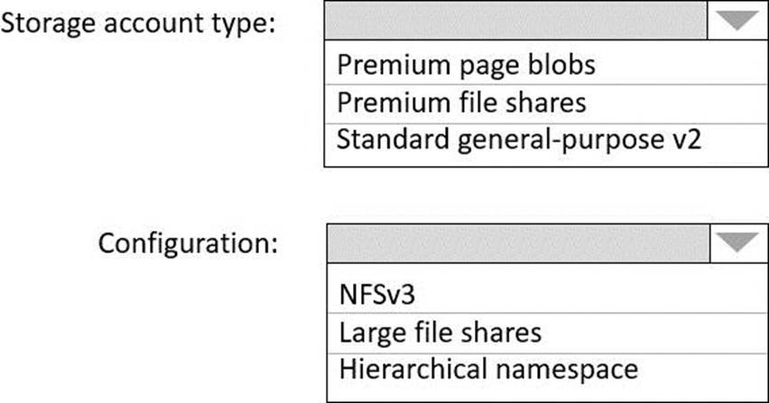

- [ ] Storage account type: Standard general-purpose v2. Configuration: NFSv3.
- [x] Storage account type: Standard general-purpose v2. Configuration: Hierarchical namespace.
- [ ] Storage account type: Premium page blobs. Configuration: Hierarchical namespace.
- [ ] Storage account type: Premium file shares. Configuration: NFSv3.

**[⬆ Back to Top](#table-of-contents)**

Management groups:

- [ ] 1.
- [x] 2.
- [ ] 3.
- [ ] 4.

Bluepprint definitions:

- [x] 1.
- [ ] 2.
- [ ] 3.
- [ ] 4.

Bluepprint assignments:

- [ ] 1.
- [x] 2.
- [ ] 3.
- [ ] 4.

**[⬆ Back to Top](#table-of-contents)**

### The on-premises network contains a single Active Directory domain named contoso.com. Contoso has a single Azure subscription. Contoso has a business partnership with Fabrikam, Inc. Fabrikam users access some Contoso applications over the internet by using Azure Active Directory (Azure AD) guest accounts. Contoso plans to deploy two applications named App1 and App2 to Azure. App1 will be a Python web app hosted in Azure App Service that requires a Linux runtime. Users from Contoso and Fabrikam will access App1. App1 will access several services that require third-party credentials and access strings. The credentials and access strings are stored in Azure Key Vault. App1 will have six instances: three in the East US Azure region and three in the West Europe Azure region. App1 has the following data requirements: Each instance will write data to a data store in the same availability zone as the instance. Data written by any App1 instance must be visible to all App1 instances. App1 will only be accessible from the internet. App1 has the following connection requirements: Connections to App1 must pass through a web application firewall (WAF). Connections to App1 must be active-active load balanced between instances. All connections to App1 from North America must be directed to the East US region. All other connections must be directed to the West Europe region. Every hour, you will run a maintenance task by invoking a PowerShell script that copies files from all the App1 instances. The PowerShell script will run from a central location. App2 will be a NET app hosted in App Service that requires a Windows runtime. App2 has the following file storage requirements: Save files to an Azure Storage account. Replicate files to an on-premises location. Ensure that on-premises clients can read the files over the LAN by using the SMB protocol. You need to monitor App2 to analyze how long it takes to perform different transactions within the application. The solution must not require changes to the application code. Application developers will constantly develop new versions of App1 and App2. The development process must meet the following requirements: A staging instance of a new application version must be deployed to the application host before the new version is used in production. After testing the new version, the staging version of the application will replace the production version. The switch to the new application version from staging to production must occur without any downtime of the application. Contoso identifies the following requirements for managing Fabrikam access to resources: Every month, an account manager at Fabrikam must review which Fabrikam users have access permissions to App1. Accounts that no longer need permissions must be removed as guests. The solution must minimize development effort. All secrets used by Azure services must be stored in Azure Key Vault. Services that require credentials must have the credentials tied to the service instance. The credentials must NOT be shared between services. What should you implement to meet the identity requirements?

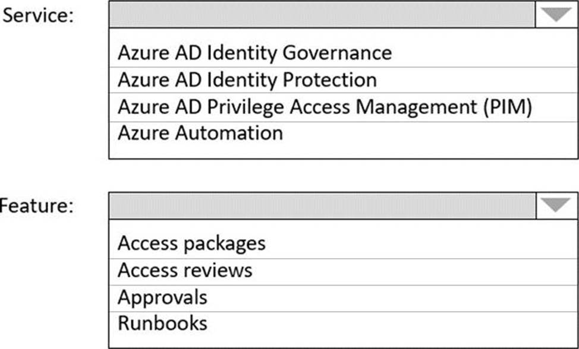

- [ ] Service: Azure Automation. Feature: Access reviews.
- [x] Service: The Azure AD Privileged Identity Management (PIM). Feature: Access reviews.
- [ ] Service: The Azure AD Privileged Identity Management (PIM). Feature: Approvals.
- [ ] Service: Azure Automation. Feature: Runbooks.

**[⬆ Back to Top](#table-of-contents)**

### You plan to import data from your on-premises environment to Azure. The data Is shown in the following table. What should you recommend using to migrate the data?

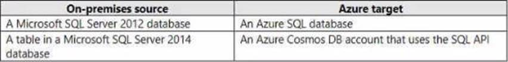
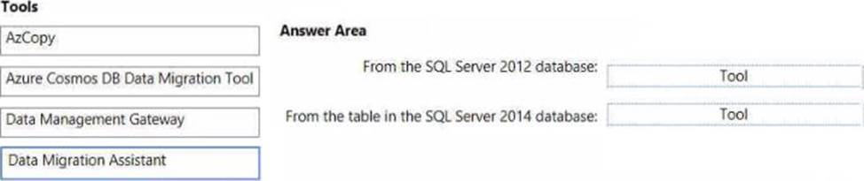

- [ ] From the SQL Server 2012 database: Data Migration Assistant. From the table in the SQL Server 2014 database: AzCopy.
- [ ] From the SQL Server 2012 database: Data Management Gateway. From the table in the SQL Server 2014 database: Data Migration Assistant.
- [ ] From the SQL Server 2012 database: Azure Cosmos DB Data Migration Tool. From the table in the SQL Server 2014 database: Data Migration Assistant.
- [x] From the SQL Server 2012 database: Data Migration Assistant. From the table in the SQL Server 2014 database: Azure Cosmos DB Data Migration Tool.

**[⬆ Back to Top](#table-of-contents)**

### Your organization has developed and deployed several Azure App Service Web and API applications. The applications use Azure Key Vault to store several authentication, storage account, and data encryption keys. Several departments have the following requests to support the applications. You need to recommend the appropriate Azure service for each department request. What should you recommend?

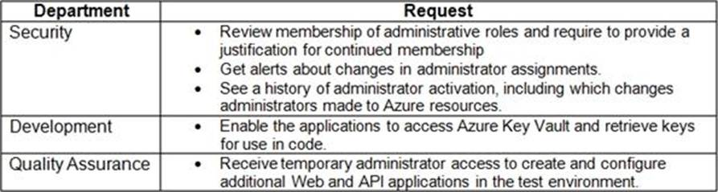
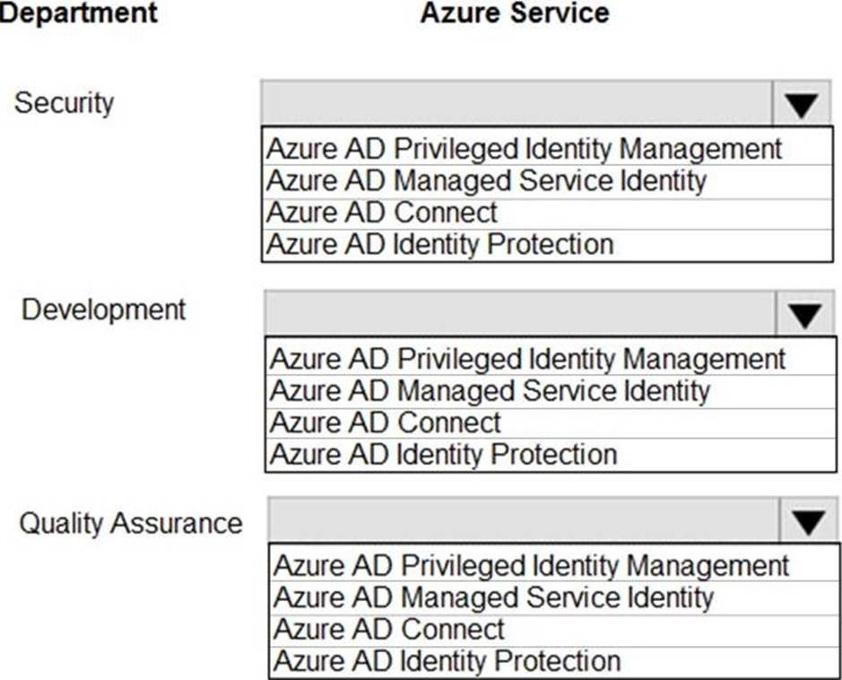

- [ ] Security: Azure AD Privileged Identity Management. Development: Azure AD Connect. Quality Assurance: Azure AD Identity Protection.
- [ ] Security: Azure AD Identity Protection. Development: Azure AD Connect. Quality Assurance: Privileged Identity Management.
- [x] Security: Azure AD Privileged Identity Management. Development: Azure AD Managed Service Identity. Quality Assurance: Azure AD Privileged Identity Management.
- [ ] Security: Azure AD Identity Protection. Development: Azure AD Managed Service Identity. Quality Assurance: Azure AD Connect.

**[⬆ Back to Top](#table-of-contents)**

### The on-premises network contains a single Active Directory domain named contoso.com. Contoso has a single Azure subscription. Contoso has a business partnership with Fabrikam, Inc. Fabrikam users access some Contoso applications over the internet by using Azure Active Directory (Azure AD) guest accounts. Contoso plans to deploy two applications named App1 and App2 to Azure. App1 will be a Python web app hosted in Azure App Service that requires a Linux runtime. Users from Contoso and Fabrikam will access App1. App1 will access several services that require third-party credentials and access strings. The credentials and access strings are stored in Azure Key Vault. App1 will have six instances: three in the East US Azure region and three in the West Europe Azure region. App1 has the following data requirements: Each instance will write data to a data store in the same availability zone as the instance. Data written by any App1 instance must be visible to all App1 instances. App1 will only be accessible from the internet. App1 has the following connection requirements: Connections to App1 must pass through a web application firewall (WAF). Connections to App1 must be active-active load balanced between instances. All connections to App1 from North America must be directed to the East US region. All other connections must be directed to the West Europe region. Every hour, you will run a maintenance task by invoking a PowerShell script that copies files from all the App1 instances. The PowerShell script will run from a central location. App2 will be a NET app hosted in App Service that requires a Windows runtime. App2 has the following file storage requirements: Save files to an Azure Storage account. Replicate files to an on-premises location. Ensure that on-premises clients can read the files over the LAN by using the SMB protocol. You need to monitor App2 to analyze how long it takes to perform different transactions within the application. The solution must not require changes to the application code. Application developers will constantly develop new versions of App1 and App2. The development process must meet the following requirements: A staging instance of a new application version must be deployed to the application host before the new version is used in production. After testing the new version, the staging version of the application will replace the production version. The switch to the new application version from staging to production must occur without any downtime of the application. Contoso identifies the following requirements for managing Fabrikam access to resources: Every month, an account manager at Fabrikam must review which Fabrikam users have access permissions to App1. Accounts that no longer need permissions must be removed as guests. The solution must minimize development effort. All secrets used by Azure services must be stored in Azure Key Vault. Services that require credentials must have the credentials tied to the service instance. The credentials must NOT be shared between services. You need to recommend a solution that meets the data requirements for App1. What should you recommend deploying to each availability zone that contains an instance of App1?

- [x] An Azure Cosmos DB that uses multi-region writes.
- [ ] An Azure Storage account that uses geo-zone-redundant storage (GZRS).
- [ ] An Azure Data Lake store that uses geo-zone-redundant storage (GZRS).
- [ ] An Azure SQL database that uses active geo-replication.

**[⬆ Back to Top](#table-of-contents)**

### Fabrikam, Inc. is an engineering company that has offices throughout Europe. The company has a main office in London and three branch offices in Amsterdam, Berlin, and Rome. The network contains two Active Directory forests named corp.fabrikam.com and rd.fabrikam.com. There are no trust relationships between the forests. Corp.fabrikam.com is a production forest that contains identities used for internal user and computer authentication. Rd.fabrikam.com is used by the research and development (R&D) department only. The R&D department is restricted to using on-premises resources only. Each office contains at least one domain controller from the corp.fabrikam.com domain. The main office contains all the domain controllers for the rd.fabrikam.com forest. All the offices have a high-speed connection to the internet. An existing application named WebApp1 is hosted in the data center of the London office. WebApp1 is used by customers to place and track orders. WebApp1 has a web tier that uses Microsoft Internet information Services (IIS) and a database tier that runs Microsoft SQL Server 2016. The web tier and the database tier are deployed to virtual machines that run on Hyper-V. The IT department currently uses a separate Hyper-V environment to test updates to WebApp1. Fabrikam purchases all Microsoft licenses through a Microsoft Enterprise Agreement that includes Software Assurance. The use of WebApp1 is unpredictable. At peak times, users often report delays. At other times, many resources for WebApp1 are underutilized. Fabrikam plans to move most of its production workloads to Azure during the next few years, including virtual machines that rely on Active Directory for authentication. As one of its first projects, the company plans to establish a hybrid identity model, facilitating an upcoming Microsoft 365 deployment. All R&D operations will remain on-premises. Fabrikam plans to migrate the production and test instances of WebApp1 to Azure. Fabrikam identifies the following technical requirements: Website content must be easily updated from a single point. User input must be minimized when provisioning new web app instances. Whenever possible, existing on-premises licenses must be used to reduce cost. Users must always authenticate by using their corp.fabrikam.com UPN identity. Any new deployments to Azure must be redundant in case an Azure region fails. Whenever possible, solutions must be deployed to Azure by using the Standard pricing tier of Azure App Service. An email distribution group named IT Support must be notified of any issues relating to the directory synchronization services. In the event that a link fails between Azure and the on-premises network, ensure that the virtual machines hosted in Azure can authenticate to Active Directory. Directory synchronization between Azure Active Directory (Azure AD) and corp.fabrikam.com must not be affected by a link failure between Azure and the on- premises network. Fabrikam identifies the following database requirements: Database metrics for the production instance of WebApp1 must be available for analysis so that database administrators can optimize the performance settings. To avoid disrupting customer access, database downtime must be minimized when databases are migrated. Database backups must be retained for a minimum of seven years to meet compliance requirements. Fabrikam identifies the following security requirements: Company information including policies, templates, and data must be inaccessible to anyone outside the company. Users on the on-premises network must be able to authenticate to corp.fabrikam.com if an internet link fails. Administrators must be able authenticate to the Azure portal by using their corp.fabrikam.com credentials. All administrative access to the Azure portal must be secured by using multi-factor authentication (MFA). The testing of WebApp1 updates must not be visible to anyone outside the company. You need to recommend a solution to meet the database retention requirements. What should you recommend?

- [x] Configure a long-term retention policy for the database.
- [ ] Configure Azure Site Recovery.
- [ ] Configure geo replication of the database.
- [ ] Use automatic Azure SQL Database backups.

**[⬆ Back to Top](#table-of-contents)**

### You need to recommend a solution to ensure that App1 can access the third-party credentials and access strings. The solution must meet the What should you include in the recommendation?

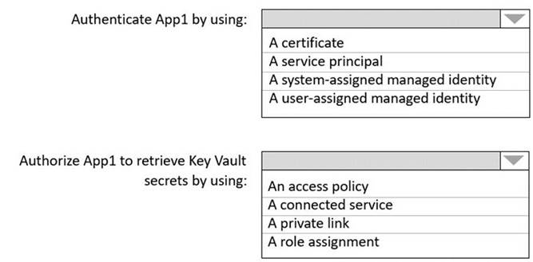

- [ ] Authenticate App1 by using: A service principal. Authorize App1 to retrieve Key Vault secrets by using: A role assignment.
- [ ] Authenticate App1 by using: A system-assigned managed identity. Authorize App1 to retrieve Key Vault secrets by using: A role assignment.
- [x] Authenticate App1 by using: A system-assigned managed identity. Authorize App1 to retrieve Key Vault secrets by using: An access policy.
- [ ] Authenticate App1 by using: A service principal. Authorize App1 to retrieve Key Vault secrets by using: An access policy.

**[⬆ Back to Top](#table-of-contents)**

### You are evaluating whether to use Azure Traffic Manager and Azure Application Gateway to meet the connection requirements for App1. What is the minimum numbers of instances required for each service?

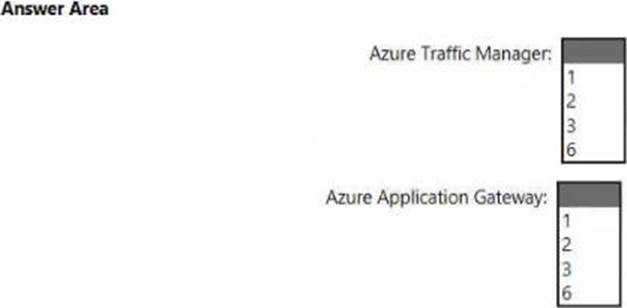

- [x] Azure Traffic Manager: 2. Azure Application Gateway: 1.
- [ ] Azure Traffic Manager: 3. Azure Application Gateway: 1.
- [ ] Azure Traffic Manager: 6. Azure Application Gateway: 3.
- [ ] Azure Traffic Manager: 1. Azure Application Gateway: 6.

**[⬆ Back to Top](#table-of-contents)**

### PLACEHOLDER

**[⬆ Back to Top](#table-of-contents)**

### Note: This question is part of a series of questions that present the same scenario. Each question in the series contains a unique solution that might meet the stated goals. Some question sets might have more than one correct solution, while others might not have a correct solution. After you answer a question in this section, you will NOT be able to return to it. As a result, these questions will not appear in the review screen. Your company deploys several virtual machines on-premises and to Azure. ExpressRoute is deployed and configured for on-premises to Azure connectivity. Several virtual machines exhibit network connectivity issues. You need to analyze the network traffic to identify whether packets are being allowed or denied to the virtual machines. Solution: Use Azure Advisor to analyze the network traffic. Does this meet the goal?

- [ ] Yes.
- [x] No.

**[⬆ Back to Top](#table-of-contents)**

### You need to recommend a solution to generate a monthly report of all the new Azure Resource Manager resource deployment in your subscription. What should you include in the recommendation?

- [x] Azure Activity Log.
- [ ] Azure Monitor action groups.
- [ ] Azure Advisor.
- [ ] Azure Monitor metrics.

**[⬆ Back to Top](#table-of-contents)**

### You need to design a storage solution for an app that will store large amounts of frequently used data. The solution must meet the following requirements: Maximize data throughput. Prevent the modification of data for one year. Minimize latency for read and write operations. Which Azure Storage account type and storage service should you recommend?

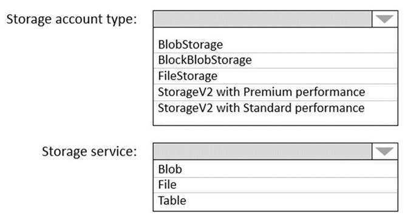

- [ ] Storage account type: BlobStorage. Storage service: File.
- [x] Storage account type: BlockBlobStorage. Storage service: Blob.
- [ ] Storage account type: StorageV.2 with Premium performance. Storage service: Table.
- [ ] Storage account type: BlockBlobStorage. Storage service: Table.

**[⬆ Back to Top](#table-of-contents)**

### You need to recommend an Azure Storage Account configuration for two applications named Application1 and Applications. The configuration must meet the following requirements: Storage for Application1 must provide the highest possible transaction rates and the lowest possible latency. Storage for Application2 must provide the lowest possible storage costs per GB. Storage for both applications must be optimized for uploads and downloads. Storage for both applications must be available in an event of datacenter failure. What should you recommend?

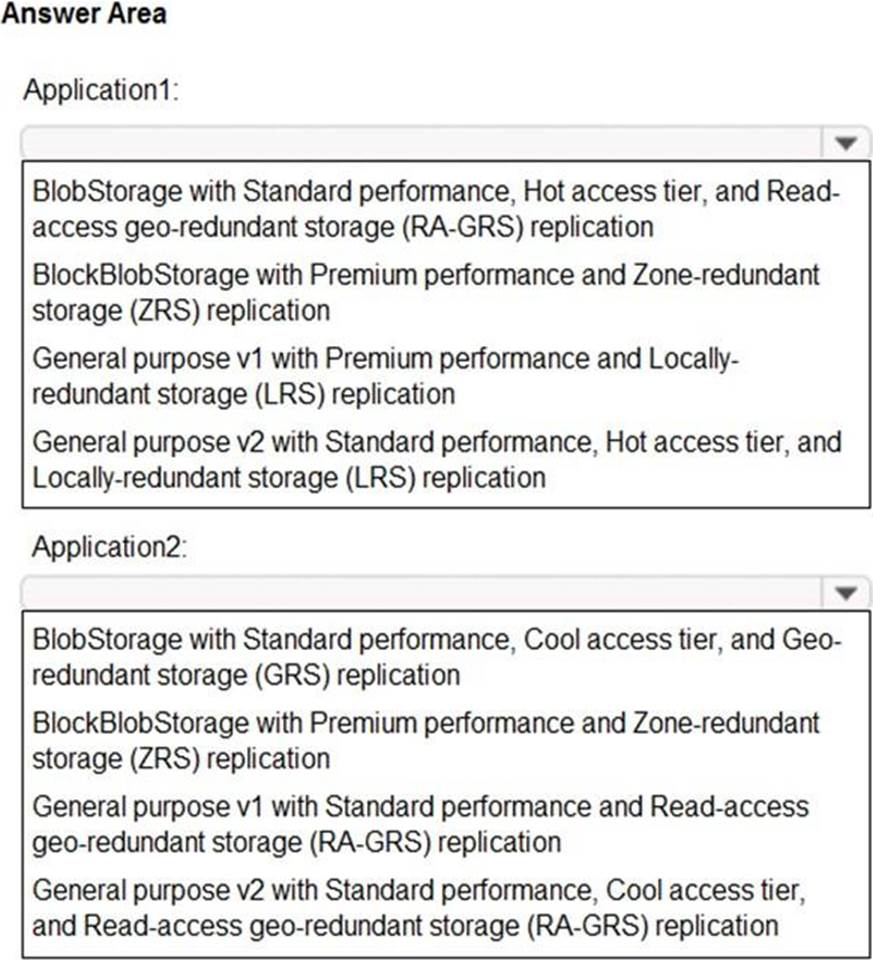

- [x] Application1: BlockBlobStorage with Premium performance and Zone-redundant storage (ZRS) replication. Application2: General purpose v2 with Standard performance, Cool access tier,
and Read-access geo-redundant storage (RA-GRS) replication.
- [ ] Application1: BlobStorage with Standard performance, Hot access tier, and Read-access geo-redundant storage (RA-GRS) replication. Application2: General purpose v1 with Standard performance and Read-access geo-redundant storage (RA-GRS) replication.
- [ ] Application1: BlockBlobStorage with Premium performance and Zone-redundant storage (ZRS) replication. Application2: BlobStorage with Standard performance, Cool access tier, and Geo redundant storage (GRS) replicaton.
- [ ] Application1: General purpose v2 with Standard performance, Hot access tier, and
Locally-redundant storage (LRS) replication. Application2: General purpose v2 with Standard performance, Cool access tier,and Read-access geo-redundant storage (RA-GRS) replication.

**[⬆ Back to Top](#table-of-contents)**

### Fabrikam, Inc. is an engineering company that has offices throughout Europe. The company has a main office in London and three branch offices in Amsterdam, Berlin, and Rome. The network contains two Active Directory forests named corp.fabrikam.com and rd.fabrikam.com. There are no trust relationships between the forests. Corp.fabrikam.com is a production forest that contains identities used for internal user and computer authentication. Rd.fabrikam.com is used by the research and development (R&D) department only. The R&D department is restricted to using on-premises resources only. Each office contains at least one domain controller from the corp.fabrikam.com domain. The main office contains all the domain controllers for the rd.fabrikam.com forest. All the offices have a high-speed connection to the internet. An existing application named WebApp1 is hosted in the data center of the London office. WebApp1 is used by customers to place and track orders. WebApp1 has a web tier that uses Microsoft Internet information Services (IIS) and a database tier that runs Microsoft SQL Server 2016. The web tier and the database tier are deployed to virtual machines that run on Hyper-V. The IT department currently uses a separate Hyper-V environment to test updates to WebApp1. Fabrikam purchases all Microsoft licenses through a Microsoft Enterprise Agreement that includes Software Assurance. The use of WebApp1 is unpredictable. At peak times, users often report delays. At other times, many resources for WebApp1 are underutilized. Fabrikam plans to move most of its production workloads to Azure during the next few years, including virtual machines that rely on Active Directory for authentication. As one of its first projects, the company plans to establish a hybrid identity model, facilitating an upcoming Microsoft 365 deployment. All R&D operations will remain on-premises. Fabrikam plans to migrate the production and test instances of WebApp1 to Azure. Fabrikam identifies the following technical requirements: Website content must be easily updated from a single point. User input must be minimized when provisioning new web app instances. Whenever possible, existing on-premises licenses must be used to reduce cost. Users must always authenticate by using their corp.fabrikam.com UPN identity. Any new deployments to Azure must be redundant in case an Azure region fails. Whenever possible, solutions must be deployed to Azure by using the Standard pricing tier of Azure App Service. An email distribution group named IT Support must be notified of any issues relating to the directory synchronization services. In the event that a link fails between Azure and the on-premises network, ensure that the virtual machines hosted in Azure can authenticate to Active Directory. Directory synchronization between Azure Active Directory (Azure AD) and corp.fabrikam.com must not be affected by a link failure between Azure and the on- premises network. Fabrikam identifies the following database requirements: Database metrics for the production instance of WebApp1 must be available for analysis so that database administrators can optimize the performance settings. To avoid disrupting customer access, database downtime must be minimized when databases are migrated. Database backups must be retained for a minimum of seven years to meet compliance requirements. Fabrikam identifies the following security requirements: Company information including policies, templates, and data must be inaccessible to anyone outside the company. Users on the on-premises network must be able to authenticate to corp.fabrikam.com if an internet link fails. Administrators must be able authenticate to the Azure portal by using their corp.fabrikam.com credentials. All administrative access to the Azure portal must be secured by using multi-factor authentication (MFA). The testing of WebApp1 updates must not be visible to anyone outside the company. To meet the authentication requirements of Fabrikam, what should you include in the solution?

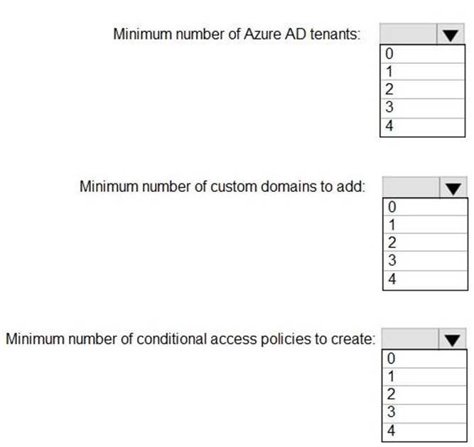

- [ ] Minimum number of Azure AD tenants: 2. Minimum number of custom domains to add: 4. Minimum number of conditional access policies to create: 1
- [ ] Minimum number of Azure AD tenants: 1. Minimum number of custom domains to add: 1 Minimum number of conditional access policies to create: 0.
- [x] Minimum number of Azure AD tenants: 1. Minimum number of custom domains to add: 1. Minimum number of conditional access policies to create: 2.
- [ ] Minimum number of Azure AD tenants: 1. Minimum number of custom domains to add: 1. Minimum number of conditional access policies to create: 1.

**[⬆ Back to Top](#table-of-contents)**

### You need to design an architecture to capture the creation of users and the assignment of roles. The captured data must be stored in Azure Cosmos DB. Which Azure services should you include in the design?

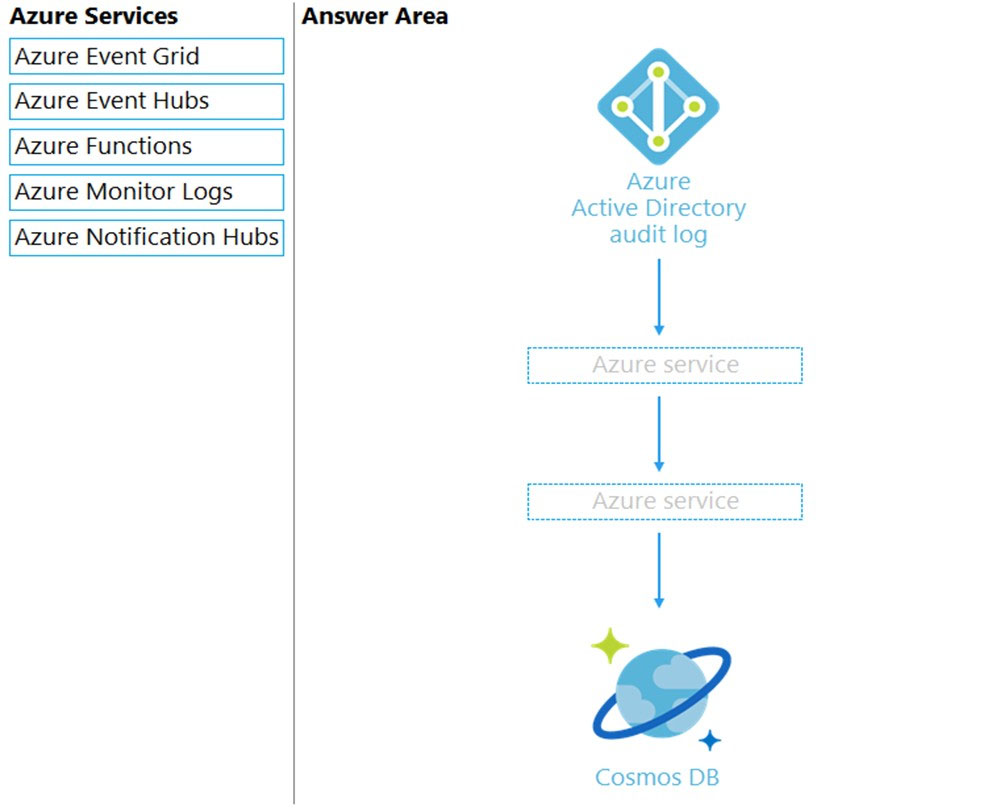

- [ ] Box 1: Azure Event Grid. Box 2: Azure Functions.
- [x] Box 1: Azure Event Hubs. Box 2: Azure Functions.
- [ ] Box 1: Azure Notification Hubs. Box 2: Azure Log Analytics.
- [ ] Box1: Azure Notification Hubs. Box 2: Azure Functions.

**[⬆ Back to Top](#table-of-contents)**

### Litware, Inc. is a medium-sized finance company. Litware has a main office in Boston. The network contains an Active Directory forest named Litware.com that is linked to an Azure Active Directory (Azure AD) tenant named Litware.com. All users have Azure Active Directory Premium P2 licenses. Litware has a second Azure AD tenant named dev.Litware.com that is used as a development environment. The Litware.com tenant has a conditional acess policy named capolicy1. Capolicy1 requires that when users manage the Azure subscription for a production environment by using the Azure portal, they must connect from a hybrid Azure AD-joined device. Litware has 10 Azure subscriptions that are linked to the Litware.com tenant and five Azure subscriptions that are linked to the dev.Litware.com tenant. All the subscriptions are in an Enterprise Agreement (EA). The Litware.com tenant contains a custom Azure role-based access control (Azure RBAC) role named Role1 that grants the DataActions read permission to the blobs and files in Azure Storage. The on-premises network of Litware contains the resources shown in the following table. Litware has ExpressRoute connectivity to Azure. Litware plans to implement the following changes: Migrate DB1 and DB2 to Azure. Migrate App1 to Azure virtual machines. Deploy the Azure virtual machines that will host App1 to Azure dedicated hosts. Litware identifies the following authentication and authorization requirements: Users that manage the production environment by using the Azure portal must connect from a hybrid Azure AD-joined device and authenticate by using Azure Multi-Factor Authentication (MFA). The Network Contributor built-in RBAC role must be used to grant permission to all the virtual networks in all the Azure subscriptions. To access the resources in Azure, App1 must use the managed identity of the virtual machines that will host the app. Role1 must be used to assign permissions to the storage accounts of all the Azure subscriptions. RBAC roles must be applied at the highest level possible. Litware identifies the following resiliency requirements: Once migrated to Azure, DB1 and DB2 must meet the following requirements: Maintain availability if two availability zones in the local Azure region fail. Fail over automatically. Minimize I/O latency. App1 must meet the following requirements: Be hosted in an Azure region that supports availability zones. Be hosted on Azure virtual machines that support automatic scaling. Maintain availability if two availability zones in the local Azure region fail. Litware identifies the following security and compliance requirements: Once App1 is migrated to Azure, you must ensure that new data can be written to the app, and the modification of new and existing data is prevented for a period of three years. On-premises users and services must be able to access the Azure Storage account that will host the data in App1. Access to the public endpoint of the Azure Storage account that will host the App1 data must be prevented. All Azure SQL databases in the production environment must have Transparent Data Encryption (TDE) enabled. App1 must not share physical hardware with other workloads. Litware identifies the following business requirements: Minimize administrative effort. Minimize costs. You plan to migrate DB1 and DB2 to Azure. You need to ensure that the Azure database and the service tier meet the resiliency and business requirements. What should you configure?

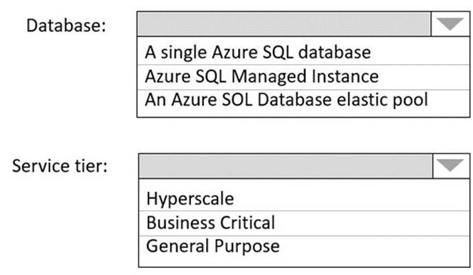

- [x] Database: An Azure SQL Database elastic pool. Service tier: Business Critical.
- [ ] Database: Azure SQL Managed Instance. Service tier: Business Critical.
- [ ] Database: An Azure SQL Database elastic pool. Service tier: Hyperscale.
- [ ] Database: Azure SQL Managed Instance. Service tier: Business Critical.

**[⬆ Back to Top](#table-of-contents)**

### You need to recommend a strategy for the web tier of WebApp1. The solution must minimize. What should you recommend?

- [x] Create a runbook that resizes virtual machines automatically to a smaller size outside of business hours.
- [ ] Configure the Scale Up settings for a web app.
- [ ] Deploy a virtual machine scale set that scales out on a 75 percent CPU threshold.
- [ ] Configure the Scale Out settings for a web app.

**[⬆ Back to Top](#table-of-contents)**

### Litware, Inc. is a medium-sized finance company. Litware has a main office in Boston. The network contains an Active Directory forest named Litware.com that is linked to an Azure Active Directory (Azure AD) tenant named Litware.com. All users have Azure Active Directory Premium P2 licenses. Litware has a second Azure AD tenant named dev.Litware.com that is used as a development environment. The Litware.com tenant has a conditional acess policy named capolicy1. Capolicy1 requires that when users manage the Azure subscription for a production environment by using the Azure portal, they must connect from a hybrid Azure AD-joined device. Litware has 10 Azure subscriptions that are linked to the Litware.com tenant and five Azure subscriptions that are linked to the dev.Litware.com tenant. All the subscriptions are in an Enterprise Agreement (EA). The Litware.com tenant contains a custom Azure role-based access control (Azure RBAC) role named Role1 that grants the DataActions read permission to the blobs and files in Azure Storage. The on-premises network of Litware contains the resources shown in the following table. Litware has ExpressRoute connectivity to Azure. Litware plans to implement the following changes: Migrate DB1 and DB2 to Azure. Migrate App1 to Azure virtual machines. Deploy the Azure virtual machines that will host App1 to Azure dedicated hosts. Litware identifies the following authentication and authorization requirements: Users that manage the production environment by using the Azure portal must connect from a hybrid Azure AD-joined device and authenticate by using Azure Multi-Factor Authentication (MFA). The Network Contributor built-in RBAC role must be used to grant permission to all the virtual networks in all the Azure subscriptions. To access the resources in Azure, App1 must use the managed identity of the virtual machines that will host the app. Role1 must be used to assign permissions to the storage accounts of all the Azure subscriptions. RBAC roles must be applied at the highest level possible. Litware identifies the following resiliency requirements: Once migrated to Azure, DB1 and DB2 must meet the following requirements: Maintain availability if two availability zones in the local Azure region fail. Fail over automatically. Minimize I/O latency. App1 must meet the following requirements: Be hosted in an Azure region that supports availability zones. Be hosted on Azure virtual machines that support automatic scaling. Maintain availability if two availability zones in the local Azure region fail. Litware identifies the following security and compliance requirements: Once App1 is migrated to Azure, you must ensure that new data can be written to the app, and the modification of new and existing data is prevented for a period of three years. On-premises users and services must be able to access the Azure Storage account that will host the data in App1. Access to the public endpoint of the Azure Storage account that will host the App1 data must be prevented. All Azure SQL databases in the production environment must have Transparent Data Encryption (TDE) enabled. App1 must not share physical hardware with other workloads. Litware identifies the following business requirements: Minimize administrative effort. Minimize costs. You plan to migrate App1 to Azure. You need to recommend a network connectivity solution for the Azure Storage account that will host the App1 data. The solution must meet the security and compliance requirements. What should you include in the recommendation?

- [ ] Azure Instance Metadata Service (IMDS).
- [ ] Azure AD.
- [ ] Azure Service Management.
- [x] Microsoft identity platform.

**[⬆ Back to Top](#table-of-contents)**

### Litware, Inc. is a medium-sized finance company. Litware has a main office in Boston. The network contains an Active Directory forest named Litware.com that is linked to an Azure Active Directory (Azure AD) tenant named Litware.com. All users have Azure Active Directory Premium P2 licenses. Litware has a second Azure AD tenant named dev.Litware.com that is used as a development environment. The Litware.com tenant has a conditional acess policy named capolicy1. Capolicy1 requires that when users manage the Azure subscription for a production environment by using the Azure portal, they must connect from a hybrid Azure AD-joined device. Litware has 10 Azure subscriptions that are linked to the Litware.com tenant and five Azure subscriptions that are linked to the dev.Litware.com tenant. All the subscriptions are in an Enterprise Agreement (EA). The Litware.com tenant contains a custom Azure role-based access control (Azure RBAC) role named Role1 that grants the DataActions read permission to the blobs and files in Azure Storage. The on-premises network of Litware contains the resources shown in the following table. Litware has ExpressRoute connectivity to Azure. Litware plans to implement the following changes: Migrate DB1 and DB2 to Azure. Migrate App1 to Azure virtual machines. Deploy the Azure virtual machines that will host App1 to Azure dedicated hosts. Litware identifies the following authentication and authorization requirements: Users that manage the production environment by using the Azure portal must connect from a hybrid Azure AD-joined device and authenticate by using Azure Multi-Factor Authentication (MFA). The Network Contributor built-in RBAC role must be used to grant permission to all the virtual networks in all the Azure subscriptions. To access the resources in Azure, App1 must use the managed identity of the virtual machines that will host the app. Role1 must be used to assign permissions to the storage accounts of all the Azure subscriptions. RBAC roles must be applied at the highest level possible. Litware identifies the following resiliency requirements: Once migrated to Azure, DB1 and DB2 must meet the following requirements: Maintain availability if two availability zones in the local Azure region fail. Fail over automatically. Minimize I/O latency. App1 must meet the following requirements: Be hosted in an Azure region that supports availability zones. Be hosted on Azure virtual machines that support automatic scaling. Maintain availability if two availability zones in the local Azure region fail. Litware identifies the following security and compliance requirements: Once App1 is migrated to Azure, you must ensure that new data can be written to the app, and the modification of new and existing data is prevented for a period of three years. On-premises users and services must be able to access the Azure Storage account that will host the data in App1. Access to the public endpoint of the Azure Storage account that will host the App1 data must be prevented. All Azure SQL databases in the production environment must have Transparent Data Encryption (TDE) enabled. App1 must not share physical hardware with other workloads. Litware identifies the following business requirements: Minimize administrative effort. Minimize costs. You plan to migrate App1 to Azure. You need to recommend a network connectivity solution for the Azure Storage account that will host the App1 data. The solution must meet the security and compliance requirements. What should you include in the recommendation?

- [x] A private endpoint.
- [ ] A service endpoint that has a service endpoint policy.
- [ ] Azure public peering for an ExpressRoute circuit.
- [ ] Microsoft peering for an ExpressRoute circuit.

**[⬆ Back to Top](#table-of-contents)**

### You need to ensure that users managing the production environment are registered for Azure MFA and must authenticate by using Azure MFA when they sign in to the Azure portal. The solution must meet the authentication and authorization requirements. What should you do?

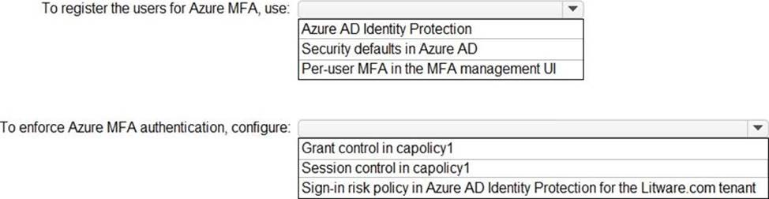

- [x] To register the users for Azure MFA, use: Azure AD Identity Protection. To enforce Azure MFA authertication, configure: Sign-in nsk policy in Azure AD Identity Protection for the Litware.com tenant.
- [ ] To register the users for Azure MFA, use: Azure AD Identity Protection. To enforce Azure MFA authertication, configure: Grant control in capolicy1.
- [ ] To register the users for Azure MFA, use:Secunty defaults in Azure AD. configure: Session control in capolicy1.
- [ ] To register the users for Azure MFA, use: Per-user MFA in the MFA management Ul. configure: Grant control in capolicy1.

**[⬆ Back to Top](#table-of-contents)**

### You need to recommend an App Service architecture that meets the requirements for Appl. The solution must minimize costs. What should few recommend?

- [x] One App Service Environment (ASE) per availability zone.
- [ ] One App Service plan per availability zone.
- [ ] One App Service plan per region.
- [ ] One App Service Environment (ASE) per region.

**[⬆ Back to Top](#table-of-contents)**

### Your company develops a web service that is deployed to an Azure virtual machine named VM1. The web service allows an API to access real-time data from VM1. The current virtual machine deployment is shown in the Deployment exhibit. The chief technology officer (CTO) sends you the following email message: 'Our developers have deployed the web service to a virtual machine named VM1. Testing has shown that the API is accessible from VM1 and VM2. Our partners must be able to connect to the API over the Internet. Partners will use this data in applications that they develop.' You deploy an Azure API Management (APIM) service. The relevant API Management configuration is shown in the API exhibit. The API is available to partners over the Internet.

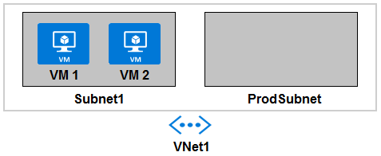
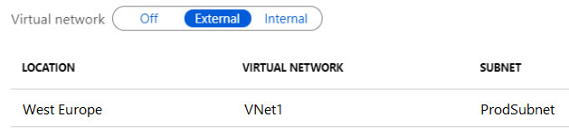

- [x] Yes.
- [ ] No.

**[⬆ Back to Top](#table-of-contents)**

### Your company develops a web service that is deployed to an Azure virtual machine named VM1. The web service allows an API to access real-time data from VM1. The current virtual machine deployment is shown in the Deployment exhibit. The chief technology officer (CTO) sends you the following email message: 'Our developers have deployed the web service to a virtual machine named VM1. Testing has shown that the API is accessible from VM1 and VM2. Our partners must be able to connect to the API over the Internet. Partners will use this data in applications that they develop.' You deploy an Azure API Management (APIM) service. The relevant API Management configuration is shown in the API exhibit. The APIM instance can access real-time data from VM1.

- [x] Yes.
- [ ] No.

**[⬆ Back to Top](#table-of-contents)**

### Your company develops a web service that is deployed to an Azure virtual machine named VM1. The web service allows an API to access real-time data from VM1. The current virtual machine deployment is shown in the Deployment exhibit. The chief technology officer (CTO) sends you the following email message: 'Our developers have deployed the web service to a virtual machine named VM1. Testing has shown that the API is accessible from VM1 and VM2. Our partners must be able to connect to the API over the Internet. Partners will use this data in applications that they develop.' You deploy an Azure API Management (APIM) service. The relevant API Management configuration is shown in the API exhibit. A VPN gateway is required for partner access.

- [ ] Yes.
- [x] No.

**[⬆ Back to Top](#table-of-contents)**

### What should you include in the recommendation? [???]

- [ ] Azure Network Watcher.
- [ ] An action group.
- [ ] A SendGrid account with advanced reporting.
- [x] Azure AD Connect Health.

**[⬆ Back to Top](#table-of-contents)**

### You design a solution for the web tier of WebApp1 as shown in the exhibit. Question 1: The design supports the technical requirements for redundancy.

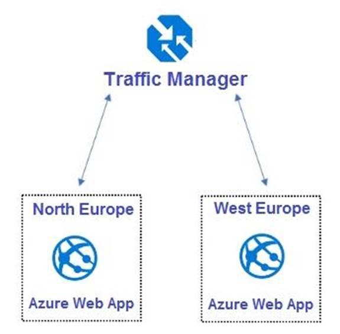

- [x] Yes.
- [ ] No.

**[⬆ Back to Top](#table-of-contents)**

### You have an Azure subscription named Subscription1 that is linked to a hybrid Azure Active Directory (Azure AD) tenant. You have an on-premises datacenter that does NOT have a VPN connection to Subscription1. The datacenter contains a computer named Server1 that has Microsoft SQL Server 2016 installed. Server1 is prevented from accessing the internet. An Azure logic app named LogicApp1 requires write access to a database on Server1. You need to recommend a solution to provide LogicApp1 with the ability to access Server1. What should you recommend deploying on-premises and in Azure?

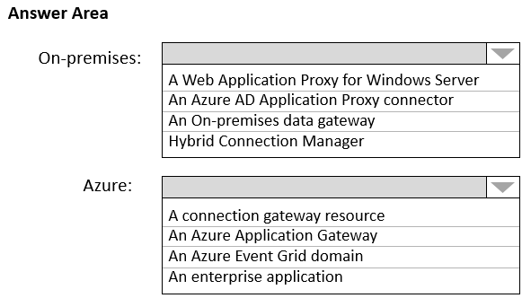

- [ ] On-premises: An On-premises data gateway. Azure: An enterprise application.
- [x] On-premises: An On-premises data gateway. Azure: A connection gateway resource.
- [ ] On-premises: A Web Application Proxy for Windows Server. Azure: An Azure Event Grid domain.
- [ ] On-premises: An Azure AD Application Proxy connector. Azure: An Azure Application Gateway.

**[⬆ Back to Top](#table-of-contents)**

### You plan to migrate App1 to Azure. You need to estimate the compute costs for App1 in Azure. The solution must meet the security and compliance requirements. What should you use to estimate the costs, and what should you implement to minimize the costs?

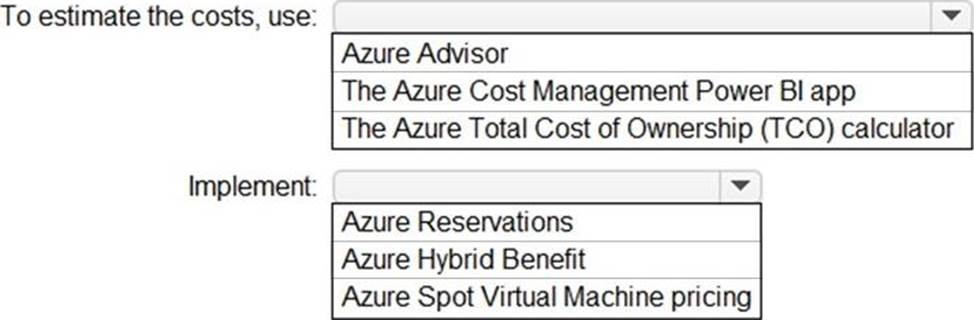

- [ ] To estimate the costs, use: The Azure Cost Management Power Bl app. Implement: Azure Spot Virtual Machine pricing.
- [ ] To estimate the costs, use: The Azure Cost Management Power Bl app. Implement: Azure Reservations.
- [x] To estimate the costs, use: The Azure Total Cost of Ownership (TCO) calculator. Implement: Azure Hybrid Benefit.
- [ ] To estimate the costs, use: Azure Reservations. Implement: Azure Hybrid Benefit.

**[⬆ Back to Top](#table-of-contents)**

### Litware, Inc. is a medium-sized finance company. Litware has a main office in Boston. The network contains an Active Directory forest named Litware.com that is linked to an Azure Active Directory (Azure AD) tenant named Litware.com. All users have Azure Active Directory Premium P2 licenses. Litware has a second Azure AD tenant named dev.Litware.com that is used as a development environment. The Litware.com tenant has a conditional acess policy named capolicy1. Capolicy1 requires that when users manage the Azure subscription for a production environment by using the Azure portal, they must connect from a hybrid Azure AD-joined device. Litware has 10 Azure subscriptions that are linked to the Litware.com tenant and five Azure subscriptions that are linked to the dev.Litware.com tenant. All the subscriptions are in an Enterprise Agreement (EA). The Litware.com tenant contains a custom Azure role-based access control (Azure RBAC) role named Role1 that grants the DataActions read permission to the blobs and files in Azure Storage. The on-premises network of Litware contains the resources shown in the following table. Litware has ExpressRoute connectivity to Azure. Litware plans to implement the following changes: Migrate DB1 and DB2 to Azure. Migrate App1 to Azure virtual machines. Deploy the Azure virtual machines that will host App1 to Azure dedicated hosts. Litware identifies the following authentication and authorization requirements: Users that manage the production environment by using the Azure portal must connect from a hybrid Azure AD-joined device and authenticate by using Azure Multi-Factor Authentication (MFA). The Network Contributor built-in RBAC role must be used to grant permission to all the virtual networks in all the Azure subscriptions. To access the resources in Azure, App1 must use the managed identity of the virtual machines that will host the app. Role1 must be used to assign permissions to the storage accounts of all the Azure subscriptions. RBAC roles must be applied at the highest level possible. Litware identifies the following resiliency requirements: Once migrated to Azure, DB1 and DB2 must meet the following requirements: Maintain availability if two availability zones in the local Azure region fail. Fail over automatically. Minimize I/O latency. App1 must meet the following requirements: Be hosted in an Azure region that supports availability zones. Be hosted on Azure virtual machines that support automatic scaling. Maintain availability if two availability zones in the local Azure region fail. Litware identifies the following security and compliance requirements: Once App1 is migrated to Azure, you must ensure that new data can be written to the app, and the modification of new and existing data is prevented for a period of three years. On-premises users and services must be able to access the Azure Storage account that will host the data in App1. Access to the public endpoint of the Azure Storage account that will host the App1 data must be prevented. All Azure SQL databases in the production environment must have Transparent Data Encryption (TDE) enabled. App1 must not share physical hardware with other workloads. Litware identifies the following business requirements: Minimize administrative effort. Minimize costs. You plan to migrate App1 to Azure. After you migrate App1 to Azure, you need to enforce the data modification requirements to meet the security and compliance requirements. What should you do?

- [x] Create an access policy for the blob service.
- [ ] Modify the access level of the blob service.
- [ ] Implement Azure resource locks.
- [ ] Create Azure RBAC assignments.

**[⬆ Back to Top](#table-of-contents)**

### Does this meet the goal? [???]

- [ ] Yes.
- [x] No.

**[⬆ Back to Top](#table-of-contents)**

### What should you include in the recommendation? [???]

- [ ] A Recovery Services vault and Azure Backup.
- [x] An Azure file share and Azure File Sync.
- [ ] Azure blob containers and Azure File Sync.
- [ ] A Recovery Services vault and Windows Server Backup.

**[⬆ Back to Top](#table-of-contents)**

### You plan to migrate App1 to Azure. You need to recommend a high-availability solution for App1. The solution must meet the resiliency requirements. What should you include in the recommendation?

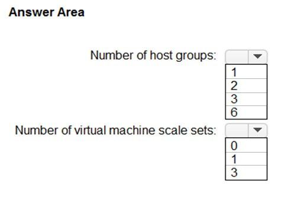

- [ ] Number of host groups: 2. Number of virtual machine scale sets: 3.
- [ ] Number of host groups: 3. Number of virtual machine scale sets: 1.
- [x] Number of host groups: 3. Number of virtual machine scale sets: 3.
- [ ] Number of host groups: 1. Number of virtual machine scale sets: 0.

**[⬆ Back to Top](#table-of-contents)**

### Litware, Inc. is a medium-sized finance company. Litware has a main office in Boston. The network contains an Active Directory forest named Litware.com that is linked to an Azure Active Directory (Azure AD) tenant named Litware.com. All users have Azure Active Directory Premium P2 licenses. Litware has a second Azure AD tenant named dev.Litware.com that is used as a development environment. The Litware.com tenant has a conditional acess policy named capolicy1. Capolicy1 requires that when users manage the Azure subscription for a production environment by using the Azure portal, they must connect from a hybrid Azure AD-joined device. Litware has 10 Azure subscriptions that are linked to the Litware.com tenant and five Azure subscriptions that are linked to the dev.Litware.com tenant. All the subscriptions are in an Enterprise Agreement (EA). The Litware.com tenant contains a custom Azure role-based access control (Azure RBAC) role named Role1 that grants the DataActions read permission to the blobs and files in Azure Storage. The on-premises network of Litware contains the resources shown in the following table. Litware has ExpressRoute connectivity to Azure. Litware plans to implement the following changes: Migrate DB1 and DB2 to Azure. Migrate App1 to Azure virtual machines. Deploy the Azure virtual machines that will host App1 to Azure dedicated hosts. Litware identifies the following authentication and authorization requirements: Users that manage the production environment by using the Azure portal must connect from a hybrid Azure AD-joined device and authenticate by using Azure Multi-Factor Authentication (MFA). The Network Contributor built-in RBAC role must be used to grant permission to all the virtual networks in all the Azure subscriptions. To access the resources in Azure, App1 must use the managed identity of the virtual machines that will host the app. Role1 must be used to assign permissions to the storage accounts of all the Azure subscriptions. RBAC roles must be applied at the highest level possible. Litware identifies the following resiliency requirements: Once migrated to Azure, DB1 and DB2 must meet the following requirements: Maintain availability if two availability zones in the local Azure region fail. Fail over automatically. Minimize I/O latency. App1 must meet the following requirements: Be hosted in an Azure region that supports availability zones. Be hosted on Azure virtual machines that support automatic scaling. Maintain availability if two availability zones in the local Azure region fail. Litware identifies the following security and compliance requirements: Once App1 is migrated to Azure, you must ensure that new data can be written to the app, and the modification of new and existing data is prevented for a period of three years. On-premises users and services must be able to access the Azure Storage account that will host the data in App1. Access to the public endpoint of the Azure Storage account that will host the App1 data must be prevented. All Azure SQL databases in the production environment must have Transparent Data Encryption (TDE) enabled. App1 must not share physical hardware with other workloads. Litware identifies the following business requirements: Minimize administrative effort. Minimize costs. You need to implement the Azure RBAC role assignments for the Network Contributor role. The solution must meet the authentication and authorization requirements. What is the minimum number of assignments that you must use?

- [ ] 1.
- [x] 2.
- [ ] 5.
- [ ] 10.
- [ ] 15.

**[⬆ Back to Top](#table-of-contents)**

### What should you include in in the recommendation? [???]

- [ ] An Azure SQL Database elastic pool.
- [x] A vCore-based Azure SQL database.
- [ ] An Azure virtual machine that runs SQL Server.
- [ ] A fixed-size DTU AzureSQL database.

**[⬆ Back to Top](#table-of-contents)**

### What should you use to make the recommendation? [???]

- [ ] Azure Cost Management.
- [ ] Azure Pricing calculator.
- [x] Azure Migrate.
- [ ] Azure Advisor.

**[⬆ Back to Top](#table-of-contents)**

### You need to configure an Azure policy to ensure that the Azure SQL databases have TDE enabled. The solution must meet the security and compliance requirements. Which three actions should you perform in sequence? To answer, move the appropriate actions from the list of actions to the answer area and arrange them in the correct order.

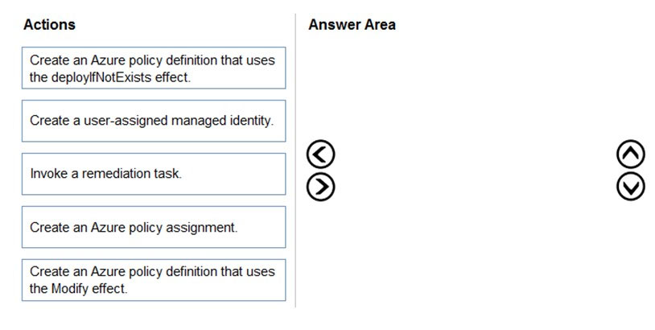

- [ ] Box 1: Create an Azure policy assignment. Box 2: Invoke a remediation task. Box 3: Create a user-assigned managed identity.
- [ ] Box 1: Create an Azure policy definition that uses the Modify effect. Box 2: Create an Azure policy assignment. Box 3: Invoke a remediation task.
- [ ] Box 1: Create an Azure policy definition that uses the Modify effect. Box 2: reate an Azure policy assignment. Box 3: Invoke a remediation task.
- [x] Box 1: Create an Azure policy definition that uses the deployIfNotExists effect. Box 2: Create an Azure policy assignment. Box 3: Invoke a remediation task.

**[⬆ Back to Top](#table-of-contents)**

### Fabrikam, Inc. is an engineering company that has offices throughout Europe. The company has a main office in London and three branch offices in Amsterdam, Berlin, and Rome. The network contains two Active Directory forests named corp.fabrikam.com and rd.fabrikam.com. There are no trust relationships between the forests. Corp.fabrikam.com is a production forest that contains identities used for internal user and computer authentication. Rd.fabrikam.com is used by the research and development (R&D) department only. The R&D department is restricted to using on-premises resources only. Each office contains at least one domain controller from the corp.fabrikam.com domain. The main office contains all the domain controllers for the rd.fabrikam.com forest. All the offices have a high-speed connection to the internet. An existing application named WebApp1 is hosted in the data center of the London office. WebApp1 is used by customers to place and track orders. WebApp1 has a web tier that uses Microsoft Internet information Services (IIS) and a database tier that runs Microsoft SQL Server 2016. The web tier and the database tier are deployed to virtual machines that run on Hyper-V. The IT department currently uses a separate Hyper-V environment to test updates to WebApp1. Fabrikam purchases all Microsoft licenses through a Microsoft Enterprise Agreement that includes Software Assurance. The use of WebApp1 is unpredictable. At peak times, users often report delays. At other times, many resources for WebApp1 are underutilized. Fabrikam plans to move most of its production workloads to Azure during the next few years, including virtual machines that rely on Active Directory for authentication. As one of its first projects, the company plans to establish a hybrid identity model, facilitating an upcoming Microsoft 365 deployment. All R&D operations will remain on-premises. Fabrikam plans to migrate the production and test instances of WebApp1 to Azure. Fabrikam identifies the following technical requirements: Website content must be easily updated from a single point. User input must be minimized when provisioning new web app instances. Whenever possible, existing on-premises licenses must be used to reduce cost. Users must always authenticate by using their corp.fabrikam.com UPN identity. Any new deployments to Azure must be redundant in case an Azure region fails. Whenever possible, solutions must be deployed to Azure by using the Standard pricing tier of Azure App Service. An email distribution group named IT Support must be notified of any issues relating to the directory synchronization services. In the event that a link fails between Azure and the on-premises network, ensure that the virtual machines hosted in Azure can authenticate to Active Directory. Directory synchronization between Azure Active Directory (Azure AD) and corp.fabrikam.com must not be affected by a link failure between Azure and the on- premises network. Fabrikam identifies the following database requirements: Database metrics for the production instance of WebApp1 must be available for analysis so that database administrators can optimize the performance settings. To avoid disrupting customer access, database downtime must be minimized when databases are migrated. Database backups must be retained for a minimum of seven years to meet compliance requirements. Fabrikam identifies the following security requirements: Company information including policies, templates, and data must be inaccessible to anyone outside the company. Users on the on-premises network must be able to authenticate to corp.fabrikam.com if an internet link fails. Administrators must be able authenticate to the Azure portal by using their corp.fabrikam.com credentials. All administrative access to the Azure portal must be secured by using multi-factor authentication (MFA). The testing of WebApp1 updates must not be visible to anyone outside the company. You must provision an Azure Storage account for the SQL Server database migration.

- [x] Yes.
- [ ] No.

**[⬆ Back to Top](#table-of-contents)**

### Fabrikam, Inc. is an engineering company that has offices throughout Europe. The company has a main office in London and three branch offices in Amsterdam, Berlin, and Rome. The network contains two Active Directory forests named corp.fabrikam.com and rd.fabrikam.com. There are no trust relationships between the forests. Corp.fabrikam.com is a production forest that contains identities used for internal user and computer authentication. Rd.fabrikam.com is used by the research and development (R&D) department only. The R&D department is restricted to using on-premises resources only. Each office contains at least one domain controller from the corp.fabrikam.com domain. The main office contains all the domain controllers for the rd.fabrikam.com forest. All the offices have a high-speed connection to the internet. An existing application named WebApp1 is hosted in the data center of the London office. WebApp1 is used by customers to place and track orders. WebApp1 has a web tier that uses Microsoft Internet information Services (IIS) and a database tier that runs Microsoft SQL Server 2016. The web tier and the database tier are deployed to virtual machines that run on Hyper-V. The IT department currently uses a separate Hyper-V environment to test updates to WebApp1. Fabrikam purchases all Microsoft licenses through a Microsoft Enterprise Agreement that includes Software Assurance. The use of WebApp1 is unpredictable. At peak times, users often report delays. At other times, many resources for WebApp1 are underutilized. Fabrikam plans to move most of its production workloads to Azure during the next few years, including virtual machines that rely on Active Directory for authentication. As one of its first projects, the company plans to establish a hybrid identity model, facilitating an upcoming Microsoft 365 deployment. All R&D operations will remain on-premises. Fabrikam plans to migrate the production and test instances of WebApp1 to Azure. Fabrikam identifies the following technical requirements: Website content must be easily updated from a single point. User input must be minimized when provisioning new web app instances. Whenever possible, existing on-premises licenses must be used to reduce cost. Users must always authenticate by using their corp.fabrikam.com UPN identity. Any new deployments to Azure must be redundant in case an Azure region fails. Whenever possible, solutions must be deployed to Azure by using the Standard pricing tier of Azure App Service. An email distribution group named IT Support must be notified of any issues relating to the directory synchronization services. In the event that a link fails between Azure and the on-premises network, ensure that the virtual machines hosted in Azure can authenticate to Active Directory. Directory synchronization between Azure Active Directory (Azure AD) and corp.fabrikam.com must not be affected by a link failure between Azure and the on- premises network. Fabrikam identifies the following database requirements: Database metrics for the production instance of WebApp1 must be available for analysis so that database administrators can optimize the performance settings. To avoid disrupting customer access, database downtime must be minimized when databases are migrated. Database backups must be retained for a minimum of seven years to meet compliance requirements. Fabrikam identifies the following security requirements: Company information including policies, templates, and data must be inaccessible to anyone outside the company. Users on the on-premises network must be able to authenticate to corp.fabrikam.com if an internet link fails. Administrators must be able authenticate to the Azure portal by using their corp.fabrikam.com credentials. All administrative access to the Azure portal must be secured by using multi-factor authentication (MFA). The testing of WebApp1 updates must not be visible to anyone outside the company. You must provision an Azure Storage account for the Web site content storage

- [ ] Yes.
- [x] No.

**[⬆ Back to Top](#table-of-contents)**

### Fabrikam, Inc. is an engineering company that has offices throughout Europe. The company has a main office in London and three branch offices in Amsterdam, Berlin, and Rome. The network contains two Active Directory forests named corp.fabrikam.com and rd.fabrikam.com. There are no trust relationships between the forests. Corp.fabrikam.com is a production forest that contains identities used for internal user and computer authentication. Rd.fabrikam.com is used by the research and development (R&D) department only. The R&D department is restricted to using on-premises resources only. Each office contains at least one domain controller from the corp.fabrikam.com domain. The main office contains all the domain controllers for the rd.fabrikam.com forest. All the offices have a high-speed connection to the internet. An existing application named WebApp1 is hosted in the data center of the London office. WebApp1 is used by customers to place and track orders. WebApp1 has a web tier that uses Microsoft Internet information Services (IIS) and a database tier that runs Microsoft SQL Server 2016. The web tier and the database tier are deployed to virtual machines that run on Hyper-V. The IT department currently uses a separate Hyper-V environment to test updates to WebApp1. Fabrikam purchases all Microsoft licenses through a Microsoft Enterprise Agreement that includes Software Assurance. The use of WebApp1 is unpredictable. At peak times, users often report delays. At other times, many resources for WebApp1 are underutilized. Fabrikam plans to move most of its production workloads to Azure during the next few years, including virtual machines that rely on Active Directory for authentication. As one of its first projects, the company plans to establish a hybrid identity model, facilitating an upcoming Microsoft 365 deployment. All R&D operations will remain on-premises. Fabrikam plans to migrate the production and test instances of WebApp1 to Azure. Fabrikam identifies the following technical requirements: Website content must be easily updated from a single point. User input must be minimized when provisioning new web app instances. Whenever possible, existing on-premises licenses must be used to reduce cost. Users must always authenticate by using their corp.fabrikam.com UPN identity. Any new deployments to Azure must be redundant in case an Azure region fails. Whenever possible, solutions must be deployed to Azure by using the Standard pricing tier of Azure App Service. An email distribution group named IT Support must be notified of any issues relating to the directory synchronization services. In the event that a link fails between Azure and the on-premises network, ensure that the virtual machines hosted in Azure can authenticate to Active Directory. Directory synchronization between Azure Active Directory (Azure AD) and corp.fabrikam.com must not be affected by a link failure between Azure and the on- premises network. Fabrikam identifies the following database requirements: Database metrics for the production instance of WebApp1 must be available for analysis so that database administrators can optimize the performance settings. To avoid disrupting customer access, database downtime must be minimized when databases are migrated. Database backups must be retained for a minimum of seven years to meet compliance requirements. Fabrikam identifies the following security requirements: Company information including policies, templates, and data must be inaccessible to anyone outside the company. Users on the on-premises network must be able to authenticate to corp.fabrikam.com if an internet link fails. Administrators must be able authenticate to the Azure portal by using their corp.fabrikam.com credentials. All administrative access to the Azure portal must be secured by using multi-factor authentication (MFA). The testing of WebApp1 updates must not be visible to anyone outside the company. You must provision an Azure Storage account for the Database metric monitoring

- [ ] Yes.
- [x] No.

**[⬆ Back to Top](#table-of-contents)**

### Litware, Inc. is a medium-sized finance company. Litware has a main office in Boston. The network contains an Active Directory forest named Litware.com that is linked to an Azure Active Directory (Azure AD) tenant named Litware.com. All users have Azure Active Directory Premium P2 licenses. Litware has a second Azure AD tenant named dev.Litware.com that is used as a development environment. The Litware.com tenant has a conditional acess policy named capolicy1. Capolicy1 requires that when users manage the Azure subscription for a production environment by using the Azure portal, they must connect from a hybrid Azure AD-joined device. Litware has 10 Azure subscriptions that are linked to the Litware.com tenant and five Azure subscriptions that are linked to the dev.Litware.com tenant. All the subscriptions are in an Enterprise Agreement (EA). The Litware.com tenant contains a custom Azure role-based access control (Azure RBAC) role named Role1 that grants the DataActions read permission to the blobs and files in Azure Storage. The on-premises network of Litware contains the resources shown in the following table. Litware has ExpressRoute connectivity to Azure. Litware plans to implement the following changes: Migrate DB1 and DB2 to Azure. Migrate App1 to Azure virtual machines. Deploy the Azure virtual machines that will host App1 to Azure dedicated hosts. Litware identifies the following authentication and authorization requirements: Users that manage the production environment by using the Azure portal must connect from a hybrid Azure AD-joined device and authenticate by using Azure Multi-Factor Authentication (MFA). The Network Contributor built-in RBAC role must be used to grant permission to all the virtual networks in all the Azure subscriptions. To access the resources in Azure, App1 must use the managed identity of the virtual machines that will host the app. Role1 must be used to assign permissions to the storage accounts of all the Azure subscriptions. RBAC roles must be applied at the highest level possible. Litware identifies the following resiliency requirements: Once migrated to Azure, DB1 and DB2 must meet the following requirements: Maintain availability if two availability zones in the local Azure region fail. Fail over automatically. Minimize I/O latency. App1 must meet the following requirements: Be hosted in an Azure region that supports availability zones. Be hosted on Azure virtual machines that support automatic scaling. Maintain availability if two availability zones in the local Azure region fail. Litware identifies the following security and compliance requirements: Once App1 is migrated to Azure, you must ensure that new data can be written to the app, and the modification of new and existing data is prevented for a period of three years. On-premises users and services must be able to access the Azure Storage account that will host the data in App1. Access to the public endpoint of the Azure Storage account that will host the App1 data must be prevented. All Azure SQL databases in the production environment must have Transparent Data Encryption (TDE) enabled. App1 must not share physical hardware with other workloads. Litware identifies the following business requirements: Minimize administrative effort. Minimize costs. How should the migrated databases DB1 and DB2 be implemented in Azure?

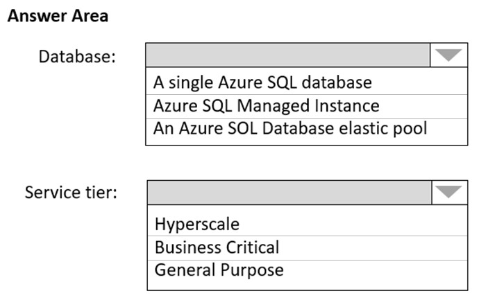

- [x] Database: An Azure SQL Database elastic pool. Service tier: Business Critical.
- [ ] Database: Azure SQL Managed Instance. Service tier: Business Critical.
- [ ] Database: Azure SQL Managed Instance . Service tier: Hyperscale.
- [ ] Database: A single Azure SQL database. Service tier: General Purpose.

**[⬆ Back to Top](#table-of-contents)**

### Fabrikam, Inc. is an engineering company that has offices throughout Europe. The company has a main office in London and three branch offices in Amsterdam, Berlin, and Rome. The network contains two Active Directory forests named corp.fabrikam.com and rd.fabrikam.com. There are no trust relationships between the forests. Corp.fabrikam.com is a production forest that contains identities used for internal user and computer authentication. Rd.fabrikam.com is used by the research and development (R&D) department only. The R&D department is restricted to using on-premises resources only. Each office contains at least one domain controller from the corp.fabrikam.com domain. The main office contains all the domain controllers for the rd.fabrikam.com forest. All the offices have a high-speed connection to the internet. An existing application named WebApp1 is hosted in the data center of the London office. WebApp1 is used by customers to place and track orders. WebApp1 has a web tier that uses Microsoft Internet information Services (IIS) and a database tier that runs Microsoft SQL Server 2016. The web tier and the database tier are deployed to virtual machines that run on Hyper-V. The IT department currently uses a separate Hyper-V environment to test updates to WebApp1. Fabrikam purchases all Microsoft licenses through a Microsoft Enterprise Agreement that includes Software Assurance. The use of WebApp1 is unpredictable. At peak times, users often report delays. At other times, many resources for WebApp1 are underutilized. Fabrikam plans to move most of its production workloads to Azure during the next few years, including virtual machines that rely on Active Directory for authentication. As one of its first projects, the company plans to establish a hybrid identity model, facilitating an upcoming Microsoft 365 deployment. All R&D operations will remain on-premises. Fabrikam plans to migrate the production and test instances of WebApp1 to Azure. Fabrikam identifies the following technical requirements: Website content must be easily updated from a single point. User input must be minimized when provisioning new web app instances. Whenever possible, existing on-premises licenses must be used to reduce cost. Users must always authenticate by using their corp.fabrikam.com UPN identity. Any new deployments to Azure must be redundant in case an Azure region fails. Whenever possible, solutions must be deployed to Azure by using the Standard pricing tier of Azure App Service. An email distribution group named IT Support must be notified of any issues relating to the directory synchronization services. In the event that a link fails between Azure and the on-premises network, ensure that the virtual machines hosted in Azure can authenticate to Active Directory. Directory synchronization between Azure Active Directory (Azure AD) and corp.fabrikam.com must not be affected by a link failure between Azure and the on- premises network. Fabrikam identifies the following database requirements: Database metrics for the production instance of WebApp1 must be available for analysis so that database administrators can optimize the performance settings. To avoid disrupting customer access, database downtime must be minimized when databases are migrated. Database backups must be retained for a minimum of seven years to meet compliance requirements. Fabrikam identifies the following security requirements: Company information including policies, templates, and data must be inaccessible to anyone outside the company. Users on the on-premises network must be able to authenticate to corp.fabrikam.com if an internet link fails. Administrators must be able authenticate to the Azure portal by using their corp.fabrikam.com credentials. All administrative access to the Azure portal must be secured by using multi-factor authentication (MFA). The testing of WebApp1 updates must not be visible to anyone outside the company. What should you include in the identity management strategy to support the planned changes?

- [ ] Move all the domain controllers from corp.fabrikam.com to virtual networks in Azure.
- [x] Deploy domain controllers for corp.fabrikam.com to virtual networks in Azure.
- [ ] Deploy a new Azure AD tenant for the authentication of new R&D projects.
- [ ] Deploy domain controllers for the rd.fabrikam.com forest to virtual networks in Azure.

**[⬆ Back to Top](#table-of-contents)**

### You plan to migrate App1 to Azure. The solution must meet the authentication and authorization requirements. Which type of endpoint should App1 use to obtain an access token?

- [ ] Azure Instance Metadata Service (IMDS).
- [ ] Azure AD.
- [ ] Azure Service Management.
- [x] Microsoft identity platform.

**[⬆ Back to Top](#table-of-contents)**

### Your company plans to deploy various Azure App Service instances that will use Azure SQL databases. The App Service instances will be deployed at the same time as the Azure SQL databases. The company has a regulatory requirement to deploy the App Service instances only to specific Azure regions. The resources for the App Service instances must reside in the same region. You need to recommend a solution to meet the regulatory requirement.

- [x] Yes.
- [ ] No.

**[⬆ Back to Top](#table-of-contents)**

### Fabrikam, Inc. is an engineering company that has offices throughout Europe. The company has a main office in London and three branch offices in Amsterdam Berlin, and Rome. The network contains two Active Directory forests named corp.fabnkam.com and rd.fabrikam.com. There are no trust relationships between the forests. Corp.fabrikam.com is a production forest that contains identities used for internal user and computer authentication. Rd.fabrikam.com is used by the research and development (R&D) department only. The R&D department is restricted to using on-premises resources only. Each office contains at least one domain controller from the corp.fabrikam.com domain. The main office contains all the domain controllers for the rd.fabrikam.com forest. All the offices have a high-speed connection to the Internet. An existing application named WebApp1 is hosted in the data center of the London office. WebApp1 is used by customers to place and track orders. WebApp1 has a web tier that uses Microsoft Internet Information Services (IIS) and a database tier that runs Microsoft SQL Server 2016. The web tier and the database tier are deployed to virtual machines that run on Hyper-V. The IT department currently uses a separate Hyper-V environment to test updates to WebApp1. Fabrikam purchases all Microsoft licenses through a Microsoft Enterprise Agreement that includes Software Assurance. The use of Web App1 is unpredictable. At peak times, users often report delays. At other times, many resources for WebApp1 are underutilized. Fabrikam plans to move most of its production workloads to Azure during the next few years. As one of its first projects, the company plans to establish a hybrid identity model, facilitating an upcoming Microsoft Office 365 deployment All R&D operations will remain on-premises. Fabrikam plans to migrate the production and test instances of WebApp1 to Azure. Fabrikam identifies the following technical requirements: Web site content must be easily updated from a single point. User input must be minimized when provisioning new app instances. Whenever possible, existing on premises licenses must be used to reduce cost. Users must always authenticate by using their corp.fabrikam.com UPN identity. Any new deployments to Azure must be redundant in case an Azure region fails. Whenever possible, solutions must be deployed to Azure by using platform as a service (PaaS). An email distribution group named IT Support must be notified of any issues relating to the directory synchronization services. Directory synchronization between Azure Active Directory (Azure AD) and corp.fabhkam.com must not be affected by a link failure between Azure and the on premises network. Fabrikam identifies the following database requirements: Database metrics for the production instance of WebApp1 must be available for analysis so that database administrators can optimize the performance settings. To avoid disrupting customer access, database downtime must be minimized when databases are migrated. Database backups must be retained for a minimum of seven years to meet compliance requirement. Fabrikam identifies the following security requirements: Company information including policies, templates, and data must be inaccessible to anyone outside the company. Users on the on-premises network must be able to authenticate to corp.fabrikam.com if an Internet link fails. Administrators must be able authenticate to the Azure portal by using their corp.fabrikam.com credentials. All administrative access to the Azure portal must be secured by using multi-factor authentication. The testing of WebApp1 updates must not be visible to anyone outside the company. You need to recommend a strategy for migrating the database content of WebApp1 to Azure. What should you include in the recommendation?

- [ ] Use Azure Site Recovery to replicate the SQL servers to Azure.
- [x] Use SQL Server transactional replication.
- [ ] Copy the BACPAC file that contains the Azure SQL database file to Azure Blob storage.
- [ ] Copy the VHD that contains the Azure SQL database files to Azure Blob storage.

**[⬆ Back to Top](#table-of-contents)**

### The on-premises network contains a single Active Directory domain named contoso.com. Contoso has a single Azure subscription. Contoso has a business partnership with Fabrikam, Inc. Fabrikam users access some Contoso applications over the internet by using Azure Active Directory (Azure AD) guest accounts. Contoso plans to deploy two applications named App1 and App2 to Azure. App1 will be a Python web app hosted in Azure App Service that requires a Linux runtime. Users from Contoso and Fabrikam will access App1. App1 will access several services that require third-party credentials and access strings. The credentials and access strings are stored in Azure Key Vault. App1 will have six instances: three in the East US Azure region and three in the West Europe Azure region. App1 has the following data requirements: Each instance will write data to a data store in the same availability zone as the instance. Data written by any App1 instance must be visible to all App1 instances. App1 will only be accessible from the internet. App1 has the following connection requirements: Connections to App1 must pass through a web application firewall (WAF). Connections to App1 must be active-active load balanced between instances. All connections to App1 from North America must be directed to the East US region. All other connections must be directed to the West Europe region. Every hour, you will run a maintenance task by invoking a PowerShell script that copies files from all the App1 instances. The PowerShell script will run from a central location. App2 will be a NET app hosted in App Service that requires a Windows runtime. App2 has the following file storage requirements: Save files to an Azure Storage account. Replicate files to an on-premises location. Ensure that on-premises clients can read the files over the LAN by using the SMB protocol. You need to monitor App2 to analyze how long it takes to perform different transactions within the application. The solution must not require changes to the application code. Application developers will constantly develop new versions of App1 and App2. The development process must meet the following requirements: A staging instance of a new application version must be deployed to the application host before the new version is used in production. After testing the new version, the staging version of the application will replace the production version. The switch to the new application version from staging to production must occur without any downtime of the application. Contoso identifies the following requirements for managing Fabrikam access to resources: Every month, an account manager at Fabrikam must review which Fabrikam users have access permissions to App1. Accounts that no longer need permissions must be removed as guests. The solution must minimize development effort. All secrets used by Azure services must be stored in Azure Key Vault. Services that require credentials must have the credentials tied to the service instance. The credentials must NOT be shared between services. You need to recommend a solution that meets the file storage requirements for App2. What should you deploy to the Azure subscription and the on-premises network?

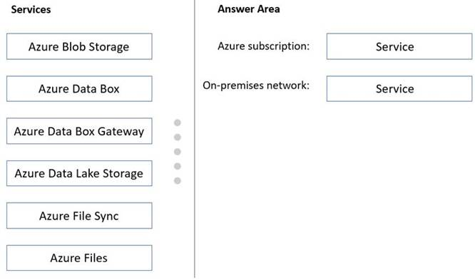

- [x] Azure subscription: Azure Files. On-premises network: Azure File Sync.
- [ ] Azure subscription: Azure Files. On-premises network: Azure Data Box Gateway.
- [ ] Azure subscription: Azure Data Lake Storage. On-premises network: Azure File Sync.
- [ ] Azure subscription: Azure Data Box Gateway. On-premises network: Azure Blob Storage.

**[⬆ Back to Top](#table-of-contents)**

### You have an Azure subscription that contains a custom application named Application1. Application1 was developed by an external company named Fabrikam, Ltd. Developers at Fabrikam were assigned role-based access control (RBAC) permissions to the Application1 components. All users are licensed for the Microsoft 365 E5 plan. You need to recommend a solution to verify whether the Fabrikam developers still require permissions to Application1. The solution must meet the following requirements: To the manager of the developers, send a monthly email message that lists the access permissions to Application1. If the manager does not verify an access permission, automatically revoke that permission. Minimize development effort. What should you recommend?

- [x] In Azure Active Directory (Azure AD), create an access review of Application1.
- [ ] Create an Azure Automation runbook that runs the Get-AzRoleAssignment cmdlet.
- [ ] In Azure Active Directory (Azure AD) Privileged Identity Management, create a custom role assignment for the Application1 resources.
- [ ] Create an Azure Automation runbook that runs the Get-AzureADUserAppRoleAssignment cmdlet.

**[⬆ Back to Top](#table-of-contents)**

### You have an Azure subscription. The subscription has a blob container that contains multiple blobs. Ten users in the finance department of your company plan to access the blobs during the month of April. You need to recommend a solution to enable access to the blobs during the month of April only. Which security solution should you include in the recommendation?

- [x] shared access signatures (SAS).
- [ ] Conditional Access policies.
- [ ] certificates.
- [ ] access keys.

**[⬆ Back to Top](#table-of-contents)**

### You have an Azure Active Directory (Azure AD) tenant that syncs with an on-premises Active Directory domain.You have an internal web app named WebApp1 that is hosted on-premises. WebApp1 uses Integrated Windows authentication. Some users work remotely and do NOT have VPN access to the on-premises network. You need to provide the remote users with single sign-on (SSO) access to WebApp1. Which two features should you include in the solution? Each correct answer presents part of the solution

- [x] Azure AD Application Proxy
- [ ] Azure AD Privileged Identity Management (PIM)
- [ ] Conditional Access policies
- [ ] Azure Arc
- [x] Azure AD enterprise applications
- [ ] Azure Application Gateway

**[⬆ Back to Top](#table-of-contents)**

### You have an Azure Active Directory (Azure AD) tenant named contoso.com that has a security group named Group1. Group1 is configured for assigned membership. Group1 has 50 members, including 20 guest users. You need to recommend a solution for evaluating the membership of Group1. The solution must meet the following requirements: The evaluation must be repeated automatically every three months. Every member must be able to report whether they need to be in Group1. Users who report that they do not need to be in Group1 must be removed from Group1 automatically. Users who do not report whether they need to be in Group1 must be removed from Group1 automatically. What should you include in the recommendation?

- [ ] Implement Azure AD Identity Protection.
- [ ] Change the Membership type of Group1 to Dynamic User.
- [x] Create an access review.
- [ ] Implement Azure AD Privileged Identity Management (PIM).

**[⬆ Back to Top](#table-of-contents)**

### You plan to deploy Azure Databricks to support a machine learning application. Data engineers will mount an Azure Data Lake Storage account to the Databricks file system. Permissions to folders are granted directly to the data engineers. You need to recommend a design for the planned Databrick deployment. The solution must meet the following requirements: Ensure that the data engineers can only access folders to which they have permissions. Minimize development effort. Minimize costs. What should you include in the recommendation? To answer, select the appropriate options in the answer area.NOTE: Each correct selection is worth one point.

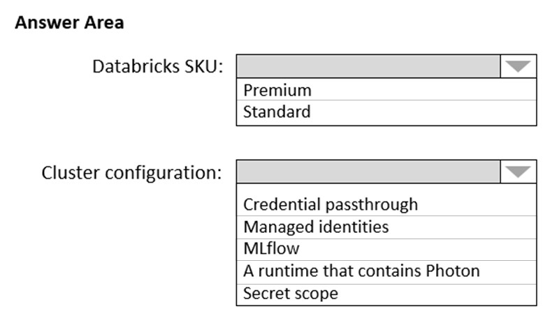

- [ ] Databricks SKU: Premium. Cluster configuration: Credential passthrough.
- [x] Databricks SKU: Premium. Cluster configuration: Credential passthrough.
- [ ] Databricks SKU: Standard. Cluster configuration: Secret scope.
- [ ] Databricks SKU: Premium. Cluster configuration: Managed identities.

**[⬆ Back to Top](#table-of-contents)**

### You plan to deploy an Azure web app named App1 that will use Azure Active Directory (Azure AD) authentication.App1 will be accessed from the internet by the users at your company. All the users have computers that run Windows 10 and are joined to Azure AD.You need to recommend a solution to ensure that the users can connect to App1 without being prompted for authentication and can access App1 only from company-owned computers

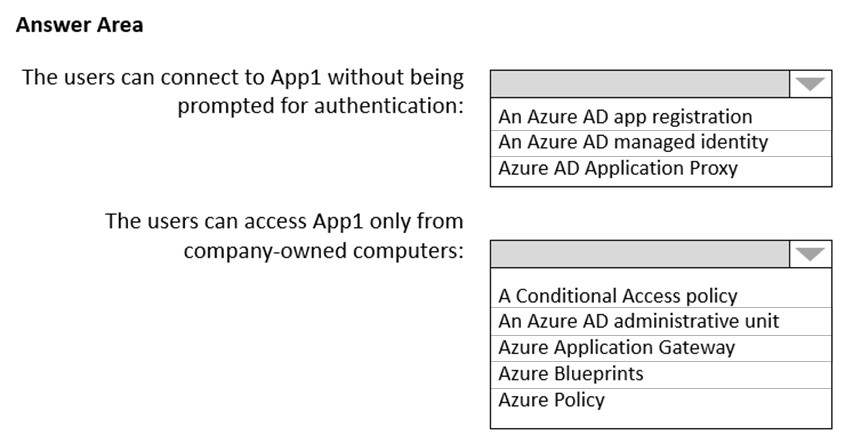

- [ ] The users can connect to App1 without being prompted for authentication: Azure AD Application Proxy. The users can access App1 only from company-owned computers: Azure Application Gateway.
- [ ] The users can connect to App1 without being prompted for authentication: An Azure AD app registration. The users can access App1 only from company-owned computers: Azure Application Gateway.
- [x] The users can connect to App1 without being prompted for authentication: An Azure AD app registration. The users can access App1 only from company-owned computers: A Conditional Access policy.
- [ ] The users can connect to App1 without being prompted for authentication: An Azure AD managed identity. The users can access App1 only from company-owned computers: A Conditional Access policy.

**[⬆ Back to Top](#table-of-contents)**

### Note: This question is part of a series of questions that present the same scenario. Each question in the series contains a unique solution that might meet the stated goals. Some question sets might have more than one correct solution, while others might not have a correct solution. After you answer a question in this section, you will NOT be able to return to it. As a result, these questions will not appear in the review screen.Your company deploys several virtual machines on-premises and to Azure. ExpressRoute is being deployed and configured for on-premises to Azure connectivity. Several virtual machines exhibit network connectivity issues. You need to analyze the network traffic to identify whether packets are being allowed or denied to the virtual machines. Solution: Use Azure Traffic Analytics in Azure Network Watcher to analyze the network traffic. Does this meet the goal?

- [ ] Yes.
- [x] No.

**[⬆ Back to Top](#table-of-contents)**

### Your company deploys several virtual machines on-premises and to Azure. ExpressRoute is deployed and configured for on-premises to Azure connectivity. Several virtual machines exhibit network connectivity issues. You need to analyze the network traffic to identify whether packets are being allowed or denied to the virtual machines. Solution: Use Azure Advisor to analyze the network traffic.

- [ ] Yes.
- [x] No.

**[⬆ Back to Top](#table-of-contents)**

### Note: This question is part of a series of questions that present the same scenario. Each question in the series contains a unique solution that might meet the stated goals. Some question sets might have more than one correct solution, while others might not have a correct solution.After you answer a question in this section, you will NOT be able to return to it. As a result, these questions will not appear in the review screen.Your company deploys several virtual machines on-premises and to Azure. ExpressRoute is deployed and configured for on-premises to Azure connectivity. Several virtual machines exhibit network connectivity issues. You need to analyze the network traffic to identify whether packets are being allowed or denied to the virtual machines. Solution: Use Azure Network Watcher to run IP flow verify to analyze the network traffic. Does this meet the goal?

- [x] Yes.
- [ ] No.

**[⬆ Back to Top](#table-of-contents)**

### You have an Azure subscription. The subscription contains Azure virtual machines that run Windows Server 2016 and Linux. You need to use Azure Monitor to design an alerting strategy for security-related events. Which Azure Monitor Logs tables should you query?

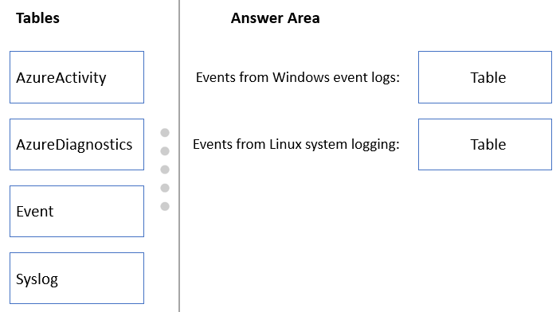

- [ ] Events from Windows event logs: Syslog. Events from Linux system logging: Event.
- [ ] Events from Windows event logs: AzureActivity. Events from Linux system logging: AzureDiagnostics.
- [ ] Events from Windows event logs: AzureDiagnostics. Events from Linux system logging: Syslog.
- [x] Events from Windows event logs: Event. Events from Linux system logging: Syslog.

**[⬆ Back to Top](#table-of-contents)**

### You are designing a large Azure environment that will contain many subscriptions. You plan to use Azure Policy as part of a governance solution. To which three scopes can you assign Azure Policy definitions? Each correct answer presents a complete solution. NOTE: Each correct selection is worth one point.

- [ ] Azure Active Directory (Azure AD) administrative units.
- [ ] Azure Active Directory (Azure AD) tenants.
- [x] Subscriptions.
- [ ] Compute resources.
- [x] Resource groups.
- [x] Management groups.

**[⬆ Back to Top](#table-of-contents)**

### Your on-premises network contains a server named Server1 that runs an ASP.NET application named App1. You have a hybrid deployment of Azure Active Directory (Azure AD). You need to recommend a solution to ensure that users sign in by using their Azure AD account and Azure Multi-Factor Authentication (MFA) when they connect to App1 from the internet. Which three features should you recommend be deployed and configured in sequence? To answer, move the appropriate features from the list of features to the answer area and arrange them in the correct order.

- [ ] a public Azure Load Balancer.
- [ ] a managed identity.
- [ ] an internal Azure Load Balancer.
- [x] a Conditional Access policy.
- [ ] an Azure Appp Service pplan.
- [x] Azure Ad Application Proxy.
- [x] an Azure AD enterpprise application.

**[⬆ Back to Top](#table-of-contents)**

### You need to recommend a solution to generate a monthly report of all the new Azure Resource Manager (ARM) resource deployments in your Azure subscription. What should you include in the recommendation?

- [x] Azure Activity Log.
- [ ] Azure Advisor.
- [ ] Azure Analysis Services.
- [ ] Azure Monitor action groups.

**[⬆ Back to Top](#table-of-contents)**

### You have 100 servers that run Windows Server 2012 R2 and host Microsoft SQL Server 2014 instances. The instances host databases that have the following characteristics: Stored procedures are implemented by using CLR. The largest database is currently 3 TB. None of the databases will ever exceed 4 TB. You plan to move all the data from SQL Server to Azure. You need to recommend a service to host the databases. The solution must meet the following requirements: Whenever possible, minimize management overhead for the migrated databases. Ensure that users can authenticate by using Azure Active Directory (Azure AD) credentials. Minimize the number of database changes required to facilitate the migration. What should you include in the recommendation?

- [ ] Azure SQL Database elastic pools.
- [x] Azure SQL Managed Instance.
- [ ] Azure SQL Database single databases.
- [ ] SQL Server 2016 on Azure virtual machines.

**[⬆ Back to Top](#table-of-contents)**

### You have an Azure subscription that contains an Azure Blob Storage account named store1. You have an on-premises file server named Server1 that runs Windows Server 2016. Server1 stores 500 GB of company files. You need to store a copy of the company files from Server1 in store1. Which two possible Azure services achieve this goal?

- [ ] An Azure Logic Apps integration account.
- [x] An Azure Import/Export job.
- [x] Azure Data Factory.
- [ ] An Azure Analysis services On-premises data gateway.
- [ ] An Azure Batch account.

**[⬆ Back to Top](#table-of-contents)**

### You have an Azure subscription that contains two applications named App1 and App2. App1 is a sales processing application. When a transaction in App1 requires shipping, a message is added to an Azure Storage account queue, and then App2 listens to the queue for relevant transactions. In the future, additional applications will be added that will process some of the shipping requests based on the specific details of the transactions. You need to recommend a replacement for the storage account queue to ensure that each additional application will be able to read the relevant transactions. What should you recommend?

- [ ] One Azure Data Factory pipeline.
- [ ] Multiple storage account queues.
- [ ] One Azure Service Bus queue.
- [x] One Azure Service Bus topic.

**[⬆ Back to Top](#table-of-contents)**

### You have an Azure subscription that contains the storage accounts shown in the following table. You plan to implement two new apps that have the requirements shown in the following table. Which storage accounts should you recommend using for each app?

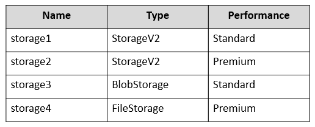
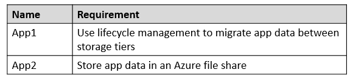
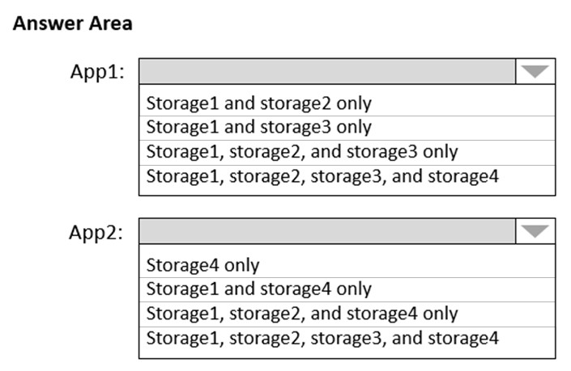

- [ ] App1: Storagel, storage2, and storage3 only. App2: Storage1, storage2, and storage4 only.
- [ ] App1: Storage1 and storage2 only. App2: Storage1, storage2, and storage4 only.
- [x] App1: Storage1 and storage3 only. App2: Storage1 and storage4 only.
- [ ] App1: Storage1, storage2, storage3, and storage4. App2: Storage1 and storage4 only.

**[⬆ Back to Top](#table-of-contents)**

### You are designing an application that will be hosted in Azure. The application will host video files that range from 50 MB to 12 GB. The application will use certificate-based authentication and will be available to users on the internet. You need to recommend a storage option for the video files. The solution must provide the fastest read performance and must minimize storage costs. What should you recommend?

- [ ] Azure Files.
- [ ] Azure Data Lake Storage Gen2.
- [x] Azure Blob Storage.
- [ ] Azure SQL Database.

**[⬆ Back to Top](#table-of-contents)**

### You are designing a SQL database solution. The solution will include 20 databases that will be 20 GB each and have varying usage patterns.You need to recommend a database platform to host the databases. The solution must meet the following requirements: The solution must meet a Service Level Agreement (SLA) of 99.99% uptime.The compute resources allocated to the databases must scale dynamically. The solution must have reserved capacity. Compute charges must be minimized. What should you include in the recommendation?

- [x] An elastic pool that contains 20 Azure SQL databases.
- [ ] 20 databases on a Microsoft SQL server that runs on an Azure virtual machine in an availability set.
- [ ] Azure public peering for an ExpressRoute circuit.
- [ ] 20 instances of Azure SQL Database serverless.

**[⬆ Back to Top](#table-of-contents)**

### You have an on-premises database that you plan to migrate to Azure. You need to design the database architecture to meet the following requirements: Support scaling up and down. Support geo-redundant backups. Support a database of up to 75 TB. Be optimized for online transaction processing (OLTP). What should you include in the design?

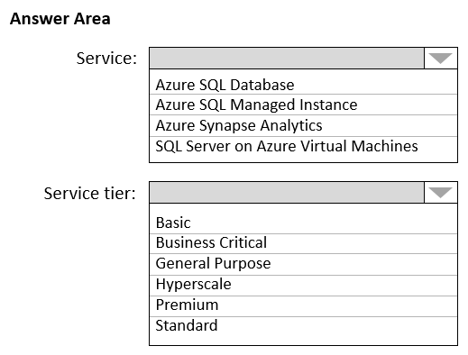

- [x] Service: Azure SQL Database. Service tier: Hyperscale.
- [ ] Service: Azure SQL Database. Service tier: Premium.
- [ ] Service: SQL Server on Azure Virtual Machines. Service tier: Standard.
- [ ] Service: Azure Synapse Analytics. Service tier: Basic.

**[⬆ Back to Top](#table-of-contents)**

### You are planning an Azure IoT Hub solution that will include 50,000 IoT devices. Each device will stream data, including temperature, device ID, and time data. Approximately 50,000 records will be written every second. The data will be visualized in near real time. You need to recommend a service to store and query the data. Which two services can you recommend?

- [ ] Azure Table Storage.
- [ ] Azure Event Grid.
- [x] Azure Cosmos DB SQL API.
- [x] Azure Time Series Insights.

**[⬆ Back to Top](#table-of-contents)**

### You are designing an application that will aggregate content for users. You need to recommend a database solution for the application. The solution must meet the following requirements: Support SQL commands. Support multi-master writes. Guarantee low latency read operations. What should you include in the recommendation?

- [x] Azure Cosmos DB SQL API.
- [ ] Azure SQL Database that uses active geo-replication.
- [ ] Azure SQL Database Hyperscale.
- [ ] Azure Database for PostgreSQL.

**[⬆ Back to Top](#table-of-contents)**

### You have an Azure subscription that contains the SQL servers on Azure shown in the following table. The subscription contains the storage accounts shown in the following table. You create the Azure SQL databases shown in the following table. Question 1: When you enable auditing for SQLdb1, you can store the audit information to storage1.

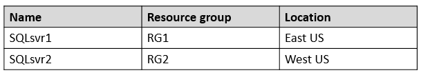
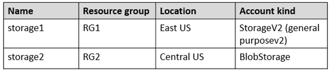
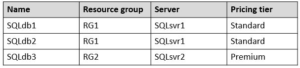

- [x] Yes.
- [ ] No.

**[⬆ Back to Top](#table-of-contents)**

### You have an Azure subscription that contains the SQL servers on Azure shown in the following table. The subscription contains the storage accounts shown in the following table. You create the Azure SQL databases shown in the following table. Question 2: When you enable auditing for SQLdb2, you can store the audit information to storage2.

- [ ] Yes.
- [x] No.

**[⬆ Back to Top](#table-of-contents)**

### You have an Azure subscription that contains the SQL servers on Azure shown in the following table. The subscription contains the storage accounts shown in the following table. You create the Azure SQL databases shown in the following table. Question 3: When you enable auditing for SQLdb3, you can store the audit information to storage2.

- [x] Yes.
- [ ] No.

**[⬆ Back to Top](#table-of-contents)**

### You have SQL Server on an Azure virtual machine. The databases are written to nightly as part of a batch process. You need to recommend a disaster recovery solution for the data. The solution must meet the following requirements: Provide the ability to recover in the event of a regional outage. Support a recovery time objective (RTO) of 15 minutes. Support a recovery point objective (RPO) of 24 hours. Support automated recovery. Minimize costs. What should you include in the recommendation?

- [ ] Azure virtual machine availability sets.
- [ ] Azure Disk Backup.
- [ ] An Always On availability group.
- [x] Azure Site Recovery.

**[⬆ Back to Top](#table-of-contents)**

### You plan to deploy the backup policy shown in the following exhibit.

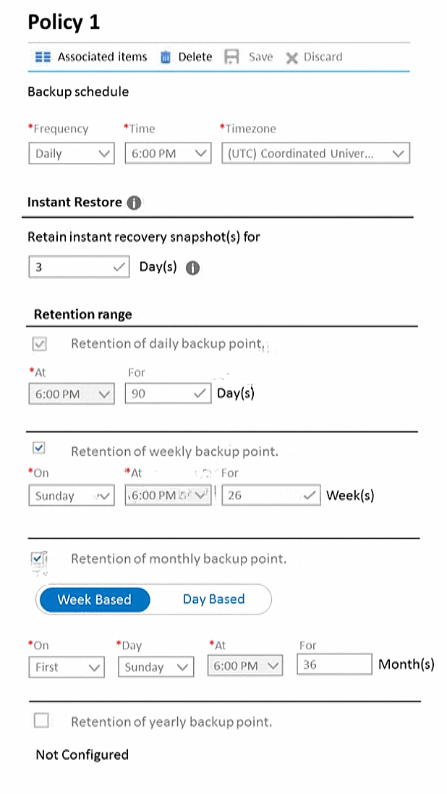
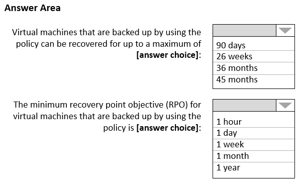

- [ ] Virtual machines that are backed up by using the policy can be recovered for up to a maximum of
[answer choice]: 90 days. The minimum recovery point objective (RPO) for virtual machines that are backed up by using the
policy is [answer choice]: 1 month.
- [ ] Virtual machines that are backed up by using the policy can be recovered for up to a maximum of
[answer choice]: 26 weeks. The minimum recovery point objective (RPO) for virtual machines that are backed up by using the
policy is [answer choice]: 1 hour.
- [ ] Virtual machines that are backed up by using the policy can be recovered for up to a maximum of
[answer choice]: 90 days. The minimum recovery point objective (RPO) for virtual machines that are backed up by using the
policy is [answer choice]: 1 day.
- [x] Virtual machines that are backed up by using the policy can be recovered for up to a maximum of
[answer choice]: 36 months. The minimum recovery point objective (RPO) for virtual machines that are backed up by using the policy is [answer choice]: 1 day.

**[⬆ Back to Top](#table-of-contents)**

### After you answer a question in this section, you will NOT be able to return to it. As a result, these questions will not appear in the review screen. You need to deploy resources to host a stateless web app in an Azure subscription. The solution must meet the following requirements: Provide access to the full .NET framework. Provide redundancy if an Azure region fails. Grant administrators access to the operating system to install custom application dependencies. Solution: You deploy two Azure virtual machines to two Azure regions, and you create an Azure Traffic Manager profile. Does this meet the goal?

- [x] Yes.
- [ ] No.

**[⬆ Back to Top](#table-of-contents)**

### After you answer a question in this section, you will NOT be able to return to it. As a result, these questions will not appear in the review screen. You need to deploy resources to host a stateless web app in an Azure subscription. The solution must meet the following requirements: Provide access to the full .NET framework. Provide redundancy if an Azure region fails. Grant administrators access to the operating system to install custom application dependencies. Solution: You deploy two Azure virtual machines to two Azure regions, and you deploy an Azure Application Gateway.

- [ ] Yes.
- [x] No.

**[⬆ Back to Top](#table-of-contents)**

### You plan to create an Azure Storage account that will host file shares. The shares will be accessed from on-premises applications that are transaction-intensive. You need to recommend a solution to minimize latency when accessing the file shares. The solution must provide the highest-level of resiliency for the selected storage tier. What should you include in the recommendation?

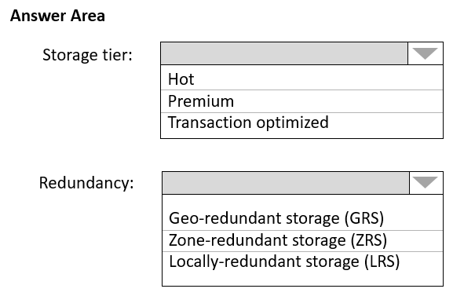

- [ ] Storage tier: Hot. Redundancy: Locally-redundant storage (LRS).
- [ ] Storage tier: Premium. Redundancy: Geo-redundant storage (GRS).
- [x] Storage tier: Premium. Redundancy: Zone-redundant storage (ZRS).
- [ ] Storage tier: Transaction optimized. Redundancy: Zone-redundant storage (ZRS).

**[⬆ Back to Top](#table-of-contents)**

### You need to deploy resources to host a stateless web app in an Azure subscription. The solution must meet the following requirements: Provide access to the full .NET framework. Provide redundancy if an Azure region fails. Grant administrators access to the operating system to install custom application dependencies. Solution: You deploy an Azure virtual machine scale set that uses autoscaling.

- [ ] Yes.
- [x] No.

**[⬆ Back to Top](#table-of-contents)**

### You plan to move a web app named App1 from an on-premises datacenter to Azure.App1 depends on a custom COM component that is installed on the host server. You need to recommend a solution to host App1 in Azure. The solution must meet the following requirements: App1 must be available to users if an Azure datacenter becomes unavailable. Costs must be minimized. What should you include in the recommendation?

- [ ] In two Azure regions, deploy a load balancer and a web app.
- [ ] In two Azure regions, deploy a load balancer and a virtual machine scale set.
- [x] Deploy a load balancer and a virtual machine scale set across two availability zones.
- [ ] In two Azure regions, deploy an Azure Traffic Manager profile and a web app.

**[⬆ Back to Top](#table-of-contents)**

### You have an Azure subscription that contains a Basic Azure virtual WAN named VirtualWAN1 and the virtual hubs shown in the following table. You have an ExpressRoute circuit in the US East Azure region. You need to create an ExpressRoute association to VirtualWAN1. What should you do first?

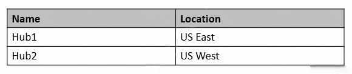

- [x] Upgrade VirtualWAN1 to Standard.
- [ ] Create a gateway on Hub1.
- [ ] Enable the ExpressRoute premium add-on.
- [ ] Create a hub virtual network in US East.

**[⬆ Back to Top](#table-of-contents)**

### You have an Azure subscription that contains a storage account. An application sometimes writes duplicate files to the storage account. You have a PowerShell script that identifies and deletes duplicate files in the storage account. Currently, the script is run manually after approval from the operations manager. You need to recommend a serverless solution that performs the following actions: Runs the script once an hour to identify whether duplicate files exist. Sends an email notification to the operations manager requesting approval to delete the duplicate files. Processes an email response from the operations manager specifying whether the deletion was approved. Runs the script if the deletion was approved. What should you include in the recommendation?

- [ ] Azure Logic Apps and Azure Event Grid.
- [x] Azure Logic Apps and Azure Functions.
- [ ] Azure Pipelines and Azure Service Fabric.
- [ ] Azure Functions and Azure Batch.

**[⬆ Back to Top](#table-of-contents)**

### Your company has the infrastructure shown in the following table. The on-premises Active Directory domain syncs with Azure Active Directory (Azure AD). Server1 runs an application named App1 that uses LDAP queries to verify user identities in the on-premises Active Directory domain. You plan to migrate Server1 to a virtual machine in Subscription1. A company security policy states that the virtual machines and services deployed to Subscription1 must be prevented from accessing the on-premises network. You need to recommend a solution to ensure that App1 continues to function after the migration. The solution must meet the security policy. What should you include in the recommendation?

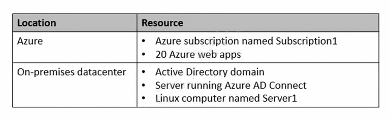

- [ ] Azure AD Application Proxy.
- [ ] The Active Directory Domain Services role on a virtual machine.
- [ ] An Azure VPN gateway.
- [x] Azure AD Domain Services (Azure AD DS).

**[⬆ Back to Top](#table-of-contents)**

### You need to design a solution that will execute custom C# code in response to an event routed to Azure Event Grid. The solution must meet the following requirements: The executed code must be able to access the private IP address of a Microsoft SQL Server instance that runs on an Azure virtual machine. Costs must be minimized. What should you include in the solution?

- [ ] Azure Logic Apps in the Consumption plan.
- [ ] Azure Functions in the Premium plan.
- [x] Azure Functions in the Consumption plan.
- [ ] Azure Logic Apps in the integrated service environment.

**[⬆ Back to Top](#table-of-contents)**

### You have an on-premises network and an Azure subscription. The on-premises network has several branch offices. A branch office in Toronto contains a virtual machine named VM1 that is configured as a file server. Users access the shared files on VM1 from all the offices. You need to recommend a solution to ensure that the users can access the shared files as quickly as possible if the Toronto branch office is inaccessible. What should you include in the recommendation?

- [ ] A Recovery Services vault and Windows Server Backup.
- [ ] Azure blob containers and Azure File Sync.
- [ ] A Recovery Services vault and Azure Backup.
- [x] An Azure file share and Azure File Sync.

**[⬆ Back to Top](#table-of-contents)**

### Your company develops a web service that is deployed to an Azure virtual machine named VM1. The web service allows an API to access real-time data from VM1. The current virtual machine deployment is shown in the Deployment exhibit. The chief technology officer (CTO) sends you the following email message: 'Our developers have deployed the web service to a virtual machine named VM1. Testing has shown that the API is accessible from VM1 and VM2. Our partners must be able to connect to the API over the Internet. Partners will use this data in applications that they develop.' You deploy an Azure API Management (APIM) service. The relevant API Management configuration is shown in the API exhibit. Question 1: The API is available to partners over the internet.

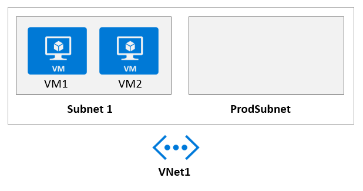
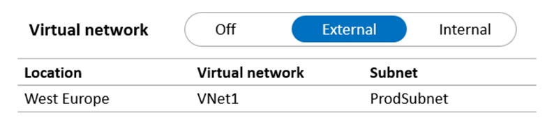

- [x] Yes.
- [ ] No.

**[⬆ Back to Top](#table-of-contents)**

### Your company develops a web service that is deployed to an Azure virtual machine named VM1. The web service allows an API to access real-time data from VM1. The current virtual machine deployment is shown in the Deployment exhibit. The chief technology officer (CTO) sends you the following email message: 'Our developers have deployed the web service to a virtual machine named VM1. Testing has shown that the API is accessible from VM1 and VM2. Our partners must be able to connect to the API over the Internet. Partners will use this data in applications that they develop.' You deploy an Azure API Management (APIM) service. The relevant API Management configuration is shown in the API exhibit. Question 2: The APIM instance can access real-time data from VM1.

- [x] Yes.
- [ ] No.

**[⬆ Back to Top](#table-of-contents)**

### Your company develops a web service that is deployed to an Azure virtual machine named VM1. The web service allows an API to access real-time data from VM1. The current virtual machine deployment is shown in the Deployment exhibit. The chief technology officer (CTO) sends you the following email message: 'Our developers have deployed the web service to a virtual machine named VM1. Testing has shown that the API is accessible from VM1 and VM2. Our partners must be able to connect to the API over the Internet. Partners will use this data in applications that they develop.' You deploy an Azure API Management (APIM) service. The relevant API Management configuration is shown in the API exhibit. Question 3: A VPN gateway is required for partner access.

- [ ] Yes.
- [x] No.

**[⬆ Back to Top](#table-of-contents)**

### Your company has an existing web app that runs on Azure virtual machines. You need to ensure that the app is protected from SQL injection attempts and uses a layer-7 load balancer. The solution must minimize disruptions to the code of the app. What should you recommend?

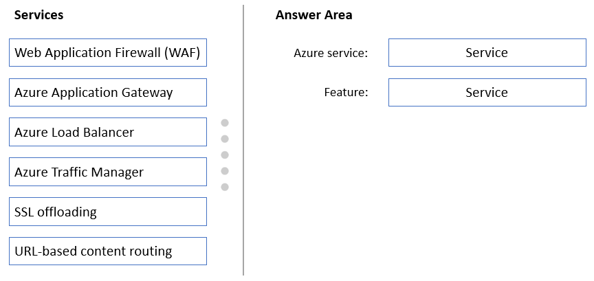

- [ ] Azure service: Azure Application Gateway. Feature: SSL offloading.
- [ ] Azure service: Azure Traffic Manager. Feature: Web Application Firewall (WAF).
- [x] Azure service: Azure Application Gateway. Feature: Web Application Firewall (WAF).
- [ ] Azure service: Azure Load Balancer. Feature: URL-based content routing.

**[⬆ Back to Top](#table-of-contents)**

### You are designing a microservices architecture that will be hosted in an Azure Kubernetes Service (AKS) cluster. Apps that will consume the microservices will be hosted on Azure virtual machines. The virtual machines and the AKS cluster will reside on the same virtual network. You need to design a solution to expose the microservices to the consumer apps. The solution must meet the following requirements: Ingress access to the microservices must be restricted to a single private IP address and protected by using mutual TLS authentication. The number of incoming microservice calls must be rate-limited. Costs must be minimized. What should you include in the solution?

- [ ] Azure App Gateway with Azure Web Application Firewall (WAF).
- [ ] Azure API Management Standard tier with a service endpoint.
- [ ] Azure Front Door with Azure Web Application Firewall (WAF).
- [x] Azure API Management Premium tier with virtual network connection.

**[⬆ Back to Top](#table-of-contents)**

### You have a .NET web service named Service1 that has the following requirements: Must read and write temporary files to the local file system. Must write to the Application event log. You need to recommend a solution to host Service1 in Azure. The solution must meet the following requirements: Minimize maintenance overhead. Minimize costs. What should you include in the recommendation?

- [ ] An Azure App Service web app.
- [x] An Azure virtual machine scale set.
- [ ] An App Service Environment (ASE).
- [ ] An Azure Functions app.

**[⬆ Back to Top](#table-of-contents)**

### You have the Azure resources shown in the following table. You need to deploy a new Azure Firewall policy that will contain mandatory rules for all Azure Firewall deployments. The new policy will be configured as a parent policy for the existing policies. What is the minimum number of additional Azure Firewall policies you should create?

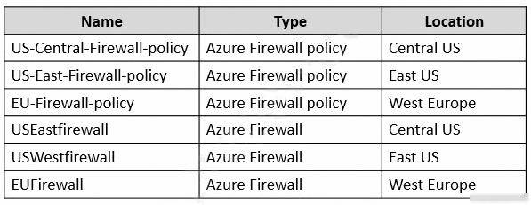

- [ ] 0.
- [x] 1.
- [ ] 2.
- [ ] 3.

**[⬆ Back to Top](#table-of-contents)**

### Your company has an app named App1 that uses data from the on-premises Microsoft SQL Server databases shown in the following table. App1 and the data are used on the first day of the month only. The data is not expected to grow more than 3% each year. The company is rewriting App1 as an Azure web app and plans to migrate all the data to Azure. You need to migrate the data to Azure SQL Database. The solution must minimize costs. Which service tier should you use?

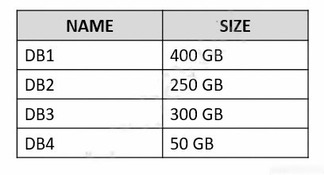

- [ ] vCore-based General Purpose.
- [x] DTU-based Standard.
- [ ] vCore-based Business Critical.
- [ ] DTU-based Basic.

**[⬆ Back to Top](#table-of-contents)**

### You are developing a sales application that will contain several Azure cloud services and handle different components of a transaction. Different cloud services will process customer orders, billing, payment, inventory, and shipping. You need to recommend a solution to enable the cloud services to asynchronously communicate transaction information by using XML messages. What should you include in the recommendation?

- [ ] Azure Service Fabric.
- [ ] Azure Data Lake.
- [x] Azure Service Bus.
- [ ] Azure Traffic Manager.

**[⬆ Back to Top](#table-of-contents)**

### Your company has 300 virtual machines hosted in a VMware environment. The virtual machines vary in size and have various utilization levels. You plan to move all the virtual machines to Azure. You need to recommend how many and what size Azure virtual machines will be required to move the current workloads to Azure. The solution must minimize administrative effort. What should you use to make the recommendation?

- [ ] Azure Pricing calculator.
- [ ] Azure Advisor.
- [x] Azure Migrate.
- [ ] Azure Cost Management.

**[⬆ Back to Top](#table-of-contents)**

### You plan provision a High Performance Computing (HPC) cluster in Azure that will use a third-party scheduler. You need to recommend a solution to provision and manage the HPC cluster node. What should you include in the recommendation?

- [ ] Azure Automation.
- [ ] Azure CycleCloud.
- [x] Azure Purview.
- [ ] Azure Lighthouse

**[⬆ Back to Top](#table-of-contents)**

### You are designing an Azure App Service web app. You plan to deploy the web app to the North Europe Azure region and the West Europe Azure region. You need to recommend a solution for the web app. The solution must meet the following requirements: Users must always access the web app from the North Europe region, unless the region fails. The web app must be available to users if an Azure region is unavailable. Deployment costs must be minimized. What should you include in the recommendation?

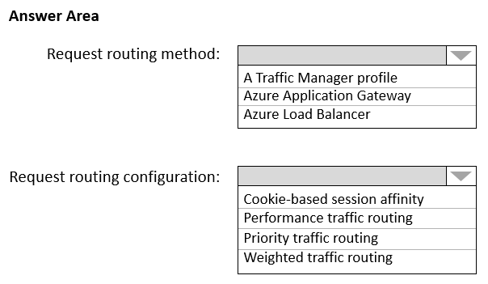

- [x] Request routing method: A Traffic Manager profile. Request routing configuration: Priority traffic routing.
- [ ] Request routing method: Azure Application Gateway. Request routing configuration: Priority traffic routing.
- [ ] Request routing method: A Traffic Manager profile. Request routing configuration: Cookie-based session affinity.
- [ ] Request routing method: Azure Load Balancer. Request routing configuration: Performance traffic routing.

**[⬆ Back to Top](#table-of-contents)**

### You design a solution for the web tier of WebApp1 as shown in the exhibit. Question 2: The design supports autoscaling.

- [x] Yes.
- [ ] No.

**[⬆ Back to Top](#table-of-contents)**

### You design a solution for the web tier of WebApp1 as shown in the exhibit. Question 3: The design requires a manual configuration if an Azure region fails.

- [ ] Yes.
- [x] No.

**[⬆ Back to Top](#table-of-contents)**

### Note: This question is part of a series of questions that present the same scenario. Each question in the series contains a unique solution that might meet the stated goals. Some question sets might have more than one correct solution, while others might not have a correct solution. After you answer a question in this section, you will NOT be able to return to it. As a result, these questions will not appear in the review screen. Your network contains an Active Directory Domain Services (AD DS) domain named contoso.com. You need to identify which server is the PDC emulator for the domain. Solution: From Active Directory Domains and Trusts, you right-click Active Directory Domains and Trusts in the console tree, and then select Operations Master. Does this meet the goal?

- [x] Yes.
- [ ] No.

### You have an on premises Active Directory Domain Services (AD DS) domain that syncs with an Azure Active Directory (Azure AD) tenant. You plan to implement self-service password reset (SSPR) in Azure AD.You need to ensure that users that reset their passwords by using SSPR can use the new password resources in the AD DS domain. What should you do?

- [ ] Deploy the Azure AD Password Protection proxy service to the on premises network.
- [x] Run the Microsoft Azure Active Directory Connect wizard and select Password writeback.
- [ ] Grant the Change password permission for the domain to the Azure AD Connect service account.
- [ ] Grant the impersonate a client after authentication user right to the Azure AD Connect service account.

### You have an Azure Active Directory Domain Services (Azure AD DS) domain named contoso.com. You need to provide an administrator with the ability to manage Group Policy Objects (GPOs). The solution must use the principle of least privilege. To which group should you add the administrator?

- [x] AAD DC Administrators.
- [ ] Domain Admins.
- [ ] Schema Admins.
- [ ] Enterprise Admins.
- [ ] Group Policy Creator Owners.

### You create a new Azure subscription. You plan to deploy Azure Active Directory Domain Services (Azure AD DS) and Azure virtual machines. You need to ensure that the virtual machines can join to Azure AD DS. Which three actions should you perform in sequence? To answer, move the appropriate actions from the list of actions to the answer area and arrange them in the correct order. Select and Place:

- [x] Modify the settings of the Azure virtual network.
- [ ] Install the Active Direcotry Domain Services role.
- [ ] Install Azure AD Connect.
- [x] Create an Azure virtual network.
- [x] Create an Azure AD DS instance.
- [ ] Run the Active Directory Domain Service installation Wizard.

### Add Admin1 to the following group:

- [x] AAD DC Administrators.
- [ ] Domain Admins.
- [ ] Group Policy Creator Oweners.

### Instruct Admin1 apply the custom Groupp Policy settings by:

- [ ] Creating a new Group Policy Object (GPO) and linking the GPO to the domain.
- [x] Modifying AADDC Compputers GPO.
- [ ] Modifying the default domain GPO.

### Your network contains a single domain Active Directory Domain Services (AD DS) forest named contoso.com. The forest contains a single Active Directory site. You plan to deploy a read only domain controller (RODC) to a new datacenter on a server named Server1. A user named User1 is a member of the local Administrators group on Server1. You need to recommend a deployment plan that meets the following requirements: Ensures that a user named User1 can perform the RODC installation on Server1 Ensures that you can control the AD DS replication schedule to the Server1 Ensures that Server1 is in a new site named RemoteSite1Uses the principle of least privilege Which three actions should you recommend performing in sequence? To answer, move the appropriate actions from the list of actions to the answer area and arrange them in the correct order. Select and Place:

- [x] Instruct User1 to run the Active Directory Domain Services installation Wizard on Server!.
- [ ] Create a site and a subnet.
- [x] Create a site link.
- [x] Pre-create an RODOC account.
- [ ] Add User1 to the Contoso\Administstrators group.

###  Your network contains an Active Directory Domain Services (AD DS) domain. The network also contains 20 domain controllers, 100 member servers, and 100 client computers. You have a Group Policy Object (GPO) named GPO1 that contains Group Policy preferences. You plan to link GPO1 to the domain. You need to ensure that the preference in GPO1 apply only to domain member servers and NOT to domain controllers or client computers. All the other Group Policy settings in GPO1 must apply to all the computers. The solution must minimize administrative effort. Which type of item level targeting should you use?

- [ ] Domain
- [x] Operating System
- [ ] Security Group
- [ ] Environment Variable

### Events from Windows event logs:

- [ ] AzureActivity.
- [ ] AzureDiagnostics.
- [x] Event.
- [ ] Syslog.

### Events from Linux system logging:

- [ ] AzureActivity.
- [ ] AzureDiagnostics.
- [ ] Event.
- [x] Syslog.

### Note: This question is part of a series of questions that present the same scenario. Each question in the series contains a unique solution that might meet the stated goals. Some question sets might have more than one correct solution, while others might not have a correct solution. After you answer a question in this section, you will NOT be able to return to it. As a result, these questions will not appear in the review screen. Your company deploys several virtual machines on-premises and to Azure. ExpressRoute is deployed and configured for on-premises to Azure connectivity. Several virtual machines exhibit network connectivity issues. You need to analyze the network traffic to identify whether packets are being allowed or denied to the virtual machines. Solution: Install and configure the Azure Monitoring agent and the Dependency Agent on all the virtual machines. Use VM insights in Azure Monitor to analyze the network traffic. Does this meet the goal?

- [ ] Yes.
- [x] No.

### You need to design an architecture to capture the creation of users and the assignment of roles. The captured data must be stored in Azure Cosmos DB. Which services should you include in the design? To answer, drag the appropriate services to the correct targets. Each service may be used once, more than once, or not at all. You may need to drag the split bar between panes or scroll to view content. NOTE: Each correct selection is worth one point.

- [ ] Azure Event Grid.
- [x] Azure Event Hubs.
- [x] Azure Functions.
- [ ] Azure Monitor Logs.
- [ ] Azure Notification Hubs.

### Your company, named Contoso, Ltd., implements several Azure logic apps that have HTTP triggers. The logic apps provide access to an on-premises web service. Contoso establishes a partnership with another company named Fabrikam, Inc. Fabrikam does not have an existing Azure Active Directory (Azure AD) tenant and uses third-party OAuth 2.0 identity management to authenticate its users. Developers at Fabrikam plan to use a subset of the logic apps to build applications that will integrate with the on-premises web service of Contoso. You need to design a solution to provide the Fabrikam developers with access to the logic apps. The solution must meet the following requirements: Requests to the logic apps from the developers must be limited to lower rates than the requests from the users at Contoso. The developers must be able to rely on their existing OAuth 2.0 provider to gain access to the logic apps. The solution must NOT require changes to the logic apps. The solution must NOT use Azure AD guest accounts. What should you include in the solution?v

- [ ] Azure Front Door.
- [ ] Azure AD Application Proxy.
- [ ] Azure AD business-to-business (B2B).
- [x] Azure API Management.

### Resource to create in Azure:

- [ ] An event hub.
- [x] A Log Analytics workspace.
- [ ] A search service.
- [ ] A storage account.

### Configuration to erform on the virtual machines:

- [ ] Create event subscripptions.
- [ ] Configure Continous delivery.
- [x] Install the Azure Monitor agent.
- [ ] Modify the membership of the Event Log Readers group.

### Security:

- [x] Azure AD privileged Identitu Management.
- [ ] Azure Managed Identity.
- [ ] Azure Ad Connect.
- [ ] Azure Ad identity Pprotection.

### Development:

- [ ] Azure AD privileged Identitu Management.
- [x] Azure Managed Identity.
- [ ] Azure Ad Connect.
- [ ] Azure Ad identity Pprotection.

### Quality Assurance:

- [x] Azure AD privileged Identitu Management.
- [ ] Azure Managed Identity.
- [ ] Azure Ad Connect.
- [ ] Azure Ad identity Pprotection.

### Azure Policy effect to use:

- [ ] Append.
- [ ] EnforceOPAConstraint.
- [ ] EnforceRegoPolicy.
- [x] Modify.

### Azure Active Direcotry (Azure AD) objects and role-based access control (RBAC) role to use for the remediation tasks:

- [x] A managed identity with the Contributor role.
- [ ] A managed identity with the User Access Administrator role.
- [ ] A service principal with the Contribution role.
- [ ] A service principal with the User Access Administrator role.

### You can add a new diagnostic settings that archives SQLInsights logs to storage2.

- [x] Yes.
- [ ] No.

### You can add a new diagnostic settings that send SQLInsights logs to Workspace2.

- [x] Yes.
- [ ] No.

### You can add a new diagnostic settings that send SQLInsights logs to Hub1.

- [x] Yes.
- [ ] No.

### You plan to deploy an Azure SQL database that will store Personally Identifiable Information (PII). You need to ensure that only privileged users can view the PII. What should you include in the solution?

- [x] dynamic data masking.
- [ ] role-based access control (RBAC).
- [ ] Data Discovery & Classification.
- [ ] Transparent Data Encryption (TDE).

### You plan to deploy an app that will use an Azure Storage account. You need to deploy the storage account. The storage account must meet the following requirements: Store the data for multiple users. Encrypt each user's data by using a separate key. Encrypt all the data in the storage account by using customer-managed keys. What should you deploy?

- [ ] files in a premium file share storage account.
- [x] blobs in a general purpose v2 storage account.
- [ ] blobs in an Azure Data Lake Storage Gen2 account.
- [ ] files in a general purpose v2 storage account.

### Key Vault integration method:

- [x] Key Vault references in Application settings.
- [ ] Key Vault references in Appsettings.json.
- [ ] Key Vault references in Web.config.
- [ ] Key Vault SDK

### Key Vault ppermissions for the managed identity:

- [ ] Keys: Gey.
- [ ] Keys: List and Get.
- [x] Secrets: Get.
- [ ] Secrets: List and Get.

### You plan to deploy an application named App1 that will run on five Azure virtual machines. Additional virtual machines will be deployed later to run App1. You need to recommend a solution to meet the following requirements for the virtual machines that will run App1: Ensure that the virtual machines can authenticate to Azure Active Directory (Azure AD) to gain access to an Azure key vault, Azure Logic Apps instances, and an Azure SQL database. Avoid assigning new roles and permissions for Azure services when you deploy additional virtual machines. Avoid storing secrets and certificates on the virtual machines. Minimize administrative effort for managing identities. Which type of identity should you include in the recommendation?

- [ ] a system-assigned managed identity.
- [ ] a service principal that is configured to use a certificate.
- [ ] a service principal that is configured to use a client secret.
- [x] a user-assigned managed identity.

### You have the resources shown in the following table: CDB1 hosts a container that stores continuously updated operational data. You are designing a solution that will use AS1 to analyze the operational data daily. You need to recommend a solution to analyze the data without affecting the performance of the operational data store. What should you include in the recommendation?

- [ ] Azure Cosmos DB change feed.
- [ ] Azure Data Factory with Azure Cosmos DB and Azure Synapse Analytics connectors.
- [x] Azure Synapse Link for Azure Cosmos DB.
- [ ] Azure Synapse Analytics with PolyBase data loading.

### The amount of time that SQLInsight data will be stored in blob storage in [...].

- [ ] 30 days.
- [x] 90 days.
- [ ] 730 days.
- [ ] indefinite.

### The maximum  amount of time that SQLInsights data can be stored in Azure Log Analytics is [...].

- [ ] 30 days.
- [ ] 90 days.
- [x] 730 days.
- [ ] indefinite.

### You have an application that is used by 6,000 users to validate their vacation requests. The application manages its own credential store. Users must enter a username and password to access the application. The application does NOT support identity providers. You plan to upgrade the application to use single sign-on (SSO) authentication by using an Azure Active Directory (Azure AD) application registration. Which SSO method should you use?

- [ ] header-based.
- [ ] SAML.
- [x] password-based.
- [ ] OpenID Connect.

### To provide access to virtual machines on VNET1, use: [...].

- [ ] Azure Bastion.
- [x] Just-in-time (JIT) VM access.
- [ ] Azure Web Appplication Firewall (WAF) in Azure Front Doctor.

### To enforce Azure MFA, use:

- [ ] An Azure Identity Governance access package.
- [x] A Conditional Access policy that has the Cloud apps assignment set to Azure Windows Vm Sing-In.
- [ ] A Conditional Access ppolicy that has the Cloud apps assignment set to Microsoft Azure Management.

### You are designing an Azure governance solution. All Azure resources must be easily identifiable based on the following operational information: environment, owner, department and cost center. You need to ensure that you can use the operational information when you generate reports for the Azure resources. What should you include in the solution?

- [ ] an Azure data catalog that uses the Azure REST API as a data source.
- [ ] an Azure management group that uses parent groups to create a hierarchy.
- [x] an Azure policy that enforces tagging rules.
- [ ] Azure Active Directory (Azure AD) administrative units.

### A company named Contoso, Ltd. has an Azure Active Directory (Azure AD) tenant that is integrated with Microsoft 365 and an Azure subscription. Contoso has an on-premises identity infrastructure. The infrastructure includes servers that run Active Directory Domain Services (AD DS) and Azure AD Connect. Contoso has a partnership with a company named Fabrikam. Inc. Fabrikam has an Active Directory forest and a Microsoft 365 tenant. Fabrikam has the same on- premises identity infrastructure components as Contoso. A team of 10 developers from Fabrikam will work on an Azure solution that will be hosted in the Azure subscription of Contoso. The developers must be added to the Contributor role for a resource group in the Contoso subscription. You need to recommend a solution to ensure that Contoso can assign the role to the 10 Fabrikam developers. The solution must ensure that the Fabrikam developers use their existing credentials to access resources What should you recommend?

- [ ] In the Azure AD tenant of Contoso. create cloud-only user accounts for the Fabrikam developers.
- [ ] Configure a forest trust between the on-premises Active Directory forests of Contoso and Fabrikam.
- [ ] Configure an organization relationship between the Microsoft 365 tenants of Fabrikam and Contoso.
- [x] In the Azure AD tenant of Contoso, create guest accounts for the Fabnkam developers.

### Your company has the divisions shown in the following table. Sub1 contains an Azure App Service web app named App1. App1 uses Azure AD for single-tenant user authentication. Users from contoso.com can authenticate to App1. You need to recommend a solution to enable users in the fabrikam.com tenant to authenticate to App1. What should you recommend?

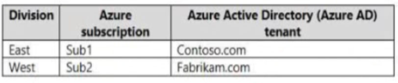

- [ ] Configure the Azure AD provisioning service.
- [ ] Enable Azure AD pass-through authentication and update the sign-in endpoint.
- [x] Use Azure AD entitlement management to govern external users.
- [ ] Configure Azure AD join.

### Grant permissions to allow the web apps to access the web APIs by using [...].

- [x] Azure AD.
- [ ] Azure API Management.
- [ ] The web APIs.

### Configure a JSON WEB Token (JWT) validation policy by using [...].

- [ ] Azure AD.
- [x] Azure API Management.
- [ ] The web APIs.

### You are developing an app that will read activity logs for an Azure subscription by using Azure Functions. You need to recommend an authentication solution for Azure Functions. The solution must minimize administrative effort. What should you include in the recommendation?

- [ ] an enterprise application in Azure AD.
- [x] system-assigned managed identities.
- [ ] shared access signatures (SAS).
- [ ] application registration in Azure AD.

### Your company has the divisions shown in the following table. Sub1 contains an Azure App Service web app named App1. App1 uses Azure AD for single-tenant user authentication. Users from contoso.com can authenticate to App1. You need to recommend a solution to enable users in the fabrikam.com tenant to authenticate to App1. What should you recommend?

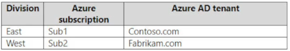

- [ ] Configure Azure AD join.
- [x] Use Azure AD entitlement management to govern external users.
- [ ] Enable Azure AD pass-through authentication and update the sign-in endpoint.
- [ ] Configure assignments for the fabrikam.com users by using Azure AD Privileged Identity Management (PIM).

### Your company has the divisions shown in the following table. Sub1 contains an Azure App Service web app named App1. App1 uses Azure AD for single-tenant user authentication. Users from contoso.com can authenticate to App1. You need to recommend a solution to enable users in the fabrikam.com tenant to authenticate to App1. What should you recommend?

- [ ] Configure Azure AD join.
- [ ] Configure Azure AD Identity Protection.
- [x] Use Azure AD entitlement management to govern external users.
- [ ] Configure assignments for the fabrikam.com users by using Azure AD Privileged Identity Management (PIM).

### You need to recommend a solution to generate a monthly report of all the new Azure Resource Manager (ARM) resource deployments in your Azure subscription. What should you include in the recommendation?

- [x] Azure Activity Log.
- [ ] Azure Arc.
- [ ] Azure Analysis Services.
- [ ] Azure Monitor metrics.

### Configure App1l to use OAuth 2.0 [...]:

- [ ] Authorization code grant flows.
- [x] Client credentials grant flows.
- [ ] Implicit grant flows.

### Configure App1 to use a Rest API call to retrieve an authentication token from the [...]:

- [ ] Azure Instance Metadata Service (MDS) endpoint.
- [x] OAuth 2.0 access token endpoint of Azure AD.
- [ ] OAuth 2.0 access token endpoint of Microsoft Identity Platform.

### Your company has the divisions shown in the following table. Sub1 contains an Azure App Service web app named App1. App1 uses Azure AD for single-tenant user authentication. Users from contoso.com can authenticate to App1. You need to recommend a solution to enable users in the fabrikam.com tenant to authenticate to App1. What should you recommend?

- [ ] Configure Azure AD join.
- [ ] Configure Azure AD Identity Protection.
- [ ] Configure a Conditional Access policy.
- [x] Configure Supported account types in the application registration and update the sign-in endpoint.

### Authentication:

- [x] Application registration in Azure AD.
- [ ] A system-assigned managed identity.
- [ ] A user-assigned managed identity.

### Authorization:

- [ ] Application permissions.
- [ ] Azure role-based access control (Azure RBAC).
- [x] Delegated permissions.

### Your company has the divisions shown in the following table. Sub1 contains an Azure App Service web app named App1. App1 uses Azure AD for single-tenant user authentication. Users from contoso.com can authenticate to App1. You need to recommend a solution to enable users in the fabrikam.com tenant to authenticate to App1. What should you recommend?

- [ ] Enable Azure AD pass-through authentication and update the sign-in endpoint.
- [x] Use Azure AD entitlement management to govern external users.
- [ ] Configure assignments for the fabrikam.com users by using Azure AD Privileged Identity Management (PIM).
- [ ] Configure Azure AD Identity Protection.

###  Your company has the divisions shown in the following table. Sub1 contains an Azure App Service web app named App1. App1 uses Azure AD for single-tenant user authentication. Users from contoso.com can authenticate to App1. You need to recommend a solution to enable users in the fabrikam.com tenant to authenticate to App1. What should you recommend?

[Question 45](images/question45.png)

- [ ] Configure the Azure AD provisioning service.
- [ ] Enable Azure AD pass-through authentication and update the sign-in endpoint.
- [x] Configure Supported account types in the application registration and update the sign-in endpoint.
- [ ] Configure Azure AD join.

### User1 can create a new virtual machine in RG1.

- [x] Yes.
- [ ] No.

### User2 can grant permissions to Group2.

- [ ] Yes.
- [x] No.

### User3 can create a storage account in RG2.

- [x] Yes.
- [ ] No.

### Your company has the divisions shown in the following table. Sub1 contains an Azure App Service web app named App1. App1 uses Azure AD for single-tenant user authentication. Users from contoso.com can authenticate to App1. You need to recommend a solution to enable users in the fabrikam.com tenant to authenticate to App1. What should you recommend?

[Question 47](images/question47.png)

- [ ] Configure Azure AD Identity Protection.
- [ ] Configure assignments for the fabrikam.com users by using Azure AD Privileged Identity Management (PIM).
- [x] Configure Supported account types in the application registration and update the sign-in endpoint.
- [ ] Configure a Conditional Access policy.

### Your company has the divisions shown in the following table. Sub1 contains an Azure App Service web app named App1. App1 uses Azure AD for single-tenant user authentication. Users from contoso.com can authenticate to App1. You need to recommend a solution to enable users in the fabrikam.com tenant to authenticate to App1. What should you recommend?

- [x] Use Azure AD entitlement management to govern external users.
- [ ] Enable Azure AD pass-through authentication and update the sign-in endpoint.
- [ ] Configure a Conditional Access policy.
- [ ] Configure assignments for the fabrikam.com users by using Azure AD Privileged Identity Management (PIM).

### You have an Azure subscription that contains 1,000 resources. You need to generate compliance reports for the subscription. The solution must ensure that the resources can be grouped by department. What should you use to organize the resources?

- [ ] application groups and quotas.
- [x] Azure Policy and tags.
- [ ] administrative units and Azure Lighthouse.
- [ ] resource groups and role assignments.

### You need to recommend a solution to generate a monthly report of all the new Azure Resource Manager (ARM) resource deployments in your Azure subscription. What should you include in the recommendation?

- [ ] Azure Arc
- [ ] Azure Monitor metrics
- [ ] Azure Advisor
- [x] Azure Log Analytics

### You need to recommend a solution to generate a monthly report of all the new Azure Resource Manager (ARM) resource deployments in your Azure subscription. What should you include in the recommendation?

- [ ] Azure Monitor action groups.
- [ ] Azure Arc.
- [ ] Azure Monitor metrics.
- [x] Azure Activity Log.

### You have an Azure AD tenant that contains an administrative unit named MarketingAU. MarketingAU contains 100 users. You create two users named User1 and User2. You need to ensure that the users can perform the following actions in MarketingAU:  User1 must be able to create user accounts. User2 must be able to reset user passwords. Which role should you assign to each user? To answer, drag the appropriate roles to the correct users. Each role may be used once, more than once, or not at all. You may need to drag the split bar between panes or scroll to view content. NOTE: Each correct selection is worth one point.

- [x] Helpdesk Administrator for MarketingAU.
- [ ] Helpdesk Administrator for the tenant.
- [x] User Administrator for MarketingAU.
- [ ] User Administrator for the tenant.

### You need to recommend a solution to generate a monthly report of all the new Azure Resource Manager (ARM) resource deployments in your Azure subscription. What should you include in the recommendation?

- [ ] Azure Arc.
- [x] Azure Log Analytics Most Voted.
- [ ] Application insights.
- [ ] Azure Monitor action groups.

### Storage [...]:

- [ ] Certificate.
- [ ] Key.
- [x] Secret.

### Access [...]:

- [ ] An API token.
- [x] A managed service identity.
- [ ] A service principal.

### You have two app registrations named App1 and App2 in Azure AD. App1 supports role-based access control (RBAC) and includes a role named Writer. You need to ensure that when App2 authenticates to access App1, the tokens issued by Azure AD include the Writer role claim. Which blade should you use to modify each app registration? To answer, drag the appropriate blades to the correct app registrations. Each blade may be used once, more than once, or not at all. You may need to drag the split bar between panes or scroll to view content. NOTE: Each correct selection is worth one point.

- [ ] API permissions.
- [x] App roles.
- [x] Token configuration.

### You have an Azure subscription. You plan to deploy a monitoring solution that will include the following: Azure Monitor Network Insights. Application Insights. Microsoft Sentinel. VM insights. The monitoring solution will be managed by a single team. What is the minimum number of Azure Monitor workspaces required?

- [x] 1.
- [ ] 2.
- [ ] 3.
- [ ] 4.

### You have an Azure subscription that contains 10 web apps. The apps are integrated with Azure AD and are accessed by users on different project teams. The users frequently move between projects. You need to recommend an access management solution for the web apps. The solution must meet the following requirements: The users must only have access to the app of the project to which they are assigned currently. Project managers must verify which users have access to their project’s app and remove users that are no longer assigned to their project. Once every 30 days, the project managers must be prompted automatically to verify which users are assigned to their projects. What should you include in the recommendation?

- [ ] Azure AD Identity Protection.
- [ ] Microsoft Defender for Identity.
- [ ] Microsoft Entra Permissions Management.
- [x] Azure AD Identity Governance.
