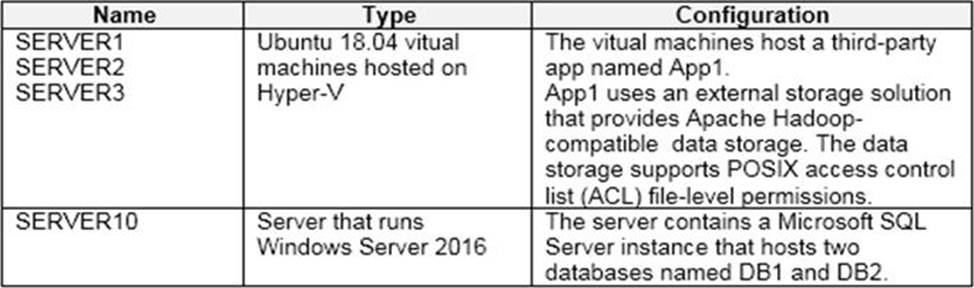
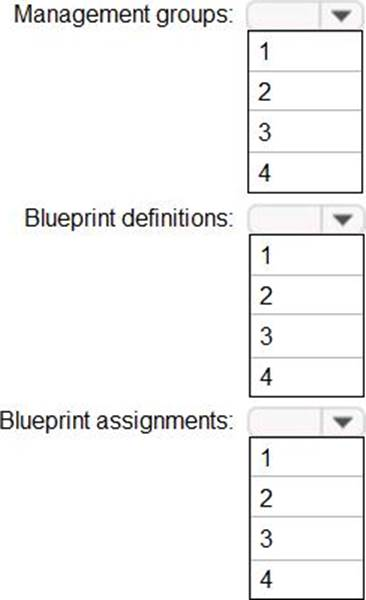

# ⬆️ Microsoft Azure AZ-305 (Designing Microsoft Azure Infrastructure Solutions) Practice Tests Exams Questions & Answers

## Table of Contents

| No. | Questions |
|---- | ---------
| 1   | [Litware, Inc. is a medium-sized finance company. Litware has a main office in Boston. The network contains an Active Directory forest named Litware.com that is linked to an Azure Active Directory (Azure AD) tenant named Litware.com. All users have Azure Active Directory Premium P2 licenses. Litware has a second Azure AD tenant named dev.Litware.com that is used as a development environment. The Litware.com tenant has a conditional acess policy named capolicy1. Capolicy1 requires that when users manage the Azure subscription for a production environment by using the Azure portal, they must connect from a hybrid Azure AD-joined device. Litware has 10 Azure subscriptions that are linked to the Litware.com tenant and five Azure subscriptions that are linked to the dev.Litware.com tenant. All the subscriptions are in an Enterprise Agreement (EA). The Litware.com tenant contains a custom Azure role-based access control (Azure RBAC) role named Role1 that grants the DataActions read permission to the blobs and files in Azure Storage. The on-premises network of Litware contains the resources shown in the following table. Litware has ExpressRoute connectivity to Azure. Litware plans to implement the following changes: Migrate DB1 and DB2 to Azure. Migrate App1 to Azure virtual machines. Deploy the Azure virtual machines that will host App1 to Azure dedicated hosts. Litware identifies the following authentication and authorization requirements: Users that manage the production environment by using the Azure portal must connect from a hybrid Azure AD-joined device and authenticate by using Azure Multi-Factor Authentication (MFA). The Network Contributor built-in RBAC role must be used to grant permission to all the virtual networks in all the Azure subscriptions. To access the resources in Azure, App1 must use the managed identity of the virtual machines that will host the app. Role1 must be used to assign permissions to the storage accounts of all the Azure subscriptions. RBAC roles must be applied at the highest level possible. Litware identifies the following resiliency requirements: Once migrated to Azure, DB1 and DB2 must meet the following requirements: Maintain availability if two availability zones in the local Azure region fail. Fail over automatically. Minimize I/O latency. App1 must meet the following requirements: Be hosted in an Azure region that supports availability zones. Be hosted on Azure virtual machines that support automatic scaling. Maintain availability if two availability zones in the local Azure region fail. Litware identifies the following security and compliance requirements: Once App1 is migrated to Azure, you must ensure that new data can be written to the app, and the modification of new and existing data is prevented for a period of three years. On-premises users and services must be able to access the Azure Storage account that will host the data in App1. Access to the public endpoint of the Azure Storage account that will host the App1 data must be prevented. All Azure SQL databases in the production environment must have Transparent Data Encryption (TDE) enabled. App1 must not share physical hardware with other workloads. Litware identifies the following business requirements: Minimize administrative effort. Minimize costs. You plan to migrate App1 to Azure. You need to recommend a storage solution for App1 that meets the security and compliance requirements. Which type of storage should you recommend, and how should you recommend configuring the storage?](#litware-inc-is-a-medium-sized-finance-company-litware-has-a-main-office-in-boston-the-network-contains-an-active-directory-forest-named-litwarecom-that-is-linked-to-an-azure-active-directory-azure-ad-tenant-named-litwarecom-all-users-have-azure-active-directory-premium-p2-licenses-litware-has-a-second-azure-ad-tenant-named-devlitwarecom-that-is-used-as-a-development-environment-the-litwarecom-tenant-has-a-conditional-acess-policy-named-capolicy1-capolicy1-requires-that-when-users-manage-the-azure-subscription-for-a-production-environment-by-using-the-azure-portal-they-must-connect-from-a-hybrid-azure-ad-joined-device-litware-has-10-azure-subscriptions-that-are-linked-to-the-litwarecom-tenant-and-five-azure-subscriptions-that-are-linked-to-the-devlitwarecom-tenant-all-the-subscriptions-are-in-an-enterprise-agreement-ea-the-litwarecom-tenant-contains-a-custom-azure-role-based-access-control-azure-rbac-role-named-role1-that-grants-the-dataactions-read-permission-to-the-blobs-and-files-in-azure-storage-the-on-premises-network-of-litware-contains-the-resources-shown-in-the-following-table-litware-has-expressroute-connectivity-to-azure-litware-plans-to-implement-the-following-changes-migrate-db1-and-db2-to-azure-migrate-app1-to-azure-virtual-machines-deploy-the-azure-virtual-machines-that-will-host-app1-to-azure-dedicated-hosts-litware-identifies-the-following-authentication-and-authorization-requirements-users-that-manage-the-production-environment-by-using-the-azure-portal-must-connect-from-a-hybrid-azure-ad-joined-device-and-authenticate-by-using-azure-multi-factor-authentication-mfa-the-network-contributor-built-in-rbac-role-must-be-used-to-grant-permission-to-all-the-virtual-networks-in-all-the-azure-subscriptions-to-access-the-resources-in-azure-app1-must-use-the-managed-identity-of-the-virtual-machines-that-will-host-the-app-role1-must-be-used-to-assign-permissions-to-the-storage-accounts-of-all-the-azure-subscriptions-rbac-roles-must-be-applied-at-the-highest-level-possible-litware-identifies-the-following-resiliency-requirements-once-migrated-to-azure-db1-and-db2-must-meet-the-following-requirements-maintain-availability-if-two-availability-zones-in-the-local-azure-region-fail-fail-over-automatically-minimize-io-latency-app1-must-meet-the-following-requirements-be-hosted-in-an-azure-region-that-supports-availability-zones-be-hosted-on-azure-virtual-machines-that-support-automatic-scaling-maintain-availability-if-two-availability-zones-in-the-local-azure-region-fail-litware-identifies-the-following-security-and-compliance-requirements-once-app1-is-migrated-to-azure-you-must-ensure-that-new-data-can-be-written-to-the-app-and-the-modification-of-new-and-existing-data-is-prevented-for-a-period-of-three-years-on-premises-users-and-services-must-be-able-to-access-the-azure-storage-account-that-will-host-the-data-in-app1-access-to-the-public-endpoint-of-the-azure-storage-account-that-will-host-the-app1-data-must-be-prevented-all-azure-sql-databases-in-the-production-environment-must-have-transparent-data-encryption-tde-enabled-app1-must-not-share-physical-hardware-with-other-workloads-litware-identifies-the-following-business-requirements-minimize-administrative-effort-minimize-costs-you-plan-to-migrate-app1-to-azure-you-need-to-recommend-a-storage-solution-for-app1-that-meets-the-security-and-compliance-requirements-which-type-of-storage-should-you-recommend-and-how-should-you-recommend-configuring-the-storage)
| 2   | [Your company has the divisions shown in the following table. You plan to deploy a custom application to each subscription. The application will contain the following: A resource group. An Azure web app. Custom role assignments. An Azure Cosmos DB account. You need to use Azure Blueprints to deploy the application to each subscription. What is the minimum number of objects required to deploy the application?](#your-company-has-the-divisions-shown-in-the-following-table-you-plan-to-deploy-a-custom-application-to-each-subscription-the-application-will-contain-the-following-a-resource-group-an-azure-web-app-custom-role-assignments-an-azure-cosmos-db-account-you-need-to-use-azure-blueprints-to-deploy-the-application-to-each-subscription-what-is-the-minimum-number-of-objects-required-to-deploy-the-application)
| 3   | [The on-premises network contains a single Active Directory domain named contoso.com. Contoso has a single Azure subscription. Contoso has a business partnership with Fabrikam, Inc. Fabrikam users access some Contoso applications over the internet by using Azure Active Directory (Azure AD) guest accounts. Contoso plans to deploy two applications named App1 and App2 to Azure. App1 will be a Python web app hosted in Azure App Service that requires a Linux runtime. Users from Contoso and Fabrikam will access App1. App1 will access several services that require third-party credentials and access strings. The credentials and access strings are stored in Azure Key Vault. App1 will have six instances: three in the East US Azure region and three in the West Europe Azure region. App1 has the following data requirements: Each instance will write data to a data store in the same availability zone as the instance. Data written by any App1 instance must be visible to all App1 instances. App1 will only be accessible from the internet. App1 has the following connection requirements: Connections to App1 must pass through a web application firewall (WAF). Connections to App1 must be active-active load balanced between instances. All connections to App1 from North America must be directed to the East US region. All other connections must be directed to the West Europe region. Every hour, you will run a maintenance task by invoking a PowerShell script that copies files from all the App1 instances. The PowerShell script will run from a central location. App2 will be a NET app hosted in App Service that requires a Windows runtime. App2 has the following file storage requirements: Save files to an Azure Storage account. Replicate files to an on-premises location. Ensure that on-premises clients can read the files over the LAN by using the SMB protocol. You need to monitor App2 to analyze how long it takes to perform different transactions within the application. The solution must not require changes to the application code. Application developers will constantly develop new versions of App1 and App2. The development process must meet the following requirements: A staging instance of a new application version must be deployed to the application host before the new version is used in production. After testing the new version, the staging version of the application will replace the production version. The switch to the new application version from staging to production must occur without any downtime of the application. Contoso identifies the following requirements for managing Fabrikam access to resources: Every month, an account manager at Fabrikam must review which Fabrikam users have access permissions to App1. Accounts that no longer need permissions must be removed as guests. The solution must minimize development effort. All secrets used by Azure services must be stored in Azure Key Vault. Services that require credentials must have the credentials tied to the service instance. The credentials must NOT be shared between services. What should you implement to meet the identity requirements?](#the-on-premises-network-contains-a-single-active-directory-domain-named-contosocom-contoso-has-a-single-azure-subscription-contoso-has-a-business-partnership-with-fabrikam-inc-fabrikam-users-access-some-contoso-applications-over-the-internet-by-using-azure-active-directory-azure-ad-guest-accounts-contoso-plans-to-deploy-two-applications-named-app1-and-app2-to-azure-app1-will-be-a-python-web-app-hosted-in-azure-app-service-that-requires-a-linux-runtime-users-from-contoso-and-fabrikam-will-access-app1-app1-will-access-several-services-that-require-third-party-credentials-and-access-strings-the-credentials-and-access-strings-are-stored-in-azure-key-vault-app1-will-have-six-instances-three-in-the-east-us-azure-region-and-three-in-the-west-europe-azure-region-app1-has-the-following-data-requirements-each-instance-will-write-data-to-a-data-store-in-the-same-availability-zone-as-the-instance-data-written-by-any-app1-instance-must-be-visible-to-all-app1-instances-app1-will-only-be-accessible-from-the-internet-app1-has-the-following-connection-requirements-connections-to-app1-must-pass-through-a-web-application-firewall-waf-connections-to-app1-must-be-active-active-load-balanced-between-instances-all-connections-to-app1-from-north-america-must-be-directed-to-the-east-us-region-all-other-connections-must-be-directed-to-the-west-europe-region-every-hour-you-will-run-a-maintenance-task-by-invoking-a-powershell-script-that-copies-files-from-all-the-app1-instances-the-powershell-script-will-run-from-a-central-location-app2-will-be-a-net-app-hosted-in-app-service-that-requires-a-windows-runtime-app2-has-the-following-file-storage-requirements-save-files-to-an-azure-storage-account-replicate-files-to-an-on-premises-location-ensure-that-on-premises-clients-can-read-the-files-over-the-lan-by-using-the-smb-protocol-you-need-to-monitor-app2-to-analyze-how-long-it-takes-to-perform-different-transactions-within-the-application-the-solution-must-not-require-changes-to-the-application-code-application-developers-will-constantly-develop-new-versions-of-app1-and-app2-the-development-process-must-meet-the-following-requirements-a-staging-instance-of-a-new-application-version-must-be-deployed-to-the-application-host-before-the-new-version-is-used-in-production-after-testing-the-new-version-the-staging-version-of-the-application-will-replace-the-production-version-the-switch-to-the-new-application-version-from-staging-to-production-must-occur-without-any-downtime-of-the-application-contoso-identifies-the-following-requirements-for-managing-fabrikam-access-to-resources-every-month-an-account-manager-at-fabrikam-must-review-which-fabrikam-users-have-access-permissions-to-app1-accounts-that-no-longer-need-permissions-must-be-removed-as-guests-the-solution-must-minimize-development-effort-all-secrets-used-by-azure-services-must-be-stored-in-azure-key-vault-services-that-require-credentials-must-have-the-credentials-tied-to-the-service-instance-the-credentials-must-not-be-shared-between-services-what-should-you-implement-to-meet-the-identity-requirements)
| 4   | [You plan to import data from your on-premises environment to Azure. The data Is shown in the following table. What should you recommend using to migrate the data?](#you-plan-to-import-data-from-your-on-premises-environment-to-azure-the-data-is-shown-in-the-following-table-what-should-you-recommend-using-to-migrate-the-data)
| 5   | [Your organization has developed and deployed several Azure App Service Web and API applications. The applications use Azure Key Vault to store several authentication, storage account, and data encryption keys. Several departments have the following requests to support the applications. You need to recommend the appropriate Azure service for each department request. What should you recommend?](#your-organization-has-developed-and-deployed-several-azure-app-service-web-and-api-applications-the-applications-use-azure-key-vault-to-store-several-authentication-storage-account-and-data-encryption-keys-several-departments-have-the-following-requests-to-support-the-applications-you-need-to-recommend-the-appropriate-azure-service-for-each-department-request-what-should-you-recommend)
| 6   | [The on-premises network contains a single Active Directory domain named contoso.com. Contoso has a single Azure subscription. Contoso has a business partnership with Fabrikam, Inc. Fabrikam users access some Contoso applications over the internet by using Azure Active Directory (Azure AD) guest accounts. Contoso plans to deploy two applications named App1 and App2 to Azure. App1 will be a Python web app hosted in Azure App Service that requires a Linux runtime. Users from Contoso and Fabrikam will access App1. App1 will access several services that require third-party credentials and access strings. The credentials and access strings are stored in Azure Key Vault. App1 will have six instances: three in the East US Azure region and three in the West Europe Azure region. App1 has the following data requirements: Each instance will write data to a data store in the same availability zone as the instance. Data written by any App1 instance must be visible to all App1 instances. App1 will only be accessible from the internet. App1 has the following connection requirements: Connections to App1 must pass through a web application firewall (WAF). Connections to App1 must be active-active load balanced between instances. All connections to App1 from North America must be directed to the East US region. All other connections must be directed to the West Europe region. Every hour, you will run a maintenance task by invoking a PowerShell script that copies files from all the App1 instances. The PowerShell script will run from a central location. App2 will be a NET app hosted in App Service that requires a Windows runtime. App2 has the following file storage requirements: Save files to an Azure Storage account. Replicate files to an on-premises location. Ensure that on-premises clients can read the files over the LAN by using the SMB protocol. You need to monitor App2 to analyze how long it takes to perform different transactions within the application. The solution must not require changes to the application code. Application developers will constantly develop new versions of App1 and App2. The development process must meet the following requirements: A staging instance of a new application version must be deployed to the application host before the new version is used in production. After testing the new version, the staging version of the application will replace the production version. The switch to the new application version from staging to production must occur without any downtime of the application. Contoso identifies the following requirements for managing Fabrikam access to resources: Every month, an account manager at Fabrikam must review which Fabrikam users have access permissions to App1. Accounts that no longer need permissions must be removed as guests. The solution must minimize development effort. All secrets used by Azure services must be stored in Azure Key Vault. Services that require credentials must have the credentials tied to the service instance. The credentials must NOT be shared between services. You need to recommend a solution that meets the data requirements for App1. What should you recommend deploying to each availability zone that contains an instance of App1?](#the-on-premises-network-contains-a-single-active-directory-domain-named-contosocom-contoso-has-a-single-azure-subscription-contoso-has-a-business-partnership-with-fabrikam-inc-fabrikam-users-access-some-contoso-applications-over-the-internet-by-using-azure-active-directory-azure-ad-guest-accounts-contoso-plans-to-deploy-two-applications-named-app1-and-app2-to-azure-app1-will-be-a-python-web-app-hosted-in-azure-app-service-that-requires-a-linux-runtime-users-from-contoso-and-fabrikam-will-access-app1-app1-will-access-several-services-that-require-third-party-credentials-and-access-strings-the-credentials-and-access-strings-are-stored-in-azure-key-vault-app1-will-have-six-instances-three-in-the-east-us-azure-region-and-three-in-the-west-europe-azure-region-app1-has-the-following-data-requirements-each-instance-will-write-data-to-a-data-store-in-the-same-availability-zone-as-the-instance-data-written-by-any-app1-instance-must-be-visible-to-all-app1-instances-app1-will-only-be-accessible-from-the-internet-app1-has-the-following-connection-requirements-connections-to-app1-must-pass-through-a-web-application-firewall-waf-connections-to-app1-must-be-active-active-load-balanced-between-instances-all-connections-to-app1-from-north-america-must-be-directed-to-the-east-us-region-all-other-connections-must-be-directed-to-the-west-europe-region-every-hour-you-will-run-a-maintenance-task-by-invoking-a-powershell-script-that-copies-files-from-all-the-app1-instances-the-powershell-script-will-run-from-a-central-location-app2-will-be-a-net-app-hosted-in-app-service-that-requires-a-windows-runtime-app2-has-the-following-file-storage-requirements-save-files-to-an-azure-storage-account-replicate-files-to-an-on-premises-location-ensure-that-on-premises-clients-can-read-the-files-over-the-lan-by-using-the-smb-protocol-you-need-to-monitor-app2-to-analyze-how-long-it-takes-to-perform-different-transactions-within-the-application-the-solution-must-not-require-changes-to-the-application-code-application-developers-will-constantly-develop-new-versions-of-app1-and-app2-the-development-process-must-meet-the-following-requirements-a-staging-instance-of-a-new-application-version-must-be-deployed-to-the-application-host-before-the-new-version-is-used-in-production-after-testing-the-new-version-the-staging-version-of-the-application-will-replace-the-production-version-the-switch-to-the-new-application-version-from-staging-to-production-must-occur-without-any-downtime-of-the-application-contoso-identifies-the-following-requirements-for-managing-fabrikam-access-to-resources-every-month-an-account-manager-at-fabrikam-must-review-which-fabrikam-users-have-access-permissions-to-app1-accounts-that-no-longer-need-permissions-must-be-removed-as-guests-the-solution-must-minimize-development-effort-all-secrets-used-by-azure-services-must-be-stored-in-azure-key-vault-services-that-require-credentials-must-have-the-credentials-tied-to-the-service-instance-the-credentials-must-not-be-shared-between-services-you-need-to-recommend-a-solution-that-meets-the-data-requirements-for-app1-what-should-you-recommend-deploying-to-each-availability-zone-that-contains-an-instance-of-app1)
| 7   | [Fabrikam, Inc. is an engineering company that has offices throughout Europe. The company has a main office in London and three branch offices in Amsterdam, Berlin, and Rome. The network contains two Active Directory forests named corp.fabrikam.com and rd.fabrikam.com. There are no trust relationships between the forests. Corp.fabrikam.com is a production forest that contains identities used for internal user and computer authentication. Rd.fabrikam.com is used by the research and development (R&D) department only. The R&D department is restricted to using on-premises resources only. Each office contains at least one domain controller from the corp.fabrikam.com domain. The main office contains all the domain controllers for the rd.fabrikam.com forest. All the offices have a high-speed connection to the internet. An existing application named WebApp1 is hosted in the data center of the London office. WebApp1 is used by customers to place and track orders. WebApp1 has a web tier that uses Microsoft Internet information Services (IIS) and a database tier that runs Microsoft SQL Server 2016. The web tier and the database tier are deployed to virtual machines that run on Hyper-V. The IT department currently uses a separate Hyper-V environment to test updates to WebApp1. Fabrikam purchases all Microsoft licenses through a Microsoft Enterprise Agreement that includes Software Assurance. The use of WebApp1 is unpredictable. At peak times, users often report delays. At other times, many resources for WebApp1 are underutilized. Fabrikam plans to move most of its production workloads to Azure during the next few years, including virtual machines that rely on Active Directory for authentication. As one of its first projects, the company plans to establish a hybrid identity model, facilitating an upcoming Microsoft 365 deployment. All R&D operations will remain on-premises. Fabrikam plans to migrate the production and test instances of WebApp1 to Azure. Fabrikam identifies the following technical requirements: Website content must be easily updated from a single point. User input must be minimized when provisioning new web app instances. Whenever possible, existing on-premises licenses must be used to reduce cost. Users must always authenticate by using their corp.fabrikam.com UPN identity. Any new deployments to Azure must be redundant in case an Azure region fails. Whenever possible, solutions must be deployed to Azure by using the Standard pricing tier of Azure App Service. An email distribution group named IT Support must be notified of any issues relating to the directory synchronization services. In the event that a link fails between Azure and the on-premises network, ensure that the virtual machines hosted in Azure can authenticate to Active Directory. Directory synchronization between Azure Active Directory (Azure AD) and corp.fabrikam.com must not be affected by a link failure between Azure and the on- premises network. Fabrikam identifies the following database requirements: Database metrics for the production instance of WebApp1 must be available for analysis so that database administrators can optimize the performance settings. To avoid disrupting customer access, database downtime must be minimized when databases are migrated. Database backups must be retained for a minimum of seven years to meet compliance requirements. Fabrikam identifies the following security requirements: Company information including policies, templates, and data must be inaccessible to anyone outside the company. Users on the on-premises network must be able to authenticate to corp.fabrikam.com if an internet link fails. Administrators must be able authenticate to the Azure portal by using their corp.fabrikam.com credentials. All administrative access to the Azure portal must be secured by using multi-factor authentication (MFA). The testing of WebApp1 updates must not be visible to anyone outside the company. You need to recommend a solution to meet the database retention requirements. What should you recommend?](#fabrikam-inc-is-an-engineering-company-that-has-offices-throughout-europe-the-company-has-a-main-office-in-london-and-three-branch-offices-in-amsterdam-berlin-and-rome-the-network-contains-two-active-directory-forests-named-corpfabrikamcom-and-rdfabrikamcom-there-are-no-trust-relationships-between-the-forests-corpfabrikamcom-is-a-production-forest-that-contains-identities-used-for-internal-user-and-computer-authentication-rdfabrikamcom-is-used-by-the-research-and-development-rd-department-only-the-rd-department-is-restricted-to-using-on-premises-resources-only-each-office-contains-at-least-one-domain-controller-from-the-corpfabrikamcom-domain-the-main-office-contains-all-the-domain-controllers-for-the-rdfabrikamcom-forest-all-the-offices-have-a-high-speed-connection-to-the-internet-an-existing-application-named-webapp1-is-hosted-in-the-data-center-of-the-london-office-webapp1-is-used-by-customers-to-place-and-track-orders-webapp1-has-a-web-tier-that-uses-microsoft-internet-information-services-iis-and-a-database-tier-that-runs-microsoft-sql-server-2016-the-web-tier-and-the-database-tier-are-deployed-to-virtual-machines-that-run-on-hyper-v-the-it-department-currently-uses-a-separate-hyper-v-environment-to-test-updates-to-webapp1-fabrikam-purchases-all-microsoft-licenses-through-a-microsoft-enterprise-agreement-that-includes-software-assurance-the-use-of-webapp1-is-unpredictable-at-peak-times-users-often-report-delays-at-other-times-many-resources-for-webapp1-are-underutilized-fabrikam-plans-to-move-most-of-its-production-workloads-to-azure-during-the-next-few-years-including-virtual-machines-that-rely-on-active-directory-for-authentication-as-one-of-its-first-projects-the-company-plans-to-establish-a-hybrid-identity-model-facilitating-an-upcoming-microsoft-365-deployment-all-rd-operations-will-remain-on-premises-fabrikam-plans-to-migrate-the-production-and-test-instances-of-webapp1-to-azure-fabrikam-identifies-the-following-technical-requirements-website-content-must-be-easily-updated-from-a-single-point-user-input-must-be-minimized-when-provisioning-new-web-app-instances-whenever-possible-existing-on-premises-licenses-must-be-used-to-reduce-cost-users-must-always-authenticate-by-using-their-corpfabrikamcom-upn-identity-any-new-deployments-to-azure-must-be-redundant-in-case-an-azure-region-fails-whenever-possible-solutions-must-be-deployed-to-azure-by-using-the-standard-pricing-tier-of-azure-app-service-an-email-distribution-group-named-it-support-must-be-notified-of-any-issues-relating-to-the-directory-synchronization-services-in-the-event-that-a-link-fails-between-azure-and-the-on-premises-network-ensure-that-the-virtual-machines-hosted-in-azure-can-authenticate-to-active-directory-directory-synchronization-between-azure-active-directory-azure-ad-and-corpfabrikamcom-must-not-be-affected-by-a-link-failure-between-azure-and-the-on--premises-network-fabrikam-identifies-the-following-database-requirements-database-metrics-for-the-production-instance-of-webapp1-must-be-available-for-analysis-so-that-database-administrators-can-optimize-the-performance-settings-to-avoid-disrupting-customer-access-database-downtime-must-be-minimized-when-databases-are-migrated-database-backups-must-be-retained-for-a-minimum-of-seven-years-to-meet-compliance-requirements-fabrikam-identifies-the-following-security-requirements-company-information-including-policies-templates-and-data-must-be-inaccessible-to-anyone-outside-the-company-users-on-the-on-premises-network-must-be-able-to-authenticate-to-corpfabrikamcom-if-an-internet-link-fails-administrators-must-be-able-authenticate-to-the-azure-portal-by-using-their-corpfabrikamcom-credentials-all-administrative-access-to-the-azure-portal-must-be-secured-by-using-multi-factor-authentication-mfa-the-testing-of-webapp1-updates-must-not-be-visible-to-anyone-outside-the-company-you-need-to-recommend-a-solution-to-meet-the-database-retention-requirements-what-should-you-recommend)
| 8   | [You need to recommend a solution to ensure that App1 can access the third-party credentials and access strings. The solution must meet the What should you include in the recommendation?](#you-need-to-recommend-a-solution-to-ensure-that-app1-can-access-the-third-party-credentials-and-access-strings-the-solution-must-meet-the-what-should-you-include-in-the-recommendation)
| 9   | [You are evaluating whether to use Azure Traffic Manager and Azure Application Gateway to meet the connection requirements for App1. What is the minimum numbers of instances required for each service?](#you-are-evaluating-whether-to-use-azure-traffic-manager-and-azure-application-gateway-to-meet-the-connection-requirements-for-app1-what-is-the-minimum-numbers-of-instances-required-for-each-service)
| 10  | [PLACEHOLDER](#placeholder)
| 11  | [Your company has deployed several virtual machines (VMs) on-premises and to Azure. Azure ExpressRoute has been deployed and configured for on-premises to Azure connectivity. Several VMs are exhibiting network connectivity issues. You need to analyze the network traffic to determine whether packets are being allowed or denied to the VMs. Solution: Use the Azure Advisor to analyze the network traffic. Does the solution meet the goal?](#your-company-has-deployed-several-virtual-machines-vms-on-premises-and-to-azure-azure-expressroute-has-been-deployed-and-configured-for-on-premises-to-azure-connectivity-several-vms-are-exhibiting-network-connectivity-issues-you-need-to-analyze-the-network-traffic-to-determine-whether-packets-are-being-allowed-or-denied-to-the-vms-solution-use-the-azure-advisor-to-analyze-the-network-traffic-does-the-solution-meet-the-goal)
| 12  | [You need to recommend a solution to generate a monthly report of all the new Azure Resource Manager resource deployment in your subscription. What should you include in the recommendation?](#you-need-to-recommend-a-solution-to-generate-a-monthly-report-of-all-the-new-azure-resource-manager-resource-deployment-in-your-subscription-what-should-you-include-in-the-recommendation)
| 13  | [You need to design a storage solution for an app that will store large amounts of frequently used data. The solution must meet the following requirements: Maximize data throughput. Prevent the modification of data for one year. Minimize latency for read and write operations. Which Azure Storage account type and storage service should you recommend?](#you-need-to-design-a-storage-solution-for-an-app-that-will-store-large-amounts-of-frequently-used-data-the-solution-must-meet-the-following-requirements-maximize-data-throughput-prevent-the-modification-of-data-for-one-year-minimize-latency-for-read-and-write-operations-which-azure-storage-account-type-and-storage-service-should-you-recommend)
| 14  | [You need to recommend an Azure Storage Account configuration for two applications named Application1 and Applications. The configuration must meet the following requirements: Storage for Application1 must provide the highest possible transaction rates and the lowest possible latency. Storage for Application2 must provide the lowest possible storage costs per GB. Storage for both applications must be optimized for uploads and downloads. Storage for both applications must be available in an event of datacenter failure. What should you recommend?](#you-need-to-recommend-an-azure-storage-account-configuration-for-two-applications-named-application1-and-applications-the-configuration-must-meet-the-following-requirements-storage-for-application1-must-provide-the-highest-possible-transaction-rates-and-the-lowest-possible-latency-storage-for-application2-must-provide-the-lowest-possible-storage-costs-per-gb-storage-for-both-applications-must-be-optimized-for-uploads-and-downloads-storage-for-both-applications-must-be-available-in-an-event-of-datacenter-failure-what-should-you-recommend)
| 15  | [Fabrikam, Inc. is an engineering company that has offices throughout Europe. The company has a main office in London and three branch offices in Amsterdam, Berlin, and Rome. The network contains two Active Directory forests named corp.fabrikam.com and rd.fabrikam.com. There are no trust relationships between the forests. Corp.fabrikam.com is a production forest that contains identities used for internal user and computer authentication. Rd.fabrikam.com is used by the research and development (R&D) department only. The R&D department is restricted to using on-premises resources only. Each office contains at least one domain controller from the corp.fabrikam.com domain. The main office contains all the domain controllers for the rd.fabrikam.com forest. All the offices have a high-speed connection to the internet. An existing application named WebApp1 is hosted in the data center of the London office. WebApp1 is used by customers to place and track orders. WebApp1 has a web tier that uses Microsoft Internet information Services (IIS) and a database tier that runs Microsoft SQL Server 2016. The web tier and the database tier are deployed to virtual machines that run on Hyper-V. The IT department currently uses a separate Hyper-V environment to test updates to WebApp1. Fabrikam purchases all Microsoft licenses through a Microsoft Enterprise Agreement that includes Software Assurance. The use of WebApp1 is unpredictable. At peak times, users often report delays. At other times, many resources for WebApp1 are underutilized. Fabrikam plans to move most of its production workloads to Azure during the next few years, including virtual machines that rely on Active Directory for authentication. As one of its first projects, the company plans to establish a hybrid identity model, facilitating an upcoming Microsoft 365 deployment. All R&D operations will remain on-premises. Fabrikam plans to migrate the production and test instances of WebApp1 to Azure. Fabrikam identifies the following technical requirements: Website content must be easily updated from a single point. User input must be minimized when provisioning new web app instances. Whenever possible, existing on-premises licenses must be used to reduce cost. Users must always authenticate by using their corp.fabrikam.com UPN identity. Any new deployments to Azure must be redundant in case an Azure region fails. Whenever possible, solutions must be deployed to Azure by using the Standard pricing tier of Azure App Service. An email distribution group named IT Support must be notified of any issues relating to the directory synchronization services. In the event that a link fails between Azure and the on-premises network, ensure that the virtual machines hosted in Azure can authenticate to Active Directory. Directory synchronization between Azure Active Directory (Azure AD) and corp.fabrikam.com must not be affected by a link failure between Azure and the on- premises network. Fabrikam identifies the following database requirements: Database metrics for the production instance of WebApp1 must be available for analysis so that database administrators can optimize the performance settings. To avoid disrupting customer access, database downtime must be minimized when databases are migrated. Database backups must be retained for a minimum of seven years to meet compliance requirements. Fabrikam identifies the following security requirements: Company information including policies, templates, and data must be inaccessible to anyone outside the company. Users on the on-premises network must be able to authenticate to corp.fabrikam.com if an internet link fails. Administrators must be able authenticate to the Azure portal by using their corp.fabrikam.com credentials. All administrative access to the Azure portal must be secured by using multi-factor authentication (MFA). The testing of WebApp1 updates must not be visible to anyone outside the company. To meet the authentication requirements of Fabrikam, what should you include in the solution?](#fabrikam-inc-is-an-engineering-company-that-has-offices-throughout-europe-the-company-has-a-main-office-in-london-and-three-branch-offices-in-amsterdam-berlin-and-rome-the-network-contains-two-active-directory-forests-named-corpfabrikamcom-and-rdfabrikamcom-there-are-no-trust-relationships-between-the-forests-corpfabrikamcom-is-a-production-forest-that-contains-identities-used-for-internal-user-and-computer-authentication-rdfabrikamcom-is-used-by-the-research-and-development-rd-department-only-the-rd-department-is-restricted-to-using-on-premises-resources-only-each-office-contains-at-least-one-domain-controller-from-the-corpfabrikamcom-domain-the-main-office-contains-all-the-domain-controllers-for-the-rdfabrikamcom-forest-all-the-offices-have-a-high-speed-connection-to-the-internet-an-existing-application-named-webapp1-is-hosted-in-the-data-center-of-the-london-office-webapp1-is-used-by-customers-to-place-and-track-orders-webapp1-has-a-web-tier-that-uses-microsoft-internet-information-services-iis-and-a-database-tier-that-runs-microsoft-sql-server-2016-the-web-tier-and-the-database-tier-are-deployed-to-virtual-machines-that-run-on-hyper-v-the-it-department-currently-uses-a-separate-hyper-v-environment-to-test-updates-to-webapp1-fabrikam-purchases-all-microsoft-licenses-through-a-microsoft-enterprise-agreement-that-includes-software-assurance-the-use-of-webapp1-is-unpredictable-at-peak-times-users-often-report-delays-at-other-times-many-resources-for-webapp1-are-underutilized-fabrikam-plans-to-move-most-of-its-production-workloads-to-azure-during-the-next-few-years-including-virtual-machines-that-rely-on-active-directory-for-authentication-as-one-of-its-first-projects-the-company-plans-to-establish-a-hybrid-identity-model-facilitating-an-upcoming-microsoft-365-deployment-all-rd-operations-will-remain-on-premises-fabrikam-plans-to-migrate-the-production-and-test-instances-of-webapp1-to-azure-fabrikam-identifies-the-following-technical-requirements-website-content-must-be-easily-updated-from-a-single-point-user-input-must-be-minimized-when-provisioning-new-web-app-instances-whenever-possible-existing-on-premises-licenses-must-be-used-to-reduce-cost-users-must-always-authenticate-by-using-their-corpfabrikamcom-upn-identity-any-new-deployments-to-azure-must-be-redundant-in-case-an-azure-region-fails-whenever-possible-solutions-must-be-deployed-to-azure-by-using-the-standard-pricing-tier-of-azure-app-service-an-email-distribution-group-named-it-support-must-be-notified-of-any-issues-relating-to-the-directory-synchronization-services-in-the-event-that-a-link-fails-between-azure-and-the-on-premises-network-ensure-that-the-virtual-machines-hosted-in-azure-can-authenticate-to-active-directory-directory-synchronization-between-azure-active-directory-azure-ad-and-corpfabrikamcom-must-not-be-affected-by-a-link-failure-between-azure-and-the-on--premises-network-fabrikam-identifies-the-following-database-requirements-database-metrics-for-the-production-instance-of-webapp1-must-be-available-for-analysis-so-that-database-administrators-can-optimize-the-performance-settings-to-avoid-disrupting-customer-access-database-downtime-must-be-minimized-when-databases-are-migrated-database-backups-must-be-retained-for-a-minimum-of-seven-years-to-meet-compliance-requirements-fabrikam-identifies-the-following-security-requirements-company-information-including-policies-templates-and-data-must-be-inaccessible-to-anyone-outside-the-company-users-on-the-on-premises-network-must-be-able-to-authenticate-to-corpfabrikamcom-if-an-internet-link-fails-administrators-must-be-able-authenticate-to-the-azure-portal-by-using-their-corpfabrikamcom-credentials-all-administrative-access-to-the-azure-portal-must-be-secured-by-using-multi-factor-authentication-mfa-the-testing-of-webapp1-updates-must-not-be-visible-to-anyone-outside-the-company-to-meet-the-authentication-requirements-of-fabrikam-what-should-you-include-in-the-solution)
| 16  | [You need to design an architecture to capture the creation of users and the assignment of roles. The captured data must be stored in Azure Cosmos DB. Which Azure services should you include in the design?](#you-need-to-design-an-architecture-to-capture-the-creation-of-users-and-the-assignment-of-roles-the-captured-data-must-be-stored-in-azure-cosmos-db-which-azure-services-should-you-include-in-the-design)
| 17  | [Litware, Inc. is a medium-sized finance company. Litware has a main office in Boston. The network contains an Active Directory forest named Litware.com that is linked to an Azure Active Directory (Azure AD) tenant named Litware.com. All users have Azure Active Directory Premium P2 licenses. Litware has a second Azure AD tenant named dev.Litware.com that is used as a development environment. The Litware.com tenant has a conditional acess policy named capolicy1. Capolicy1 requires that when users manage the Azure subscription for a production environment by using the Azure portal, they must connect from a hybrid Azure AD-joined device. Litware has 10 Azure subscriptions that are linked to the Litware.com tenant and five Azure subscriptions that are linked to the dev.Litware.com tenant. All the subscriptions are in an Enterprise Agreement (EA). The Litware.com tenant contains a custom Azure role-based access control (Azure RBAC) role named Role1 that grants the DataActions read permission to the blobs and files in Azure Storage. The on-premises network of Litware contains the resources shown in the following table. Litware has ExpressRoute connectivity to Azure. Litware plans to implement the following changes: Migrate DB1 and DB2 to Azure. Migrate App1 to Azure virtual machines. Deploy the Azure virtual machines that will host App1 to Azure dedicated hosts. Litware identifies the following authentication and authorization requirements: Users that manage the production environment by using the Azure portal must connect from a hybrid Azure AD-joined device and authenticate by using Azure Multi-Factor Authentication (MFA). The Network Contributor built-in RBAC role must be used to grant permission to all the virtual networks in all the Azure subscriptions. To access the resources in Azure, App1 must use the managed identity of the virtual machines that will host the app. Role1 must be used to assign permissions to the storage accounts of all the Azure subscriptions. RBAC roles must be applied at the highest level possible. Litware identifies the following resiliency requirements: Once migrated to Azure, DB1 and DB2 must meet the following requirements: Maintain availability if two availability zones in the local Azure region fail. Fail over automatically. Minimize I/O latency. App1 must meet the following requirements: Be hosted in an Azure region that supports availability zones. Be hosted on Azure virtual machines that support automatic scaling. Maintain availability if two availability zones in the local Azure region fail. Litware identifies the following security and compliance requirements: Once App1 is migrated to Azure, you must ensure that new data can be written to the app, and the modification of new and existing data is prevented for a period of three years. On-premises users and services must be able to access the Azure Storage account that will host the data in App1. Access to the public endpoint of the Azure Storage account that will host the App1 data must be prevented. All Azure SQL databases in the production environment must have Transparent Data Encryption (TDE) enabled. App1 must not share physical hardware with other workloads. Litware identifies the following business requirements: Minimize administrative effort. Minimize costs. You plan to migrate DB1 and DB2 to Azure. You need to ensure that the Azure database and the service tier meet the resiliency and business requirements. What should you configure?](#litware-inc-is-a-medium-sized-finance-company-litware-has-a-main-office-in-boston-the-network-contains-an-active-directory-forest-named-litwarecom-that-is-linked-to-an-azure-active-directory-azure-ad-tenant-named-litwarecom-all-users-have-azure-active-directory-premium-p2-licenses-litware-has-a-second-azure-ad-tenant-named-devlitwarecom-that-is-used-as-a-development-environment-the-litwarecom-tenant-has-a-conditional-acess-policy-named-capolicy1-capolicy1-requires-that-when-users-manage-the-azure-subscription-for-a-production-environment-by-using-the-azure-portal-they-must-connect-from-a-hybrid-azure-ad-joined-device-litware-has-10-azure-subscriptions-that-are-linked-to-the-litwarecom-tenant-and-five-azure-subscriptions-that-are-linked-to-the-devlitwarecom-tenant-all-the-subscriptions-are-in-an-enterprise-agreement-ea-the-litwarecom-tenant-contains-a-custom-azure-role-based-access-control-azure-rbac-role-named-role1-that-grants-the-dataactions-read-permission-to-the-blobs-and-files-in-azure-storage-the-on-premises-network-of-litware-contains-the-resources-shown-in-the-following-table-litware-has-expressroute-connectivity-to-azure-litware-plans-to-implement-the-following-changes-migrate-db1-and-db2-to-azure-migrate-app1-to-azure-virtual-machines-deploy-the-azure-virtual-machines-that-will-host-app1-to-azure-dedicated-hosts-litware-identifies-the-following-authentication-and-authorization-requirements-users-that-manage-the-production-environment-by-using-the-azure-portal-must-connect-from-a-hybrid-azure-ad-joined-device-and-authenticate-by-using-azure-multi-factor-authentication-mfa-the-network-contributor-built-in-rbac-role-must-be-used-to-grant-permission-to-all-the-virtual-networks-in-all-the-azure-subscriptions-to-access-the-resources-in-azure-app1-must-use-the-managed-identity-of-the-virtual-machines-that-will-host-the-app-role1-must-be-used-to-assign-permissions-to-the-storage-accounts-of-all-the-azure-subscriptions-rbac-roles-must-be-applied-at-the-highest-level-possible-litware-identifies-the-following-resiliency-requirements-once-migrated-to-azure-db1-and-db2-must-meet-the-following-requirements-maintain-availability-if-two-availability-zones-in-the-local-azure-region-fail-fail-over-automatically-minimize-io-latency-app1-must-meet-the-following-requirements-be-hosted-in-an-azure-region-that-supports-availability-zones-be-hosted-on-azure-virtual-machines-that-support-automatic-scaling-maintain-availability-if-two-availability-zones-in-the-local-azure-region-fail-litware-identifies-the-following-security-and-compliance-requirements-once-app1-is-migrated-to-azure-you-must-ensure-that-new-data-can-be-written-to-the-app-and-the-modification-of-new-and-existing-data-is-prevented-for-a-period-of-three-years-on-premises-users-and-services-must-be-able-to-access-the-azure-storage-account-that-will-host-the-data-in-app1-access-to-the-public-endpoint-of-the-azure-storage-account-that-will-host-the-app1-data-must-be-prevented-all-azure-sql-databases-in-the-production-environment-must-have-transparent-data-encryption-tde-enabled-app1-must-not-share-physical-hardware-with-other-workloads-litware-identifies-the-following-business-requirements-minimize-administrative-effort-minimize-costs-you-plan-to-migrate-db1-and-db2-to-azure-you-need-to-ensure-that-the-azure-database-and-the-service-tier-meet-the-resiliency-and-business-requirements-what-should-you-configure)
| 18  | [You need to recommend a strategy for the web tier of WebApp1. The solution must minimize. What should you recommend?](#you-need-to-recommend-a-strategy-for-the-web-tier-of-webapp1-the-solution-must-minimize-what-should-you-recommend)
| 19  | [Litware, Inc. is a medium-sized finance company. Litware has a main office in Boston. The network contains an Active Directory forest named Litware.com that is linked to an Azure Active Directory (Azure AD) tenant named Litware.com. All users have Azure Active Directory Premium P2 licenses. Litware has a second Azure AD tenant named dev.Litware.com that is used as a development environment. The Litware.com tenant has a conditional acess policy named capolicy1. Capolicy1 requires that when users manage the Azure subscription for a production environment by using the Azure portal, they must connect from a hybrid Azure AD-joined device. Litware has 10 Azure subscriptions that are linked to the Litware.com tenant and five Azure subscriptions that are linked to the dev.Litware.com tenant. All the subscriptions are in an Enterprise Agreement (EA). The Litware.com tenant contains a custom Azure role-based access control (Azure RBAC) role named Role1 that grants the DataActions read permission to the blobs and files in Azure Storage. The on-premises network of Litware contains the resources shown in the following table. Litware has ExpressRoute connectivity to Azure. Litware plans to implement the following changes: Migrate DB1 and DB2 to Azure. Migrate App1 to Azure virtual machines. Deploy the Azure virtual machines that will host App1 to Azure dedicated hosts. Litware identifies the following authentication and authorization requirements: Users that manage the production environment by using the Azure portal must connect from a hybrid Azure AD-joined device and authenticate by using Azure Multi-Factor Authentication (MFA). The Network Contributor built-in RBAC role must be used to grant permission to all the virtual networks in all the Azure subscriptions. To access the resources in Azure, App1 must use the managed identity of the virtual machines that will host the app. Role1 must be used to assign permissions to the storage accounts of all the Azure subscriptions. RBAC roles must be applied at the highest level possible. Litware identifies the following resiliency requirements: Once migrated to Azure, DB1 and DB2 must meet the following requirements: Maintain availability if two availability zones in the local Azure region fail. Fail over automatically. Minimize I/O latency. App1 must meet the following requirements: Be hosted in an Azure region that supports availability zones. Be hosted on Azure virtual machines that support automatic scaling. Maintain availability if two availability zones in the local Azure region fail. Litware identifies the following security and compliance requirements: Once App1 is migrated to Azure, you must ensure that new data can be written to the app, and the modification of new and existing data is prevented for a period of three years. On-premises users and services must be able to access the Azure Storage account that will host the data in App1. Access to the public endpoint of the Azure Storage account that will host the App1 data must be prevented. All Azure SQL databases in the production environment must have Transparent Data Encryption (TDE) enabled. App1 must not share physical hardware with other workloads. Litware identifies the following business requirements: Minimize administrative effort. Minimize costs. You plan to migrate App1 to Azure. You need to recommend a network connectivity solution for the Azure Storage account that will host the App1 data. The solution must meet the security and compliance requirements. What should you include in the recommendation?](#litware-inc-is-a-medium-sized-finance-company-litware-has-a-main-office-in-boston-the-network-contains-an-active-directory-forest-named-litwarecom-that-is-linked-to-an-azure-active-directory-azure-ad-tenant-named-litwarecom-all-users-have-azure-active-directory-premium-p2-licenses-litware-has-a-second-azure-ad-tenant-named-devlitwarecom-that-is-used-as-a-development-environment-the-litwarecom-tenant-has-a-conditional-acess-policy-named-capolicy1-capolicy1-requires-that-when-users-manage-the-azure-subscription-for-a-production-environment-by-using-the-azure-portal-they-must-connect-from-a-hybrid-azure-ad-joined-device-litware-has-10-azure-subscriptions-that-are-linked-to-the-litwarecom-tenant-and-five-azure-subscriptions-that-are-linked-to-the-devlitwarecom-tenant-all-the-subscriptions-are-in-an-enterprise-agreement-ea-the-litwarecom-tenant-contains-a-custom-azure-role-based-access-control-azure-rbac-role-named-role1-that-grants-the-dataactions-read-permission-to-the-blobs-and-files-in-azure-storage-the-on-premises-network-of-litware-contains-the-resources-shown-in-the-following-table-litware-has-expressroute-connectivity-to-azure-litware-plans-to-implement-the-following-changes-migrate-db1-and-db2-to-azure-migrate-app1-to-azure-virtual-machines-deploy-the-azure-virtual-machines-that-will-host-app1-to-azure-dedicated-hosts-litware-identifies-the-following-authentication-and-authorization-requirements-users-that-manage-the-production-environment-by-using-the-azure-portal-must-connect-from-a-hybrid-azure-ad-joined-device-and-authenticate-by-using-azure-multi-factor-authentication-mfa-the-network-contributor-built-in-rbac-role-must-be-used-to-grant-permission-to-all-the-virtual-networks-in-all-the-azure-subscriptions-to-access-the-resources-in-azure-app1-must-use-the-managed-identity-of-the-virtual-machines-that-will-host-the-app-role1-must-be-used-to-assign-permissions-to-the-storage-accounts-of-all-the-azure-subscriptions-rbac-roles-must-be-applied-at-the-highest-level-possible-litware-identifies-the-following-resiliency-requirements-once-migrated-to-azure-db1-and-db2-must-meet-the-following-requirements-maintain-availability-if-two-availability-zones-in-the-local-azure-region-fail-fail-over-automatically-minimize-io-latency-app1-must-meet-the-following-requirements-be-hosted-in-an-azure-region-that-supports-availability-zones-be-hosted-on-azure-virtual-machines-that-support-automatic-scaling-maintain-availability-if-two-availability-zones-in-the-local-azure-region-fail-litware-identifies-the-following-security-and-compliance-requirements-once-app1-is-migrated-to-azure-you-must-ensure-that-new-data-can-be-written-to-the-app-and-the-modification-of-new-and-existing-data-is-prevented-for-a-period-of-three-years-on-premises-users-and-services-must-be-able-to-access-the-azure-storage-account-that-will-host-the-data-in-app1-access-to-the-public-endpoint-of-the-azure-storage-account-that-will-host-the-app1-data-must-be-prevented-all-azure-sql-databases-in-the-production-environment-must-have-transparent-data-encryption-tde-enabled-app1-must-not-share-physical-hardware-with-other-workloads-litware-identifies-the-following-business-requirements-minimize-administrative-effort-minimize-costs-you-plan-to-migrate-app1-to-azure-you-need-to-recommend-a-network-connectivity-solution-for-the-azure-storage-account-that-will-host-the-app1-data-the-solution-must-meet-the-security-and-compliance-requirements-what-should-you-include-in-the-recommendation)
| 20  | [Litware, Inc. is a medium-sized finance company. Litware has a main office in Boston. The network contains an Active Directory forest named Litware.com that is linked to an Azure Active Directory (Azure AD) tenant named Litware.com. All users have Azure Active Directory Premium P2 licenses. Litware has a second Azure AD tenant named dev.Litware.com that is used as a development environment. The Litware.com tenant has a conditional acess policy named capolicy1. Capolicy1 requires that when users manage the Azure subscription for a production environment by using the Azure portal, they must connect from a hybrid Azure AD-joined device. Litware has 10 Azure subscriptions that are linked to the Litware.com tenant and five Azure subscriptions that are linked to the dev.Litware.com tenant. All the subscriptions are in an Enterprise Agreement (EA). The Litware.com tenant contains a custom Azure role-based access control (Azure RBAC) role named Role1 that grants the DataActions read permission to the blobs and files in Azure Storage. The on-premises network of Litware contains the resources shown in the following table. Litware has ExpressRoute connectivity to Azure. Litware plans to implement the following changes: Migrate DB1 and DB2 to Azure. Migrate App1 to Azure virtual machines. Deploy the Azure virtual machines that will host App1 to Azure dedicated hosts. Litware identifies the following authentication and authorization requirements: Users that manage the production environment by using the Azure portal must connect from a hybrid Azure AD-joined device and authenticate by using Azure Multi-Factor Authentication (MFA). The Network Contributor built-in RBAC role must be used to grant permission to all the virtual networks in all the Azure subscriptions. To access the resources in Azure, App1 must use the managed identity of the virtual machines that will host the app. Role1 must be used to assign permissions to the storage accounts of all the Azure subscriptions. RBAC roles must be applied at the highest level possible. Litware identifies the following resiliency requirements: Once migrated to Azure, DB1 and DB2 must meet the following requirements: Maintain availability if two availability zones in the local Azure region fail. Fail over automatically. Minimize I/O latency. App1 must meet the following requirements: Be hosted in an Azure region that supports availability zones. Be hosted on Azure virtual machines that support automatic scaling. Maintain availability if two availability zones in the local Azure region fail. Litware identifies the following security and compliance requirements: Once App1 is migrated to Azure, you must ensure that new data can be written to the app, and the modification of new and existing data is prevented for a period of three years. On-premises users and services must be able to access the Azure Storage account that will host the data in App1. Access to the public endpoint of the Azure Storage account that will host the App1 data must be prevented. All Azure SQL databases in the production environment must have Transparent Data Encryption (TDE) enabled. App1 must not share physical hardware with other workloads. Litware identifies the following business requirements: Minimize administrative effort. Minimize costs. You plan to migrate App1 to Azure. You need to recommend a network connectivity solution for the Azure Storage account that will host the App1 data. The solution must meet the security and compliance requirements. What should you include in the recommendation?](#litware-inc-is-a-medium-sized-finance-company-litware-has-a-main-office-in-boston-the-network-contains-an-active-directory-forest-named-litwarecom-that-is-linked-to-an-azure-active-directory-azure-ad-tenant-named-litwarecom-all-users-have-azure-active-directory-premium-p2-licenses-litware-has-a-second-azure-ad-tenant-named-devlitwarecom-that-is-used-as-a-development-environment-the-litwarecom-tenant-has-a-conditional-acess-policy-named-capolicy1-capolicy1-requires-that-when-users-manage-the-azure-subscription-for-a-production-environment-by-using-the-azure-portal-they-must-connect-from-a-hybrid-azure-ad-joined-device-litware-has-10-azure-subscriptions-that-are-linked-to-the-litwarecom-tenant-and-five-azure-subscriptions-that-are-linked-to-the-devlitwarecom-tenant-all-the-subscriptions-are-in-an-enterprise-agreement-ea-the-litwarecom-tenant-contains-a-custom-azure-role-based-access-control-azure-rbac-role-named-role1-that-grants-the-dataactions-read-permission-to-the-blobs-and-files-in-azure-storage-the-on-premises-network-of-litware-contains-the-resources-shown-in-the-following-table-litware-has-expressroute-connectivity-to-azure-litware-plans-to-implement-the-following-changes-migrate-db1-and-db2-to-azure-migrate-app1-to-azure-virtual-machines-deploy-the-azure-virtual-machines-that-will-host-app1-to-azure-dedicated-hosts-litware-identifies-the-following-authentication-and-authorization-requirements-users-that-manage-the-production-environment-by-using-the-azure-portal-must-connect-from-a-hybrid-azure-ad-joined-device-and-authenticate-by-using-azure-multi-factor-authentication-mfa-the-network-contributor-built-in-rbac-role-must-be-used-to-grant-permission-to-all-the-virtual-networks-in-all-the-azure-subscriptions-to-access-the-resources-in-azure-app1-must-use-the-managed-identity-of-the-virtual-machines-that-will-host-the-app-role1-must-be-used-to-assign-permissions-to-the-storage-accounts-of-all-the-azure-subscriptions-rbac-roles-must-be-applied-at-the-highest-level-possible-litware-identifies-the-following-resiliency-requirements-once-migrated-to-azure-db1-and-db2-must-meet-the-following-requirements-maintain-availability-if-two-availability-zones-in-the-local-azure-region-fail-fail-over-automatically-minimize-io-latency-app1-must-meet-the-following-requirements-be-hosted-in-an-azure-region-that-supports-availability-zones-be-hosted-on-azure-virtual-machines-that-support-automatic-scaling-maintain-availability-if-two-availability-zones-in-the-local-azure-region-fail-litware-identifies-the-following-security-and-compliance-requirements-once-app1-is-migrated-to-azure-you-must-ensure-that-new-data-can-be-written-to-the-app-and-the-modification-of-new-and-existing-data-is-prevented-for-a-period-of-three-years-on-premises-users-and-services-must-be-able-to-access-the-azure-storage-account-that-will-host-the-data-in-app1-access-to-the-public-endpoint-of-the-azure-storage-account-that-will-host-the-app1-data-must-be-prevented-all-azure-sql-databases-in-the-production-environment-must-have-transparent-data-encryption-tde-enabled-app1-must-not-share-physical-hardware-with-other-workloads-litware-identifies-the-following-business-requirements-minimize-administrative-effort-minimize-costs-you-plan-to-migrate-app1-to-azure-you-need-to-recommend-a-network-connectivity-solution-for-the-azure-storage-account-that-will-host-the-app1-data-the-solution-must-meet-the-security-and-compliance-requirements-what-should-you-include-in-the-recommendation-1)
| 21  | [You need to ensure that users managing the production environment are registered for Azure MFA and must authenticate by using Azure MFA when they sign in to the Azure portal. The solution must meet the authentication and authorization requirements. What should you do?](#you-need-to-ensure-that-users-managing-the-production-environment-are-registered-for-azure-mfa-and-must-authenticate-by-using-azure-mfa-when-they-sign-in-to-the-azure-portal-the-solution-must-meet-the-authentication-and-authorization-requirements-what-should-you-do)
| 22  | [You need to recommend an App Service architecture that meets the requirements for Appl. The solution must minimize costs. What should few recommend?](#you-need-to-recommend-an-app-service-architecture-that-meets-the-requirements-for-appl-the-solution-must-minimize-costs-what-should-few-recommend)
| 23  | [Your company develops a web service that is deployed to an Azure virtual machine named VM1. The web service allows an API to access real-time data from VM1. The current virtual machine deployment is shown in the Deployment exhibit. The chief technology officer (CTO) sends you the following email message: 'Our developers have deployed the web service to a virtual machine named VM1. Testing has shown that the API is accessible from VM1 and VM2. Our partners must be able to connect to the API over the Internet. Partners will use this data in applications that they develop.' You deploy an Azure API Management (APIM) service. The relevant API Management configuration is shown in the API exhibit. The API is available to partners over the Internet.](#your-company-develops-a-web-service-that-is-deployed-to-an-azure-virtual-machine-named-vm1-the-web-service-allows-an-api-to-access-real-time-data-from-vm1-the-current-virtual-machine-deployment-is-shown-in-the-deployment-exhibit-the-chief-technology-officer-cto-sends-you-the-following-email-message-our-developers-have-deployed-the-web-service-to-a-virtual-machine-named-vm1-testing-has-shown-that-the-api-is-accessible-from-vm1-and-vm2-our-partners-must-be-able-to-connect-to-the-api-over-the-internet-partners-will-use-this-data-in-applications-that-they-develop-you-deploy-an-azure-api-management-apim-service-the-relevant-api-management-configuration-is-shown-in-the-api-exhibit-the-api-is-available-to-partners-over-the-internet)
| 24  | [Your company develops a web service that is deployed to an Azure virtual machine named VM1. The web service allows an API to access real-time data from VM1. The current virtual machine deployment is shown in the Deployment exhibit. The chief technology officer (CTO) sends you the following email message: 'Our developers have deployed the web service to a virtual machine named VM1. Testing has shown that the API is accessible from VM1 and VM2. Our partners must be able to connect to the API over the Internet. Partners will use this data in applications that they develop.' You deploy an Azure API Management (APIM) service. The relevant API Management configuration is shown in the API exhibit. The APIM instance can access real-time data from VM1.](#your-company-develops-a-web-service-that-is-deployed-to-an-azure-virtual-machine-named-vm1-the-web-service-allows-an-api-to-access-real-time-data-from-vm1-the-current-virtual-machine-deployment-is-shown-in-the-deployment-exhibit-the-chief-technology-officer-cto-sends-you-the-following-email-message-our-developers-have-deployed-the-web-service-to-a-virtual-machine-named-vm1-testing-has-shown-that-the-api-is-accessible-from-vm1-and-vm2-our-partners-must-be-able-to-connect-to-the-api-over-the-internet-partners-will-use-this-data-in-applications-that-they-develop-you-deploy-an-azure-api-management-apim-service-the-relevant-api-management-configuration-is-shown-in-the-api-exhibit-the-apim-instance-can-access-real-time-data-from-vm1)
| 25  | [Your company develops a web service that is deployed to an Azure virtual machine named VM1. The web service allows an API to access real-time data from VM1. The current virtual machine deployment is shown in the Deployment exhibit. The chief technology officer (CTO) sends you the following email message: 'Our developers have deployed the web service to a virtual machine named VM1. Testing has shown that the API is accessible from VM1 and VM2. Our partners must be able to connect to the API over the Internet. Partners will use this data in applications that they develop.' You deploy an Azure API Management (APIM) service. The relevant API Management configuration is shown in the API exhibit. A VPN gateway is required for partner access.](#your-company-develops-a-web-service-that-is-deployed-to-an-azure-virtual-machine-named-vm1-the-web-service-allows-an-api-to-access-real-time-data-from-vm1-the-current-virtual-machine-deployment-is-shown-in-the-deployment-exhibit-the-chief-technology-officer-cto-sends-you-the-following-email-message-our-developers-have-deployed-the-web-service-to-a-virtual-machine-named-vm1-testing-has-shown-that-the-api-is-accessible-from-vm1-and-vm2-our-partners-must-be-able-to-connect-to-the-api-over-the-internet-partners-will-use-this-data-in-applications-that-they-develop-you-deploy-an-azure-api-management-apim-service-the-relevant-api-management-configuration-is-shown-in-the-api-exhibit-a-vpn-gateway-is-required-for-partner-access)
| 26  | [What should you include in the recommendation? [???]](#what-should-you-include-in-the-recommendation-)
| 27  | [You design a solution for the web tier of WebApp1 as shown in the exhibit](#you-design-a-solution-for-the-web-tier-of-webapp1-as-shown-in-the-exhibit)
| 28  | [You have an Azure subscription named Subscription1 that is linked to a hybrid Azure Active Directory (Azure AD) tenant. You have an on-premises datacenter that does NOT have a VPN connection to Subscription1. The datacenter contains a computer named Server1 that has Microsoft SQL Server 2016 installed. Server1 is prevented from accessing the internet. An Azure logic app named LogicApp1 requires write access to a database on Server1. You need to recommend a solution to provide LogicApp1 with the ability to access Server1. What should you recommend deploying on-premises and in Azure?](#you-have-an-azure-subscription-named-subscription1-that-is-linked-to-a-hybrid-azure-active-directory-azure-ad-tenant-you-have-an-on-premises-datacenter-that-does-not-have-a-vpn-connection-to-subscription1-the-datacenter-contains-a-computer-named-server1-that-has-microsoft-sql-server-2016-installed-server1-is-prevented-from-accessing-the-internet-an-azure-logic-app-named-logicapp1-requires-write-access-to-a-database-on-server1-you-need-to-recommend-a-solution-to-provide-logicapp1-with-the-ability-to-access-server1-what-should-you-recommend-deploying-on-premises-and-in-azure)
| 29  | [You plan to migrate App1 to Azure. You need to estimate the compute costs for App1 in Azure. The solution must meet the security and compliance requirements. What should you use to estimate the costs, and what should you implement to minimize the costs?](#you-plan-to-migrate-app1-to-azure-you-need-to-estimate-the-compute-costs-for-app1-in-azure-the-solution-must-meet-the-security-and-compliance-requirements-what-should-you-use-to-estimate-the-costs-and-what-should-you-implement-to-minimize-the-costs)
| 30  | [Litware, Inc. is a medium-sized finance company. Litware has a main office in Boston. The network contains an Active Directory forest named Litware.com that is linked to an Azure Active Directory (Azure AD) tenant named Litware.com. All users have Azure Active Directory Premium P2 licenses. Litware has a second Azure AD tenant named dev.Litware.com that is used as a development environment. The Litware.com tenant has a conditional acess policy named capolicy1. Capolicy1 requires that when users manage the Azure subscription for a production environment by using the Azure portal, they must connect from a hybrid Azure AD-joined device. Litware has 10 Azure subscriptions that are linked to the Litware.com tenant and five Azure subscriptions that are linked to the dev.Litware.com tenant. All the subscriptions are in an Enterprise Agreement (EA). The Litware.com tenant contains a custom Azure role-based access control (Azure RBAC) role named Role1 that grants the DataActions read permission to the blobs and files in Azure Storage. The on-premises network of Litware contains the resources shown in the following table. Litware has ExpressRoute connectivity to Azure. Litware plans to implement the following changes: Migrate DB1 and DB2 to Azure. Migrate App1 to Azure virtual machines. Deploy the Azure virtual machines that will host App1 to Azure dedicated hosts. Litware identifies the following authentication and authorization requirements: Users that manage the production environment by using the Azure portal must connect from a hybrid Azure AD-joined device and authenticate by using Azure Multi-Factor Authentication (MFA). The Network Contributor built-in RBAC role must be used to grant permission to all the virtual networks in all the Azure subscriptions. To access the resources in Azure, App1 must use the managed identity of the virtual machines that will host the app. Role1 must be used to assign permissions to the storage accounts of all the Azure subscriptions. RBAC roles must be applied at the highest level possible. Litware identifies the following resiliency requirements: Once migrated to Azure, DB1 and DB2 must meet the following requirements: Maintain availability if two availability zones in the local Azure region fail. Fail over automatically. Minimize I/O latency. App1 must meet the following requirements: Be hosted in an Azure region that supports availability zones. Be hosted on Azure virtual machines that support automatic scaling. Maintain availability if two availability zones in the local Azure region fail. Litware identifies the following security and compliance requirements: Once App1 is migrated to Azure, you must ensure that new data can be written to the app, and the modification of new and existing data is prevented for a period of three years. On-premises users and services must be able to access the Azure Storage account that will host the data in App1. Access to the public endpoint of the Azure Storage account that will host the App1 data must be prevented. All Azure SQL databases in the production environment must have Transparent Data Encryption (TDE) enabled. App1 must not share physical hardware with other workloads. Litware identifies the following business requirements: Minimize administrative effort. Minimize costs. You plan to migrate App1 to Azure. After you migrate App1 to Azure, you need to enforce the data modification requirements to meet the security and compliance requirements. What should you do?](#litware-inc-is-a-medium-sized-finance-company-litware-has-a-main-office-in-boston-the-network-contains-an-active-directory-forest-named-litwarecom-that-is-linked-to-an-azure-active-directory-azure-ad-tenant-named-litwarecom-all-users-have-azure-active-directory-premium-p2-licenses-litware-has-a-second-azure-ad-tenant-named-devlitwarecom-that-is-used-as-a-development-environment-the-litwarecom-tenant-has-a-conditional-acess-policy-named-capolicy1-capolicy1-requires-that-when-users-manage-the-azure-subscription-for-a-production-environment-by-using-the-azure-portal-they-must-connect-from-a-hybrid-azure-ad-joined-device-litware-has-10-azure-subscriptions-that-are-linked-to-the-litwarecom-tenant-and-five-azure-subscriptions-that-are-linked-to-the-devlitwarecom-tenant-all-the-subscriptions-are-in-an-enterprise-agreement-ea-the-litwarecom-tenant-contains-a-custom-azure-role-based-access-control-azure-rbac-role-named-role1-that-grants-the-dataactions-read-permission-to-the-blobs-and-files-in-azure-storage-the-on-premises-network-of-litware-contains-the-resources-shown-in-the-following-table-litware-has-expressroute-connectivity-to-azure-litware-plans-to-implement-the-following-changes-migrate-db1-and-db2-to-azure-migrate-app1-to-azure-virtual-machines-deploy-the-azure-virtual-machines-that-will-host-app1-to-azure-dedicated-hosts-litware-identifies-the-following-authentication-and-authorization-requirements-users-that-manage-the-production-environment-by-using-the-azure-portal-must-connect-from-a-hybrid-azure-ad-joined-device-and-authenticate-by-using-azure-multi-factor-authentication-mfa-the-network-contributor-built-in-rbac-role-must-be-used-to-grant-permission-to-all-the-virtual-networks-in-all-the-azure-subscriptions-to-access-the-resources-in-azure-app1-must-use-the-managed-identity-of-the-virtual-machines-that-will-host-the-app-role1-must-be-used-to-assign-permissions-to-the-storage-accounts-of-all-the-azure-subscriptions-rbac-roles-must-be-applied-at-the-highest-level-possible-litware-identifies-the-following-resiliency-requirements-once-migrated-to-azure-db1-and-db2-must-meet-the-following-requirements-maintain-availability-if-two-availability-zones-in-the-local-azure-region-fail-fail-over-automatically-minimize-io-latency-app1-must-meet-the-following-requirements-be-hosted-in-an-azure-region-that-supports-availability-zones-be-hosted-on-azure-virtual-machines-that-support-automatic-scaling-maintain-availability-if-two-availability-zones-in-the-local-azure-region-fail-litware-identifies-the-following-security-and-compliance-requirements-once-app1-is-migrated-to-azure-you-must-ensure-that-new-data-can-be-written-to-the-app-and-the-modification-of-new-and-existing-data-is-prevented-for-a-period-of-three-years-on-premises-users-and-services-must-be-able-to-access-the-azure-storage-account-that-will-host-the-data-in-app1-access-to-the-public-endpoint-of-the-azure-storage-account-that-will-host-the-app1-data-must-be-prevented-all-azure-sql-databases-in-the-production-environment-must-have-transparent-data-encryption-tde-enabled-app1-must-not-share-physical-hardware-with-other-workloads-litware-identifies-the-following-business-requirements-minimize-administrative-effort-minimize-costs-you-plan-to-migrate-app1-to-azure-after-you-migrate-app1-to-azure-you-need-to-enforce-the-data-modification-requirements-to-meet-the-security-and-compliance-requirements-what-should-you-do)
| 31  | [Does this meet the goal? [???]](#does-this-meet-the-goal-)
| 32  | [What should you include in the recommendation? [???]](#what-should-you-include-in-the-recommendation--1)
| 33  | [You plan to migrate App1 to Azure. You need to recommend a high-availability solution for App1. The solution must meet the resiliency requirements. What should you include in the recommendation?](#you-plan-to-migrate-app1-to-azure-you-need-to-recommend-a-high-availability-solution-for-app1-the-solution-must-meet-the-resiliency-requirements-what-should-you-include-in-the-recommendation)
| 34  | [Litware, Inc. is a medium-sized finance company. Litware has a main office in Boston. The network contains an Active Directory forest named Litware.com that is linked to an Azure Active Directory (Azure AD) tenant named Litware.com. All users have Azure Active Directory Premium P2 licenses. Litware has a second Azure AD tenant named dev.Litware.com that is used as a development environment. The Litware.com tenant has a conditional acess policy named capolicy1. Capolicy1 requires that when users manage the Azure subscription for a production environment by using the Azure portal, they must connect from a hybrid Azure AD-joined device. Litware has 10 Azure subscriptions that are linked to the Litware.com tenant and five Azure subscriptions that are linked to the dev.Litware.com tenant. All the subscriptions are in an Enterprise Agreement (EA). The Litware.com tenant contains a custom Azure role-based access control (Azure RBAC) role named Role1 that grants the DataActions read permission to the blobs and files in Azure Storage. The on-premises network of Litware contains the resources shown in the following table. Litware has ExpressRoute connectivity to Azure. Litware plans to implement the following changes: Migrate DB1 and DB2 to Azure. Migrate App1 to Azure virtual machines. Deploy the Azure virtual machines that will host App1 to Azure dedicated hosts. Litware identifies the following authentication and authorization requirements: Users that manage the production environment by using the Azure portal must connect from a hybrid Azure AD-joined device and authenticate by using Azure Multi-Factor Authentication (MFA). The Network Contributor built-in RBAC role must be used to grant permission to all the virtual networks in all the Azure subscriptions. To access the resources in Azure, App1 must use the managed identity of the virtual machines that will host the app. Role1 must be used to assign permissions to the storage accounts of all the Azure subscriptions. RBAC roles must be applied at the highest level possible. Litware identifies the following resiliency requirements: Once migrated to Azure, DB1 and DB2 must meet the following requirements: Maintain availability if two availability zones in the local Azure region fail. Fail over automatically. Minimize I/O latency. App1 must meet the following requirements: Be hosted in an Azure region that supports availability zones. Be hosted on Azure virtual machines that support automatic scaling. Maintain availability if two availability zones in the local Azure region fail. Litware identifies the following security and compliance requirements: Once App1 is migrated to Azure, you must ensure that new data can be written to the app, and the modification of new and existing data is prevented for a period of three years. On-premises users and services must be able to access the Azure Storage account that will host the data in App1. Access to the public endpoint of the Azure Storage account that will host the App1 data must be prevented. All Azure SQL databases in the production environment must have Transparent Data Encryption (TDE) enabled. App1 must not share physical hardware with other workloads. Litware identifies the following business requirements: Minimize administrative effort. Minimize costs. You need to implement the Azure RBAC role assignments for the Network Contributor role. The solution must meet the authentication and authorization requirements. What is the minimum number of assignments that you must use?](#litware-inc-is-a-medium-sized-finance-company-litware-has-a-main-office-in-boston-the-network-contains-an-active-directory-forest-named-litwarecom-that-is-linked-to-an-azure-active-directory-azure-ad-tenant-named-litwarecom-all-users-have-azure-active-directory-premium-p2-licenses-litware-has-a-second-azure-ad-tenant-named-devlitwarecom-that-is-used-as-a-development-environment-the-litwarecom-tenant-has-a-conditional-acess-policy-named-capolicy1-capolicy1-requires-that-when-users-manage-the-azure-subscription-for-a-production-environment-by-using-the-azure-portal-they-must-connect-from-a-hybrid-azure-ad-joined-device-litware-has-10-azure-subscriptions-that-are-linked-to-the-litwarecom-tenant-and-five-azure-subscriptions-that-are-linked-to-the-devlitwarecom-tenant-all-the-subscriptions-are-in-an-enterprise-agreement-ea-the-litwarecom-tenant-contains-a-custom-azure-role-based-access-control-azure-rbac-role-named-role1-that-grants-the-dataactions-read-permission-to-the-blobs-and-files-in-azure-storage-the-on-premises-network-of-litware-contains-the-resources-shown-in-the-following-table-litware-has-expressroute-connectivity-to-azure-litware-plans-to-implement-the-following-changes-migrate-db1-and-db2-to-azure-migrate-app1-to-azure-virtual-machines-deploy-the-azure-virtual-machines-that-will-host-app1-to-azure-dedicated-hosts-litware-identifies-the-following-authentication-and-authorization-requirements-users-that-manage-the-production-environment-by-using-the-azure-portal-must-connect-from-a-hybrid-azure-ad-joined-device-and-authenticate-by-using-azure-multi-factor-authentication-mfa-the-network-contributor-built-in-rbac-role-must-be-used-to-grant-permission-to-all-the-virtual-networks-in-all-the-azure-subscriptions-to-access-the-resources-in-azure-app1-must-use-the-managed-identity-of-the-virtual-machines-that-will-host-the-app-role1-must-be-used-to-assign-permissions-to-the-storage-accounts-of-all-the-azure-subscriptions-rbac-roles-must-be-applied-at-the-highest-level-possible-litware-identifies-the-following-resiliency-requirements-once-migrated-to-azure-db1-and-db2-must-meet-the-following-requirements-maintain-availability-if-two-availability-zones-in-the-local-azure-region-fail-fail-over-automatically-minimize-io-latency-app1-must-meet-the-following-requirements-be-hosted-in-an-azure-region-that-supports-availability-zones-be-hosted-on-azure-virtual-machines-that-support-automatic-scaling-maintain-availability-if-two-availability-zones-in-the-local-azure-region-fail-litware-identifies-the-following-security-and-compliance-requirements-once-app1-is-migrated-to-azure-you-must-ensure-that-new-data-can-be-written-to-the-app-and-the-modification-of-new-and-existing-data-is-prevented-for-a-period-of-three-years-on-premises-users-and-services-must-be-able-to-access-the-azure-storage-account-that-will-host-the-data-in-app1-access-to-the-public-endpoint-of-the-azure-storage-account-that-will-host-the-app1-data-must-be-prevented-all-azure-sql-databases-in-the-production-environment-must-have-transparent-data-encryption-tde-enabled-app1-must-not-share-physical-hardware-with-other-workloads-litware-identifies-the-following-business-requirements-minimize-administrative-effort-minimize-costs-you-need-to-implement-the-azure-rbac-role-assignments-for-the-network-contributor-role-the-solution-must-meet-the-authentication-and-authorization-requirements-what-is-the-minimum-number-of-assignments-that-you-must-use)
| 35  | [What should you include in in the recommendation? [???]](#what-should-you-include-in-in-the-recommendation-)
| 36  | [What should you use to make the recommendation? [???]](#what-should-you-use-to-make-the-recommendation-)
| 37  | [You need to configure an Azure policy to ensure that the Azure SQL databases have TDE enabled. The solution must meet the security and compliance requirements. Which three actions should you perform in sequence? To answer, move the appropriate actions from the list of actions to the answer area and arrange them in the correct order.](#you-need-to-configure-an-azure-policy-to-ensure-that-the-azure-sql-databases-have-tde-enabled-the-solution-must-meet-the-security-and-compliance-requirements-which-three-actions-should-you-perform-in-sequence-to-answer-move-the-appropriate-actions-from-the-list-of-actions-to-the-answer-area-and-arrange-them-in-the-correct-order)
| 38  | [Fabrikam, Inc. is an engineering company that has offices throughout Europe. The company has a main office in London and three branch offices in Amsterdam, Berlin, and Rome. The network contains two Active Directory forests named corp.fabrikam.com and rd.fabrikam.com. There are no trust relationships between the forests. Corp.fabrikam.com is a production forest that contains identities used for internal user and computer authentication. Rd.fabrikam.com is used by the research and development (R&D) department only. The R&D department is restricted to using on-premises resources only. Each office contains at least one domain controller from the corp.fabrikam.com domain. The main office contains all the domain controllers for the rd.fabrikam.com forest. All the offices have a high-speed connection to the internet. An existing application named WebApp1 is hosted in the data center of the London office. WebApp1 is used by customers to place and track orders. WebApp1 has a web tier that uses Microsoft Internet information Services (IIS) and a database tier that runs Microsoft SQL Server 2016. The web tier and the database tier are deployed to virtual machines that run on Hyper-V. The IT department currently uses a separate Hyper-V environment to test updates to WebApp1. Fabrikam purchases all Microsoft licenses through a Microsoft Enterprise Agreement that includes Software Assurance. The use of WebApp1 is unpredictable. At peak times, users often report delays. At other times, many resources for WebApp1 are underutilized. Fabrikam plans to move most of its production workloads to Azure during the next few years, including virtual machines that rely on Active Directory for authentication. As one of its first projects, the company plans to establish a hybrid identity model, facilitating an upcoming Microsoft 365 deployment. All R&D operations will remain on-premises. Fabrikam plans to migrate the production and test instances of WebApp1 to Azure. Fabrikam identifies the following technical requirements: Website content must be easily updated from a single point. User input must be minimized when provisioning new web app instances. Whenever possible, existing on-premises licenses must be used to reduce cost. Users must always authenticate by using their corp.fabrikam.com UPN identity. Any new deployments to Azure must be redundant in case an Azure region fails. Whenever possible, solutions must be deployed to Azure by using the Standard pricing tier of Azure App Service. An email distribution group named IT Support must be notified of any issues relating to the directory synchronization services. In the event that a link fails between Azure and the on-premises network, ensure that the virtual machines hosted in Azure can authenticate to Active Directory. Directory synchronization between Azure Active Directory (Azure AD) and corp.fabrikam.com must not be affected by a link failure between Azure and the on- premises network. Fabrikam identifies the following database requirements: Database metrics for the production instance of WebApp1 must be available for analysis so that database administrators can optimize the performance settings. To avoid disrupting customer access, database downtime must be minimized when databases are migrated. Database backups must be retained for a minimum of seven years to meet compliance requirements. Fabrikam identifies the following security requirements: Company information including policies, templates, and data must be inaccessible to anyone outside the company. Users on the on-premises network must be able to authenticate to corp.fabrikam.com if an internet link fails. Administrators must be able authenticate to the Azure portal by using their corp.fabrikam.com credentials. All administrative access to the Azure portal must be secured by using multi-factor authentication (MFA). The testing of WebApp1 updates must not be visible to anyone outside the company. You must provision an Azure Storage account for the SQL Server database migration.](#fabrikam-inc-is-an-engineering-company-that-has-offices-throughout-europe-the-company-has-a-main-office-in-london-and-three-branch-offices-in-amsterdam-berlin-and-rome-the-network-contains-two-active-directory-forests-named-corpfabrikamcom-and-rdfabrikamcom-there-are-no-trust-relationships-between-the-forests-corpfabrikamcom-is-a-production-forest-that-contains-identities-used-for-internal-user-and-computer-authentication-rdfabrikamcom-is-used-by-the-research-and-development-rd-department-only-the-rd-department-is-restricted-to-using-on-premises-resources-only-each-office-contains-at-least-one-domain-controller-from-the-corpfabrikamcom-domain-the-main-office-contains-all-the-domain-controllers-for-the-rdfabrikamcom-forest-all-the-offices-have-a-high-speed-connection-to-the-internet-an-existing-application-named-webapp1-is-hosted-in-the-data-center-of-the-london-office-webapp1-is-used-by-customers-to-place-and-track-orders-webapp1-has-a-web-tier-that-uses-microsoft-internet-information-services-iis-and-a-database-tier-that-runs-microsoft-sql-server-2016-the-web-tier-and-the-database-tier-are-deployed-to-virtual-machines-that-run-on-hyper-v-the-it-department-currently-uses-a-separate-hyper-v-environment-to-test-updates-to-webapp1-fabrikam-purchases-all-microsoft-licenses-through-a-microsoft-enterprise-agreement-that-includes-software-assurance-the-use-of-webapp1-is-unpredictable-at-peak-times-users-often-report-delays-at-other-times-many-resources-for-webapp1-are-underutilized-fabrikam-plans-to-move-most-of-its-production-workloads-to-azure-during-the-next-few-years-including-virtual-machines-that-rely-on-active-directory-for-authentication-as-one-of-its-first-projects-the-company-plans-to-establish-a-hybrid-identity-model-facilitating-an-upcoming-microsoft-365-deployment-all-rd-operations-will-remain-on-premises-fabrikam-plans-to-migrate-the-production-and-test-instances-of-webapp1-to-azure-fabrikam-identifies-the-following-technical-requirements-website-content-must-be-easily-updated-from-a-single-point-user-input-must-be-minimized-when-provisioning-new-web-app-instances-whenever-possible-existing-on-premises-licenses-must-be-used-to-reduce-cost-users-must-always-authenticate-by-using-their-corpfabrikamcom-upn-identity-any-new-deployments-to-azure-must-be-redundant-in-case-an-azure-region-fails-whenever-possible-solutions-must-be-deployed-to-azure-by-using-the-standard-pricing-tier-of-azure-app-service-an-email-distribution-group-named-it-support-must-be-notified-of-any-issues-relating-to-the-directory-synchronization-services-in-the-event-that-a-link-fails-between-azure-and-the-on-premises-network-ensure-that-the-virtual-machines-hosted-in-azure-can-authenticate-to-active-directory-directory-synchronization-between-azure-active-directory-azure-ad-and-corpfabrikamcom-must-not-be-affected-by-a-link-failure-between-azure-and-the-on--premises-network-fabrikam-identifies-the-following-database-requirements-database-metrics-for-the-production-instance-of-webapp1-must-be-available-for-analysis-so-that-database-administrators-can-optimize-the-performance-settings-to-avoid-disrupting-customer-access-database-downtime-must-be-minimized-when-databases-are-migrated-database-backups-must-be-retained-for-a-minimum-of-seven-years-to-meet-compliance-requirements-fabrikam-identifies-the-following-security-requirements-company-information-including-policies-templates-and-data-must-be-inaccessible-to-anyone-outside-the-company-users-on-the-on-premises-network-must-be-able-to-authenticate-to-corpfabrikamcom-if-an-internet-link-fails-administrators-must-be-able-authenticate-to-the-azure-portal-by-using-their-corpfabrikamcom-credentials-all-administrative-access-to-the-azure-portal-must-be-secured-by-using-multi-factor-authentication-mfa-the-testing-of-webapp1-updates-must-not-be-visible-to-anyone-outside-the-company-you-must-provision-an-azure-storage-account-for-the-sql-server-database-migration)
| 39  | [Fabrikam, Inc. is an engineering company that has offices throughout Europe. The company has a main office in London and three branch offices in Amsterdam, Berlin, and Rome. The network contains two Active Directory forests named corp.fabrikam.com and rd.fabrikam.com. There are no trust relationships between the forests. Corp.fabrikam.com is a production forest that contains identities used for internal user and computer authentication. Rd.fabrikam.com is used by the research and development (R&D) department only. The R&D department is restricted to using on-premises resources only. Each office contains at least one domain controller from the corp.fabrikam.com domain. The main office contains all the domain controllers for the rd.fabrikam.com forest. All the offices have a high-speed connection to the internet. An existing application named WebApp1 is hosted in the data center of the London office. WebApp1 is used by customers to place and track orders. WebApp1 has a web tier that uses Microsoft Internet information Services (IIS) and a database tier that runs Microsoft SQL Server 2016. The web tier and the database tier are deployed to virtual machines that run on Hyper-V. The IT department currently uses a separate Hyper-V environment to test updates to WebApp1. Fabrikam purchases all Microsoft licenses through a Microsoft Enterprise Agreement that includes Software Assurance. The use of WebApp1 is unpredictable. At peak times, users often report delays. At other times, many resources for WebApp1 are underutilized. Fabrikam plans to move most of its production workloads to Azure during the next few years, including virtual machines that rely on Active Directory for authentication. As one of its first projects, the company plans to establish a hybrid identity model, facilitating an upcoming Microsoft 365 deployment. All R&D operations will remain on-premises. Fabrikam plans to migrate the production and test instances of WebApp1 to Azure. Fabrikam identifies the following technical requirements: Website content must be easily updated from a single point. User input must be minimized when provisioning new web app instances. Whenever possible, existing on-premises licenses must be used to reduce cost. Users must always authenticate by using their corp.fabrikam.com UPN identity. Any new deployments to Azure must be redundant in case an Azure region fails. Whenever possible, solutions must be deployed to Azure by using the Standard pricing tier of Azure App Service. An email distribution group named IT Support must be notified of any issues relating to the directory synchronization services. In the event that a link fails between Azure and the on-premises network, ensure that the virtual machines hosted in Azure can authenticate to Active Directory. Directory synchronization between Azure Active Directory (Azure AD) and corp.fabrikam.com must not be affected by a link failure between Azure and the on- premises network. Fabrikam identifies the following database requirements: Database metrics for the production instance of WebApp1 must be available for analysis so that database administrators can optimize the performance settings. To avoid disrupting customer access, database downtime must be minimized when databases are migrated. Database backups must be retained for a minimum of seven years to meet compliance requirements. Fabrikam identifies the following security requirements: Company information including policies, templates, and data must be inaccessible to anyone outside the company. Users on the on-premises network must be able to authenticate to corp.fabrikam.com if an internet link fails. Administrators must be able authenticate to the Azure portal by using their corp.fabrikam.com credentials. All administrative access to the Azure portal must be secured by using multi-factor authentication (MFA). The testing of WebApp1 updates must not be visible to anyone outside the company. You must provision an Azure Storage account for the Web site content storage.](#fabrikam-inc-is-an-engineering-company-that-has-offices-throughout-europe-the-company-has-a-main-office-in-london-and-three-branch-offices-in-amsterdam-berlin-and-rome-the-network-contains-two-active-directory-forests-named-corpfabrikamcom-and-rdfabrikamcom-there-are-no-trust-relationships-between-the-forests-corpfabrikamcom-is-a-production-forest-that-contains-identities-used-for-internal-user-and-computer-authentication-rdfabrikamcom-is-used-by-the-research-and-development-rd-department-only-the-rd-department-is-restricted-to-using-on-premises-resources-only-each-office-contains-at-least-one-domain-controller-from-the-corpfabrikamcom-domain-the-main-office-contains-all-the-domain-controllers-for-the-rdfabrikamcom-forest-all-the-offices-have-a-high-speed-connection-to-the-internet-an-existing-application-named-webapp1-is-hosted-in-the-data-center-of-the-london-office-webapp1-is-used-by-customers-to-place-and-track-orders-webapp1-has-a-web-tier-that-uses-microsoft-internet-information-services-iis-and-a-database-tier-that-runs-microsoft-sql-server-2016-the-web-tier-and-the-database-tier-are-deployed-to-virtual-machines-that-run-on-hyper-v-the-it-department-currently-uses-a-separate-hyper-v-environment-to-test-updates-to-webapp1-fabrikam-purchases-all-microsoft-licenses-through-a-microsoft-enterprise-agreement-that-includes-software-assurance-the-use-of-webapp1-is-unpredictable-at-peak-times-users-often-report-delays-at-other-times-many-resources-for-webapp1-are-underutilized-fabrikam-plans-to-move-most-of-its-production-workloads-to-azure-during-the-next-few-years-including-virtual-machines-that-rely-on-active-directory-for-authentication-as-one-of-its-first-projects-the-company-plans-to-establish-a-hybrid-identity-model-facilitating-an-upcoming-microsoft-365-deployment-all-rd-operations-will-remain-on-premises-fabrikam-plans-to-migrate-the-production-and-test-instances-of-webapp1-to-azure-fabrikam-identifies-the-following-technical-requirements-website-content-must-be-easily-updated-from-a-single-point-user-input-must-be-minimized-when-provisioning-new-web-app-instances-whenever-possible-existing-on-premises-licenses-must-be-used-to-reduce-cost-users-must-always-authenticate-by-using-their-corpfabrikamcom-upn-identity-any-new-deployments-to-azure-must-be-redundant-in-case-an-azure-region-fails-whenever-possible-solutions-must-be-deployed-to-azure-by-using-the-standard-pricing-tier-of-azure-app-service-an-email-distribution-group-named-it-support-must-be-notified-of-any-issues-relating-to-the-directory-synchronization-services-in-the-event-that-a-link-fails-between-azure-and-the-on-premises-network-ensure-that-the-virtual-machines-hosted-in-azure-can-authenticate-to-active-directory-directory-synchronization-between-azure-active-directory-azure-ad-and-corpfabrikamcom-must-not-be-affected-by-a-link-failure-between-azure-and-the-on--premises-network-fabrikam-identifies-the-following-database-requirements-database-metrics-for-the-production-instance-of-webapp1-must-be-available-for-analysis-so-that-database-administrators-can-optimize-the-performance-settings-to-avoid-disrupting-customer-access-database-downtime-must-be-minimized-when-databases-are-migrated-database-backups-must-be-retained-for-a-minimum-of-seven-years-to-meet-compliance-requirements-fabrikam-identifies-the-following-security-requirements-company-information-including-policies-templates-and-data-must-be-inaccessible-to-anyone-outside-the-company-users-on-the-on-premises-network-must-be-able-to-authenticate-to-corpfabrikamcom-if-an-internet-link-fails-administrators-must-be-able-authenticate-to-the-azure-portal-by-using-their-corpfabrikamcom-credentials-all-administrative-access-to-the-azure-portal-must-be-secured-by-using-multi-factor-authentication-mfa-the-testing-of-webapp1-updates-must-not-be-visible-to-anyone-outside-the-company-you-must-provision-an-azure-storage-account-for-the-web-site-content-storage)
| 40  | [Fabrikam, Inc. is an engineering company that has offices throughout Europe. The company has a main office in London and three branch offices in Amsterdam, Berlin, and Rome. The network contains two Active Directory forests named corp.fabrikam.com and rd.fabrikam.com. There are no trust relationships between the forests. Corp.fabrikam.com is a production forest that contains identities used for internal user and computer authentication. Rd.fabrikam.com is used by the research and development (R&D) department only. The R&D department is restricted to using on-premises resources only. Each office contains at least one domain controller from the corp.fabrikam.com domain. The main office contains all the domain controllers for the rd.fabrikam.com forest. All the offices have a high-speed connection to the internet. An existing application named WebApp1 is hosted in the data center of the London office. WebApp1 is used by customers to place and track orders. WebApp1 has a web tier that uses Microsoft Internet information Services (IIS) and a database tier that runs Microsoft SQL Server 2016. The web tier and the database tier are deployed to virtual machines that run on Hyper-V. The IT department currently uses a separate Hyper-V environment to test updates to WebApp1. Fabrikam purchases all Microsoft licenses through a Microsoft Enterprise Agreement that includes Software Assurance. The use of WebApp1 is unpredictable. At peak times, users often report delays. At other times, many resources for WebApp1 are underutilized. Fabrikam plans to move most of its production workloads to Azure during the next few years, including virtual machines that rely on Active Directory for authentication. As one of its first projects, the company plans to establish a hybrid identity model, facilitating an upcoming Microsoft 365 deployment. All R&D operations will remain on-premises. Fabrikam plans to migrate the production and test instances of WebApp1 to Azure. Fabrikam identifies the following technical requirements: Website content must be easily updated from a single point. User input must be minimized when provisioning new web app instances. Whenever possible, existing on-premises licenses must be used to reduce cost. Users must always authenticate by using their corp.fabrikam.com UPN identity. Any new deployments to Azure must be redundant in case an Azure region fails. Whenever possible, solutions must be deployed to Azure by using the Standard pricing tier of Azure App Service. An email distribution group named IT Support must be notified of any issues relating to the directory synchronization services. In the event that a link fails between Azure and the on-premises network, ensure that the virtual machines hosted in Azure can authenticate to Active Directory. Directory synchronization between Azure Active Directory (Azure AD) and corp.fabrikam.com must not be affected by a link failure between Azure and the on- premises network. Fabrikam identifies the following database requirements: Database metrics for the production instance of WebApp1 must be available for analysis so that database administrators can optimize the performance settings. To avoid disrupting customer access, database downtime must be minimized when databases are migrated. Database backups must be retained for a minimum of seven years to meet compliance requirements. Fabrikam identifies the following security requirements: Company information including policies, templates, and data must be inaccessible to anyone outside the company. Users on the on-premises network must be able to authenticate to corp.fabrikam.com if an internet link fails. Administrators must be able authenticate to the Azure portal by using their corp.fabrikam.com credentials. All administrative access to the Azure portal must be secured by using multi-factor authentication (MFA). The testing of WebApp1 updates must not be visible to anyone outside the company. You must provision an Azure Storage account for the Database metric monitoring](#fabrikam-inc-is-an-engineering-company-that-has-offices-throughout-europe-the-company-has-a-main-office-in-london-and-three-branch-offices-in-amsterdam-berlin-and-rome-the-network-contains-two-active-directory-forests-named-corpfabrikamcom-and-rdfabrikamcom-there-are-no-trust-relationships-between-the-forests-corpfabrikamcom-is-a-production-forest-that-contains-identities-used-for-internal-user-and-computer-authentication-rdfabrikamcom-is-used-by-the-research-and-development-rd-department-only-the-rd-department-is-restricted-to-using-on-premises-resources-only-each-office-contains-at-least-one-domain-controller-from-the-corpfabrikamcom-domain-the-main-office-contains-all-the-domain-controllers-for-the-rdfabrikamcom-forest-all-the-offices-have-a-high-speed-connection-to-the-internet-an-existing-application-named-webapp1-is-hosted-in-the-data-center-of-the-london-office-webapp1-is-used-by-customers-to-place-and-track-orders-webapp1-has-a-web-tier-that-uses-microsoft-internet-information-services-iis-and-a-database-tier-that-runs-microsoft-sql-server-2016-the-web-tier-and-the-database-tier-are-deployed-to-virtual-machines-that-run-on-hyper-v-the-it-department-currently-uses-a-separate-hyper-v-environment-to-test-updates-to-webapp1-fabrikam-purchases-all-microsoft-licenses-through-a-microsoft-enterprise-agreement-that-includes-software-assurance-the-use-of-webapp1-is-unpredictable-at-peak-times-users-often-report-delays-at-other-times-many-resources-for-webapp1-are-underutilized-fabrikam-plans-to-move-most-of-its-production-workloads-to-azure-during-the-next-few-years-including-virtual-machines-that-rely-on-active-directory-for-authentication-as-one-of-its-first-projects-the-company-plans-to-establish-a-hybrid-identity-model-facilitating-an-upcoming-microsoft-365-deployment-all-rd-operations-will-remain-on-premises-fabrikam-plans-to-migrate-the-production-and-test-instances-of-webapp1-to-azure-fabrikam-identifies-the-following-technical-requirements-website-content-must-be-easily-updated-from-a-single-point-user-input-must-be-minimized-when-provisioning-new-web-app-instances-whenever-possible-existing-on-premises-licenses-must-be-used-to-reduce-cost-users-must-always-authenticate-by-using-their-corpfabrikamcom-upn-identity-any-new-deployments-to-azure-must-be-redundant-in-case-an-azure-region-fails-whenever-possible-solutions-must-be-deployed-to-azure-by-using-the-standard-pricing-tier-of-azure-app-service-an-email-distribution-group-named-it-support-must-be-notified-of-any-issues-relating-to-the-directory-synchronization-services-in-the-event-that-a-link-fails-between-azure-and-the-on-premises-network-ensure-that-the-virtual-machines-hosted-in-azure-can-authenticate-to-active-directory-directory-synchronization-between-azure-active-directory-azure-ad-and-corpfabrikamcom-must-not-be-affected-by-a-link-failure-between-azure-and-the-on--premises-network-fabrikam-identifies-the-following-database-requirements-database-metrics-for-the-production-instance-of-webapp1-must-be-available-for-analysis-so-that-database-administrators-can-optimize-the-performance-settings-to-avoid-disrupting-customer-access-database-downtime-must-be-minimized-when-databases-are-migrated-database-backups-must-be-retained-for-a-minimum-of-seven-years-to-meet-compliance-requirements-fabrikam-identifies-the-following-security-requirements-company-information-including-policies-templates-and-data-must-be-inaccessible-to-anyone-outside-the-company-users-on-the-on-premises-network-must-be-able-to-authenticate-to-corpfabrikamcom-if-an-internet-link-fails-administrators-must-be-able-authenticate-to-the-azure-portal-by-using-their-corpfabrikamcom-credentials-all-administrative-access-to-the-azure-portal-must-be-secured-by-using-multi-factor-authentication-mfa-the-testing-of-webapp1-updates-must-not-be-visible-to-anyone-outside-the-company-you-must-provision-an-azure-storage-account-for-the%C2%A0database-metric-monitoring)
| 41  | [Litware, Inc. is a medium-sized finance company. Litware has a main office in Boston. The network contains an Active Directory forest named Litware.com that is linked to an Azure Active Directory (Azure AD) tenant named Litware.com. All users have Azure Active Directory Premium P2 licenses. Litware has a second Azure AD tenant named dev.Litware.com that is used as a development environment. The Litware.com tenant has a conditional acess policy named capolicy1. Capolicy1 requires that when users manage the Azure subscription for a production environment by using the Azure portal, they must connect from a hybrid Azure AD-joined device. Litware has 10 Azure subscriptions that are linked to the Litware.com tenant and five Azure subscriptions that are linked to the dev.Litware.com tenant. All the subscriptions are in an Enterprise Agreement (EA). The Litware.com tenant contains a custom Azure role-based access control (Azure RBAC) role named Role1 that grants the DataActions read permission to the blobs and files in Azure Storage. The on-premises network of Litware contains the resources shown in the following table. Litware has ExpressRoute connectivity to Azure. Litware plans to implement the following changes: Migrate DB1 and DB2 to Azure. Migrate App1 to Azure virtual machines. Deploy the Azure virtual machines that will host App1 to Azure dedicated hosts. Litware identifies the following authentication and authorization requirements: Users that manage the production environment by using the Azure portal must connect from a hybrid Azure AD-joined device and authenticate by using Azure Multi-Factor Authentication (MFA). The Network Contributor built-in RBAC role must be used to grant permission to all the virtual networks in all the Azure subscriptions. To access the resources in Azure, App1 must use the managed identity of the virtual machines that will host the app. Role1 must be used to assign permissions to the storage accounts of all the Azure subscriptions. RBAC roles must be applied at the highest level possible. Litware identifies the following resiliency requirements: Once migrated to Azure, DB1 and DB2 must meet the following requirements: Maintain availability if two availability zones in the local Azure region fail. Fail over automatically. Minimize I/O latency. App1 must meet the following requirements: Be hosted in an Azure region that supports availability zones. Be hosted on Azure virtual machines that support automatic scaling. Maintain availability if two availability zones in the local Azure region fail. Litware identifies the following security and compliance requirements: Once App1 is migrated to Azure, you must ensure that new data can be written to the app, and the modification of new and existing data is prevented for a period of three years. On-premises users and services must be able to access the Azure Storage account that will host the data in App1. Access to the public endpoint of the Azure Storage account that will host the App1 data must be prevented. All Azure SQL databases in the production environment must have Transparent Data Encryption (TDE) enabled. App1 must not share physical hardware with other workloads. Litware identifies the following business requirements: Minimize administrative effort. Minimize costs. How should the migrated databases DB1 and DB2 be implemented in Azure?](#litware-inc-is-a-medium-sized-finance-company-litware-has-a-main-office-in-boston-the-network-contains-an-active-directory-forest-named-litwarecom-that-is-linked-to-an-azure-active-directory-azure-ad-tenant-named-litwarecom-all-users-have-azure-active-directory-premium-p2-licenses-litware-has-a-second-azure-ad-tenant-named-devlitwarecom-that-is-used-as-a-development-environment-the-litwarecom-tenant-has-a-conditional-acess-policy-named-capolicy1-capolicy1-requires-that-when-users-manage-the-azure-subscription-for-a-production-environment-by-using-the-azure-portal-they-must-connect-from-a-hybrid-azure-ad-joined-device-litware-has-10-azure-subscriptions-that-are-linked-to-the-litwarecom-tenant-and-five-azure-subscriptions-that-are-linked-to-the-devlitwarecom-tenant-all-the-subscriptions-are-in-an-enterprise-agreement-ea-the-litwarecom-tenant-contains-a-custom-azure-role-based-access-control-azure-rbac-role-named-role1-that-grants-the-dataactions-read-permission-to-the-blobs-and-files-in-azure-storage-the-on-premises-network-of-litware-contains-the-resources-shown-in-the-following-table-litware-has-expressroute-connectivity-to-azure-litware-plans-to-implement-the-following-changes-migrate-db1-and-db2-to-azure-migrate-app1-to-azure-virtual-machines-deploy-the-azure-virtual-machines-that-will-host-app1-to-azure-dedicated-hosts-litware-identifies-the-following-authentication-and-authorization-requirements-users-that-manage-the-production-environment-by-using-the-azure-portal-must-connect-from-a-hybrid-azure-ad-joined-device-and-authenticate-by-using-azure-multi-factor-authentication-mfa-the-network-contributor-built-in-rbac-role-must-be-used-to-grant-permission-to-all-the-virtual-networks-in-all-the-azure-subscriptions-to-access-the-resources-in-azure-app1-must-use-the-managed-identity-of-the-virtual-machines-that-will-host-the-app-role1-must-be-used-to-assign-permissions-to-the-storage-accounts-of-all-the-azure-subscriptions-rbac-roles-must-be-applied-at-the-highest-level-possible-litware-identifies-the-following-resiliency-requirements-once-migrated-to-azure-db1-and-db2-must-meet-the-following-requirements-maintain-availability-if-two-availability-zones-in-the-local-azure-region-fail-fail-over-automatically-minimize-io-latency-app1-must-meet-the-following-requirements-be-hosted-in-an-azure-region-that-supports-availability-zones-be-hosted-on-azure-virtual-machines-that-support-automatic-scaling-maintain-availability-if-two-availability-zones-in-the-local-azure-region-fail-litware-identifies-the-following-security-and-compliance-requirements-once-app1-is-migrated-to-azure-you-must-ensure-that-new-data-can-be-written-to-the-app-and-the-modification-of-new-and-existing-data-is-prevented-for-a-period-of-three-years-on-premises-users-and-services-must-be-able-to-access-the-azure-storage-account-that-will-host-the-data-in-app1-access-to-the-public-endpoint-of-the-azure-storage-account-that-will-host-the-app1-data-must-be-prevented-all-azure-sql-databases-in-the-production-environment-must-have-transparent-data-encryption-tde-enabled-app1-must-not-share-physical-hardware-with-other-workloads-litware-identifies-the-following-business-requirements-minimize-administrative-effort-minimize-costs-how-should-the-migrated-databases-db1-and-db2-be-implemented-in-azure)
| 42  | [Fabrikam, Inc. is an engineering company that has offices throughout Europe. The company has a main office in London and three branch offices in Amsterdam, Berlin, and Rome. The network contains two Active Directory forests named corp.fabrikam.com and rd.fabrikam.com. There are no trust relationships between the forests. Corp.fabrikam.com is a production forest that contains identities used for internal user and computer authentication. Rd.fabrikam.com is used by the research and development (R&D) department only. The R&D department is restricted to using on-premises resources only. Each office contains at least one domain controller from the corp.fabrikam.com domain. The main office contains all the domain controllers for the rd.fabrikam.com forest. All the offices have a high-speed connection to the internet. An existing application named WebApp1 is hosted in the data center of the London office. WebApp1 is used by customers to place and track orders. WebApp1 has a web tier that uses Microsoft Internet information Services (IIS) and a database tier that runs Microsoft SQL Server 2016. The web tier and the database tier are deployed to virtual machines that run on Hyper-V. The IT department currently uses a separate Hyper-V environment to test updates to WebApp1. Fabrikam purchases all Microsoft licenses through a Microsoft Enterprise Agreement that includes Software Assurance. The use of WebApp1 is unpredictable. At peak times, users often report delays. At other times, many resources for WebApp1 are underutilized. Fabrikam plans to move most of its production workloads to Azure during the next few years, including virtual machines that rely on Active Directory for authentication. As one of its first projects, the company plans to establish a hybrid identity model, facilitating an upcoming Microsoft 365 deployment. All R&D operations will remain on-premises. Fabrikam plans to migrate the production and test instances of WebApp1 to Azure. Fabrikam identifies the following technical requirements: Website content must be easily updated from a single point. User input must be minimized when provisioning new web app instances. Whenever possible, existing on-premises licenses must be used to reduce cost. Users must always authenticate by using their corp.fabrikam.com UPN identity. Any new deployments to Azure must be redundant in case an Azure region fails. Whenever possible, solutions must be deployed to Azure by using the Standard pricing tier of Azure App Service. An email distribution group named IT Support must be notified of any issues relating to the directory synchronization services. In the event that a link fails between Azure and the on-premises network, ensure that the virtual machines hosted in Azure can authenticate to Active Directory. Directory synchronization between Azure Active Directory (Azure AD) and corp.fabrikam.com must not be affected by a link failure between Azure and the on- premises network. Fabrikam identifies the following database requirements: Database metrics for the production instance of WebApp1 must be available for analysis so that database administrators can optimize the performance settings. To avoid disrupting customer access, database downtime must be minimized when databases are migrated. Database backups must be retained for a minimum of seven years to meet compliance requirements. Fabrikam identifies the following security requirements: Company information including policies, templates, and data must be inaccessible to anyone outside the company. Users on the on-premises network must be able to authenticate to corp.fabrikam.com if an internet link fails. Administrators must be able authenticate to the Azure portal by using their corp.fabrikam.com credentials. All administrative access to the Azure portal must be secured by using multi-factor authentication (MFA). The testing of WebApp1 updates must not be visible to anyone outside the company. What should you include in the identity management strategy to support the planned changes?](#fabrikam-inc-is-an-engineering-company-that-has-offices-throughout-europe-the-company-has-a-main-office-in-london-and-three-branch-offices-in-amsterdam-berlin-and-rome-the-network-contains-two-active-directory-forests-named-corpfabrikamcom-and-rdfabrikamcom-there-are-no-trust-relationships-between-the-forests-corpfabrikamcom-is-a-production-forest-that-contains-identities-used-for-internal-user-and-computer-authentication-rdfabrikamcom-is-used-by-the-research-and-development-rd-department-only-the-rd-department-is-restricted-to-using-on-premises-resources-only-each-office-contains-at-least-one-domain-controller-from-the-corpfabrikamcom-domain-the-main-office-contains-all-the-domain-controllers-for-the-rdfabrikamcom-forest-all-the-offices-have-a-high-speed-connection-to-the-internet-an-existing-application-named-webapp1-is-hosted-in-the-data-center-of-the-london-office-webapp1-is-used-by-customers-to-place-and-track-orders-webapp1-has-a-web-tier-that-uses-microsoft-internet-information-services-iis-and-a-database-tier-that-runs-microsoft-sql-server-2016-the-web-tier-and-the-database-tier-are-deployed-to-virtual-machines-that-run-on-hyper-v-the-it-department-currently-uses-a-separate-hyper-v-environment-to-test-updates-to-webapp1-fabrikam-purchases-all-microsoft-licenses-through-a-microsoft-enterprise-agreement-that-includes-software-assurance-the-use-of-webapp1-is-unpredictable-at-peak-times-users-often-report-delays-at-other-times-many-resources-for-webapp1-are-underutilized-fabrikam-plans-to-move-most-of-its-production-workloads-to-azure-during-the-next-few-years-including-virtual-machines-that-rely-on-active-directory-for-authentication-as-one-of-its-first-projects-the-company-plans-to-establish-a-hybrid-identity-model-facilitating-an-upcoming-microsoft-365-deployment-all-rd-operations-will-remain-on-premises-fabrikam-plans-to-migrate-the-production-and-test-instances-of-webapp1-to-azure-fabrikam-identifies-the-following-technical-requirements-website-content-must-be-easily-updated-from-a-single-point-user-input-must-be-minimized-when-provisioning-new-web-app-instances-whenever-possible-existing-on-premises-licenses-must-be-used-to-reduce-cost-users-must-always-authenticate-by-using-their-corpfabrikamcom-upn-identity-any-new-deployments-to-azure-must-be-redundant-in-case-an-azure-region-fails-whenever-possible-solutions-must-be-deployed-to-azure-by-using-the-standard-pricing-tier-of-azure-app-service-an-email-distribution-group-named-it-support-must-be-notified-of-any-issues-relating-to-the-directory-synchronization-services-in-the-event-that-a-link-fails-between-azure-and-the-on-premises-network-ensure-that-the-virtual-machines-hosted-in-azure-can-authenticate-to-active-directory-directory-synchronization-between-azure-active-directory-azure-ad-and-corpfabrikamcom-must-not-be-affected-by-a-link-failure-between-azure-and-the-on--premises-network-fabrikam-identifies-the-following-database-requirements-database-metrics-for-the-production-instance-of-webapp1-must-be-available-for-analysis-so-that-database-administrators-can-optimize-the-performance-settings-to-avoid-disrupting-customer-access-database-downtime-must-be-minimized-when-databases-are-migrated-database-backups-must-be-retained-for-a-minimum-of-seven-years-to-meet-compliance-requirements-fabrikam-identifies-the-following-security-requirements-company-information-including-policies-templates-and-data-must-be-inaccessible-to-anyone-outside-the-company-users-on-the-on-premises-network-must-be-able-to-authenticate-to-corpfabrikamcom-if-an-internet-link-fails-administrators-must-be-able-authenticate-to-the-azure-portal-by-using-their-corpfabrikamcom-credentials-all-administrative-access-to-the-azure-portal-must-be-secured-by-using-multi-factor-authentication-mfa-the-testing-of-webapp1-updates-must-not-be-visible-to-anyone-outside-the-company-what-should-you-include-in-the-identity-management-strategy-to-support-the-planned-changes)
| 43  | [You plan to migrate App1 to Azure. The solution must meet the authentication and authorization requirements. Which type of endpoint should App1 use to obtain an access token?](#you-plan-to-migrate-app1-to-azure-the-solution-must-meet-the-authentication-and-authorization-requirements-which-type-of-endpoint-should-app1-use-to-obtain-an-access-token)
| 44  | [Your company plans to deploy various Azure App Service instances that will use Azure SQL databases. The App Service instances will be deployed at the same time as the Azure SQL databases. The company has a regulatory requirement to deploy the App Service instances only to specific Azure regions. The resources for the App Service instances must reside in the same region. You need to recommend a solution to meet the regulatory requirement.](#your-company-plans-to-deploy-various-azure-app-service-instances-that-will-use-azure-sql-databases-the-app-service-instances-will-be-deployed-at-the-same-time-as-the-azure-sql-databases-the-company-has-a-regulatory-requirement-to-deploy-the-app-service-instances-only-to-specific-azure-regions-the-resources-for-the-app-service-instances-must-reside-in-the-same-regionyou-need-to-recommend-a-solution-to-meet-the-regulatory-requirement)
| 45  | [Fabrikam, Inc. is an engineering company that has offices throughout Europe. The company has a main office in London and three branch offices in Amsterdam Berlin, and Rome. The network contains two Active Directory forests named corp.fabnkam.com and rd.fabrikam.com. There are no trust relationships between the forests. Corp.fabrikam.com is a production forest that contains identities used for internal user and computer authentication. Rd.fabrikam.com is used by the research and development (R&D) department only. The R&D department is restricted to using on-premises resources only. Each office contains at least one domain controller from the corp.fabrikam.com domain. The main office contains all the domain controllers for the rd.fabrikam.com forest. All the offices have a high-speed connection to the Internet. An existing application named WebApp1 is hosted in the data center of the London office. WebApp1 is used by customers to place and track orders. WebApp1 has a web tier that uses Microsoft Internet Information Services (IIS) and a database tier that runs Microsoft SQL Server 2016. The web tier and the database tier are deployed to virtual machines that run on Hyper-V. The IT department currently uses a separate Hyper-V environment to test updates to WebApp1. Fabrikam purchases all Microsoft licenses through a Microsoft Enterprise Agreement that includes Software Assurance. The use of Web App1 is unpredictable. At peak times, users often report delays. At other times, many resources for WebApp1 are underutilized. Fabrikam plans to move most of its production workloads to Azure during the next few years. As one of its first projects, the company plans to establish a hybrid identity model, facilitating an upcoming Microsoft Office 365 deployment All R&D operations will remain on-premises. Fabrikam plans to migrate the production and test instances of WebApp1 to Azure. Fabrikam identifies the following technical requirements: Web site content must be easily updated from a single point. User input must be minimized when provisioning new app instances. Whenever possible, existing on premises licenses must be used to reduce cost. Users must always authenticate by using their corp.fabrikam.com UPN identity. Any new deployments to Azure must be redundant in case an Azure region fails. Whenever possible, solutions must be deployed to Azure by using platform as a service (PaaS). An email distribution group named IT Support must be notified of any issues relating to the directory synchronization services. Directory synchronization between Azure Active Directory (Azure AD) and corp.fabhkam.com must not be affected by a link failure between Azure and the on premises network. Fabrikam identifies the following database requirements: Database metrics for the production instance of WebApp1 must be available for analysis so that database administrators can optimize the performance settings. To avoid disrupting customer access, database downtime must be minimized when databases are migrated. Database backups must be retained for a minimum of seven years to meet compliance requirement. Fabrikam identifies the following security requirements: Company information including policies, templates, and data must be inaccessible to anyone outside the company. Users on the on-premises network must be able to authenticate to corp.fabrikam.com if an Internet link fails. Administrators must be able authenticate to the Azure portal by using their corp.fabrikam.com credentials. All administrative access to the Azure portal must be secured by using multi-factor authentication. The testing of WebApp1 updates must not be visible to anyone outside the company. You need to recommend a strategy for migrating the database content of WebApp1 to Azure. What should you include in the recommendation?](#fabrikam-inc-is-an-engineering-company-that-has-offices-throughout-europe-the-company-has-a-main-office-in-london-and-three-branch-offices-in-amsterdam-berlin-and-rome-the-network-contains-two-active-directory-forests-named-corpfabnkamcom-and-rdfabrikamcom-there-are-no-trust-relationships-between-the-forests-corpfabrikamcom-is-a-production-forest-that-contains-identities-used-for-internal-user-and-computer-authentication-rdfabrikamcom-is-used-by-the-research-and-development-rd-department-only-the-rd-department-is-restricted-to-using-on-premises-resources-only-each-office-contains-at-least-one-domain-controller-from-the-corpfabrikamcom-domain-the-main-office-contains-all-the-domain-controllers-for-the-rdfabrikamcom-forest-all-the-offices-have-a-high-speed-connection-to-the-internet-an-existing-application-named-webapp1-is-hosted-in-the-data-center-of-the-london-office-webapp1-is-used-by-customers-to-place-and-track-orders-webapp1-has-a-web-tier-that-uses-microsoft-internet-information-services-iis-and-a-database-tier-that-runs-microsoft-sql-server-2016-the-web-tier-and-the-database-tier-are-deployed-to-virtual-machines-that-run-on-hyper-v-the-it-department-currently-uses-a-separate-hyper-v-environment-to-test-updates-to-webapp1-fabrikam-purchases-all-microsoft-licenses-through-a-microsoft-enterprise-agreement-that-includes-software-assurance-the-use-of-web-app1-is-unpredictable-at-peak-times-users-often-report-delays-at-other-times-many-resources-for-webapp1-are-underutilized-fabrikam-plans-to-move-most-of-its-production-workloads-to-azure-during-the-next-few-years-as-one-of-its-first-projects-the-company-plans-to-establish-a-hybrid-identity-model-facilitating-an-upcoming-microsoft-office-365-deployment-all-rd-operations-will-remain-on-premises-fabrikam-plans-to-migrate-the-production-and-test-instances-of-webapp1-to-azure-fabrikam-identifies-the-following-technical-requirements-web-site-content-must-be-easily-updated-from-a-single-point-user-input-must-be-minimized-when-provisioning-new-app-instances-whenever-possible-existing-on-premises-licenses-must-be-used-to-reduce-cost-users-must-always-authenticate-by-using-their-corpfabrikamcom-upn-identity-any-new-deployments-to-azure-must-be-redundant-in-case-an-azure-region-fails-whenever-possible-solutions-must-be-deployed-to-azure-by-using-platform-as-a-service-paas-an-email-distribution-group-named-it-support-must-be-notified-of-any-issues-relating-to-the-directory-synchronization-services-directory-synchronization-between-azure-active-directory-azure-ad-and-corpfabhkamcom-must-not-be-affected-by-a-link-failure-between-azure-and-the-on-premises-network-fabrikam-identifies-the-following-database-requirements-database-metrics-for-the-production-instance-of-webapp1-must-be-available-for-analysis-so-that-database-administrators-can-optimize-the-performance-settings-to-avoid-disrupting-customer-access-database-downtime-must-be-minimized-when-databases-are-migrated-database-backups-must-be-retained-for-a-minimum-of-seven-years-to-meet-compliance-requirement-fabrikam-identifies-the-following-security-requirements-company-information-including-policies-templates-and-data-must-be-inaccessible-to-anyone-outside-the-company-users-on-the-on-premises-network-must-be-able-to-authenticate-to-corpfabrikamcom-if-an-internet-link-fails-administrators-must-be-able-authenticate-to-the-azure-portal-by-using-their-corpfabrikamcom-credentials-all-administrative-access-to-the-azure-portal-must-be-secured-by-using-multi-factor-authentication-the-testing-of-webapp1-updates-must-not-be-visible-to-anyone-outside-the-company-you-need-to-recommend-a-strategy-for-migrating-the-database-content-of-webapp1-to-azure-what-should-you-include-in-the-recommendation)
| 46  | [The on-premises network contains a single Active Directory domain named contoso.com. Contoso has a single Azure subscription. Contoso has a business partnership with Fabrikam, Inc. Fabrikam users access some Contoso applications over the internet by using Azure Active Directory (Azure AD) guest accounts. Contoso plans to deploy two applications named App1 and App2 to Azure. App1 will be a Python web app hosted in Azure App Service that requires a Linux runtime. Users from Contoso and Fabrikam will access App1. App1 will access several services that require third-party credentials and access strings. The credentials and access strings are stored in Azure Key Vault. App1 will have six instances: three in the East US Azure region and three in the West Europe Azure region. App1 has the following data requirements: Each instance will write data to a data store in the same availability zone as the instance. Data written by any App1 instance must be visible to all App1 instances. App1 will only be accessible from the internet. App1 has the following connection requirements: Connections to App1 must pass through a web application firewall (WAF). Connections to App1 must be active-active load balanced between instances. All connections to App1 from North America must be directed to the East US region. All other connections must be directed to the West Europe region. Every hour, you will run a maintenance task by invoking a PowerShell script that copies files from all the App1 instances. The PowerShell script will run from a central location. App2 will be a NET app hosted in App Service that requires a Windows runtime. App2 has the following file storage requirements: Save files to an Azure Storage account. Replicate files to an on-premises location. Ensure that on-premises clients can read the files over the LAN by using the SMB protocol. You need to monitor App2 to analyze how long it takes to perform different transactions within the application. The solution must not require changes to the application code. Application developers will constantly develop new versions of App1 and App2. The development process must meet the following requirements: A staging instance of a new application version must be deployed to the application host before the new version is used in production. After testing the new version, the staging version of the application will replace the production version. The switch to the new application version from staging to production must occur without any downtime of the application. Contoso identifies the following requirements for managing Fabrikam access to resources: Every month, an account manager at Fabrikam must review which Fabrikam users have access permissions to App1. Accounts that no longer need permissions must be removed as guests. The solution must minimize development effort. All secrets used by Azure services must be stored in Azure Key Vault. Services that require credentials must have the credentials tied to the service instance. The credentials must NOT be shared between services. You need to recommend a solution that meets the file storage requirements for App2. What should you deploy to the Azure subscription and the on-premises network?](#the-on-premises-network-contains-a-single-active-directory-domain-named-contosocom-contoso-has-a-single-azure-subscription-contoso-has-a-business-partnership-with-fabrikam-inc-fabrikam-users-access-some-contoso-applications-over-the-internet-by-using-azure-active-directory-azure-ad-guest-accounts-contoso-plans-to-deploy-two-applications-named-app1-and-app2-to-azure-app1-will-be-a-python-web-app-hosted-in-azure-app-service-that-requires-a-linux-runtime-users-from-contoso-and-fabrikam-will-access-app1-app1-will-access-several-services-that-require-third-party-credentials-and-access-strings-the-credentials-and-access-strings-are-stored-in-azure-key-vault-app1-will-have-six-instances-three-in-the-east-us-azure-region-and-three-in-the-west-europe-azure-region-app1-has-the-following-data-requirements-each-instance-will-write-data-to-a-data-store-in-the-same-availability-zone-as-the-instance-data-written-by-any-app1-instance-must-be-visible-to-all-app1-instances-app1-will-only-be-accessible-from-the-internet-app1-has-the-following-connection-requirements-connections-to-app1-must-pass-through-a-web-application-firewall-waf-connections-to-app1-must-be-active-active-load-balanced-between-instances-all-connections-to-app1-from-north-america-must-be-directed-to-the-east-us-region-all-other-connections-must-be-directed-to-the-west-europe-region-every-hour-you-will-run-a-maintenance-task-by-invoking-a-powershell-script-that-copies-files-from-all-the-app1-instances-the-powershell-script-will-run-from-a-central-location-app2-will-be-a-net-app-hosted-in-app-service-that-requires-a-windows-runtime-app2-has-the-following-file-storage-requirements-save-files-to-an-azure-storage-account-replicate-files-to-an-on-premises-location-ensure-that-on-premises-clients-can-read-the-files-over-the-lan-by-using-the-smb-protocol-you-need-to-monitor-app2-to-analyze-how-long-it-takes-to-perform-different-transactions-within-the-application-the-solution-must-not-require-changes-to-the-application-code-application-developers-will-constantly-develop-new-versions-of-app1-and-app2-the-development-process-must-meet-the-following-requirements-a-staging-instance-of-a-new-application-version-must-be-deployed-to-the-application-host-before-the-new-version-is-used-in-production-after-testing-the-new-version-the-staging-version-of-the-application-will-replace-the-production-version-the-switch-to-the-new-application-version-from-staging-to-production-must-occur-without-any-downtime-of-the-application-contoso-identifies-the-following-requirements-for-managing-fabrikam-access-to-resources-every-month-an-account-manager-at-fabrikam-must-review-which-fabrikam-users-have-access-permissions-to-app1-accounts-that-no-longer-need-permissions-must-be-removed-as-guests-the-solution-must-minimize-development-effort-all-secrets-used-by-azure-services-must-be-stored-in-azure-key-vault-services-that-require-credentials-must-have-the-credentials-tied-to-the-service-instance-the-credentials-must-not-be-shared-between-services-you-need-to-recommend-a-solution-that-meets-the-file-storage-requirements-for-app2-what-should-you-deploy-to-the-azure-subscription-and-the-on-premises-network)

### Litware, Inc. is a medium-sized finance company. Litware has a main office in Boston. The network contains an Active Directory forest named Litware.com that is linked to an Azure Active Directory (Azure AD) tenant named Litware.com. All users have Azure Active Directory Premium P2 licenses. Litware has a second Azure AD tenant named dev.Litware.com that is used as a development environment. The Litware.com tenant has a conditional acess policy named capolicy1. Capolicy1 requires that when users manage the Azure subscription for a production environment by using the Azure portal, they must connect from a hybrid Azure AD-joined device. Litware has 10 Azure subscriptions that are linked to the Litware.com tenant and five Azure subscriptions that are linked to the dev.Litware.com tenant. All the subscriptions are in an Enterprise Agreement (EA). The Litware.com tenant contains a custom Azure role-based access control (Azure RBAC) role named Role1 that grants the DataActions read permission to the blobs and files in Azure Storage. The on-premises network of Litware contains the resources shown in the following table. Litware has ExpressRoute connectivity to Azure. Litware plans to implement the following changes: Migrate DB1 and DB2 to Azure. Migrate App1 to Azure virtual machines. Deploy the Azure virtual machines that will host App1 to Azure dedicated hosts. Litware identifies the following authentication and authorization requirements: Users that manage the production environment by using the Azure portal must connect from a hybrid Azure AD-joined device and authenticate by using Azure Multi-Factor Authentication (MFA). The Network Contributor built-in RBAC role must be used to grant permission to all the virtual networks in all the Azure subscriptions. To access the resources in Azure, App1 must use the managed identity of the virtual machines that will host the app. Role1 must be used to assign permissions to the storage accounts of all the Azure subscriptions. RBAC roles must be applied at the highest level possible. Litware identifies the following resiliency requirements: Once migrated to Azure, DB1 and DB2 must meet the following requirements: Maintain availability if two availability zones in the local Azure region fail. Fail over automatically. Minimize I/O latency. App1 must meet the following requirements: Be hosted in an Azure region that supports availability zones. Be hosted on Azure virtual machines that support automatic scaling. Maintain availability if two availability zones in the local Azure region fail. Litware identifies the following security and compliance requirements: Once App1 is migrated to Azure, you must ensure that new data can be written to the app, and the modification of new and existing data is prevented for a period of three years. On-premises users and services must be able to access the Azure Storage account that will host the data in App1. Access to the public endpoint of the Azure Storage account that will host the App1 data must be prevented. All Azure SQL databases in the production environment must have Transparent Data Encryption (TDE) enabled. App1 must not share physical hardware with other workloads. Litware identifies the following business requirements: Minimize administrative effort. Minimize costs. You plan to migrate App1 to Azure. You need to recommend a storage solution for App1 that meets the security and compliance requirements. Which type of storage should you recommend, and how should you recommend configuring the storage?

- [ ] Storage account type: Standard general-purpose v2. Configuration: NFSv3.
- [x] Storage account type: Standard general-purpose v2. Configuration: Hierarchical namespace.
- [ ] Storage account type: Premium page blobs. Configuration: Hierarchical namespace.
- [ ] Storage account type: Premium file shares. Configuration: NFSv3.

**[⬆ Back to Top](#table-of-contents)**

### Your company has the divisions shown in the following table. You plan to deploy a custom application to each subscription. The application will contain the following: A resource group. An Azure web app. Custom role assignments. An Azure Cosmos DB account. You need to use Azure Blueprints to deploy the application to each subscription. What is the minimum number of objects required to deploy the application?

- [ ] Management groups: 1. Blueprint definitions: 2. Blueprint assignments: 1.
- [ ] Management groups: 2. Blueprint definitions: 2. Blueprint assignments: 2.
- [x] Management groups: 2. Blueprint definitions: 2. Blueprint assignments: 4.
- [ ] Management groups: 4. Blueprint definitions: 4. Blueprint assignments: 2.

**[⬆ Back to Top](#table-of-contents)**

### The on-premises network contains a single Active Directory domain named contoso.com. Contoso has a single Azure subscription. Contoso has a business partnership with Fabrikam, Inc. Fabrikam users access some Contoso applications over the internet by using Azure Active Directory (Azure AD) guest accounts. Contoso plans to deploy two applications named App1 and App2 to Azure. App1 will be a Python web app hosted in Azure App Service that requires a Linux runtime. Users from Contoso and Fabrikam will access App1. App1 will access several services that require third-party credentials and access strings. The credentials and access strings are stored in Azure Key Vault. App1 will have six instances: three in the East US Azure region and three in the West Europe Azure region. App1 has the following data requirements: Each instance will write data to a data store in the same availability zone as the instance. Data written by any App1 instance must be visible to all App1 instances. App1 will only be accessible from the internet. App1 has the following connection requirements: Connections to App1 must pass through a web application firewall (WAF). Connections to App1 must be active-active load balanced between instances. All connections to App1 from North America must be directed to the East US region. All other connections must be directed to the West Europe region. Every hour, you will run a maintenance task by invoking a PowerShell script that copies files from all the App1 instances. The PowerShell script will run from a central location. App2 will be a NET app hosted in App Service that requires a Windows runtime. App2 has the following file storage requirements: Save files to an Azure Storage account. Replicate files to an on-premises location. Ensure that on-premises clients can read the files over the LAN by using the SMB protocol. You need to monitor App2 to analyze how long it takes to perform different transactions within the application. The solution must not require changes to the application code. Application developers will constantly develop new versions of App1 and App2. The development process must meet the following requirements: A staging instance of a new application version must be deployed to the application host before the new version is used in production. After testing the new version, the staging version of the application will replace the production version. The switch to the new application version from staging to production must occur without any downtime of the application. Contoso identifies the following requirements for managing Fabrikam access to resources: Every month, an account manager at Fabrikam must review which Fabrikam users have access permissions to App1. Accounts that no longer need permissions must be removed as guests. The solution must minimize development effort. All secrets used by Azure services must be stored in Azure Key Vault. Services that require credentials must have the credentials tied to the service instance. The credentials must NOT be shared between services. What should you implement to meet the identity requirements?

- [ ] Service: Azure Automation. Feature: Access reviews.
- [x] Service: The Azure AD Privileged Identity Management (PIM). Feature: Access reviews.
- [ ] Service: The Azure AD Privileged Identity Management (PIM). Feature: Approvals.
- [ ] Service: Azure Automation. Feature: Runbooks.

**[⬆ Back to Top](#table-of-contents)**

### You plan to import data from your on-premises environment to Azure. The data Is shown in the following table. What should you recommend using to migrate the data?

- [ ] From the SQL Server 2012 database: Data Migration Assistant. From the table in the SQL Server 2014 database: AzCopy.
- [ ] From the SQL Server 2012 database: Data Management Gateway. From the table in the SQL Server 2014 database: Data Migration Assistant.
- [ ] From the SQL Server 2012 database: Azure Cosmos DB Data Migration Tool. From the table in the SQL Server 2014 database: Data Migration Assistant.
- [x] From the SQL Server 2012 database: Data Migration Assistant. From the table in the SQL Server 2014 database: Azure Cosmos DB Data Migration Tool.

**[⬆ Back to Top](#table-of-contents)**

### Your organization has developed and deployed several Azure App Service Web and API applications. The applications use Azure Key Vault to store several authentication, storage account, and data encryption keys. Several departments have the following requests to support the applications. You need to recommend the appropriate Azure service for each department request. What should you recommend?

- [ ] Security: Azure AD Privileged Identity Management. Development: Azure AD Connect. Quality Assurance: Azure AD Identity Protection.
- [ ] Security: Azure AD Identity Protection. Development: Azure AD Connect. Quality Assurance: Privileged Identity Management.
- [x] Security: Azure AD Privileged Identity Management. Development: Azure AD Managed Service Identity. Quality Assurance: Azure AD Privileged Identity Management.
- [ ] Security: Azure AD Identity Protection. Development: Azure AD Managed Service Identity. Quality Assurance: Azure AD Connect.

**[⬆ Back to Top](#table-of-contents)**

### The on-premises network contains a single Active Directory domain named contoso.com. Contoso has a single Azure subscription. Contoso has a business partnership with Fabrikam, Inc. Fabrikam users access some Contoso applications over the internet by using Azure Active Directory (Azure AD) guest accounts. Contoso plans to deploy two applications named App1 and App2 to Azure. App1 will be a Python web app hosted in Azure App Service that requires a Linux runtime. Users from Contoso and Fabrikam will access App1. App1 will access several services that require third-party credentials and access strings. The credentials and access strings are stored in Azure Key Vault. App1 will have six instances: three in the East US Azure region and three in the West Europe Azure region. App1 has the following data requirements: Each instance will write data to a data store in the same availability zone as the instance. Data written by any App1 instance must be visible to all App1 instances. App1 will only be accessible from the internet. App1 has the following connection requirements: Connections to App1 must pass through a web application firewall (WAF). Connections to App1 must be active-active load balanced between instances. All connections to App1 from North America must be directed to the East US region. All other connections must be directed to the West Europe region. Every hour, you will run a maintenance task by invoking a PowerShell script that copies files from all the App1 instances. The PowerShell script will run from a central location. App2 will be a NET app hosted in App Service that requires a Windows runtime. App2 has the following file storage requirements: Save files to an Azure Storage account. Replicate files to an on-premises location. Ensure that on-premises clients can read the files over the LAN by using the SMB protocol. You need to monitor App2 to analyze how long it takes to perform different transactions within the application. The solution must not require changes to the application code. Application developers will constantly develop new versions of App1 and App2. The development process must meet the following requirements: A staging instance of a new application version must be deployed to the application host before the new version is used in production. After testing the new version, the staging version of the application will replace the production version. The switch to the new application version from staging to production must occur without any downtime of the application. Contoso identifies the following requirements for managing Fabrikam access to resources: Every month, an account manager at Fabrikam must review which Fabrikam users have access permissions to App1. Accounts that no longer need permissions must be removed as guests. The solution must minimize development effort. All secrets used by Azure services must be stored in Azure Key Vault. Services that require credentials must have the credentials tied to the service instance. The credentials must NOT be shared between services. You need to recommend a solution that meets the data requirements for App1. What should you recommend deploying to each availability zone that contains an instance of App1?

- [x] An Azure Cosmos DB that uses multi-region writes.
- [ ] An Azure Storage account that uses geo-zone-redundant storage (GZRS).
- [ ] An Azure Data Lake store that uses geo-zone-redundant storage (GZRS).
- [ ] An Azure SQL database that uses active geo-replication.

**[⬆ Back to Top](#table-of-contents)**

### Fabrikam, Inc. is an engineering company that has offices throughout Europe. The company has a main office in London and three branch offices in Amsterdam, Berlin, and Rome. The network contains two Active Directory forests named corp.fabrikam.com and rd.fabrikam.com. There are no trust relationships between the forests. Corp.fabrikam.com is a production forest that contains identities used for internal user and computer authentication. Rd.fabrikam.com is used by the research and development (R&D) department only. The R&D department is restricted to using on-premises resources only. Each office contains at least one domain controller from the corp.fabrikam.com domain. The main office contains all the domain controllers for the rd.fabrikam.com forest. All the offices have a high-speed connection to the internet. An existing application named WebApp1 is hosted in the data center of the London office. WebApp1 is used by customers to place and track orders. WebApp1 has a web tier that uses Microsoft Internet information Services (IIS) and a database tier that runs Microsoft SQL Server 2016. The web tier and the database tier are deployed to virtual machines that run on Hyper-V. The IT department currently uses a separate Hyper-V environment to test updates to WebApp1. Fabrikam purchases all Microsoft licenses through a Microsoft Enterprise Agreement that includes Software Assurance. The use of WebApp1 is unpredictable. At peak times, users often report delays. At other times, many resources for WebApp1 are underutilized. Fabrikam plans to move most of its production workloads to Azure during the next few years, including virtual machines that rely on Active Directory for authentication. As one of its first projects, the company plans to establish a hybrid identity model, facilitating an upcoming Microsoft 365 deployment. All R&D operations will remain on-premises. Fabrikam plans to migrate the production and test instances of WebApp1 to Azure. Fabrikam identifies the following technical requirements: Website content must be easily updated from a single point. User input must be minimized when provisioning new web app instances. Whenever possible, existing on-premises licenses must be used to reduce cost. Users must always authenticate by using their corp.fabrikam.com UPN identity. Any new deployments to Azure must be redundant in case an Azure region fails. Whenever possible, solutions must be deployed to Azure by using the Standard pricing tier of Azure App Service. An email distribution group named IT Support must be notified of any issues relating to the directory synchronization services. In the event that a link fails between Azure and the on-premises network, ensure that the virtual machines hosted in Azure can authenticate to Active Directory. Directory synchronization between Azure Active Directory (Azure AD) and corp.fabrikam.com must not be affected by a link failure between Azure and the on- premises network. Fabrikam identifies the following database requirements: Database metrics for the production instance of WebApp1 must be available for analysis so that database administrators can optimize the performance settings. To avoid disrupting customer access, database downtime must be minimized when databases are migrated. Database backups must be retained for a minimum of seven years to meet compliance requirements. Fabrikam identifies the following security requirements: Company information including policies, templates, and data must be inaccessible to anyone outside the company. Users on the on-premises network must be able to authenticate to corp.fabrikam.com if an internet link fails. Administrators must be able authenticate to the Azure portal by using their corp.fabrikam.com credentials. All administrative access to the Azure portal must be secured by using multi-factor authentication (MFA). The testing of WebApp1 updates must not be visible to anyone outside the company. You need to recommend a solution to meet the database retention requirements. What should you recommend?

- [x] Configure a long-term retention policy for the database.
- [ ] Configure Azure Site Recovery.
- [ ] Configure geo replication of the database.
- [ ] Use automatic Azure SQL Database backups.

**[⬆ Back to Top](#table-of-contents)**

### You need to recommend a solution to ensure that App1 can access the third-party credentials and access strings. The solution must meet the What should you include in the recommendation?

- [ ] Authenticate App1 by using: A service principal. Authorize App1 to retrieve Key Vault secrets by using: A role assignment.
- [ ] Authenticate App1 by using: A system-assigned managed identity. Authorize App1 to retrieve Key Vault secrets by using: A role assignment.
- [x] Authenticate App1 by using: A system-assigned managed identity. Authorize App1 to retrieve Key Vault secrets by using: An access policy.
- [ ] Authenticate App1 by using: A service principal. Authorize App1 to retrieve Key Vault secrets by using: An access policy.

**[⬆ Back to Top](#table-of-contents)**

### You are evaluating whether to use Azure Traffic Manager and Azure Application Gateway to meet the connection requirements for App1. What is the minimum numbers of instances required for each service?

- [x] Azure Traffic Manager: 2. Azure Application Gateway: 1.
- [ ] Azure Traffic Manager: 3. Azure Application Gateway: 1.
- [ ] Azure Traffic Manager: 6. Azure Application Gateway: 3.
- [ ] Azure Traffic Manager: 1. Azure Application Gateway: 6.

**[⬆ Back to Top](#table-of-contents)**

### PLACEHOLDER

**[⬆ Back to Top](#table-of-contents)**

### Your company has deployed several virtual machines (VMs) on-premises and to Azure. Azure ExpressRoute has been deployed and configured for on-premises to Azure connectivity. Several VMs are exhibiting network connectivity issues. You need to analyze the network traffic to determine whether packets are being allowed or denied to the VMs. Solution: Use the Azure Advisor to analyze the network traffic. Does the solution meet the goal?

- [ ] Yes.
- [x] No.

**[⬆ Back to Top](#table-of-contents)**

### You need to recommend a solution to generate a monthly report of all the new Azure Resource Manager resource deployment in your subscription. What should you include in the recommendation?

- [x] Azure Activity Log.
- [ ] Azure Monitor action groups.
- [ ] Azure Advisor.
- [ ] Azure Monitor metrics.

**[⬆ Back to Top](#table-of-contents)**

### You need to design a storage solution for an app that will store large amounts of frequently used data. The solution must meet the following requirements: Maximize data throughput. Prevent the modification of data for one year. Minimize latency for read and write operations. Which Azure Storage account type and storage service should you recommend?

- [ ] Storage account type: BlobStorage. Storage service: File.
- [x] Storage account type: BlockBlobStorage. Storage service: Blob.
- [ ] Storage account type: StorageV.2 with Premium performance. Storage service: Table.
- [ ] Storage account type: BlockBlobStorage. Storage service: Table.

**[⬆ Back to Top](#table-of-contents)**

### You need to recommend an Azure Storage Account configuration for two applications named Application1 and Applications. The configuration must meet the following requirements: Storage for Application1 must provide the highest possible transaction rates and the lowest possible latency. Storage for Application2 must provide the lowest possible storage costs per GB. Storage for both applications must be optimized for uploads and downloads. Storage for both applications must be available in an event of datacenter failure. What should you recommend?

- [x] Application1: BlockBlobStorage with Premium performance and Zone-redundant storage (ZRS) replication. Application2: General purpose v2 with Standard performance, Cool access tier,
and Read-access geo-redundant storage (RA-GRS) replication.
- [ ] Application1: BlobStorage with Standard performance, Hot access tier, and Read-access geo-redundant storage (RA-GRS) replication. Application2: General purpose v1 with Standard performance and Read-access geo-redundant storage (RA-GRS) replication.
- [ ] Application1: BlockBlobStorage with Premium performance and Zone-redundant storage (ZRS) replication. Application2: BlobStorage with Standard performance, Cool access tier, and Geo redundant storage (GRS) replicaton.
- [ ] Application1: General purpose v2 with Standard performance, Hot access tier, and
Locally-redundant storage (LRS) replication. Application2: General purpose v2 with Standard performance, Cool access tier,and Read-access geo-redundant storage (RA-GRS) replication.

**[⬆ Back to Top](#table-of-contents)**

### Fabrikam, Inc. is an engineering company that has offices throughout Europe. The company has a main office in London and three branch offices in Amsterdam, Berlin, and Rome. The network contains two Active Directory forests named corp.fabrikam.com and rd.fabrikam.com. There are no trust relationships between the forests. Corp.fabrikam.com is a production forest that contains identities used for internal user and computer authentication. Rd.fabrikam.com is used by the research and development (R&D) department only. The R&D department is restricted to using on-premises resources only. Each office contains at least one domain controller from the corp.fabrikam.com domain. The main office contains all the domain controllers for the rd.fabrikam.com forest. All the offices have a high-speed connection to the internet. An existing application named WebApp1 is hosted in the data center of the London office. WebApp1 is used by customers to place and track orders. WebApp1 has a web tier that uses Microsoft Internet information Services (IIS) and a database tier that runs Microsoft SQL Server 2016. The web tier and the database tier are deployed to virtual machines that run on Hyper-V. The IT department currently uses a separate Hyper-V environment to test updates to WebApp1. Fabrikam purchases all Microsoft licenses through a Microsoft Enterprise Agreement that includes Software Assurance. The use of WebApp1 is unpredictable. At peak times, users often report delays. At other times, many resources for WebApp1 are underutilized. Fabrikam plans to move most of its production workloads to Azure during the next few years, including virtual machines that rely on Active Directory for authentication. As one of its first projects, the company plans to establish a hybrid identity model, facilitating an upcoming Microsoft 365 deployment. All R&D operations will remain on-premises. Fabrikam plans to migrate the production and test instances of WebApp1 to Azure. Fabrikam identifies the following technical requirements: Website content must be easily updated from a single point. User input must be minimized when provisioning new web app instances. Whenever possible, existing on-premises licenses must be used to reduce cost. Users must always authenticate by using their corp.fabrikam.com UPN identity. Any new deployments to Azure must be redundant in case an Azure region fails. Whenever possible, solutions must be deployed to Azure by using the Standard pricing tier of Azure App Service. An email distribution group named IT Support must be notified of any issues relating to the directory synchronization services. In the event that a link fails between Azure and the on-premises network, ensure that the virtual machines hosted in Azure can authenticate to Active Directory. Directory synchronization between Azure Active Directory (Azure AD) and corp.fabrikam.com must not be affected by a link failure between Azure and the on- premises network. Fabrikam identifies the following database requirements: Database metrics for the production instance of WebApp1 must be available for analysis so that database administrators can optimize the performance settings. To avoid disrupting customer access, database downtime must be minimized when databases are migrated. Database backups must be retained for a minimum of seven years to meet compliance requirements. Fabrikam identifies the following security requirements: Company information including policies, templates, and data must be inaccessible to anyone outside the company. Users on the on-premises network must be able to authenticate to corp.fabrikam.com if an internet link fails. Administrators must be able authenticate to the Azure portal by using their corp.fabrikam.com credentials. All administrative access to the Azure portal must be secured by using multi-factor authentication (MFA). The testing of WebApp1 updates must not be visible to anyone outside the company. To meet the authentication requirements of Fabrikam, what should you include in the solution?

- [ ] Minimum number of Azure AD tenants: 2. Minimum number of custom domains to add: 4. Minimum number of conditional access policies to create: 1
- [ ] Minimum number of Azure AD tenants: 1. Minimum number of custom domains to add: 1 Minimum number of conditional access policies to create: 0.
- [x] Minimum number of Azure AD tenants: 1. Minimum number of custom domains to add: 1. Minimum number of conditional access policies to create: 2.
- [ ] Minimum number of Azure AD tenants: 1. Minimum number of custom domains to add: 1. Minimum number of conditional access policies to create: 1.

**[⬆ Back to Top](#table-of-contents)**

### You need to design an architecture to capture the creation of users and the assignment of roles. The captured data must be stored in Azure Cosmos DB. Which Azure services should you include in the design?

- [ ] Azure Event Grid.
- [x] Azure Event Hubs.
- [x] Azure Functions.
- [ ] Azure Log Analytics.
- [ ] Azure Notification Hubs.

**[⬆ Back to Top](#table-of-contents)**

### Litware, Inc. is a medium-sized finance company. Litware has a main office in Boston. The network contains an Active Directory forest named Litware.com that is linked to an Azure Active Directory (Azure AD) tenant named Litware.com. All users have Azure Active Directory Premium P2 licenses. Litware has a second Azure AD tenant named dev.Litware.com that is used as a development environment. The Litware.com tenant has a conditional acess policy named capolicy1. Capolicy1 requires that when users manage the Azure subscription for a production environment by using the Azure portal, they must connect from a hybrid Azure AD-joined device. Litware has 10 Azure subscriptions that are linked to the Litware.com tenant and five Azure subscriptions that are linked to the dev.Litware.com tenant. All the subscriptions are in an Enterprise Agreement (EA). The Litware.com tenant contains a custom Azure role-based access control (Azure RBAC) role named Role1 that grants the DataActions read permission to the blobs and files in Azure Storage. The on-premises network of Litware contains the resources shown in the following table. Litware has ExpressRoute connectivity to Azure. Litware plans to implement the following changes: Migrate DB1 and DB2 to Azure. Migrate App1 to Azure virtual machines. Deploy the Azure virtual machines that will host App1 to Azure dedicated hosts. Litware identifies the following authentication and authorization requirements: Users that manage the production environment by using the Azure portal must connect from a hybrid Azure AD-joined device and authenticate by using Azure Multi-Factor Authentication (MFA). The Network Contributor built-in RBAC role must be used to grant permission to all the virtual networks in all the Azure subscriptions. To access the resources in Azure, App1 must use the managed identity of the virtual machines that will host the app. Role1 must be used to assign permissions to the storage accounts of all the Azure subscriptions. RBAC roles must be applied at the highest level possible. Litware identifies the following resiliency requirements: Once migrated to Azure, DB1 and DB2 must meet the following requirements: Maintain availability if two availability zones in the local Azure region fail. Fail over automatically. Minimize I/O latency. App1 must meet the following requirements: Be hosted in an Azure region that supports availability zones. Be hosted on Azure virtual machines that support automatic scaling. Maintain availability if two availability zones in the local Azure region fail. Litware identifies the following security and compliance requirements: Once App1 is migrated to Azure, you must ensure that new data can be written to the app, and the modification of new and existing data is prevented for a period of three years. On-premises users and services must be able to access the Azure Storage account that will host the data in App1. Access to the public endpoint of the Azure Storage account that will host the App1 data must be prevented. All Azure SQL databases in the production environment must have Transparent Data Encryption (TDE) enabled. App1 must not share physical hardware with other workloads. Litware identifies the following business requirements: Minimize administrative effort. Minimize costs. You plan to migrate DB1 and DB2 to Azure. You need to ensure that the Azure database and the service tier meet the resiliency and business requirements. What should you configure?

- [x] Database: An Azure SQL Database elastic pool. Service tier: Business Critical.
- [ ] Database: Azure SQL Managed Instance. Service tier: Business Critical.
- [ ] Database: An Azure SQL Database elastic pool. Service tier: Hyperscale.
- [ ] Database: Azure SQL Managed Instance. Service tier: Business Critical.

**[⬆ Back to Top](#table-of-contents)**

### You need to recommend a strategy for the web tier of WebApp1. The solution must minimize. What should you recommend?

- [x] Create a runbook that resizes virtual machines automatically to a smaller size outside of business hours.
- [ ] Configure the Scale Up settings for a web app.
- [ ] Deploy a virtual machine scale set that scales out on a 75 percent CPU threshold.
- [ ] Configure the Scale Out settings for a web app.

**[⬆ Back to Top](#table-of-contents)**

### Litware, Inc. is a medium-sized finance company. Litware has a main office in Boston. The network contains an Active Directory forest named Litware.com that is linked to an Azure Active Directory (Azure AD) tenant named Litware.com. All users have Azure Active Directory Premium P2 licenses. Litware has a second Azure AD tenant named dev.Litware.com that is used as a development environment. The Litware.com tenant has a conditional acess policy named capolicy1. Capolicy1 requires that when users manage the Azure subscription for a production environment by using the Azure portal, they must connect from a hybrid Azure AD-joined device. Litware has 10 Azure subscriptions that are linked to the Litware.com tenant and five Azure subscriptions that are linked to the dev.Litware.com tenant. All the subscriptions are in an Enterprise Agreement (EA). The Litware.com tenant contains a custom Azure role-based access control (Azure RBAC) role named Role1 that grants the DataActions read permission to the blobs and files in Azure Storage. The on-premises network of Litware contains the resources shown in the following table. Litware has ExpressRoute connectivity to Azure. Litware plans to implement the following changes: Migrate DB1 and DB2 to Azure. Migrate App1 to Azure virtual machines. Deploy the Azure virtual machines that will host App1 to Azure dedicated hosts. Litware identifies the following authentication and authorization requirements: Users that manage the production environment by using the Azure portal must connect from a hybrid Azure AD-joined device and authenticate by using Azure Multi-Factor Authentication (MFA). The Network Contributor built-in RBAC role must be used to grant permission to all the virtual networks in all the Azure subscriptions. To access the resources in Azure, App1 must use the managed identity of the virtual machines that will host the app. Role1 must be used to assign permissions to the storage accounts of all the Azure subscriptions. RBAC roles must be applied at the highest level possible. Litware identifies the following resiliency requirements: Once migrated to Azure, DB1 and DB2 must meet the following requirements: Maintain availability if two availability zones in the local Azure region fail. Fail over automatically. Minimize I/O latency. App1 must meet the following requirements: Be hosted in an Azure region that supports availability zones. Be hosted on Azure virtual machines that support automatic scaling. Maintain availability if two availability zones in the local Azure region fail. Litware identifies the following security and compliance requirements: Once App1 is migrated to Azure, you must ensure that new data can be written to the app, and the modification of new and existing data is prevented for a period of three years. On-premises users and services must be able to access the Azure Storage account that will host the data in App1. Access to the public endpoint of the Azure Storage account that will host the App1 data must be prevented. All Azure SQL databases in the production environment must have Transparent Data Encryption (TDE) enabled. App1 must not share physical hardware with other workloads. Litware identifies the following business requirements: Minimize administrative effort. Minimize costs. You plan to migrate App1 to Azure. You need to recommend a network connectivity solution for the Azure Storage account that will host the App1 data. The solution must meet the security and compliance requirements. What should you include in the recommendation?

- [ ] Azure Instance Metadata Service (IMDS).
- [ ] Azure AD.
- [ ] Azure Service Management.
- [x] Microsoft identity platform.

**[⬆ Back to Top](#table-of-contents)**

### Litware, Inc. is a medium-sized finance company. Litware has a main office in Boston. The network contains an Active Directory forest named Litware.com that is linked to an Azure Active Directory (Azure AD) tenant named Litware.com. All users have Azure Active Directory Premium P2 licenses. Litware has a second Azure AD tenant named dev.Litware.com that is used as a development environment. The Litware.com tenant has a conditional acess policy named capolicy1. Capolicy1 requires that when users manage the Azure subscription for a production environment by using the Azure portal, they must connect from a hybrid Azure AD-joined device. Litware has 10 Azure subscriptions that are linked to the Litware.com tenant and five Azure subscriptions that are linked to the dev.Litware.com tenant. All the subscriptions are in an Enterprise Agreement (EA). The Litware.com tenant contains a custom Azure role-based access control (Azure RBAC) role named Role1 that grants the DataActions read permission to the blobs and files in Azure Storage. The on-premises network of Litware contains the resources shown in the following table. Litware has ExpressRoute connectivity to Azure. Litware plans to implement the following changes: Migrate DB1 and DB2 to Azure. Migrate App1 to Azure virtual machines. Deploy the Azure virtual machines that will host App1 to Azure dedicated hosts. Litware identifies the following authentication and authorization requirements: Users that manage the production environment by using the Azure portal must connect from a hybrid Azure AD-joined device and authenticate by using Azure Multi-Factor Authentication (MFA). The Network Contributor built-in RBAC role must be used to grant permission to all the virtual networks in all the Azure subscriptions. To access the resources in Azure, App1 must use the managed identity of the virtual machines that will host the app. Role1 must be used to assign permissions to the storage accounts of all the Azure subscriptions. RBAC roles must be applied at the highest level possible. Litware identifies the following resiliency requirements: Once migrated to Azure, DB1 and DB2 must meet the following requirements: Maintain availability if two availability zones in the local Azure region fail. Fail over automatically. Minimize I/O latency. App1 must meet the following requirements: Be hosted in an Azure region that supports availability zones. Be hosted on Azure virtual machines that support automatic scaling. Maintain availability if two availability zones in the local Azure region fail. Litware identifies the following security and compliance requirements: Once App1 is migrated to Azure, you must ensure that new data can be written to the app, and the modification of new and existing data is prevented for a period of three years. On-premises users and services must be able to access the Azure Storage account that will host the data in App1. Access to the public endpoint of the Azure Storage account that will host the App1 data must be prevented. All Azure SQL databases in the production environment must have Transparent Data Encryption (TDE) enabled. App1 must not share physical hardware with other workloads. Litware identifies the following business requirements: Minimize administrative effort. Minimize costs. You plan to migrate App1 to Azure. You need to recommend a network connectivity solution for the Azure Storage account that will host the App1 data. The solution must meet the security and compliance requirements. What should you include in the recommendation?

- [x] A private endpoint.
- [ ] A service endpoint that has a service endpoint policy.
- [ ] Azure public peering for an ExpressRoute circuit.
- [ ] Microsoft peering for an ExpressRoute circuit.

**[⬆ Back to Top](#table-of-contents)**

### You need to ensure that users managing the production environment are registered for Azure MFA and must authenticate by using Azure MFA when they sign in to the Azure portal. The solution must meet the authentication and authorization requirements. What should you do?

- [x] To register the users for Azure MFA, use: Azure AD Identity Protection. To enforce Azure MFA authertication, configure: Sign-in nsk policy in Azure AD Identity Protection for the Litware.com tenant.
- [ ] To register the users for Azure MFA, use: Azure AD Identity Protection. To enforce Azure MFA authertication, configure: Grant control in capolicy1.
- [ ] To register the users for Azure MFA, use:Secunty defaults in Azure AD. configure: Session control in capolicy1.
- [ ] To register the users for Azure MFA, use: Per-user MFA in the MFA management Ul. configure: Grant control in capolicy1.

**[⬆ Back to Top](#table-of-contents)**

### You need to recommend an App Service architecture that meets the requirements for Appl. The solution must minimize costs. What should few recommend?

- [x] One App Service Environment (ASE) per availability zone.
- [ ] One App Service plan per availability zone.
- [ ] One App Service plan per region.
- [ ] One App Service Environment (ASE) per region.

**[⬆ Back to Top](#table-of-contents)**

### Your company develops a web service that is deployed to an Azure virtual machine named VM1. The web service allows an API to access real-time data from VM1. The current virtual machine deployment is shown in the Deployment exhibit. The chief technology officer (CTO) sends you the following email message: 'Our developers have deployed the web service to a virtual machine named VM1. Testing has shown that the API is accessible from VM1 and VM2. Our partners must be able to connect to the API over the Internet. Partners will use this data in applications that they develop.' You deploy an Azure API Management (APIM) service. The relevant API Management configuration is shown in the API exhibit. The API is available to partners over the Internet.

- [x] Yes.
- [ ] No.

**[⬆ Back to Top](#table-of-contents)**

### Your company develops a web service that is deployed to an Azure virtual machine named VM1. The web service allows an API to access real-time data from VM1. The current virtual machine deployment is shown in the Deployment exhibit. The chief technology officer (CTO) sends you the following email message: 'Our developers have deployed the web service to a virtual machine named VM1. Testing has shown that the API is accessible from VM1 and VM2. Our partners must be able to connect to the API over the Internet. Partners will use this data in applications that they develop.' You deploy an Azure API Management (APIM) service. The relevant API Management configuration is shown in the API exhibit. The APIM instance can access real-time data from VM1.

- [x] Yes.
- [ ] No.

**[⬆ Back to Top](#table-of-contents)**

### Your company develops a web service that is deployed to an Azure virtual machine named VM1. The web service allows an API to access real-time data from VM1. The current virtual machine deployment is shown in the Deployment exhibit. The chief technology officer (CTO) sends you the following email message: 'Our developers have deployed the web service to a virtual machine named VM1. Testing has shown that the API is accessible from VM1 and VM2. Our partners must be able to connect to the API over the Internet. Partners will use this data in applications that they develop.' You deploy an Azure API Management (APIM) service. The relevant API Management configuration is shown in the API exhibit. A VPN gateway is required for partner access.

- [ ] Yes.
- [x] No.

**[⬆ Back to Top](#table-of-contents)**

### What should you include in the recommendation? [???]

- [ ] Azure Network Watcher.
- [ ] An action group.
- [ ] A SendGrid account with advanced reporting.
- [x] Azure AD Connect Health.

**[⬆ Back to Top](#table-of-contents)**

### You design a solution for the web tier of WebApp1 as shown in the exhibit

- [x] The design supports the technical requirements for redundancy.: Yes. The design supports autoscaling.: Yes. The design requires a manual configuration if an Azure region fails.: No.
- [ ] The design supports the technical requirements for redundancy.: No. The design supports autoscaling.: Yes. The design requires a manual configuration if an Azure region fails.: No.
- [ ] The design supports the technical requirements for redundancy.: Yes. The design supports autoscaling.: No. The design requires a manual configuration if an Azure region fails.: Yes.
- [ ] The design supports the technical requirements for redundancy.: No. The design supports autoscaling.: No. The design requires a manual configuration if an Azure region fails.: No.

**[⬆ Back to Top](#table-of-contents)**

### You have an Azure subscription named Subscription1 that is linked to a hybrid Azure Active Directory (Azure AD) tenant. You have an on-premises datacenter that does NOT have a VPN connection to Subscription1. The datacenter contains a computer named Server1 that has Microsoft SQL Server 2016 installed. Server1 is prevented from accessing the internet. An Azure logic app named LogicApp1 requires write access to a database on Server1. You need to recommend a solution to provide LogicApp1 with the ability to access Server1. What should you recommend deploying on-premises and in Azure?

- [ ] On-premises: An On-premises data gateway. Azure: An enterprise application.
- [x] On-premises: An On-premises data gateway. Azure: A connection gateway resource.
- [ ] On-premises: A Web Application Proxy for Windows Server. Azure: An Azure Event Grid domain.
- [ ] On-premises: An Azure AD Application Proxy connector. Azure: An Azure Application Gateway.

**[⬆ Back to Top](#table-of-contents)**

### You plan to migrate App1 to Azure. You need to estimate the compute costs for App1 in Azure. The solution must meet the security and compliance requirements. What should you use to estimate the costs, and what should you implement to minimize the costs?

- [ ] To estimate the costs, use: The Azure Cost Management Power Bl app. Implement: Azure Spot Virtual Machine pricing.
- [ ] To estimate the costs, use: The Azure Cost Management Power Bl app. Implement: Azure Reservations.
- [x] To estimate the costs, use: The Azure Total Cost of Ownership (TCO) calculator. Implement: Azure Hybrid Benefit.
- [ ] To estimate the costs, use: Azure Reservations. Implement: Azure Hybrid Benefit.

**[⬆ Back to Top](#table-of-contents)**

### Litware, Inc. is a medium-sized finance company. Litware has a main office in Boston. The network contains an Active Directory forest named Litware.com that is linked to an Azure Active Directory (Azure AD) tenant named Litware.com. All users have Azure Active Directory Premium P2 licenses. Litware has a second Azure AD tenant named dev.Litware.com that is used as a development environment. The Litware.com tenant has a conditional acess policy named capolicy1. Capolicy1 requires that when users manage the Azure subscription for a production environment by using the Azure portal, they must connect from a hybrid Azure AD-joined device. Litware has 10 Azure subscriptions that are linked to the Litware.com tenant and five Azure subscriptions that are linked to the dev.Litware.com tenant. All the subscriptions are in an Enterprise Agreement (EA). The Litware.com tenant contains a custom Azure role-based access control (Azure RBAC) role named Role1 that grants the DataActions read permission to the blobs and files in Azure Storage. The on-premises network of Litware contains the resources shown in the following table. Litware has ExpressRoute connectivity to Azure. Litware plans to implement the following changes: Migrate DB1 and DB2 to Azure. Migrate App1 to Azure virtual machines. Deploy the Azure virtual machines that will host App1 to Azure dedicated hosts. Litware identifies the following authentication and authorization requirements: Users that manage the production environment by using the Azure portal must connect from a hybrid Azure AD-joined device and authenticate by using Azure Multi-Factor Authentication (MFA). The Network Contributor built-in RBAC role must be used to grant permission to all the virtual networks in all the Azure subscriptions. To access the resources in Azure, App1 must use the managed identity of the virtual machines that will host the app. Role1 must be used to assign permissions to the storage accounts of all the Azure subscriptions. RBAC roles must be applied at the highest level possible. Litware identifies the following resiliency requirements: Once migrated to Azure, DB1 and DB2 must meet the following requirements: Maintain availability if two availability zones in the local Azure region fail. Fail over automatically. Minimize I/O latency. App1 must meet the following requirements: Be hosted in an Azure region that supports availability zones. Be hosted on Azure virtual machines that support automatic scaling. Maintain availability if two availability zones in the local Azure region fail. Litware identifies the following security and compliance requirements: Once App1 is migrated to Azure, you must ensure that new data can be written to the app, and the modification of new and existing data is prevented for a period of three years. On-premises users and services must be able to access the Azure Storage account that will host the data in App1. Access to the public endpoint of the Azure Storage account that will host the App1 data must be prevented. All Azure SQL databases in the production environment must have Transparent Data Encryption (TDE) enabled. App1 must not share physical hardware with other workloads. Litware identifies the following business requirements: Minimize administrative effort. Minimize costs. You plan to migrate App1 to Azure. After you migrate App1 to Azure, you need to enforce the data modification requirements to meet the security and compliance requirements. What should you do?

- [x] Create an access policy for the blob service.
- [ ] Modify the access level of the blob service.
- [ ] Implement Azure resource locks.
- [ ] Create Azure RBAC assignments.

**[⬆ Back to Top](#table-of-contents)**

### Does this meet the goal? [???]

- [ ] Yes.
- [x] No.

**[⬆ Back to Top](#table-of-contents)**

### What should you include in the recommendation? [???]

- [ ] A Recovery Services vault and Azure Backup.
- [x] An Azure file share and Azure File Sync.
- [ ] Azure blob containers and Azure File Sync.
- [ ] A Recovery Services vault and Windows Server Backup.

**[⬆ Back to Top](#table-of-contents)**

### You plan to migrate App1 to Azure. You need to recommend a high-availability solution for App1. The solution must meet the resiliency requirements. What should you include in the recommendation?

- [ ] Number of host groups: 2. Number of virtual machine scale sets: 3.
- [ ] Number of host groups: 3. Number of virtual machine scale sets: 1.
- [x] Number of host groups: 3. Number of virtual machine scale sets: 3.
- [ ] Number of host groups: 1. Number of virtual machine scale sets: 0.

**[⬆ Back to Top](#table-of-contents)**

### Litware, Inc. is a medium-sized finance company. Litware has a main office in Boston. The network contains an Active Directory forest named Litware.com that is linked to an Azure Active Directory (Azure AD) tenant named Litware.com. All users have Azure Active Directory Premium P2 licenses. Litware has a second Azure AD tenant named dev.Litware.com that is used as a development environment. The Litware.com tenant has a conditional acess policy named capolicy1. Capolicy1 requires that when users manage the Azure subscription for a production environment by using the Azure portal, they must connect from a hybrid Azure AD-joined device. Litware has 10 Azure subscriptions that are linked to the Litware.com tenant and five Azure subscriptions that are linked to the dev.Litware.com tenant. All the subscriptions are in an Enterprise Agreement (EA). The Litware.com tenant contains a custom Azure role-based access control (Azure RBAC) role named Role1 that grants the DataActions read permission to the blobs and files in Azure Storage. The on-premises network of Litware contains the resources shown in the following table. Litware has ExpressRoute connectivity to Azure. Litware plans to implement the following changes: Migrate DB1 and DB2 to Azure. Migrate App1 to Azure virtual machines. Deploy the Azure virtual machines that will host App1 to Azure dedicated hosts. Litware identifies the following authentication and authorization requirements: Users that manage the production environment by using the Azure portal must connect from a hybrid Azure AD-joined device and authenticate by using Azure Multi-Factor Authentication (MFA). The Network Contributor built-in RBAC role must be used to grant permission to all the virtual networks in all the Azure subscriptions. To access the resources in Azure, App1 must use the managed identity of the virtual machines that will host the app. Role1 must be used to assign permissions to the storage accounts of all the Azure subscriptions. RBAC roles must be applied at the highest level possible. Litware identifies the following resiliency requirements: Once migrated to Azure, DB1 and DB2 must meet the following requirements: Maintain availability if two availability zones in the local Azure region fail. Fail over automatically. Minimize I/O latency. App1 must meet the following requirements: Be hosted in an Azure region that supports availability zones. Be hosted on Azure virtual machines that support automatic scaling. Maintain availability if two availability zones in the local Azure region fail. Litware identifies the following security and compliance requirements: Once App1 is migrated to Azure, you must ensure that new data can be written to the app, and the modification of new and existing data is prevented for a period of three years. On-premises users and services must be able to access the Azure Storage account that will host the data in App1. Access to the public endpoint of the Azure Storage account that will host the App1 data must be prevented. All Azure SQL databases in the production environment must have Transparent Data Encryption (TDE) enabled. App1 must not share physical hardware with other workloads. Litware identifies the following business requirements: Minimize administrative effort. Minimize costs. You need to implement the Azure RBAC role assignments for the Network Contributor role. The solution must meet the authentication and authorization requirements. What is the minimum number of assignments that you must use?

- [ ] 1.
- [x] 2.
- [ ] 5.
- [ ] 10.
- [ ] 15.

**[⬆ Back to Top](#table-of-contents)**

### What should you include in in the recommendation? [???]

- [ ] An Azure SQL Database elastic pool.
- [x] A vCore-based Azure SQL database.
- [ ] An Azure virtual machine that runs SQL Server.
- [ ] A fixed-size DTU AzureSQL database.

**[⬆ Back to Top](#table-of-contents)**

### What should you use to make the recommendation? [???]

- [ ] Azure Cost Management.
- [ ] Azure Pricing calculator.
- [x] Azure Migrate.
- [ ] Azure Advisor.

**[⬆ Back to Top](#table-of-contents)**

### You need to configure an Azure policy to ensure that the Azure SQL databases have TDE enabled. The solution must meet the security and compliance requirements. Which three actions should you perform in sequence? To answer, move the appropriate actions from the list of actions to the answer area and arrange them in the correct order.

- [ ] Box 1: Create an Azure policy assignment. Box 2: Invoke a remediation task. Box 3: Create a user-assigned managed identity.
- [ ] Box 1: Create an Azure policy definition that uses the Modify effect. Box 2: Create an Azure policy assignment. Box 3: Invoke a remediation task.
- [ ] Box 1: Create an Azure policy definition that uses the Modify effect. Box 2: reate an Azure policy assignment. Box 3: Invoke a remediation task.
- [x] Box 1: Create an Azure policy definition that uses the deployIfNotExists effect. Box 2: Create an Azure policy assignment. Box 3: Invoke a remediation task.

**[⬆ Back to Top](#table-of-contents)**

### Fabrikam, Inc. is an engineering company that has offices throughout Europe. The company has a main office in London and three branch offices in Amsterdam, Berlin, and Rome. The network contains two Active Directory forests named corp.fabrikam.com and rd.fabrikam.com. There are no trust relationships between the forests. Corp.fabrikam.com is a production forest that contains identities used for internal user and computer authentication. Rd.fabrikam.com is used by the research and development (R&D) department only. The R&D department is restricted to using on-premises resources only. Each office contains at least one domain controller from the corp.fabrikam.com domain. The main office contains all the domain controllers for the rd.fabrikam.com forest. All the offices have a high-speed connection to the internet. An existing application named WebApp1 is hosted in the data center of the London office. WebApp1 is used by customers to place and track orders. WebApp1 has a web tier that uses Microsoft Internet information Services (IIS) and a database tier that runs Microsoft SQL Server 2016. The web tier and the database tier are deployed to virtual machines that run on Hyper-V. The IT department currently uses a separate Hyper-V environment to test updates to WebApp1. Fabrikam purchases all Microsoft licenses through a Microsoft Enterprise Agreement that includes Software Assurance. The use of WebApp1 is unpredictable. At peak times, users often report delays. At other times, many resources for WebApp1 are underutilized. Fabrikam plans to move most of its production workloads to Azure during the next few years, including virtual machines that rely on Active Directory for authentication. As one of its first projects, the company plans to establish a hybrid identity model, facilitating an upcoming Microsoft 365 deployment. All R&D operations will remain on-premises. Fabrikam plans to migrate the production and test instances of WebApp1 to Azure. Fabrikam identifies the following technical requirements: Website content must be easily updated from a single point. User input must be minimized when provisioning new web app instances. Whenever possible, existing on-premises licenses must be used to reduce cost. Users must always authenticate by using their corp.fabrikam.com UPN identity. Any new deployments to Azure must be redundant in case an Azure region fails. Whenever possible, solutions must be deployed to Azure by using the Standard pricing tier of Azure App Service. An email distribution group named IT Support must be notified of any issues relating to the directory synchronization services. In the event that a link fails between Azure and the on-premises network, ensure that the virtual machines hosted in Azure can authenticate to Active Directory. Directory synchronization between Azure Active Directory (Azure AD) and corp.fabrikam.com must not be affected by a link failure between Azure and the on- premises network. Fabrikam identifies the following database requirements: Database metrics for the production instance of WebApp1 must be available for analysis so that database administrators can optimize the performance settings. To avoid disrupting customer access, database downtime must be minimized when databases are migrated. Database backups must be retained for a minimum of seven years to meet compliance requirements. Fabrikam identifies the following security requirements: Company information including policies, templates, and data must be inaccessible to anyone outside the company. Users on the on-premises network must be able to authenticate to corp.fabrikam.com if an internet link fails. Administrators must be able authenticate to the Azure portal by using their corp.fabrikam.com credentials. All administrative access to the Azure portal must be secured by using multi-factor authentication (MFA). The testing of WebApp1 updates must not be visible to anyone outside the company. You must provision an Azure Storage account for the SQL Server database migration.

- [x] Yes.
- [ ] No.

**[⬆ Back to Top](#table-of-contents)**

### Fabrikam, Inc. is an engineering company that has offices throughout Europe. The company has a main office in London and three branch offices in Amsterdam, Berlin, and Rome. The network contains two Active Directory forests named corp.fabrikam.com and rd.fabrikam.com. There are no trust relationships between the forests. Corp.fabrikam.com is a production forest that contains identities used for internal user and computer authentication. Rd.fabrikam.com is used by the research and development (R&D) department only. The R&D department is restricted to using on-premises resources only. Each office contains at least one domain controller from the corp.fabrikam.com domain. The main office contains all the domain controllers for the rd.fabrikam.com forest. All the offices have a high-speed connection to the internet. An existing application named WebApp1 is hosted in the data center of the London office. WebApp1 is used by customers to place and track orders. WebApp1 has a web tier that uses Microsoft Internet information Services (IIS) and a database tier that runs Microsoft SQL Server 2016. The web tier and the database tier are deployed to virtual machines that run on Hyper-V. The IT department currently uses a separate Hyper-V environment to test updates to WebApp1. Fabrikam purchases all Microsoft licenses through a Microsoft Enterprise Agreement that includes Software Assurance. The use of WebApp1 is unpredictable. At peak times, users often report delays. At other times, many resources for WebApp1 are underutilized. Fabrikam plans to move most of its production workloads to Azure during the next few years, including virtual machines that rely on Active Directory for authentication. As one of its first projects, the company plans to establish a hybrid identity model, facilitating an upcoming Microsoft 365 deployment. All R&D operations will remain on-premises. Fabrikam plans to migrate the production and test instances of WebApp1 to Azure. Fabrikam identifies the following technical requirements: Website content must be easily updated from a single point. User input must be minimized when provisioning new web app instances. Whenever possible, existing on-premises licenses must be used to reduce cost. Users must always authenticate by using their corp.fabrikam.com UPN identity. Any new deployments to Azure must be redundant in case an Azure region fails. Whenever possible, solutions must be deployed to Azure by using the Standard pricing tier of Azure App Service. An email distribution group named IT Support must be notified of any issues relating to the directory synchronization services. In the event that a link fails between Azure and the on-premises network, ensure that the virtual machines hosted in Azure can authenticate to Active Directory. Directory synchronization between Azure Active Directory (Azure AD) and corp.fabrikam.com must not be affected by a link failure between Azure and the on- premises network. Fabrikam identifies the following database requirements: Database metrics for the production instance of WebApp1 must be available for analysis so that database administrators can optimize the performance settings. To avoid disrupting customer access, database downtime must be minimized when databases are migrated. Database backups must be retained for a minimum of seven years to meet compliance requirements. Fabrikam identifies the following security requirements: Company information including policies, templates, and data must be inaccessible to anyone outside the company. Users on the on-premises network must be able to authenticate to corp.fabrikam.com if an internet link fails. Administrators must be able authenticate to the Azure portal by using their corp.fabrikam.com credentials. All administrative access to the Azure portal must be secured by using multi-factor authentication (MFA). The testing of WebApp1 updates must not be visible to anyone outside the company. You must provision an Azure Storage account for the Web site content storage

- [ ] Yes.
- [x] No.

**[⬆ Back to Top](#table-of-contents)**

### Fabrikam, Inc. is an engineering company that has offices throughout Europe. The company has a main office in London and three branch offices in Amsterdam, Berlin, and Rome. The network contains two Active Directory forests named corp.fabrikam.com and rd.fabrikam.com. There are no trust relationships between the forests. Corp.fabrikam.com is a production forest that contains identities used for internal user and computer authentication. Rd.fabrikam.com is used by the research and development (R&D) department only. The R&D department is restricted to using on-premises resources only. Each office contains at least one domain controller from the corp.fabrikam.com domain. The main office contains all the domain controllers for the rd.fabrikam.com forest. All the offices have a high-speed connection to the internet. An existing application named WebApp1 is hosted in the data center of the London office. WebApp1 is used by customers to place and track orders. WebApp1 has a web tier that uses Microsoft Internet information Services (IIS) and a database tier that runs Microsoft SQL Server 2016. The web tier and the database tier are deployed to virtual machines that run on Hyper-V. The IT department currently uses a separate Hyper-V environment to test updates to WebApp1. Fabrikam purchases all Microsoft licenses through a Microsoft Enterprise Agreement that includes Software Assurance. The use of WebApp1 is unpredictable. At peak times, users often report delays. At other times, many resources for WebApp1 are underutilized. Fabrikam plans to move most of its production workloads to Azure during the next few years, including virtual machines that rely on Active Directory for authentication. As one of its first projects, the company plans to establish a hybrid identity model, facilitating an upcoming Microsoft 365 deployment. All R&D operations will remain on-premises. Fabrikam plans to migrate the production and test instances of WebApp1 to Azure. Fabrikam identifies the following technical requirements: Website content must be easily updated from a single point. User input must be minimized when provisioning new web app instances. Whenever possible, existing on-premises licenses must be used to reduce cost. Users must always authenticate by using their corp.fabrikam.com UPN identity. Any new deployments to Azure must be redundant in case an Azure region fails. Whenever possible, solutions must be deployed to Azure by using the Standard pricing tier of Azure App Service. An email distribution group named IT Support must be notified of any issues relating to the directory synchronization services. In the event that a link fails between Azure and the on-premises network, ensure that the virtual machines hosted in Azure can authenticate to Active Directory. Directory synchronization between Azure Active Directory (Azure AD) and corp.fabrikam.com must not be affected by a link failure between Azure and the on- premises network. Fabrikam identifies the following database requirements: Database metrics for the production instance of WebApp1 must be available for analysis so that database administrators can optimize the performance settings. To avoid disrupting customer access, database downtime must be minimized when databases are migrated. Database backups must be retained for a minimum of seven years to meet compliance requirements. Fabrikam identifies the following security requirements: Company information including policies, templates, and data must be inaccessible to anyone outside the company. Users on the on-premises network must be able to authenticate to corp.fabrikam.com if an internet link fails. Administrators must be able authenticate to the Azure portal by using their corp.fabrikam.com credentials. All administrative access to the Azure portal must be secured by using multi-factor authentication (MFA). The testing of WebApp1 updates must not be visible to anyone outside the company. You must provision an Azure Storage account for the Database metric monitoring

- [ ] Yes.
- [x] No.

**[⬆ Back to Top](#table-of-contents)**

### Litware, Inc. is a medium-sized finance company. Litware has a main office in Boston. The network contains an Active Directory forest named Litware.com that is linked to an Azure Active Directory (Azure AD) tenant named Litware.com. All users have Azure Active Directory Premium P2 licenses. Litware has a second Azure AD tenant named dev.Litware.com that is used as a development environment. The Litware.com tenant has a conditional acess policy named capolicy1. Capolicy1 requires that when users manage the Azure subscription for a production environment by using the Azure portal, they must connect from a hybrid Azure AD-joined device. Litware has 10 Azure subscriptions that are linked to the Litware.com tenant and five Azure subscriptions that are linked to the dev.Litware.com tenant. All the subscriptions are in an Enterprise Agreement (EA). The Litware.com tenant contains a custom Azure role-based access control (Azure RBAC) role named Role1 that grants the DataActions read permission to the blobs and files in Azure Storage. The on-premises network of Litware contains the resources shown in the following table. Litware has ExpressRoute connectivity to Azure. Litware plans to implement the following changes: Migrate DB1 and DB2 to Azure. Migrate App1 to Azure virtual machines. Deploy the Azure virtual machines that will host App1 to Azure dedicated hosts. Litware identifies the following authentication and authorization requirements: Users that manage the production environment by using the Azure portal must connect from a hybrid Azure AD-joined device and authenticate by using Azure Multi-Factor Authentication (MFA). The Network Contributor built-in RBAC role must be used to grant permission to all the virtual networks in all the Azure subscriptions. To access the resources in Azure, App1 must use the managed identity of the virtual machines that will host the app. Role1 must be used to assign permissions to the storage accounts of all the Azure subscriptions. RBAC roles must be applied at the highest level possible. Litware identifies the following resiliency requirements: Once migrated to Azure, DB1 and DB2 must meet the following requirements: Maintain availability if two availability zones in the local Azure region fail. Fail over automatically. Minimize I/O latency. App1 must meet the following requirements: Be hosted in an Azure region that supports availability zones. Be hosted on Azure virtual machines that support automatic scaling. Maintain availability if two availability zones in the local Azure region fail. Litware identifies the following security and compliance requirements: Once App1 is migrated to Azure, you must ensure that new data can be written to the app, and the modification of new and existing data is prevented for a period of three years. On-premises users and services must be able to access the Azure Storage account that will host the data in App1. Access to the public endpoint of the Azure Storage account that will host the App1 data must be prevented. All Azure SQL databases in the production environment must have Transparent Data Encryption (TDE) enabled. App1 must not share physical hardware with other workloads. Litware identifies the following business requirements: Minimize administrative effort. Minimize costs. How should the migrated databases DB1 and DB2 be implemented in Azure?

- [x] Database: An Azure SQL Database elastic pool. Service tier: Business Critical.
- [ ] Database: Azure SQL Managed Instance. Service tier: Business Critical.
- [ ] Database: Azure SQL Managed Instance . Service tier: Hyperscale.
- [ ] Database: A single Azure SQL database. Service tier: General Purpose.

**[⬆ Back to Top](#table-of-contents)**

### Fabrikam, Inc. is an engineering company that has offices throughout Europe. The company has a main office in London and three branch offices in Amsterdam, Berlin, and Rome. The network contains two Active Directory forests named corp.fabrikam.com and rd.fabrikam.com. There are no trust relationships between the forests. Corp.fabrikam.com is a production forest that contains identities used for internal user and computer authentication. Rd.fabrikam.com is used by the research and development (R&D) department only. The R&D department is restricted to using on-premises resources only. Each office contains at least one domain controller from the corp.fabrikam.com domain. The main office contains all the domain controllers for the rd.fabrikam.com forest. All the offices have a high-speed connection to the internet. An existing application named WebApp1 is hosted in the data center of the London office. WebApp1 is used by customers to place and track orders. WebApp1 has a web tier that uses Microsoft Internet information Services (IIS) and a database tier that runs Microsoft SQL Server 2016. The web tier and the database tier are deployed to virtual machines that run on Hyper-V. The IT department currently uses a separate Hyper-V environment to test updates to WebApp1. Fabrikam purchases all Microsoft licenses through a Microsoft Enterprise Agreement that includes Software Assurance. The use of WebApp1 is unpredictable. At peak times, users often report delays. At other times, many resources for WebApp1 are underutilized. Fabrikam plans to move most of its production workloads to Azure during the next few years, including virtual machines that rely on Active Directory for authentication. As one of its first projects, the company plans to establish a hybrid identity model, facilitating an upcoming Microsoft 365 deployment. All R&D operations will remain on-premises. Fabrikam plans to migrate the production and test instances of WebApp1 to Azure. Fabrikam identifies the following technical requirements: Website content must be easily updated from a single point. User input must be minimized when provisioning new web app instances. Whenever possible, existing on-premises licenses must be used to reduce cost. Users must always authenticate by using their corp.fabrikam.com UPN identity. Any new deployments to Azure must be redundant in case an Azure region fails. Whenever possible, solutions must be deployed to Azure by using the Standard pricing tier of Azure App Service. An email distribution group named IT Support must be notified of any issues relating to the directory synchronization services. In the event that a link fails between Azure and the on-premises network, ensure that the virtual machines hosted in Azure can authenticate to Active Directory. Directory synchronization between Azure Active Directory (Azure AD) and corp.fabrikam.com must not be affected by a link failure between Azure and the on- premises network. Fabrikam identifies the following database requirements: Database metrics for the production instance of WebApp1 must be available for analysis so that database administrators can optimize the performance settings. To avoid disrupting customer access, database downtime must be minimized when databases are migrated. Database backups must be retained for a minimum of seven years to meet compliance requirements. Fabrikam identifies the following security requirements: Company information including policies, templates, and data must be inaccessible to anyone outside the company. Users on the on-premises network must be able to authenticate to corp.fabrikam.com if an internet link fails. Administrators must be able authenticate to the Azure portal by using their corp.fabrikam.com credentials. All administrative access to the Azure portal must be secured by using multi-factor authentication (MFA). The testing of WebApp1 updates must not be visible to anyone outside the company. What should you include in the identity management strategy to support the planned changes?

- [ ] Move all the domain controllers from corp.fabrikam.com to virtual networks in Azure.
- [x] Deploy domain controllers for corp.fabrikam.com to virtual networks in Azure.
- [ ] Deploy a new Azure AD tenant for the authentication of new R&D projects.
- [ ] Deploy domain controllers for the rd.fabrikam.com forest to virtual networks in Azure.

**[⬆ Back to Top](#table-of-contents)**

### You plan to migrate App1 to Azure. The solution must meet the authentication and authorization requirements. Which type of endpoint should App1 use to obtain an access token?

- [ ] Azure Instance Metadata Service (IMDS).
- [ ] Azure AD.
- [ ] Azure Service Management.
- [x] Microsoft identity platform.

**[⬆ Back to Top](#table-of-contents)**

### Your company plans to deploy various Azure App Service instances that will use Azure SQL databases. The App Service instances will be deployed at the same time as the Azure SQL databases. The company has a regulatory requirement to deploy the App Service instances only to specific Azure regions. The resources for the App Service instances must reside in the same region. You need to recommend a solution to meet the regulatory requirement.

- [x] Yes.
- [ ] No.

**[⬆ Back to Top](#table-of-contents)**

### Fabrikam, Inc. is an engineering company that has offices throughout Europe. The company has a main office in London and three branch offices in Amsterdam Berlin, and Rome. The network contains two Active Directory forests named corp.fabnkam.com and rd.fabrikam.com. There are no trust relationships between the forests. Corp.fabrikam.com is a production forest that contains identities used for internal user and computer authentication. Rd.fabrikam.com is used by the research and development (R&D) department only. The R&D department is restricted to using on-premises resources only. Each office contains at least one domain controller from the corp.fabrikam.com domain. The main office contains all the domain controllers for the rd.fabrikam.com forest. All the offices have a high-speed connection to the Internet. An existing application named WebApp1 is hosted in the data center of the London office. WebApp1 is used by customers to place and track orders. WebApp1 has a web tier that uses Microsoft Internet Information Services (IIS) and a database tier that runs Microsoft SQL Server 2016. The web tier and the database tier are deployed to virtual machines that run on Hyper-V. The IT department currently uses a separate Hyper-V environment to test updates to WebApp1. Fabrikam purchases all Microsoft licenses through a Microsoft Enterprise Agreement that includes Software Assurance. The use of Web App1 is unpredictable. At peak times, users often report delays. At other times, many resources for WebApp1 are underutilized. Fabrikam plans to move most of its production workloads to Azure during the next few years. As one of its first projects, the company plans to establish a hybrid identity model, facilitating an upcoming Microsoft Office 365 deployment All R&D operations will remain on-premises. Fabrikam plans to migrate the production and test instances of WebApp1 to Azure. Fabrikam identifies the following technical requirements: Web site content must be easily updated from a single point. User input must be minimized when provisioning new app instances. Whenever possible, existing on premises licenses must be used to reduce cost. Users must always authenticate by using their corp.fabrikam.com UPN identity. Any new deployments to Azure must be redundant in case an Azure region fails. Whenever possible, solutions must be deployed to Azure by using platform as a service (PaaS). An email distribution group named IT Support must be notified of any issues relating to the directory synchronization services. Directory synchronization between Azure Active Directory (Azure AD) and corp.fabhkam.com must not be affected by a link failure between Azure and the on premises network. Fabrikam identifies the following database requirements: Database metrics for the production instance of WebApp1 must be available for analysis so that database administrators can optimize the performance settings. To avoid disrupting customer access, database downtime must be minimized when databases are migrated. Database backups must be retained for a minimum of seven years to meet compliance requirement. Fabrikam identifies the following security requirements: Company information including policies, templates, and data must be inaccessible to anyone outside the company. Users on the on-premises network must be able to authenticate to corp.fabrikam.com if an Internet link fails. Administrators must be able authenticate to the Azure portal by using their corp.fabrikam.com credentials. All administrative access to the Azure portal must be secured by using multi-factor authentication. The testing of WebApp1 updates must not be visible to anyone outside the company. You need to recommend a strategy for migrating the database content of WebApp1 to Azure. What should you include in the recommendation?

- [ ] Use Azure Site Recovery to replicate the SQL servers to Azure.
- [x] Use SQL Server transactional replication.
- [ ] Copy the BACPAC file that contains the Azure SQL database file to Azure Blob storage.
- [ ] Copy the VHD that contains the Azure SQL database files to Azure Blob storage.

**[⬆ Back to Top](#table-of-contents)**

### The on-premises network contains a single Active Directory domain named contoso.com. Contoso has a single Azure subscription. Contoso has a business partnership with Fabrikam, Inc. Fabrikam users access some Contoso applications over the internet by using Azure Active Directory (Azure AD) guest accounts. Contoso plans to deploy two applications named App1 and App2 to Azure. App1 will be a Python web app hosted in Azure App Service that requires a Linux runtime. Users from Contoso and Fabrikam will access App1. App1 will access several services that require third-party credentials and access strings. The credentials and access strings are stored in Azure Key Vault. App1 will have six instances: three in the East US Azure region and three in the West Europe Azure region. App1 has the following data requirements: Each instance will write data to a data store in the same availability zone as the instance. Data written by any App1 instance must be visible to all App1 instances. App1 will only be accessible from the internet. App1 has the following connection requirements: Connections to App1 must pass through a web application firewall (WAF). Connections to App1 must be active-active load balanced between instances. All connections to App1 from North America must be directed to the East US region. All other connections must be directed to the West Europe region. Every hour, you will run a maintenance task by invoking a PowerShell script that copies files from all the App1 instances. The PowerShell script will run from a central location. App2 will be a NET app hosted in App Service that requires a Windows runtime. App2 has the following file storage requirements: Save files to an Azure Storage account. Replicate files to an on-premises location. Ensure that on-premises clients can read the files over the LAN by using the SMB protocol. You need to monitor App2 to analyze how long it takes to perform different transactions within the application. The solution must not require changes to the application code. Application developers will constantly develop new versions of App1 and App2. The development process must meet the following requirements: A staging instance of a new application version must be deployed to the application host before the new version is used in production. After testing the new version, the staging version of the application will replace the production version. The switch to the new application version from staging to production must occur without any downtime of the application. Contoso identifies the following requirements for managing Fabrikam access to resources: Every month, an account manager at Fabrikam must review which Fabrikam users have access permissions to App1. Accounts that no longer need permissions must be removed as guests. The solution must minimize development effort. All secrets used by Azure services must be stored in Azure Key Vault. Services that require credentials must have the credentials tied to the service instance. The credentials must NOT be shared between services. You need to recommend a solution that meets the file storage requirements for App2. What should you deploy to the Azure subscription and the on-premises network?

- [x] Azure subscription: Azure Files. On-premises network: Azure File Sync.
- [ ] Azure subscription: Azure Files. On-premises network: Azure Data Box Gateway.
- [ ] Azure subscription: Azure Data Lake Storage. On-premises network: Azure File Sync.
- [ ] Azure subscription: Azure Data Box Gateway. On-premises network: Azure Blob Storage.

**[⬆ Back to Top](#table-of-contents)**
